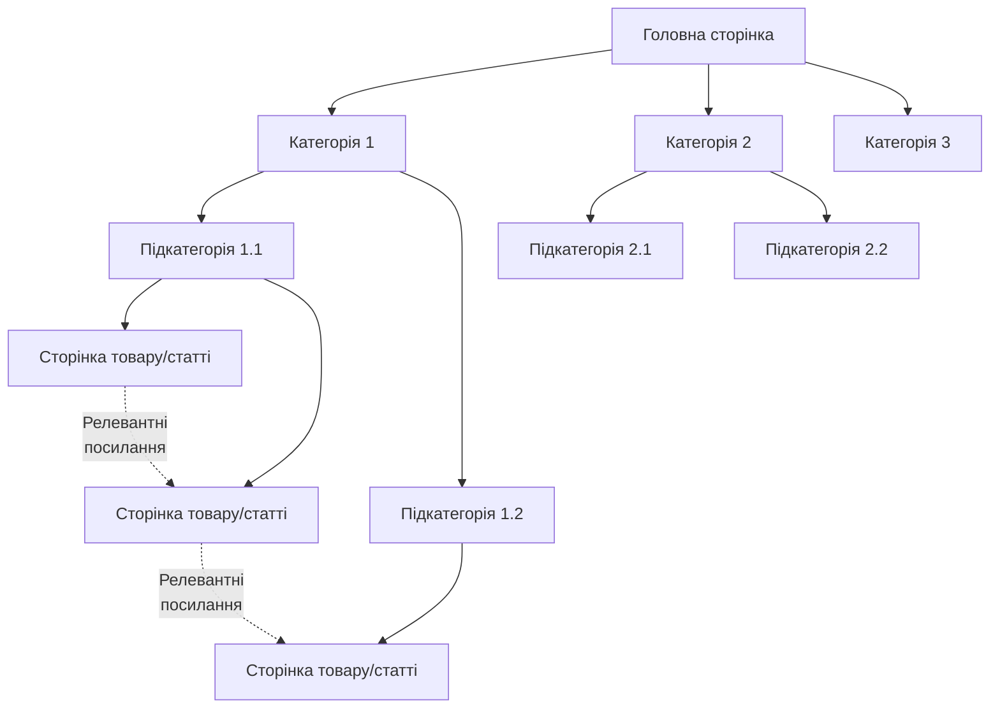

# Лабораторна робота 02 Імплементація on-page оптимізації 🎯📝

## 🎯 Мета

Після виконання лабораторної роботи здобувач освіти зможе самостійно аналізувати якість метаданих вебсторінок, створювати оптимізовані title tags та meta descriptions за SEO-формулами, імплементувати structured data у форматі JSON-LD згідно зі стандартом Schema.org, валідувати розмітку через офіційні інструменти Google, розробляти ефективну стратегію внутрішньої перелінковки та документувати результати оптимізації з доказовою базою.

## 📋 Завдання

1. Провести аудит метаданих 10-15 сторінок обраного вебсайту за допомогою META SEO Inspector.
2. Переписати title tags та meta descriptions для проаналізованих сторінок за SEO-формулами.
3. Додати structured data розмітку Schema.org у форматі JSON-LD (мінімум один тип: Article, Product або FAQ).
4. Протестувати імплементовану розмітку через Rich Results Test від Google.
5. Оптимізувати структуру внутрішніх посилань на мінімум 5 сторінках.
6. Створити детальний звіт з порівнянням стану "до/після" оптимізації.

## ⭐ Критерії оцінювання

Максимальна кількість балів за лабораторну роботу: **7 балів**.

Розподіл балів за виконання завдань:

- Якість аудиту метаданих з повним виявленням проблем та систематизацією: **1 бал**.
- Коректність написання title tags та meta descriptions за формулами з дотриманням унікальності: **2 бали**.
- Правильність імплементації Schema.org розмітки з валідним синтаксисом: **2 бали**.
- Ефективність стратегії internal linking з логічною структурою та якісними anchor texts: **1 бал**.
- Якість документації зі структурованим звітом, screenshots та аналітикою "до/після": **1 бал**.

## ⏰ Політика дедлайнів та штрафів

**Термін здачі:** Лабораторна робота має бути здана **протягом 2 тижнів** від дати проведення останнього аудиторного заняття з цієї теми.

**Система штрафів за прострочення:** Здача роботи в установлений термін дає можливість отримати повну оцінку 7 балів. Роботи, здані з запізненням, будуть оцінені максимум в 4 бали. Виняток становлять документально підтверджені поважні причини (хвороба, сімейні обставини), за яких термін може бути продовжений за погодженням з викладачем.

## 📚 Теоретичні відомості

### Метадані сторінки

Метадані являють собою інформацію про вміст вебсторінки, яка не відображається безпосередньо користувачу, але критично важлива для пошукових систем. Основні елементи метаданих включають title tags та meta descriptions.

**Title tag** є найважливішим on-page елементом для SEO. Він відображається у вкладці браузера, результатах пошуку та під час шерингу в соціальних мережах. Оптимальна довжина title tag складає 50-60 символів, що відповідає приблизно 600 пікселям у результатах пошуку Google.

Формула ефективного title tag:

```
[Первинний ключовий запит] | [Модифікатор/Контекст] | [Бренд]
```

Приклади якісних title tags:

```
Курси Python програмування | Онлайн навчання з нуля | TechAcademy
Ремонт ноутбуків у Києві | Швидко та якісно | ServicePro
10 порад з SEO оптимізації | Покроковий гід 2024 | MarketingHub
```

**Meta description** не є прямим фактором ранжування, але впливає на CTR (Click-Through Rate) у результатах пошуку. Оптимальна довжина складає 150-160 символів. Якісний meta description має містити цільовий ключовий запит, унікальну цінність пропозиції та заклик до дії.

Структура ефективного meta description:

```
[Проблема/Потреба] + [Рішення] + [Унікальна цінність] + [CTA]
```

Приклад:

```
Навчіться Python програмуванню за 3 місяці з нашими інтерактивними курсами.
Практичні проєкти, підтримка менторів 24/7. Почніть безкоштовно сьогодні!
```

### Structured Data та Schema.org

Structured data (структуровані дані) дозволяють пошуковим системам краще розуміти контекст та тип контенту на сторінці. Schema.org є стандартизованим словником для розмітки структурованих даних.

Формати structured data:

- **JSON-LD** (JavaScript Object Notation for Linked Data) — рекомендований Google формат, який розміщується у тезі `<script type="application/ld+json">`.
- **Microdata** — вбудовується безпосередньо в HTML-теги через атрибути.
- **RDFa** (Resource Description Framework in Attributes) — розширення HTML5.

Приклад розмітки Article у форматі JSON-LD:

```json
<script type="application/ld+json">
{
  "@context": "https://schema.org",
  "@type": "Article",
  "headline": "Повний гід з SEO оптимізації 2024",
  "image": "https://example.com/images/seo-guide.jpg",
  "author": {
    "@type": "Person",
    "name": "Іван Петренко",
    "url": "https://example.com/authors/ivan-petrenko"
  },
  "publisher": {
    "@type": "Organization",
    "name": "SEO Academy",
    "logo": {
      "@type": "ImageObject",
      "url": "https://example.com/logo.png"
    }
  },
  "datePublished": "2024-01-15",
  "dateModified": "2024-02-10",
  "description": "Комплексний посібник з пошукової оптимізації для початківців"
}
</script>
```

Приклад розмітки FAQ:

```json
<script type="application/ld+json">
{
  "@context": "https://schema.org",
  "@type": "FAQPage",
  "mainEntity": [
    {
      "@type": "Question",
      "name": "Що таке SEO?",
      "acceptedAnswer": {
        "@type": "Answer",
        "text": "SEO (Search Engine Optimization) — це комплекс заходів для покращення позицій сайту в органічних результатах пошуку."
      }
    },
    {
      "@type": "Question",
      "name": "Скільки часу потрібно для появи результатів SEO?",
      "acceptedAnswer": {
        "@type": "Answer",
        "text": "Зазвичай перші результати з'являються через 3-6 місяців регулярної оптимізації, залежно від конкуренції в ніші."
      }
    }
  ]
}
</script>
```

Приклад розмітки Product:

```json
<script type="application/ld+json">
{
  "@context": "https://schema.org",
  "@type": "Product",
  "name": "Ноутбук Dell XPS 15",
  "image": "https://example.com/products/dell-xps-15.jpg",
  "description": "Потужний ноутбук для професіоналів з 15.6\" 4K дисплеєм",
  "brand": {
    "@type": "Brand",
    "name": "Dell"
  },
  "offers": {
    "@type": "Offer",
    "url": "https://example.com/products/dell-xps-15",
    "priceCurrency": "UAH",
    "price": "45999",
    "availability": "https://schema.org/InStock",
    "seller": {
      "@type": "Organization",
      "name": "TechStore Ukraine"
    }
  },
  "aggregateRating": {
    "@type": "AggregateRating",
    "ratingValue": "4.7",
    "reviewCount": "89"
  }
}
</script>
```

### Internal Linking

Внутрішня перелінковка являє собою стратегію створення посилань між сторінками одного вебсайту. Ефективна структура internal linking має кілька ключових переваг: розподіл link equity (PageRank) між сторінками сайту, покращення crawlability для пошукових ботів, зниження показника bounce rate через додаткові точки взаємодії, формування тематичної релевантності та контекстуальних зв'язків.

Основні принципи внутрішньої перелінковки:

**Ієрархічна структура.** Головна сторінка посилається на категорії, категорії на підкатегорії, підкатегорії на окремі сторінки. Це формує логічну піраміду авторитетності.

**Релевантний anchor text.** Текст посилання має відображати зміст цільової сторінки та містити ключові слова природним чином.

```html
<!-- Погано -->
<a href="/services/seo">натисніть тут</a>
<a href="/services/seo">більше інформації</a>

<!-- Добре -->
<a href="/services/seo">послуги SEO оптимізації</a>
<a href="/services/seo">професійна пошукова оптимізація сайтів</a>
```

**Глибина кліків.** Рекомендується, щоб будь-яка сторінка була досяжною з головної максимум за 3-4 кліки.

**Кількість посилань.** Google рекомендує обмежувати кількість посилань на сторінці до розумної кількості (орієнтовно до 150-200), але фокус має бути на якості, а не кількості.

**Контекстуальність.** Посилання всередині основного тексту мають більшу вагу, ніж посилання в футері чи сайдбарі.

Діаграма оптимальної структури internal linking:



## 🔧 Хід роботи

### Крок 1. Підготовка до роботи

Оберіть вебсайт для аналізу та оптимізації. Це може бути власний навчальний проєкт створений раніше, сайт використаний у попередніх лабораторних роботах, публічний вебсайт малого або середнього бізнесу, блог або портфоліо з доступом до редагування.

Переконайтеся, що у вас є можливість редагувати HTML-код сторінок або доступ до системи управління контентом (WordPress, Joomla, Drupal тощо).

Встановіть розширення META SEO Inspector для вашого браузера:

- для Chrome: [META SEO Inspector](https://chrome.google.com/webstore/detail/meta-seo-inspector/ibkclpciafdglkjkcibmohobjkcfkaef)
- для Firefox: [META SEO Inspector](https://addons.mozilla.org/firefox/addon/meta-seo-inspector/)

### Крок 2. Аудит метаданих

Відкрийте обраний вебсайт та активуйте META SEO Inspector, натиснувши на іконку розширення у браузері. Інструмент автоматично проаналізує поточну сторінку та відобразить наявність та вміст title tag, наявність та вміст meta description, наявність canonical URL, Open Graph теги для соціальних мереж, structured data на сторінці.

Проведіть аналіз до 10 різних сторінок вебсайту. Рекомендується вибрати головну сторінку, 3-4 категорійні або розділові сторінки, 5-6 сторінок товарів або статей чи сервісів, 1-2 допоміжні сторінки (про нас, контакти).

Для кожної сторінки створіть таблицю аудиту у Google Sheets або Excel:

| URL | Поточний Title | Довжина | Поточний Meta Description | Довжина | Проблеми |
|-----|----------------|---------|---------------------------|---------|----------|
| example.com | Головна | 7 символів | - | 0 | Title занадто короткий, відсутній meta description |
| example.com/services | Послуги | 7 символів | - | 0 | Title занадто короткий, відсутній meta description |

Виявіть типові проблеми: відсутність title або meta description, занадто короткі або занадто довгі метадані, дублювання title/description на різних сторінках, відсутність ключових слів, використання загального шаблонного тексту, наявність технічних помилок у синтаксисі.

Зробіть screenshots результатів аудиту для кожної проблемної сторінки.

### Крок 3. Переписування title tags та meta descriptions

На основі виявлених проблем розробіть оптимізовані версії метаданих для кожної проаналізованої сторінки.

**Алгоритм створення title tag:**

Визначте первинний ключовий запит для сторінки (1-3 слова). Додайте модифікатор або контекст, що уточнює пропозицію. За потреби додайте назву бренду через роздільник "|" або "—". Перевірте довжину: оптимально 50-60 символів.

**Алгоритм створення meta description:**

Сформулюйте проблему або потребу цільової аудиторії. Опишіть рішення або цінність пропозиції. Додайте унікальну перевагу або диференціатор. Завершіть закликом до дії (CTA). Перевірте довжину: оптимально 150-160 символів.

Створіть таблицю з новими версіями:

| URL | Новий Title | Новий Meta Description |
|-----|-------------|------------------------|
| example.com | SEO оптимізація сайтів Київ \| Професійні послуги \| SEOPro | Збільште трафік на 200% з нашими послугами SEO оптимізації. Аудит сайту безкоштовно, гарантія результату. Замовте консультацію сьогодні! |

Імплементуйте нові метадані на вебсайті. Якщо ви працюєте з HTML-файлами, додайте або відредагуйте теги у секції `<head>`:

```html
<head>
  <title>SEO оптимізація сайтів Київ | Професійні послуги | SEOPro</title>
  <meta name="description" content="Збільште трафік на 200% з нашими послугами SEO оптимізації. Аудит сайту безкоштовно, гарантія результату. Замовте консультацію сьогодні!">
</head>
```

Якщо використовуєте CMS (WordPress, Joomla), скористайтеся вбудованими полями для SEO або плагінами типу Yoast SEO, Rank Math, All in One SEO.

Після імплементації зробіть screenshots оновлених метаданих через META SEO Inspector.

### Крок 4. Додавання Schema.org розмітки

Оберіть тип structured data, який найкраще відповідає контенту вашого сайту: **Article** для блогів, новинних сайтів, статей; **Product** для інтернет-магазинів, каталогів товарів; **FAQ** для сторінок з часто задаваними питаннями.

Створіть JSON-LD розмітку відповідно до обраного типу. Використовуйте наведені вище приклади як шаблон, але адаптуйте їх під ваш конкретний контент.

**Важливі поради:** всі URL мають бути абсолютними (з повним доменом), дати мають бути у форматі ISO 8601 (YYYY-MM-DD), всі обов'язкові поля для обраного типу мають бути заповнені, використовуйте реальні дані з вашого сайту.

Додайте створений JSON-LD код безпосередньо перед закриваючим тегом `</head>` або перед закриваючим тегом `</body>`:

```html
<!DOCTYPE html>
<html>
<head>
  <title>Назва сторінки</title>
  <!-- Інші мета-теги -->

  <script type="application/ld+json">
  {
    "@context": "https://schema.org",
    "@type": "Article",
    "headline": "Ваш заголовок",
    ...
  }
  </script>
</head>
<body>
  <!-- Контент сторінки -->
</body>
</html>
```

### Крок 5. Тестування через Rich Results Test

Після додавання structured data необхідно валідувати розмітку за допомогою офіційного інструменту Google.

Відкрийте [Rich Results Test](https://search.google.com/test/rich-results). Введіть URL сторінки, на якій додали розмітку, або вставте HTML-код безпосередньо у відповідне поле. Натисніть кнопку "Test URL" або "Test Code". Дочекайтеся завершення аналізу.

Інструмент покаже чи виявлено structured data на сторінці, тип виявленої розмітки, список усіх полів та їх значень, помилки або попередження (якщо є).

Можливі результати:

**Valid** (зелений статус) — розмітка коректна, всі обов'язкові поля заповнені, немає критичних помилок.

**Valid with warnings** (жовтий статус) — розмітка працює, але є рекомендації щодо додавання необов'язкових полів для покращення результату.

**Invalid** (червоний статус) — є критичні помилки, які треба виправити. Розмітка не буде використана Google.

Типові помилки: відсутність обов'язкових полів, некоректний формат дати, невалідний URL, синтаксичні помилки JSON, невідповідність типу даних.

Виправте всі критичні помилки та перетестуйте розмітку до досягнення статусу "Valid". Зробіть screenshot результатів валідації.

Додатково можна перевірити розмітку через [Schema Markup Validator](https://validator.schema.org/), який надає більш детальну інформацію про відповідність стандарту Schema.org.

### Крок 6. Оптимізація internal linking структури

Проаналізуйте поточну структуру внутрішніх посилань на вашому сайті. Оберіть мінімум 5 сторінок для оптимізації.

**Аналіз поточного стану:** для кожної обраної сторінки визначте кількість вихідних internal links, кількість вхідних internal links з інших сторінок сайту, якість anchor texts (чи містять релевантні ключові слова), глибину сторінки (скільки кліків потрібно від головної).

Скористайтеся інструментом Screaming Frog SEO Spider (безкоштовна версія до 500 URL) для візуалізації структури. Завантажте та встановіть [Screaming Frog](https://www.screamingfrog.co.uk/seo-spider/). Введіть URL вашого сайту та запустіть crawl. Перейдіть на вкладку "Internal" для аналізу внутрішніх посилань. Експортуйте дані для подальшого аналізу.

**Розробка стратегії оптимізації:** визначте сторінки-хаби (cornerstone content) — найважливіші сторінки, які мають отримувати найбільше internal links, сторінки-сироти (orphan pages) — сторінки без вхідних посилань, можливості для додавання релевантних контекстуальних посилань.

**Імплементація покращень:** додайте 3-5 нових релевантних internal links на кожній обраній сторінці. Переконайтеся, що anchor text природний та описовий, посилання ведуть на семантично релевантні сторінки, посилання розміщені контекстуально всередині основного тексту, не використовується надмірна кількість посилань на одну цільову сторінку.

Приклад додавання контекстуальних посилань:

```html
<!-- Було -->
<p>
  Пошукова оптимізація є важливою частиною цифрового маркетингу.
  Вона допомагає покращити видимість сайту в результатах пошуку.
</p>

<!-- Стало -->
<p>
  <a href="/services/seo-optimization">Пошукова оптимізація</a> є
  важливою частиною цифрового маркетингу. Вона допомагає покращити
  видимість сайту в результатах пошуку, особливо якщо використовувати
  <a href="/blog/keyword-research-guide">стратегії підбору ключових слів</a>
  та <a href="/blog/content-optimization">оптимізацію контенту</a>.
</p>
```

Створіть діаграму до/після для візуалізації покращень у структурі посилань.

### Крок 7. Документування результатів

Створіть детальний звіт про виконану роботу згідно з рекомендованою структурою.

## 📄 Рекомендована структура звіту

Звіт має містити наступні обов'язкові розділи:

**Титульна сторінка** з назвою лабораторної роботи, ПІБ студента, групою.

**Розділ 1. Аудит метаданих (до оптимізації)** з таблицею поточного стану title та meta description для 8-10 сторінок, screenshots META SEO Inspector до оптимізації, систематизованим списком виявлених проблем за категоріями.

**Розділ 2. Оптимізовані метадані (після оптимізації)** з таблицею нових версій title та meta description, screenshots META SEO Inspector після імплементації, поясненням логіки створення кожного title/description з обґрунтуванням вибору ключових слів.

**Розділ 3. Structured data імплементація** з повним кодом JSON-LD розмітки, screenshots результатів Rich Results Test з статусом валідації, поясненням обраного типу розмітки та опису заповнених полів, аналізом потенційних SERP features які може отримати сторінка.

**Розділ 4. Internal linking оптимізація** з таблицею доданих посилань (URL джерела, URL цілі, anchor text), діаграмою або схемою покращеної структури посилань, аналізом покращень (зміна глибини сторінок, розподіл link equity), порівнянням "до/після" для кожної оптимізованої сторінки.

**Розділ 5. Загальний аналіз результатів** з узагальненням усіх виконаних оптимізацій, оціночним впливом на SEO-показники, метриками покращень (кількість оптимізованих елементів, відсоток покращення).

**Висновки** з узагальненням виконаної роботи, виявленими інсайтами та навчальним досвідом, рекомендаціями для подальшої оптимізації інших сторінок сайту.

**Додатки** (за необхідності) з повними експортами даних з інструментів, додатковими screenshots, прикладами коду.

**Формат звіту - `pdf`.**

## ❓ Контрольні запитання

1. Чому title tag вважається найважливішим on-page елементом для SEO? Поясніть механізм його впливу на ранжування та CTR у результатах пошуку.
2. Яка різниця між форматами structured data: JSON-LD, Microdata та RDFa? Чому Google рекомендує саме JSON-LD для імплементації розмітки?
3. Що таке featured snippets у результатах пошуку Google та як structured data допомагає отримати їх? Наведіть приклади різних типів featured snippets.
4. Поясніть концепцію link equity (PageRank) та як внутрішня перелінковка допомагає її розподіляти між сторінками сайту. Як це впливає на ранжування?
5. Які основні помилки можуть виникнути при імплементації Schema.org розмітки та як їх уникнути? Наведіть приклади найпоширеніших помилок.
6. Чому важливо використовувати релевантні anchor texts для internal links? Наведіть приклади добрих та поганих anchor texts з поясненням відмінностей.
7. Як довжина title tag та meta description впливає на їх відображення у результатах пошуку Google? Що відбувається коли ці елементи занадто довгі або занадто короткі?
