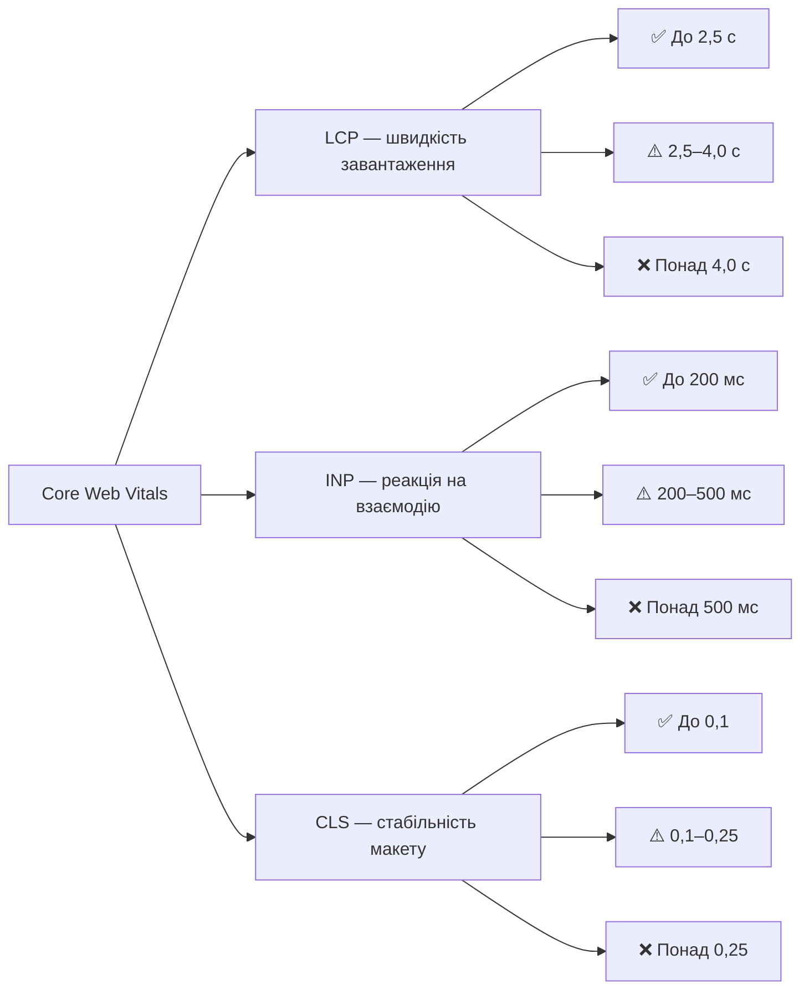
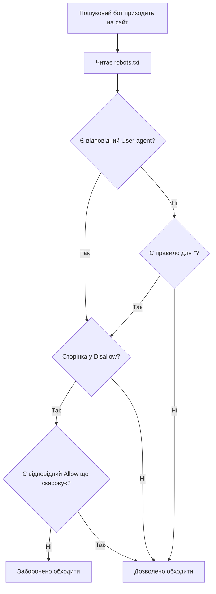
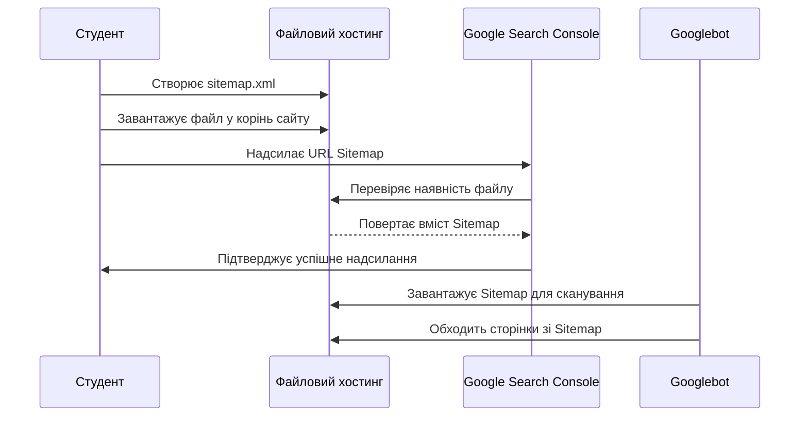

# Лабораторна робота 03 Технічна оптимізація вебсайту 🔧⚡

## 🎯 Мета

Після виконання лабораторної роботи здобувач освіти зможе самостійно виконувати комплексний технічний аудит вебсайту за допомогою PageSpeed Insights та Lighthouse, оптимізувати зображення шляхом стиснення та конвертації у сучасні формати, налаштовувати механізм lazy loading для медіаресурсів, створювати та конфігурувати файли robots.txt і XML Sitemap відповідно до вимог пошукових систем, надсилати карту сайту до Google Search Console, документувати та аналізувати покращення показників Core Web Vitals до та після оптимізації.

## 📋 Завдання

1. Провести базове тестування вебсайту через PageSpeed Insights та зафіксувати показники Core Web Vitals до оптимізації.
2. Оптимізувати зображення на сайті: стиснути файли та конвертувати їх у формат WebP.
3. Налаштувати lazy loading для зображень та інших медіаелементів.
4. Створити або оновити файл robots.txt з коректними директивами для пошукових ботів.
5. Згенерувати XML Sitemap та надіслати її до Google Search Console.
6. Повторно протестувати сайт і порівняти метрики до та після оптимізації.
7. Підготувати звіт з детальним документуванням покращень Core Web Vitals.

## ⭐ Критерії оцінювання

Максимальна кількість балів за лабораторну роботу: **7 балів**.

Розподіл балів за виконання завдань:

- Якість базового аудиту з коректно зафіксованими показниками Core Web Vitals та скріншотами до оптимізації: **1 бал**.
- Оптимізація зображень з підтвердженим зменшенням розміру файлів та конвертацією у WebP: **2 бали**.
- Коректне налаштування lazy loading та перевірка його роботи в браузері: **1 бал**.
- Правильно налаштовані файли robots.txt та XML Sitemap з підтвердженням надсилання до GSC: **2 бали**.
- Якість порівняльного аналізу "до/після" зі структурованим звітом та скріншотами: **1 бал**.

## ⏰ Політика дедлайнів та штрафів

**Термін здачі:** Лабораторна робота має бути здана **протягом 2 тижнів** від дати проведення останнього аудиторного заняття з цієї теми.

**Система штрафів за прострочення:** Здача роботи в установлений термін дає можливість отримати повну оцінку 7 балів. Роботи, здані з запізненням, будуть оцінені максимум в 4 бали. Виняток становлять документально підтверджені поважні причини (хвороба, сімейні обставини), за яких термін може бути продовжений за погодженням з викладачем.

## 📚 Теоретичні відомості

### Core Web Vitals та їх значення для SEO

Core Web Vitals — це набір стандартизованих метрик від Google, що вимірюють реальний користувацький досвід при завантаженні вебсторінок. Починаючи з 2021 року ці показники є офіційними факторами ранжування у Google Search. Вони поділяються на три ключові метрики.

**LCP (Largest Contentful Paint)** вимірює час до відображення найбільшого видимого елемента у вьюпорті — зазвичай це головне зображення, відеоблок або великий текстовий блок. Хороший показник LCP становить до 2,5 секунди. Значення від 2,5 до 4,0 секунди вважається таким, що потребує покращення, а понад 4,0 секунди — поганим.

**INP (Interaction to Next Paint)** замінив FID з березня 2024 року і вимірює затримку між взаємодією користувача (клік, натискання клавіші, дотик) та відображенням наступного кадру. Хороший показник INP — до 200 мс, прийнятний — до 500 мс.

**CLS (Cumulative Layout Shift)** вимірює сумарне зміщення елементів сторінки під час завантаження. Цей показник відображає стабільність макету. Хороше значення CLS — до 0,1, прийнятне — до 0,25.



### Оптимізація зображень

Зображення становлять найбільшу частку ваги вебсторінок і є одним із найпоширеніших джерел поганого LCP. Оптимізація зображень передбачає два взаємодоповнюючі підходи: зменшення фізичного розміру файлів та вибір правильного формату.

**Формати зображень.** Традиційні формати JPEG та PNG досі широко використовуються, але сучасні альтернативи суттєво ефективніші. Формат WebP забезпечує на 25–35% менший розмір файлу порівняно з JPEG при аналогічній якості, підтримує прозорість (як PNG) і підтримується всіма сучасними браузерами. Формат AVIF є ще ефективнішим, але має нижчий рівень підтримки браузерів. Для сучасних вебсайтів рекомендується конвертувати зображення у WebP та надавати JPEG як запасний варіант через HTML-елемент `<picture>`.

Приклад адаптивного зображення з WebP та запасним форматом:

```html
<picture>
  <source srcset="hero-image.webp" type="image/webp">
  <source srcset="hero-image.jpg" type="image/jpeg">
  
</picture>
```

**Стиснення зображень.** Розрізняють стиснення без втрат (lossless), при якому якість зображення не змінюється, та стиснення з втратами (lossy), при якому відкидаються певні деталі. Для JPEG рекомендована якість — 75–85%, для WebP — 80–85%. Важливо також правильно вказувати атрибути `width` та `height` у тегах ``, щоб браузер заздалегідь резервував місце під зображення та уникав зміщення макету (CLS).

**Онлайн-інструменти для стиснення та конвертації:**

- Squoosh (squoosh.app) — безкоштовний вебзастосунок від Google для стиснення та конвертації зображень.
- Convertio (convertio.co) — онлайн-конвертер з підтримкою WebP.
- TinyPNG (tinypng.com) — для стиснення PNG та JPEG.
- CloudConvert (cloudconvert.com) — підтримує пакетну конвертацію.

### Lazy Loading зображень

Lazy loading — це техніка відкладеного завантаження ресурсів: зображення та інші медіаелементи завантажуються лише тоді, коли вони наближаються до вьюпорту користувача, а не всі одразу під час початкового завантаження сторінки. Це суттєво зменшує обсяг даних, що завантажуються при першому відкритті сторінки, і прискорює досягнення метрики LCP для елементів вище лінії прокручування.

Нативний lazy loading у HTML реалізується через атрибут `loading="lazy"`:

```html
<!-- Зображення нижче лінії прокручування — застосовуємо lazy loading -->


<!-- Головне зображення вище лінії прокручування — НЕ застосовуємо lazy loading -->

```

Важливо: атрибут `loading="lazy"` не слід застосовувати до зображень у першому екрані (above the fold), оскільки це затримає їх завантаження і погіршить LCP. Lazy loading призначений лише для контенту, що знаходиться нижче видимої області при завантаженні сторінки.

Для iframe (вбудовані відео YouTube, Google Maps) lazy loading також підтримується:

```html
<iframe src="https://www.youtube.com/embed/VIDEO_ID"
        width="560"
        height="315"
        loading="lazy"
        title="Опис відео">
</iframe>
```

### Файл robots.txt

Robots.txt — це текстовий файл у кореневій директорії вебсайту, що містить інструкції для пошукових ботів щодо того, які сторінки або розділи сайту дозволено або заборонено індексувати. Файл має знаходитися за адресою `https://yourdomain.com/robots.txt`.

Основні директиви robots.txt:

- `User-agent` — вказує бота, до якого застосовуються наступні правила. Символ `*` означає всіх ботів.
- `Disallow` — забороняє доступ до вказаного шляху.
- `Allow` — дозволяє доступ до вказаного шляху (використовується для уточнення після широкої заборони).
- `Sitemap` — вказує URL XML Sitemap.
- `Crawl-delay` — визначає затримку між запитами бота (не підтримується Googlebot).

Приклад добре налаштованого robots.txt для типового вебсайту:

```
User-agent: *
Disallow: /admin/
Disallow: /private/
Disallow: /checkout/
Disallow: /cart/
Disallow: /search?
Allow: /

User-agent: Googlebot
Disallow: /no-google/

Sitemap: https://example.com/sitemap.xml
Sitemap: https://example.com/sitemap-images.xml
```

Критично важливо: неправильно налаштований robots.txt може заблокувати індексацію всього сайту. Наприклад, директива `Disallow: /` забороняє ботам обходити весь сайт. Перед застосуванням завжди перевіряйте файл через Google Search Console.



### XML Sitemap

XML Sitemap — це файл, що містить перелік усіх важливих URL вашого вебсайту, разом із метаданими про кожну сторінку: дату останньої зміни, частоту оновлення та відносну пріоритетність. Sitemap допомагає пошуковим системам ефективніше виявляти та індексувати сторінки сайту, особливо нові або рідко пов'язані між собою.

Структура XML Sitemap:

```xml
<?xml version="1.0" encoding="UTF-8"?>
<urlset xmlns="http://www.sitemaps.org/schemas/sitemap/0.9">

  <url>
    <loc>https://example.com/</loc>
    <lastmod>2024-01-15</lastmod>
    <changefreq>weekly</changefreq>
    <priority>1.0</priority>
  </url>

  <url>
    <loc>https://example.com/about/</loc>
    <lastmod>2024-01-10</lastmod>
    <changefreq>monthly</changefreq>
    <priority>0.8</priority>
  </url>

  <url>
    <loc>https://example.com/blog/seo-guide/</loc>
    <lastmod>2024-01-20</lastmod>
    <changefreq>monthly</changefreq>
    <priority>0.6</priority>
  </url>

</urlset>
```

Значення атрибуту `changefreq` може бути: `always`, `hourly`, `daily`, `weekly`, `monthly`, `yearly`, `never`. Значення `priority` — від 0,0 до 1,0, де 1,0 — найвищий пріоритет. Зверніть увагу, що Google використовує ці значення як підказки, а не як обов'язкові інструкції.

Для великих сайтів використовується Sitemap Index — файл, що містить посилання на кілька окремих Sitemap файлів, кожен з яких може мати до 50 000 URL:

```xml
<?xml version="1.0" encoding="UTF-8"?>
<sitemapindex xmlns="http://www.sitemaps.org/schemas/sitemap/0.9">
  <sitemap>
    <loc>https://example.com/sitemap-pages.xml</loc>
    <lastmod>2024-01-20</lastmod>
  </sitemap>
  <sitemap>
    <loc>https://example.com/sitemap-posts.xml</loc>
    <lastmod>2024-01-20</lastmod>
  </sitemap>
</sitemapindex>
```

## 🔧 Хід роботи

### Крок 1. Підготовка до роботи

Оберіть вебсайт для аналізу та оптимізації. Це може бути власний навчальний проєкт (GitHub Pages, Netlify, Google Sites), сайт, що використовувався у попередніх лабораторних роботах, або публічний вебсайт малого бізнесу, до якого у вас є доступ для редагування.

Переконайтеся, що виконуються такі умови: сайт опублікований в мережі (має публічний URL), у вас є доступ до файлів сайту або панелі адміністратора, сайт підключений до Google Search Console (налаштування виконано в лабораторній роботі 01-02).

Якщо власного сайту немає, створіть простий статичний сайт на GitHub Pages:

1. Зареєструйтесь на github.com та створіть новий репозиторій з назвою `username.github.io`.
2. Додайте файл `index.html` з базовою HTML-структурою та кількома зображеннями.
3. Увімкніть GitHub Pages у налаштуваннях репозиторію (Settings → Pages → Source: Deploy from branch → main).
4. Сайт буде доступний за адресою `https://username.github.io`.

### Крок 2. Базове тестування через PageSpeed Insights

Перш ніж розпочати будь-яку оптимізацію, необхідно зафіксувати поточні показники сайту. Це дасть змогу об'єктивно оцінити ефект виконаних покращень.

Відкрийте [PageSpeed Insights](https://pagespeed.web.dev/) та введіть URL головної сторінки вашого сайту. Дочекайтеся завершення аналізу — зазвичай це займає 15–30 секунд.

Результати аналізу відображаються у двох вкладках: **Mobile** та **Desktop**. Зробіть скріншоти обох вкладок, зафіксувавши такі показники для кожної:

- Загальний Performance Score (0–100).
- LCP (Largest Contentful Paint).
- INP (Interaction to Next Paint).
- CLS (Cumulative Layout Shift).
- FCP (First Contentful Paint).
- TTFB (Time to First Byte).

Створіть таблицю базових метрик:

| Метрика | Mobile (до) | Desktop (до) | Норма |
|---------|-------------|--------------|-------|
| Performance Score | | | 90+ |
| LCP | | | до 2,5 с |
| INP | | | до 200 мс |
| CLS | | | до 0,1 |
| FCP | | | до 1,8 с |
| TTFB | | | до 800 мс |

Прокрутіть сторінку нижче та вивчіть розділ "Opportunities" (Можливості) та "Diagnostics" (Діагностика). Зверніть особливу увагу на рекомендації, пов'язані зі зображеннями: "Serve images in next-gen formats", "Properly size images", "Defer offscreen images". Зробіть скріншот цих рекомендацій.

### Крок 3. Оптимізація зображень

#### 3.1. Інвентаризація зображень

Складіть перелік усіх зображень на сайті. Для кожного зображення зафіксуйте: URL, поточний формат (JPEG/PNG/GIF), розмір файлу в кілобайтах, розміри в пікселях (ширина × висота), наявність атрибутів `alt`, `width`, `height`.

Для перегляду розміру зображень у браузері натисніть правою кнопкою миші на зображення → "Переглянути зображення" або скористайтеся DevTools: відкрийте вкладку Network, відфільтруйте за типом "Img" та перезавантажте сторінку.

#### 3.2. Стиснення та конвертація у WebP

Для кожного зображення виконайте оптимізацію через [Squoosh](https://squoosh.app/):

1. Відкрийте squoosh.app у браузері.
2. Завантажте зображення, перетягнувши файл або натиснувши кнопку завантаження.
3. У правій панелі оберіть формат "WebP".
4. Встановіть якість на рівні 80–85% та порівняйте результат з оригіналом за допомогою повзунка.
5. Завантажте оптимізований файл.

Зафіксуйте результати в таблиці:

| Файл | Формат до | Розмір до | Формат після | Розмір після | Зменшення |
|------|-----------|-----------|--------------|--------------|-----------|
| hero.jpg | JPEG | 450 КБ | WebP | 180 КБ | 60% |

#### 3.3. Замість оригіналів на сайті — WebP з резервним форматом

Завантажте оптимізовані файли на сайт та оновіть HTML-код. Якщо сайт статичний, відредагуйте HTML-файли напряму. Якщо використовується WordPress чи інша CMS, завантажте нові зображення через медіабібліотеку.

Для забезпечення сумісності зі старішими браузерами (зокрема, старі версії Safari) використовуйте елемент `<picture>`:

```html
<!-- Зображення в першому екрані (без lazy loading) -->
<picture>
  <source srcset="images/hero.webp" type="image/webp">
  
</picture>

<!-- Зображення нижче лінії прокручування (з lazy loading) -->
<picture>
  <source srcset="images/gallery-1.webp" type="image/webp">
  
</picture>
```

Переконайтеся, що всі атрибути `alt` заповнені описовим текстом, а атрибути `width` та `height` відповідають фактичним розмірам зображення.

### Крок 4. Налаштування lazy loading

#### 4.1. Додавання атрибуту loading="lazy"

Перегляньте HTML-код усіх сторінок сайту та додайте атрибут `loading="lazy"` до всіх зображень, розташованих нижче першого екрана.

**Правило:** перше велике зображення на сторінці (найчастіше — головний банер або hero-зображення) повинно завантажуватися одразу, без lazy loading, оскільки воно впливає на LCP. Всі інші зображення — кандидати на lazy loading.

Приклад оновлення HTML-коду:

```html
<!-- Було: всі зображення завантажуються одразу -->


<!-- Стало: lazy loading для зображень нижче fold -->


```

#### 4.2. Перевірка роботи lazy loading

Для перевірки коректності налаштування:

1. Відкрийте DevTools у браузері (F12).
2. Перейдіть на вкладку "Network" та відфільтруйте за типом "Img".
3. Перезавантажте сторінку (Ctrl+Shift+R для hard refresh).
4. Перевірте, що при завантаженні сторінки завантажуються лише зображення першого екрану.
5. Прокрутіть сторінку вниз та спостерігайте, як зображення завантажуються в міру наближення до вьюпорту.

Зробіть скріншот вкладки Network, що демонструє поступове завантаження зображень при прокручуванні.

### Крок 5. Налаштування robots.txt

#### 5.1. Перевірка поточного стану

Перевірте, чи існує файл robots.txt на вашому сайті, перейшовши за адресою `https://yourdomain.com/robots.txt`. Якщо файл відсутній, браузер поверне помилку 404.

Також перевірте стан через Google Search Console: перейдіть до розділу "Settings" → "Crawl stats" → у цьому розділі можна знайти інформацію про роботу ботів.

#### 5.2. Створення або оновлення robots.txt

Створіть або відредагуйте файл robots.txt у кореневій директорії сайту. Налаштуйте його відповідно до структури вашого сайту.

Для навчального статичного сайту:

```
User-agent: *
Disallow: /drafts/
Disallow: /private/
Allow: /

Sitemap: https://yourdomain.com/sitemap.xml
```

Для сайту на WordPress:

```
User-agent: *
Disallow: /wp-admin/
Disallow: /wp-includes/
Disallow: /wp-content/plugins/
Disallow: /?s=
Disallow: /search/
Allow: /wp-admin/admin-ajax.php

Sitemap: https://yourdomain.com/sitemap_index.xml
```

#### 5.3. Валідація robots.txt через Google Search Console

1. Відкрийте Google Search Console та оберіть ваш сайт.
2. Перейдіть до розділу "Settings" (Налаштування) у нижньому лівому меню.
3. Знайдіть посилання "robots.txt" та натисніть "Open Report".
4. Перевірте, що файл успішно зчитується та не містить помилок.

Додатково перевірте конкретні URL через інструмент "URL Inspection": введіть URL у верхньому рядку пошуку GSC та натисніть "Test Live URL", щоб побачити, чи може Googlebot отримати доступ до сторінки.

Зробіть скріншот результатів перевірки.

### Крок 6. Генерація XML Sitemap та надсилання до GSC

#### 6.1. Генерація Sitemap

Залежно від типу вашого сайту, оберіть відповідний спосіб генерації Sitemap.

**Для статичного HTML-сайту** створіть файл `sitemap.xml` вручну або за допомогою онлайн-генераторів:

- [XML-Sitemaps.com](https://www.xml-sitemaps.com/) — введіть URL сайту та завантажте готовий файл.
- [Screaming Frog SEO Spider](https://www.screamingfrog.co.uk/seo-spider/) (безкоштовна версія — до 500 URL) — запустіть crawl, потім Sitemaps → XML Sitemap.

**Для WordPress:**

- Плагін Yoast SEO автоматично генерує та оновлює Sitemap. Перейдіть до Yoast SEO → General → Features → XML Sitemaps.
- Плагін All In One SEO Pack: AIOSEO → Sitemaps → General Sitemap.

Завантажте файл sitemap.xml у кореневу директорію сайту. Переконайтеся, що він доступний за адресою `https://yourdomain.com/sitemap.xml`.

#### 6.2. Перевірка Sitemap

Відкрийте URL вашої Sitemap у браузері та переконайтеся, що файл коректно відображається. Перевірте, що всі важливі сторінки сайту включені до Sitemap, URL вказані з правильним протоколом (https://), усі URL повні та абсолютні.

#### 6.3. Надсилання Sitemap до Google Search Console

1. Відкрийте Google Search Console та оберіть ваш сайт.
2. У лівому меню перейдіть до розділу "Sitemaps".
3. У полі "Add a new sitemap" введіть відносний шлях до вашої Sitemap, наприклад: `sitemap.xml`.
4. Натисніть кнопку "Submit".
5. Дочекайтеся обробки — статус зміниться з "Pending" на "Success".

Зробіть скріншот сторінки Sitemaps з підтвердженням успішного надсилання. Зверніть увагу на кількість виявлених та індексованих URL.



### Крок 7. Повторне тестування та порівняння метрик

#### 7.1. Повторний аудит через PageSpeed Insights

Після виконання всіх оптимізацій знову відкрийте [PageSpeed Insights](https://pagespeed.web.dev/) та проаналізуйте той самий URL.

Важливо: зміни у Core Web Vitals можуть відображатися в польових даних (Field Data) із затримкою від кількох тижнів, оскільки для збору необхідно достатньо реальних відвідувань. Лабораторні дані (Lab Data) та рекомендації оновлюються одразу.

Зробіть скріншоти результатів для Mobile та Desktop.

#### 7.2. Заповнення порівняльної таблиці

Доповніть таблицю, створену у Кроці 2, даними після оптимізації:

| Метрика | Mobile до | Mobile після | Desktop до | Desktop після |
|---------|-----------|--------------|------------|---------------|
| Performance Score | | | | |
| LCP | | | | |
| INP | | | | |
| CLS | | | | |
| FCP | | | | |

Розрахуйте відсоток покращення для кожної метрики.

#### 7.3. Аналіз залишкових рекомендацій

Перегляньте розділ "Opportunities" у PageSpeed Insights після оптимізації. Визначте, які проблеми вдалося усунути, а які залишаються. Для кожної залишкової рекомендації напишіть коротке пояснення: чому її не вдалося реалізувати у межах цієї роботи та що потрібно для її виправлення.

### Крок 8. Документування результатів

Підготуйте структурований звіт згідно з рекомендованою структурою.

## 📄 Рекомендована структура звіту

Звіт має містити наступні обов'язкові розділи.

**Титульна сторінка** з назвою лабораторної роботи, ПІБ студента, групою.

**Розділ 1. Базовий аудит сайту** з описом обраного вебсайту (URL, тип сайту, CMS або технологія), таблицею базових метрик Core Web Vitals до оптимізації, скріншотами PageSpeed Insights (Mobile та Desktop) до оптимізації, переліком виявлених рекомендацій щодо зображень та інших проблем.

**Розділ 2. Оптимізація зображень** з таблицею порівняння зображень "до/після" (формат, розмір файлу, зменшення у відсотках), скріншотами з Squoosh або іншого інструменту, що демонструють процес оптимізації, прикладами оновленого HTML-коду з елементами `<picture>` та атрибутами `width`/`height`, скріншотами сторінки до та після оптимізації.

**Розділ 3. Lazy loading** з переліком зображень, до яких застосовано `loading="lazy"`, обґрунтуванням вибору (чому саме ці зображення, а не перше головне), скріншотом вкладки Network у DevTools, що підтверджує відкладене завантаження, прикладами оновленого HTML-коду.

**Розділ 4. Файл robots.txt** з повним вмістом налаштованого файлу robots.txt, поясненням кожної директиви та обґрунтуванням вибору, скріншотом перевірки файлу через Google Search Console.

**Розділ 5. XML Sitemap та Google Search Console** з повним вмістом або скріншотом XML Sitemap, скріншотом успішного надсилання Sitemap до GSC з відображенням кількості виявлених URL, URL Sitemap на вашому сайті.

**Розділ 6. Порівняльний аналіз "до/після"** з таблицею порівняння метрик Core Web Vitals до та після оптимізації, скріншотами PageSpeed Insights після оптимізації (Mobile та Desktop), аналізом досягнутих покращень та залишкових проблем, переліком оптимізацій, що не вдалося реалізувати, з поясненням причин.

**Висновки** з узагальненням виконаної роботи, зазначенням найефективніших оптимізацій за впливом на Core Web Vitals, рекомендаціями для подальшого покращення технічного SEO сайту.

**Формат звіту — `pdf`.**

## ❓ Контрольні запитання

1. Що таке Core Web Vitals і які три метрики вони включають? Опишіть, що саме вимірює кожна з них та які граничні значення вважаються хорошими.
2. Чому формат WebP є кращим за JPEG та PNG для більшості вебзображень? Які переваги та можливі недоліки має його використання?
3. Поясніть принцип роботи lazy loading. До яких зображень не слід застосовувати атрибут `loading="lazy"` і чому?
4. Що таке файл robots.txt та яку роль він відіграє у технічному SEO? Чим відрізняються директиви `Disallow` та `Allow`?
5. Навіщо потрібна XML Sitemap, якщо пошукові боти можуть знаходити сторінки самостійно через посилання? У яких ситуаціях Sitemap є особливо важливою?
6. Як атрибути `width` та `height` в тегах зображень впливають на показник CLS? Що відбудеться, якщо їх не вказати?
7. Чому зміни у польових даних (Field Data) PageSpeed Insights відображаються із затримкою після оптимізації сайту? Яке джерело даних є більш актуальним для оцінки результатів щойно виконаних змін?
