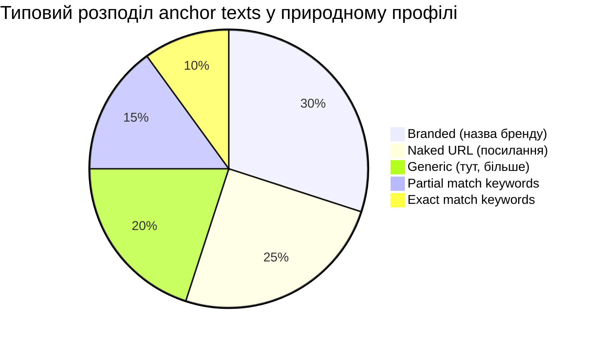
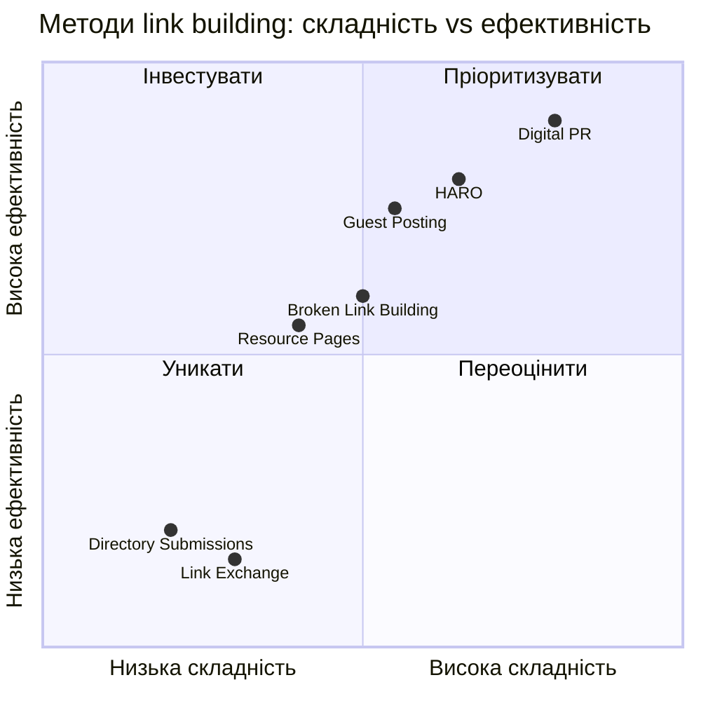
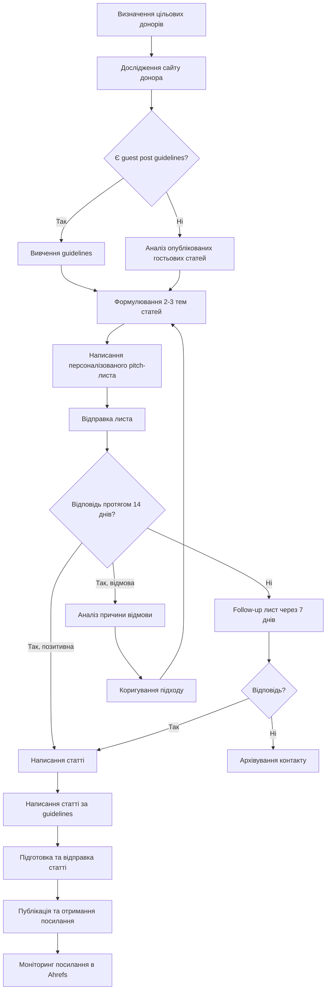

# Лабораторна робота 04 Аналіз backlink-профілю та розробка стратегії link building 🔗📊

## 🎯 Мета

Після виконання лабораторної роботи здобувач освіти зможе самостійно підключати вебсайт до Ahrefs Webmaster Tools та проводити повний аудит backlink-профілю, оцінювати якість зворотних посилань за ключовими метриками, аналізувати посилальні профілі конкурентів для виявлення конкурентних переваг, формувати обґрунтовану стратегію link building з переліком цільових донорів, а також розробляти шаблони для outreach-кампанії у форматі guest post pitch.

## 📋 Завдання

1. Зареєструватися в Ahrefs Webmaster Tools та підключити вебсайт для аналізу.
2. Провести повний аудит backlink-профілю: кількість посилань, доменів-донорів, anchor texts, динаміка зростання.
3. Проаналізувати backlink-профілі трьох основних конкурентів та виявити відмінності.
4. Визначити мінімум 10–15 потенційних джерел для отримання якісних зворотних посилань.
5. Розробити стратегію outreach із обґрунтуванням обраного підходу.
6. Підготувати два шаблони для guest post pitch, адаптованих під різні типи донорів.

## ⭐ Критерії оцінювання

Максимальна кількість балів за лабораторну роботу: **7 балів**.

Розподіл балів за виконання завдань:

- Коректне підключення до Ahrefs Webmaster Tools та повнота аудиту backlink-профілю з аналізом усіх ключових метрик: **1 бал**.
- Якість порівняльного аналізу конкурентів із виявленням конкретних gap-можливостей та обґрунтованими висновками: **2 бали**.
- Обґрунтованість та реалістичність переліку потенційних донорів (10–15 джерел) з оцінкою їх якості: **2 бали**.
- Логічність і деталізація розробленої outreach-стратегії з урахуванням пріоритетів та ресурсів: **1 бал**.
- Якість підготовлених шаблонів guest post pitch та документація у звіті: **1 бал**.

## ⏰ Політика дедлайнів та штрафів

**Термін здачі:** Лабораторна робота має бути здана **протягом 2 тижнів** від дати проведення останнього аудиторного заняття з цієї теми.

**Система штрафів за прострочення:** Здача роботи в установлений термін дає можливість отримати повну оцінку 7 балів. Роботи, здані з запізненням, будуть оцінені максимум в 4 бали. Виняток становлять документально підтверджені поважні причини (хвороба, сімейні обставини), за яких термін може бути продовжений за погодженням з викладачем.

## 📚 Теоретичні відомості

### Концепція зворотних посилань у SEO

Зворотне посилання (backlink) — це гіперпосилання з одного вебсайту на інший. З точки зору пошукових систем, кожне таке посилання є свідченням авторитетності та релевантності сторінки, на яку воно веде. Засновником цієї концепції є алгоритм PageRank, розроблений Ларрі Пейджем та Сергієм Бріном як основа для ранжування результатів пошуку Google.

Ідея PageRank аналогічна до академічного цитування: якщо авторитетне видання посилається на певну наукову роботу, це підвищує її наукову цінність. Аналогічно, посилання з авторитетного вебсайту передає частину його «авторитету» цільовій сторінці. Цей переданий авторитет у SEO-спільноті прийнято називати link equity або link juice.

Сучасні алгоритми Google значно еволюціонували порівняно з початковим PageRank: вони враховують не лише кількість посилань, але й якість донорських доменів, тематичну релевантність, природність anchor texts, швидкість нарощування посилального профілю та географічні характеристики донорів. Маніпулятивне нарощування посилань може призвести до алгоритмічних фільтрів Penguin або ручних санкцій.

### Ключові метрики оцінки backlink-профілю

Для оцінки якості зворотних посилань використовується ряд метрик, що обчислюються SEO-інструментами:

**Domain Rating (DR)** — метрика Ahrefs, що відображає силу посилального профілю домену за шкалою від 0 до 100. DR 60+ вважається сильним показником, DR 30–60 — середнім, нижче 30 — слабким. Важливо розуміти, що DR є відносною метрикою і залежить від загальної бази посилань у індексі Ahrefs.

**URL Rating (UR)** — метрика Ahrefs для оцінки авторитетності окремої сторінки на відміну від домену в цілому. Релевантна при аналізі сторінок-донорів.

**Referring Domains** — кількість унікальних доменів, що посилаються на сайт. Важливіший показник, ніж загальна кількість посилань, оскільки 1000 посилань з одного домену мають значно меншу цінність, ніж посилання з 1000 різних доменів.

**Dofollow vs Nofollow** — атрибут `rel="nofollow"` сигналізує пошуковим системам не передавати link equity через це посилання. Доfollow посилання прямо впливають на ранжування. Проте Google може враховувати nofollow посилання як «підказки», тому вони також мають певну цінність для природності профілю.

**Anchor Text Distribution** — розподіл текстів посилань у профілі. Природний профіль містить різноманітні anchor texts: branded (назва бренду), naked URL (просто посилання), generic (наприклад, «тут», «детальніше»), partial match та exact match (ключові слова). Надмірна концентрація exact match anchor texts є сигналом маніпуляції.

**Link Velocity** — швидкість приросту нових посилань у часі. Різкі стрибки, особливо на новому сайті, можуть виглядати підозріло для алгоритмів.

Діаграма компонентів здорового backlink-профілю:



### Ahrefs Webmaster Tools

Ahrefs Webmaster Tools (AWT) — безкоштовний інструмент від компанії Ahrefs, що надає власникам вебсайтів доступ до обмеженої версії повного Ahrefs-продукту. На відміну від платних планів, AWT дозволяє аналізувати лише верифіковані власні сайти, проте функціональності цілком достатньо для виконання базового аудиту посилань.

Ключові можливості безкоштовної версії: повний перелік зворотних посилань для верифікованого сайту, аналіз anchor texts і посилальних доменів, моніторинг динаміки зростання профілю, базовий аналіз ключових слів у пошуку, виявлення технічних проблем через Site Audit.

Для верифікації сайту AWT підтримує кілька методів: через HTML-файл на сервері, через мета-тег у `<head>`, через DNS-запис або через Google Search Console (автоматична синхронізація, якщо сайт вже верифікований у GSC).

### Типи стратегій link building

Стратегія link building визначає методи та канали отримання зворотних посилань. Існує кілька основних підходів, кожен з яких має свої переваги та обмеження.

**Guest posting** передбачає написання статей для сторонніх вебсайтів в обмін на розміщення посилання на власний ресурс. Це один із найбільш прозорих та ефективних методів, що дозволяє одночасно отримати посилання, побудувати авторитет у ніші та залучити реальний трафік.

**Digital PR** — отримання посилань через публікацію новинних матеріалів, оригінальних досліджень, інфографік або цікавих даних, які журналісти та блогери хочуть процитувати. Цей метод дозволяє отримувати посилання з авторитетних медіа, але вимагає значних ресурсів на створення контенту.

**Broken link building** — пошук зламаних посилань на сторонніх сайтах (посилань на видалені або переміщені сторінки) та пропозиція власного контенту як заміни. Метод відносно ефективний, оскільки веб-майстри зацікавлені у виправленні помилок на своїх сайтах.

**Resource page link building** — розміщення посилань на тематичних сторінках-ресурсах (наприклад, «Корисні ресурси для маркетологів»), які агрегують посилання на якісні матеріали.

**HARO (Help A Reporter Out)** — платформа, де журналісти шукають експертні коментарі для своїх матеріалів. Надавши якісний коментар, можна отримати посилання у відомих виданнях.

Порівняльна схема методів link building за складністю та ефективністю:



### Структура ефективного outreach-листа

Outreach — це процес виходу на зв'язок з редакторами, блогерами або власниками сайтів із пропозицією розмістити гостьовий матеріал або отримати посилання. Якість outreach-листа безпосередньо впливає на відсоток відповідей (response rate), який у середньому по галузі становить 5–15%.

Ключові компоненти ефективного листа для guest post pitch:

Персоналізована тема листа (subject line) визначає, чи буде лист взагалі відкритий. Шаблонні теми типу «Guest Post Collaboration» ігноруються. Ефективні теми містять назву конкретного сайту, посилання на конкретну статтю або специфічну деталь.

Відкриття листа має демонструвати, що відправник знайомий зі змістом сайту-донора: конкретна стаття, яку ви читали, актуальна тема для їхньої аудиторії, відповідність вашого досвіду напряму сайту.

Пропозиція теми статті має бути конкретною та демонструвати цінність для аудиторії донора, а не лише для відправника.

Підтвердження кваліфікації включає короткий опис власного досвіду та, за наявності, посилання на попередні публікації.

Закликом до дії є конкретне питання, а не відкрите «напишіть мені».

## 🔧 Хід роботи

### Крок 1. Підготовка до роботи

Оберіть вебсайт для аналізу. Оптимальні варіанти: власний навчальний проєкт, сайт з попередніх лабораторних робіт або невеликий публічний вебсайт у будь-якій ніші. Важливо, щоб сайт мав хоча б кілька зовнішніх посилань для аналізу. Якщо власний сайт є новим і не має посилань, можна скористатися демонстраційним сайтом викладача або публічно доступним сайтом за погодженням.

Перейдіть на сторінку [Ahrefs Webmaster Tools](https://ahrefs.com/webmaster-tools) та зареєструйтеся на безкоштовний акаунт. Для реєстрації знадобиться електронна пошта або акаунт Google.

Після входу натисніть «Add a website» та введіть URL вашого сайту. AWT запропонує кілька методів верифікації. Рекомендований спосіб — через Google Search Console, якщо сайт вже підключений до GSC із попередніх лабораторних робіт. В іншому випадку скористайтеся верифікацією через HTML-тег у `<head>`:

```html
<head>
  <!-- Вставте цей тег, замінивши значення content на ваш унікальний код -->
  <meta name="ahrefs-site-verification" content="ВАШ_УНІКАЛЬНИЙ_КОД">
</head>
```

Після додавання тегу натисніть «Verify» в інтерфейсі AWT. Зробіть screenshot підтвердження успішної верифікації.

Зверніть увагу: Ahrefs індексує посилання з певною затримкою, тому для нових сайтів деякі нещодавно отримані посилання можуть бути ще не відображені.

### Крок 2. Аудит власного backlink-профілю

Після верифікації перейдіть до розділу **Backlink profile** у лівому меню. Зафіксуйте та занесіть до таблиці аудиту наступні показники:

| Метрика | Значення | Коментар |
|---------|----------|----------|
| Domain Rating (DR) | | |
| Кількість зворотних посилань (Backlinks) | | |
| Кількість referring domains | | |
| Частка dofollow посилань, % | | |
| Частка nofollow посилань, % | | |

Перейдіть до розділу **Anchors** та зафіксуйте топ-10 anchor texts з кількістю посилань для кожного. Оцініть розподіл: яка частка branded, generic, exact match якорів.

У розділі **Backlinks** відсортуйте посилання за DR донора та виявіть:

- топ-5 найцінніших посилань (найвищий DR донора);
- посилання з потенційно підозрілих джерел (дуже низький DR, нерелевантна тематика, масові посилання з одного домену);
- кількість унікальних доменів-донорів.

Перейдіть до розділу **Referring domains** та проаналізуйте географічний розподіл донорів (якщо доступно) та тематичну різноманітність.

Зробіть screenshots кожного розділу для документування у звіті.

### Крок 3. Аналіз конкурентів

Визначте трьох прямих конкурентів у вашій ніші. Конкурентами вважаються сайти, що ранжуються за аналогічними ключовими запитами та мають подібну цільову аудиторію. Якщо ви аналізуєте навчальний проєкт, оберіть 2–3 реальних сайти у тій самій тематичній ніші.

Для аналізу конкурентів у безкоштовній версії AWT використовуйте функцію **Site Explorer** (доступна обмежено) або скористайтеся альтернативним безкоштовним методом через **Ahrefs Free Backlink Checker** за адресою `https://ahrefs.com/backlink-checker`.

Для кожного конкурента зафіксуйте ключові метрики у порівняльній таблиці:

| Сайт | DR | Referring Domains | Backlinks | Топ-3 anchor texts |
|------|----|-------------------|-----------|-------------------|
| Ваш сайт | | | | |
| Конкурент 1 | | | | |
| Конкурент 2 | | | | |
| Конкурент 3 | | | | |

Проведіть аналіз розриву (link gap analysis): виявіть домени, що посилаються на конкурентів, але не посилаються на ваш сайт. Це потенційні пріоритетні цілі для outreach. Зафіксуйте мінімум 5 таких доменів.

Зробіть висновок про конкурентну ситуацію: в чому ваш профіль поступається або переважає конкурентів, яка стратегія link building у конкурентів простежується з аналізу їхніх anchor texts та донорів.

### Крок 4. Формування переліку потенційних донорів

На основі аналізу конкурентів та самостійного пошуку сформуйте перелік 10–15 потенційних джерел для отримання зворотних посилань. Для кожного джерела вкажіть наступну інформацію:

| № | URL сайту | DR (за Ahrefs) | Тематика | Тип посилання | Пріоритет | Обґрунтування |
|---|-----------|---------------|----------|---------------|-----------|---------------|
| 1 | | | | Guest post | Високий | |
| 2 | | | | Resource page | Середній | |

Для оцінки якості потенційних донорів використовуйте наступні критерії відбору:

DR домену не нижче 20–25 (для тематичних нішевих сайтів допустимо нижче за умови активної аудиторії), тематична релевантність (сайт повинен висвітлювати суміжні теми), наявність органічного трафіку (можна перевірити через безкоштовний Ahrefs Backlink Checker або SimilarWeb), активне оновлення контенту (останні публікації не старіші 3–6 місяців), реальна аудиторія (коментарі, соціальна активність, відсутність ознак PBN).

Зазначте для кожного донора, до якого типу outreach-стратегії він належить: guest posting, broken link building, resource page, digital PR або інше.

### Крок 5. Розробка outreach-стратегії

Розробіть структуровану стратегію outreach для отримання посилань з обраних джерел. Стратегія має містити наступні елементи.

**Пріоритизація донорів:** розподіліть 10–15 знайдених джерел за пріоритетом (висока, середня, низька) з обґрунтуванням. Пріоритет визначається поєднанням якості донора, реалістичності отримання посилання та потенційного ефекту.

**Послідовність дій:** опишіть покроковий план для кожного типу стратегії. Наприклад, для guest posting: дослідження сайту донора → вивчення guest post guidelines → формулювання теми → написання pitch → очікування відповіді (7–14 днів) → написання статті → публікація.

**Часові рамки:** вкажіть реалістичний план на 30, 60 та 90 днів. Враховуйте, що середній цикл від першого контакту до публікації займає 4–8 тижнів.

**KPI стратегії:** визначте метрики успіху: цільова кількість нових referring domains за 3 місяці, цільовий response rate для outreach-листів, зміна DR як довгостроковий показник.

Схема послідовності outreach-процесу:



### Крок 6. Підготовка шаблонів для guest post pitch

Розробіть два шаблони outreach-листів, адаптованих під різні сценарії.

**Шаблон А — для тематичних блогів та освітніх ресурсів.** Орієнтований на менш формальну комунікацію, де редактор або власник сайту є одночасно автором контенту. Акцентуйте на цінності для аудиторії та особистій зацікавленості у тематиці.

Приклад структури:

```
Тема: [Конкретна тема або питання, пов'язане з їхнім сайтом]

Вітаю, [Ім'я редактора],

Нещодавно читав вашу статтю "[Назва конкретної статті]" —
особливо корисним виявився розділ про [конкретна деталь].
Ваш підхід до [тема] перегукується з тим, над чим я зараз
працюю.

Я [ім'я], [коротка характеристика досвіду — 1 речення].
Хотів би запропонувати для вашого блогу гостьову статтю
на одну з наступних тем:

1. [Тема 1 — конкретно, з кутом подачі]
2. [Тема 2 — конкретно, з кутом подачі]

Вважаю, що [Тема 1] буде особливо актуальною для вашої
аудиторії, оскільки [конкретне обґрунтування, чому саме
їм це цікаво].

Раніше публікував матеріали на [посилання на 1-2 попередні
публікації, якщо є].

Чи було б вам цікаво розглянути цю пропозицію?

З повагою,
[Ім'я]
[Контакти]
```

**Шаблон Б — для медіа та спеціалізованих видань.** Орієнтований на формальнішу комунікацію з редакціями, де рішення приймає редактор або контент-менеджер. Акцентуйте на експертизі та відповідності редакційній політиці.

Приклад структури:

```
Тема: Пропозиція матеріалу для [Назва видання]: [Тема статті]

Вітаю, команда [Назва видання],

Звертаюся з пропозицією авторського матеріалу для вашого
видання на тему «[Конкретна тема]».

Матеріал буде присвячений [суть статті в 1-2 реченнях].
Вважаю, що він відповідає формату [Назва видання] та
буде корисним для вашої аудиторії [опис аудиторії], оскільки
[конкретне обґрунтування актуальності].

Орієнтовний обсяг — [кількість] слів. Матеріал включатиме
[перелік елементів: дані, кейси, практичні рекомендації].

Про автора: [1-2 речення про досвід і публікації].

Якщо концепція вас зацікавила, готовий надіслати
розгорнутий план або повний текст.

З повагою,
[Ім'я]
[Посада / Назва проєкту]
[Контактна пошта]
```

Адаптуйте обидва шаблони під конкретних донорів з вашого переліку: заповніть персоналізовані поля, вкажіть конкретні теми для пропозиції, напишіть обґрунтування релевантності для аудиторії кожного донора. Підготуйте мінімум 3 персоналізовані версії одного зі шаблонів для реальних сайтів з вашого переліку.

### Крок 7. Документування результатів

Систематизуйте всі зібрані дані та підготуйте звіт відповідно до рекомендованої структури.

## 📄 Рекомендована структура звіту

Звіт має містити наступні обов'язкові розділи.

**Титульна сторінка** з назвою лабораторної роботи, ПІБ студента, групою.

**Розділ 1. Аудит власного backlink-профілю** з таблицею ключових метрик (DR, кількість посилань, referring domains, розподіл dofollow/nofollow), screenshots інтерфейсу Ahrefs Webmaster Tools (розділи Backlinks, Anchors, Referring Domains), аналізом якості наявних посилань: виявленими сильними сторонами та проблемними зонами, таблицею топ-10 anchor texts з коментарями.

**Розділ 2. Порівняльний аналіз конкурентів** зі зведеною порівняльною таблицею метрик для вашого сайту та трьох конкурентів, screenshots профілів конкурентів з Ahrefs Backlink Checker, виявленими відмінностями у стратегіях конкурентів, переліком мінімум 5 доменів-донорів конкурентів як потенційних цілей для outreach.

**Розділ 3. Перелік потенційних донорів** із повною таблицею 10–15 джерел з оцінкою якості та пріоритетністю, обґрунтуванням відбору кожного донора, розподілом донорів за типом стратегії (guest posting, broken link, resource page тощо).

**Розділ 4. Стратегія outreach** з описом загального підходу та пріоритетів, покроковим планом для основних типів стратегій, планом дій на 30/60/90 днів, визначеними KPI та метриками успіху.

**Розділ 5. Шаблони для guest post pitch** з двома базовими шаблонами (А та Б) та мінімум трьома персоналізованими версіями для конкретних донорів, поясненням підходу до персоналізації кожного листа.

**Висновки** з узагальненням поточного стану backlink-профілю, основними можливостями для покращення, очікуваним ефектом від реалізації розробленої стратегії.

**Формат звіту — `pdf`.**

## ❓ Контрольні запитання

1. Що таке PageRank та link equity? Поясніть механізм передачі авторитетності між сторінками через зворотні посилання.
2. Чим відрізняються метрики Domain Rating (DR) від Domain Authority (DA)? Чому SEO-фахівці вважають важливим розуміти природу та обмеження цих метрик?
3. Яка різниця між dofollow та nofollow посиланнями з точки зору впливу на SEO? Чому nofollow посилання все одно мають певну цінність для природності профілю?
4. Що таке anchor text diversity і чому надмірна концентрація exact match anchor texts є потенційним ризиком для сайту?
5. Поясніть концепцію link gap analysis. Яким чином аналіз посилань конкурентів допомагає у формуванні стратегії link building?
6. Які ключові елементи роблять outreach-лист ефективним? Чому персоналізація є важливішою за шаблонний підхід?
7. Чим відрізняються стратегії guest posting, digital PR та broken link building? У яких ситуаціях кожна з них є найбільш доцільною?
