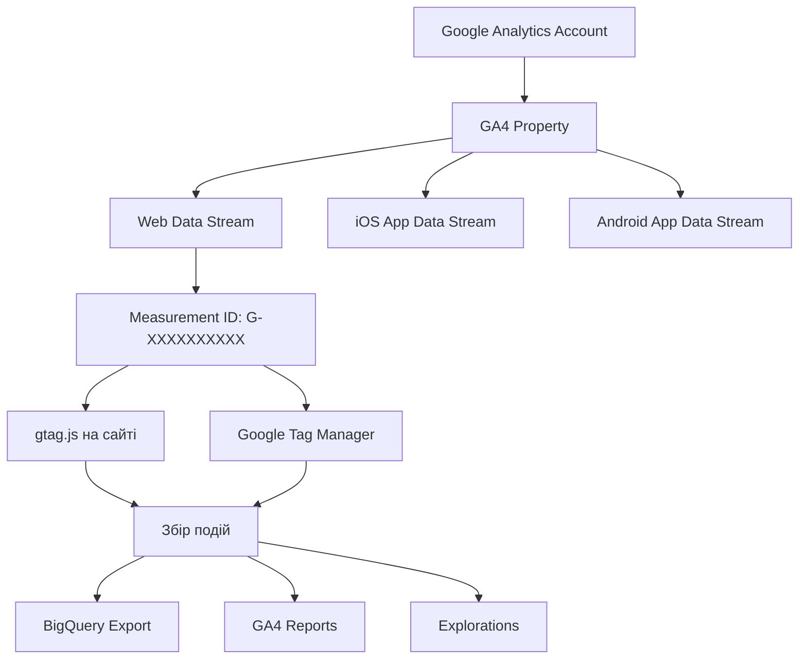
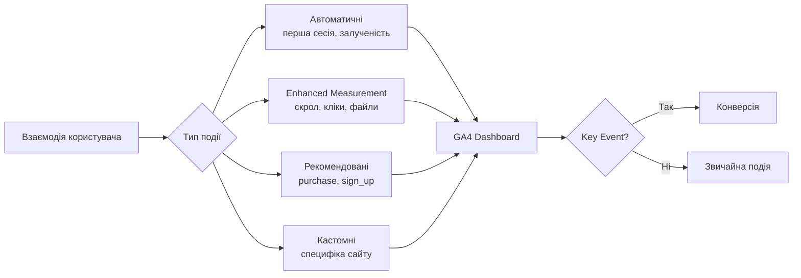

# Лабораторна робота 05 Налаштування Google Analytics 4 та відстеження подій 📊🎯

## 🎯 Мета

Після виконання лабораторної роботи здобувач освіти зможе самостійно створювати GA4 property та підключати вебсайт до системи аналітики, встановлювати tracking code через gtag.js або Google Tag Manager, налаштовувати кастомні події для відстеження взаємодій користувачів, визначати конверсії та ключові події на основі бізнес-цілей, тестувати коректність відстеження через інструмент DebugView, а також формувати базові аналітичні звіти для оцінки поведінки відвідувачів.

## 📋 Завдання

1. Створити GA4 property та налаштувати Data Stream для вебсайту.
2. Встановити tracking code (gtag.js або через Google Tag Manager) та верифікувати збір даних.
3. Налаштувати мінімум 5–7 кастомних подій для відстеження ключових взаємодій.
4. Визначити та налаштувати 3–5 конверсій (key events) відповідно до цілей сайту.
5. Активувати Enhanced Measurement та перевірити автоматичне відстеження подій.
6. Протестувати всі налаштовані події через DebugView у реальному часі.
7. Побудувати базові звіти та задокументувати початкові метрики.

## ⭐ Критерії оцінювання

Максимальна кількість балів за лабораторну роботу: **7 балів**.

Розподіл балів за виконання завдань:

- Коректне створення GA4 property та підключення Data Stream з підтвердженим збором даних: **1 бал**.
- Якість налаштування кастомних подій (5–7 подій з відповідними параметрами та обґрунтуванням вибору): **2 бали**.
- Правильне визначення конверсій та їх відповідність бізнес-цілям сайту з поясненням логіки: **2 бали**.
- Успішне тестування всіх подій через DebugView зі screenshots підтвердження: **1 бал**.
- Якість підготовлених базових звітів та документація у звіті: **1 бал**.

## ⏰ Політика дедлайнів та штрафів

**Термін здачі:** Лабораторна робота має бути здана **протягом 2 тижнів** від дати проведення останнього аудиторного заняття з цієї теми.

**Система штрафів за прострочення:** Здача роботи в установлений термін дає можливість отримати повну оцінку 7 балів. Роботи, здані з запізненням, будуть оцінені максимум в 4 бали. Виняток становлять документально підтверджені поважні причини (хвороба, сімейні обставини), за яких термін може бути продовжений за погодженням з викладачем.

## 📚 Теоретичні відомості

### Архітектура Google Analytics 4

Google Analytics 4 (GA4) — четверте покоління аналітичної платформи Google, яке прийшло на зміну Universal Analytics (UA) у 2023 році. Принципова відмінність GA4 від попередника полягає в переході від сесійної моделі даних до подієвої (event-based) моделі. У UA центральним поняттям була сесія — часовий інтервал взаємодій одного користувача. У GA4 кожна взаємодія є окремою подією з набором параметрів, що дає значно більшу гнучкість у аналізі поведінки.

Архітектура GA4 будується навколо трьох ключових сутностей. Account — верхній рівень ієрархії, зазвичай відповідає організації або бізнесу. Property — аналітичний ресурс, що відповідає одному продукту або набору пов'язаних платформ; один акаунт може містити кілька property. Data Stream — джерело даних у межах property: окремі потоки для вебсайту, iOS-застосунку та Android-застосунку можуть об'єднуватися в одній property, що дозволяє аналізувати кросплатформенну поведінку.



### Модель подій у GA4

В основі GA4 лежить концепція, що будь-яка взаємодія користувача з вебсайтом є подією. Кожна подія має ім'я та може мати до 25 параметрів — пар ключ-значення, що описують контекст взаємодії.

Залежно від джерела походження, GA4 розрізняє чотири типи подій. Автоматично зібрані події (automatically collected) фіксуються без жодного додаткового налаштування: `session_start`, `first_visit`, `user_engagement`. Покращені вимірювання (enhanced measurement) активуються одним перемикачем у налаштуваннях Data Stream і вмикають автоматичне відстеження прокрутки сторінки, кліків по зовнішніх посиланнях, пошуку по сайту, переглядів відео YouTube та завантажень файлів. Рекомендовані події (recommended events) — це стандартизовані назви подій від Google для типових сценаріїв: `purchase`, `add_to_cart`, `sign_up`, `login`. Використання стандартних назв дозволяє GA4 автоматично застосовувати відповідні шаблони звітів. Кастомні події (custom events) — будь-які події з довільними назвами, що відстежують специфічні для сайту взаємодії.

Важливе поняття — конверсія (key event у новій термінології GA4). Конверсією є будь-яка подія, позначена як ключова для бізнес-цілей: заповнення форми, здійснення покупки, реєстрація. Конверсії відображаються окремо у звітах і використовуються для оцінки ефективності каналів.



### Методи встановлення tracking code

GA4 підтримує два основних способи інтеграції з вебсайтом.

**Прямий gtag.js** передбачає вставку JavaScript-фрагменту безпосередньо в HTML сторінок. Це найпростіший спосіб, що підходить для статичних сайтів та ситуацій, коли потрібно мінімально залежати від сторонніх інструментів. Код додається у секцію `<head>` кожної сторінки:

```html
<!-- Google tag (gtag.js) -->
<script async src="https://www.googletagmanager.com/gtag/js?id=G-XXXXXXXXXX"></script>
<script>
  window.dataLayer = window.dataLayer || [];
  function gtag(){dataLayer.push(arguments);}
  gtag('js', new Date());
  gtag('config', 'G-XXXXXXXXXX');
</script>
```

**Google Tag Manager (GTM)** є системою управління тегами, що дозволяє без змін коду сайту додавати та редагувати маркетингові та аналітичні теги. GTM встановлюється один раз, після чого всі теги (включно з GA4) управляються через вебінтерфейс GTM. Цей підхід є більш гнучким і рекомендується для продуктивних проєктів: він зменшує залежність від розробників та централізує управління всіма тегами.

Для WordPress та більшості CMS існують плагіни, що спрощують встановлення GTM або gtag.js без редагування коду теми.

### Enhanced Measurement та кастомні події

Enhanced Measurement — набір автоматичних відстежувань, що вмикаються одним перемикачем у налаштуваннях Data Stream. До автоматично відстежуваних взаємодій належать: прокрутка сторінки до 90% (`scroll` з параметром `percent_scrolled: 90`), кліки по зовнішніх посиланнях (`click` з параметром `outbound: true`), пошук по сайту (`search` з параметром `search_term`), взаємодія з відео YouTube (`video_start`, `video_progress`, `video_complete`), завантаження файлів (`file_download` з параметром `file_name`).

Для відстеження подій, що не охоплюються Enhanced Measurement, необхідно надсилати кастомні події через JavaScript. Найпростіший спосіб — функція `gtag('event', ...)`:

```javascript
// Відстеження кліку по кнопці
document.getElementById('cta-button').addEventListener('click', function() {
  gtag('event', 'cta_click', {
    'button_text': 'Замовити консультацію',
    'button_location': 'hero_section'
  });
});

// Відстеження заповнення форми
document.getElementById('contact-form').addEventListener('submit', function() {
  gtag('event', 'form_submit', {
    'form_name': 'contact_form',
    'form_location': 'contact_page'
  });
});
```

### DebugView та перевірка налаштувань

DebugView — вбудований інструмент GA4 для тестування відстеження у реальному часі. Він відображає події, що надходять від конкретного пристрою або браузера, з повним набором параметрів. Для активації Debug Mode необхідно або встановити розширення Google Analytics Debugger для Chrome, або додати параметр `debug_mode: true` у конфігурацію gtag. DebugView допомагає переконатись, що всі події надсилаються коректно ще до того, як вони почнуть відображатися у стандартних звітах (де є затримка даних до 24–48 годин).

## 🔧 Хід роботи

### Крок 1. Створення GA4 Property

Перейдіть на сторінку [analytics.google.com](https://analytics.google.com) та увійдіть за допомогою акаунту Google. Якщо ви вперше відкриваєте GA, система запропонує створити акаунт.

Натисніть «Адміністратор» (піктограма шестерні у нижньому лівому куті). У колонці «Акаунт» перевірте, чи обрано правильний акаунт (або натисніть «Створити акаунт», якщо акаунту ще немає). У колонці «Ресурс» натисніть «Створити ресурс».

У майстрі налаштувань вкажіть назву ресурсу (наприклад, «Навчальний проєкт — [ваша тема]»), оберіть часовий пояс та валюту звітності. Натисніть «Далі» та заповніть відомості про вид діяльності. Після завершення майстра система відкриє сторінку «Початок збору даних».

Оберіть тип платформи «Вебсайт», вкажіть URL та назву потоку даних. GA4 автоматично згенерує Measurement ID у форматі `G-XXXXXXXXXX`. Збережіть цей ідентифікатор — він знадобиться для встановлення коду.

Зробіть screenshots: сторінки підтвердження створення Property та екрану з Measurement ID.

### Крок 2. Встановлення tracking code

Оберіть метод встановлення: gtag.js або Google Tag Manager. Рекомендується GTM для тих, хто вже знайомий з ним; gtag.js — для прямого та простого підключення.

**Варіант А: встановлення через gtag.js.** Скопіюйте фрагмент коду GA4, що відображається в налаштуваннях Data Stream (розділ «Інструкції з встановлення тегу» → «Встановити вручну»). Вставте код одразу після відкриваючого тегу `<head>` на кожній сторінці вашого сайту. Для WordPress це зазвичай робиться через плагін (наприклад, Insert Headers and Footers) або безпосередньо у файлі теми `header.php`.

**Варіант Б: встановлення через Google Tag Manager.** Якщо GTM ще не підключений — зареєструйтесь на [tagmanager.google.com](https://tagmanager.google.com), створіть контейнер і розмістіть GTM-фрагмент на сайті. Після цього у GTM створіть новий тег типу «Google Analytics: конфігурація GA4», вкажіть Measurement ID та тригер «All Pages». Опублікуйте контейнер.

Для перевірки підключення відкрийте ваш сайт у браузері та перейдіть до розділу GA4 «Звіти» → «У реальному часі». Якщо відображається активний користувач (ви самі), код встановлено коректно. Зафіксуйте скріншот реального часу.

### Крок 3. Налаштування Enhanced Measurement

У налаштуваннях GA4 перейдіть до «Адміністратор» → «Потоки даних» → оберіть ваш вебпотік → «Enhanced Measurement» (переключатель має бути увімкнено).

Натисніть на піктограму налаштувань (шестерня поруч із перемикачем) та перегляньте перелік доступних подій. Переконайтесь, що активовані: Прокрутки сторінки, Кліки по зовнішніх посиланнях, Пошук по сайту (вкажіть параметр запиту — зазвичай `s` або `q`), Взаємодія з відео (якщо на сайті є YouTube-відео).

Перевірте в DebugView, що події `scroll` та `click` надходять при взаємодії зі сторінкою. Зафіксуйте screenshots налаштувань Enhanced Measurement.

### Крок 4. Налаштування кастомних подій

Визначте та реалізуйте мінімум 5–7 кастомних подій, що відображають ключові взаємодії на вашому сайті. Заповніть таблицю планування:

| № | Назва події | Тип взаємодії | Параметри | Обґрунтування |
|---|-------------|---------------|-----------|---------------|
| 1 | `cta_click` | Клік по CTA-кнопці | `button_text`, `section` | Відстеження ефективності CTA |
| 2 | `form_submit` | Відправка форми | `form_name` | Виявлення джерел лідів |
| 3 | `phone_click` | Клік по номеру телефону | `phone_number` | Відстеження офлайн-конверсій |
| 4 | `social_click` | Клік по соцмережах | `platform` | Аналіз social traffic |
| 5 | `tab_click` | Перемикання вкладок | `tab_name` | UX аналіз навігації |

Реалізуйте код відстеження для кожної події. Додайте JavaScript-обробники подій до відповідних елементів сторінки. Нижче наведено приклад для кількох типів взаємодій:

```javascript
// Відстеження кліків по номеру телефону
document.querySelectorAll('a[href^="tel:"]').forEach(function(el) {
  el.addEventListener('click', function() {
    gtag('event', 'phone_click', {
      'phone_number': this.getAttribute('href').replace('tel:', '')
    });
  });
});

// Відстеження кліків по посиланнях соцмереж
document.querySelectorAll('.social-link').forEach(function(el) {
  el.addEventListener('click', function() {
    gtag('event', 'social_click', {
      'platform': this.dataset.platform || 'unknown'
    });
  });
});
```

### Крок 5. Визначення конверсій

Конверсії (Key Events) — події, що безпосередньо відповідають бізнес-цілям сайту. Перейдіть до «Адміністратор» → «Конверсії» (або «Ключові події» в оновленому інтерфейсі).

Визначте 3–5 подій як конверсії. Для кожної конверсії заповніть обґрунтування:

| Подія | Конверсія | Обґрунтування |
|-------|-----------|---------------|
| `form_submit` | Так | Ключова дія — запит від потенційного клієнта |
| `phone_click` | Так | Намір зв'язатись — офлайн-конверсія |
| `purchase` | Так | Пряма транзакція (якщо є e-commerce) |
| `sign_up` | Так | Реєстрація нового користувача |
| `scroll` | Ні | Поведінкова метрика, не конверсія |

Натисніть «Новий ключовий захід» та вкажіть назву події. Після збереження відповідна подія відображатиметься у звітах розділу «Конверсії». Зробіть screenshot списку налаштованих конверсій.

### Крок 6. Тестування через DebugView

Встановіть розширення [Google Analytics Debugger](https://chrome.google.com/webstore/detail/google-analytics-debugger) для браузера Chrome та активуйте його.

Перейдіть до GA4 → «Адміністратор» → «DebugView». В іншій вкладці відкрийте ваш сайт та виконайте серію тестових дій: прокрутіть сторінку, натисніть CTA-кнопку, відправте тестову форму, клікніть по соціальних посиланнях.

Спостерігайте за потоком подій у DebugView у реальному часі. Для кожної налаштованої події перевірте: правильну назву події, наявність та коректні значення всіх параметрів, відсутність дублювань.

Зафіксуйте screenshots DebugView для кожної з налаштованих подій з видимими параметрами.

### Крок 7. Побудова базових звітів

Дочекайтесь накопичення перших даних (зазвичай достатньо 24–48 годин після встановлення, для тестових цілей використовуйте «У реальному часі»).

Ознайомтеся зі стандартними звітами GA4:

**Звіти про аудиторію** («Звіти» → «Користувачі» → «Демографія»): зафіксуйте географію, мову та технологічні характеристики (браузери, ОС, пристрої).

**Звіти про залученість** («Звіти» → «Залучення» → «Сторінки та екрани»): визначте топ-5 сторінок за кількістю переглядів, середній час взаємодії.

**Звіти про конверсії** («Звіти» → «Залучення» → «Конверсії»): перевірте, що налаштовані конверсії відображаються та фіксуються.

**Звіт у реальному часі** («Звіти» → «У реальному часі»): перегляньте активних користувачів та потік подій у реальному часі. Використайте цей звіт для отримання screenshots для звіту.

Заповніть таблицю початкових метрик:

| Метрика | Значення | Дата фіксації |
|---------|----------|---------------|
| Активних користувачів (7 днів) | | |
| Нових користувачів | | |
| Середня тривалість сесії | | |
| Коефіцієнт залучення, % | | |
| Кількість зафіксованих конверсій | | |

### Крок 8. Документування результатів

Систематизуйте всі налаштування та зібрані screenshots у звіт відповідно до рекомендованої структури.

## 📄 Рекомендована структура звіту

Звіт має містити наступні обов'язкові розділи.

**Титульна сторінка** з назвою лабораторної роботи, ПІБ студента, групою.

**Розділ 1. Налаштування GA4 Property** із screenshots створення Property та Data Stream, Measurement ID, підтвердженням збору даних у реальному часі, коротким описом налаштованих параметрів.

**Розділ 2. Встановлення tracking code** зі скріншотами коду на сторінці, описом обраного методу (gtag.js або GTM) та обґрунтуванням вибору, підтвердженням коректної роботи.

**Розділ 3. Кастомні події та конверсії** з таблицею всіх налаштованих подій (назва, тип, параметри, обґрунтування), списком конверсій з поясненням логіки відбору, JavaScript-кодом реалізованих обробників подій.

**Розділ 4. Тестування через DebugView** зі screenshots DebugView для кожної налаштованої події, коментарями до підтверджених параметрів, виявленими проблемами (якщо були) та способом їх вирішення.

**Розділ 5. Базові аналітичні звіти** з таблицею початкових метрик, screenshots ключових звітів GA4, коротким аналітичним коментарем до отриманих даних.

**Висновки** з оцінкою якості налаштованої системи відстеження, ідеями для розширення відстеження у майбутньому, рефлексією щодо використання GA4 у реальних проєктах.

**Формат звіту — `pdf`.**

## ❓ Контрольні запитання

1. Чим принципово відрізняється event-based модель даних GA4 від session-based моделі Universal Analytics? Яки переваги та недоліки кожного підходу?
2. Що таке Measurement ID та як він пов'язаний із Data Stream? Чому один GA4 Property може мати кілька Data Streams?
3. Поясніть різницю між автоматично зібраними подіями, Enhanced Measurement та кастомними подіями. Наведіть приклад кожного типу.
4. Що таке Key Event (конверсія) у GA4 і за яким принципом слід визначати, яку подію позначати як конверсію?
5. Для чого призначений DebugView і чому його використання є необхідним кроком при налаштуванні відстеження, а не опціональним?
6. Чому Google рекомендує використовувати стандартизовані назви подій (рекомендовані події) замість довільних кастомних назв?
7. Які переваги управління тегами через Google Tag Manager порівняно з прямим встановленням gtag.js?
