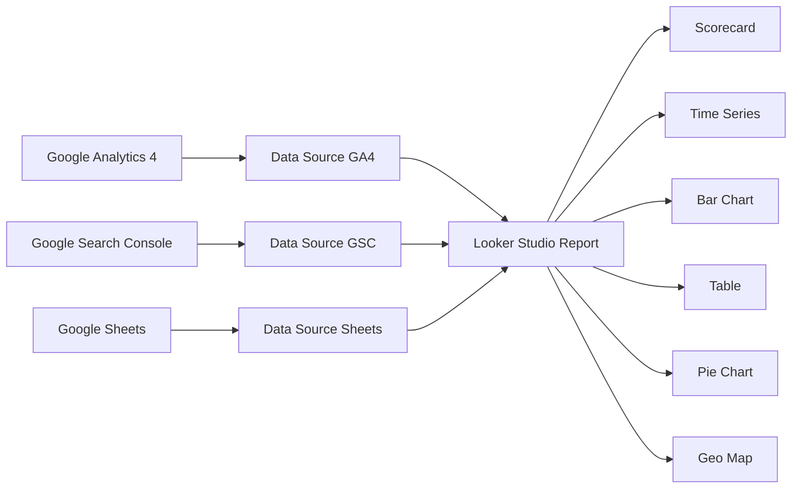
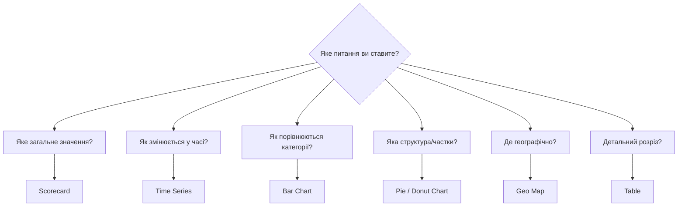

# Лабораторна робота 06 Створення аналітичних дашбордів у Looker Studio 📈🗂️

## 🎯 Мета

Після виконання лабораторної роботи здобувач освіти зможе підключати Google Analytics 4 та Google Search Console як джерела даних у Looker Studio, проєктувати структуру executive dashboard з урахуванням потреб різних типів аудиторії, використовувати різні типи візуалізацій (графіки, таблиці, scorecards, часові ряди) для відображення аналітичних даних, налаштовувати фільтри та динамічні діапазони дат для інтерактивного аналізу, а також налаштовувати спільний доступ та автоматичне надсилання звітів за розкладом.

## 📋 Завдання

1. Зареєструватися в Looker Studio та створити перший звіт.
2. Підключити GA4 як джерело даних та налаштувати відповідні поля.
3. Побудувати executive dashboard із ключовими метриками трафіку та залученості.
4. Підключити Google Search Console та додати SEO-секцію до дашборду.
5. Додати різноманітні типи візуалізацій: scorecard, time series, bar chart, table, pie chart.
6. Налаштувати фільтри дат та сегментацію для інтерактивного аналізу.
7. Налаштувати спільний доступ та (опціонально) розклад надсилання звітів.

## ⭐ Критерії оцінювання

Максимальна кількість балів за лабораторну роботу: **7 балів**.

Розподіл балів за виконання завдань:

- Коректне підключення GA4 та GSC як джерел даних з підтвердженим відображенням актуальних даних: **1 бал**.
- Якість та повнота executive dashboard: наявність ключових метрик, логічна структура, зрозумілий дизайн: **2 бали**.
- Різноманітність та доречність використаних типів візуалізацій (мінімум 5 різних типів): **2 бали**.
- Коректне налаштування фільтрів, діапазонів дат та інтерактивних елементів: **1 бал**.
- Якість документації та оформлення звіту зі screenshots готового дашборду: **1 бал**.

## ⏰ Політика дедлайнів та штрафів

**Термін здачі:** Лабораторна робота має бути здана **протягом 2 тижнів** від дати проведення останнього аудиторного заняття з цієї теми.

**Система штрафів за прострочення:** Здача роботи в установлений термін дає можливість отримати повну оцінку 7 балів. Роботи, здані з запізненням, будуть оцінені максимум в 4 бали. Виняток становлять документально підтверджені поважні причини (хвороба, сімейні обставини), за яких термін може бути продовжений за погодженням з викладачем.

## 📚 Теоретичні відомості

### Looker Studio як інструмент бізнес-аналітики

Looker Studio (до 2022 року — Google Data Studio) — безкоштовна хмарна платформа для бізнес-аналітики та візуалізації даних від Google. Вона дозволяє перетворювати «сирі» дані з різних джерел на наочні інтерактивні звіти та дашборди без навичок програмування.

Ключові переваги Looker Studio порівняно зі статичними звітами такі. По-перше, це динамічність: дані оновлюються автоматично в режимі реального часу або за розкладом, що виключає необхідність ручного оновлення. По-друге, мультиджерельність: в одному звіті можна об'єднати дані з GA4, Google Search Console, Google Ads, BigQuery, Google Sheets та десятків інших джерел. По-третє, інтерактивність: читачі звіту можуть самостійно змінювати діапазон дат, застосовувати фільтри та досліджувати дані. По-четверте, доступність: звіти доступні через браузер без встановлення ПЗ, можуть бути надіслані за посиланням або вбудовані в вебсайт.

Looker Studio особливо цінний у SEO та вебаналітиці, оскільки дозволяє об'єднати дані органічного пошуку (GSC) з поведінковими даними (GA4) та візуалізувати повну картину ефективності вебсайту.

### Концепція Data Sources та Connectors

Архітектура Looker Studio базується на розділенні звіту та джерела даних. Data Source — це конфігурований зв'язок з конкретним набором даних, що включає вибір полів, типи даних та обчислювані метрики. Один звіт може використовувати кілька Data Sources одночасно.

Connector — це технічний міст між Looker Studio та зовнішньою системою. Google підтримує власні конектори для GA4, GSC, Google Ads, BigQuery, Google Sheets, YouTube та інших продуктів. Для підключення інших систем (наприклад, Facebook Ads, Ahrefs, HubSpot) існують конектори від партнерів, частина з яких є безкоштовними, частина — платними.

### Типи візуалізацій та їх використання

Правильний вибір типу графіку є критично важливим для коректної інтерпретації даних. Кожен тип діаграми відповідає певному типу аналітичного питання.

**Scorecard (картка показника)** відображає одне числове значення з опційним порівнянням із попереднім періодом. Ідеально підходить для відображення ключових показників на «верхньому рівні» дашборду: загальна кількість сесій, кількість конверсій, дохід. Читач одразу бачить найважливіші числа та динаміку (зростання або падіння).

**Time Series (часовий ряд)** відображає зміну метрики у часі як лінійний або стовпчиковий графік. Незамінний для виявлення трендів, сезонності, аномалій. Наприклад, графік щоденного трафіку за останні 90 днів негайно показує дні з піками або провалами.

**Bar Chart / Column Chart (стовпчикова діаграма)** порівнює категоріальні значення. Горизонтальний варіант зручний для довгих назв категорій (наприклад, назв сторінок або ключових слів). Вертикальний — для порівняння невеликої кількості категорій за часом.

**Table (таблиця)** відображає детальні дані по рядках і стовпцях. Незамінна для drill-down аналізу: топ сторінок з кількостями переглядів, джерела трафіку з показниками конверсії. Looker Studio підтримує сортування та умовне форматування безпосередньо в таблицях.

**Pie / Donut Chart (кругова діаграма)** показує структуру (частки цілого). Підходить для відображення розподілу трафіку за каналами або пристроями, коли категорій не більше 5–7.

**Geo Map (географічна карта)** відображає дані з географічною прив'язкою. Використовується для аналізу географії трафіку, що є важливим для локального SEO.

### Структура ефективного SEO-дашборду

Добре спроєктований дашборд будується за принципом «від загального до конкретного» (від англ. drill-down). Верхній рівень показує найважливіші KPI одним поглядом. Нижні рівні розкривають деталі для тих, хто хоче глибшого аналізу.

Для SEO-аналітики типова структура executive dashboard включає три логічні секції. Перша — «Огляд трафіку»: загальна кількість сесій, нових користувачів, конверсій; графік динаміки трафіку за обраний період; розподіл за каналами (органічний, прямий, реферальний, соціальний). Друга — «Пошукова видимість» (на основі даних GSC): кількість показів та кліків з пошуку, CTR та середня позиція; топ пошукових запитів та сторінок. Третя — «Залученість»: показник відмов або коефіцієнт залученості; середня тривалість сесії; топ сторінок за переглядами.

### Calculated Fields та фільтри

Looker Studio дозволяє створювати обчислювані поля (Calculated Fields) — нові метрики та виміри на основі наявних даних з використанням формул. Наприклад, можна обчислити конверсійний коефіцієнт як відношення конверсій до сесій, або відсоток органічного трафіку від загального.

Фільтри дозволяють обмежити дані, що відображаються у звіті, за певними умовами. Фільтри бувають двох рівнів: на рівні Data Source (застосовуються до всіх компонентів) та на рівні конкретного компонента діаграми. Функція «Управління фільтрами» дозволяє читачам звіту самостійно перемикати фільтри, не змінюючи саму структуру звіту.

## 🔧 Хід роботи

### Крок 1. Реєстрація та знайомство з Looker Studio

Перейдіть на сторінку [lookerstudio.google.com](https://lookerstudio.google.com) та увійдіть за допомогою акаунту Google (того ж, що використовується для GA4 та GSC).

На головній сторінці ознайомтеся з наявними шаблонами у розділі «Template Gallery». Перегляньте шаблон «Acme Marketing» або «Search Console Report» — вони демонструють можливості платформи. Не використовуйте шаблон як основу для виконання завдання; мета — створити власний дашборд з нуля.

Натисніть «Створити» → «Звіт». Система запропонує одразу підключити Data Source.

### Крок 2. Підключення GA4 як джерела даних

У вікні «Додати дані до звіту» оберіть конектор «Google Analytics». У переліку акаунтів знайдіть ваш GA4 Property, створений у попередній лабораторній роботі. Оберіть відповідний Property та натисніть «Додати».

Після підключення Looker Studio покаже перелік доступних вимірів (Dimensions) та метрик (Metrics). Ознайомтеся зі структурою полів: зверніть увагу, що GA4 надає значно більше полів, ніж UA. Зафіксуйте screenshots вікна підключення та переліку полів.

Перевірте, що дані відображаються коректно, додавши простий scorecard із метрикою «Sessions» на тестовий аркуш.

### Крок 3. Підключення Google Search Console

У верхньому меню оберіть «Ресурс» → «Додати дані». Оберіть конектор «Search Console». У переліку сайтів знайдіть та оберіть вебсайт, підключений до GSC.

Зверніть увагу: GSC надає два типи таблиць — «Site Impression» (дані на рівні сайту) та «URL Impression» (дані на рівні окремих URL). Для більшості цілей SEO-звітності використовують «URL Impression», оскільки він дозволяє бачити ефективність окремих сторінок.

Виберіть тип таблиці «URL Impression» і натисніть «Додати». Тепер звіт має два підключені джерела даних. Зафіксуйте screenshot з обома підключеними джерелами.

### Крок 4. Проєктування структури дашборду

Перед початком розміщення компонентів визначте структуру дашборду. Рекомендується розмістити елементи у такому порядку:

Верхня секція («шапка»): назва дашборду, елемент вибору діапазону дат (Date Range Control), логотип (опціонально).

Ліва колонка (Scorecards): 4–6 ключових метрик — сесії, нові користувачі, коефіцієнт залучення, конверсії, покази у пошуку, CTR.

Центральна секція (основний графік): Time Series — динаміка сесій за обраний період.

Нижня секція (два стовпці): зліва — таблиця топ-10 сторінок, справа — кругова діаграма розподілу за каналами трафіку.

SEO-секція (окремий блок або друга сторінка): графік динаміки кліків та показів з GSC, таблиця топ-20 пошукових запитів (запит, кліки, покази, CTR, позиція).

### Крок 5. Побудова executive dashboard

Додайте елементи дашборду у наступній послідовності:

**Scorecards.** Виберіть «Додати компонент» → «Scorecard». Призначте метрику «Sessions» та налаштуйте порівняння з попереднім аналогічним періодом (увімкнути «Показати порівняння»). Повторіть для метрик «New Users», «Engaged Sessions», «Key Events» (конверсії). Для підключення GSC-джерела додайте Scorecards «Clicks» та «Impressions» з Data Source GSC.

**Time Series.** Додайте компонент «Time Series Chart». Джерело — GA4, виміри — Date, метрика — Sessions. Налаштуйте стиль: вкажіть колір лінії, увімкніть сглажування. Рекомендований діапазон за замовчуванням — «Останні 28 днів».

**Pie Chart.** Додайте «Pie Chart». Виміри — «Session Default Channel Group», метрика — «Sessions». Обмежте кількість секторів до 6–7 (інші об'єднайте у «Інші»). Налаштуйте легенду.

**Bar Chart.** Додайте «Bar Chart» для відображення топ-10 сторінок за переглядами. Виміри — «Page Path and Screen Class», метрика — «Views». Відсортуйте за спаданням, обмежте до 10 рядків.

**Table (GA4).** Додайте «Table» для детального аналізу сторінок. Включіть виміри «Page Path» та метрики «Views», «Sessions», «Avg. Session Duration», «Key Events». Увімкніть умовне форматування для числових стовпців.

**Table (GSC).** Додайте другу таблицю з Data Source GSC. Включіть виміри «Query» та метрики «Clicks», «Impressions», «CTR», «Position». Відсортуйте за «Clicks» за спаданням, відображайте топ-20 запитів.

Зафіксуйте screenshots дашборду у процесі збирання.

### Крок 6. Налаштування фільтрів та інтерактивності

Додайте **Date Range Control** — елемент, що дозволяє читачам змінювати діапазон дат дашборду. «Додати компонент» → «Елемент керування дати». Розмістіть у верхній частині дашборду. Задайте діапазон за замовчуванням «Останні 28 днів».

Додайте **Filter Control** для фільтрації за каналом трафіку. «Додати компонент» → «Список фільтрів». Поле — «Session Default Channel Group». Дозвольте вибір кількох значень. Це дозволить читачу побачити дані лише для органічного або лише для прямого трафіку.

Налаштуйте **Drill-down** для таблиці сторінок: додайте другий вимір «Page Title» поруч із «Page Path», що дозволяє побачити і шлях, і назву сторінки.

Перевірте інтерактивність: змініть діапазон дат та переконайтесь, що всі компоненти оновлюються синхронно. Застосуйте фільтр за каналом — переконайтесь, що таблиці та графіки реагують.

Зафіксуйте screenshots з активованими фільтрами.

### Крок 7. Налаштування спільного доступу

Натисніть «Поділитись» у верхньому правому куті. Оберіть один із варіантів доступу:

«Надати доступ» — введіть електронну адресу (наприклад, викладача) та встановіть рівень доступу «Переглядач». Це дозволить переглядати звіт, але не редагувати.

«Управління посиланням» — встановіть доступ «Будь-хто з посиланням може переглядати». Скопіюйте посилання та додайте до звіту.

Опціонально: налаштуйте автоматичне надсилання звіту. Натисніть «Ресурс» → «Заплановані доставки». Вкажіть email-адресу, частоту (щотижня/щомісяця) та формат (pdf або PNG). Зафіксуйте screenshot налаштувань доступу.

### Крок 8. Документування результатів

Зробіть фінальний повноекранний screenshot завершеного дашборду. Завантажте PDF-версію через «Файл» → «Завантажити» → «PDF».

## 📄 Рекомендована структура звіту

Звіт має містити наступні обов'язкові розділи.

**Титульна сторінка** з назвою лабораторної роботи, ПІБ студента, групою.

**Розділ 1. Налаштування джерел даних** зі screenshots підключення GA4 та GSC, описом обраних таблиць та ключових полів, посиланням на готовий звіт у Looker Studio (якщо надано публічний доступ).

**Розділ 2. Структура дашборду** зі схемою або описом логічної структури (які секції, яка інформація де розміщена), обґрунтуванням обраної структури для цільової аудиторії.

**Розділ 3. Огляд реалізованих компонентів** зі screenshots кожного типу використаної візуалізації, поясненням, яке аналітичне питання вирішує кожен компонент, описом налаштованих метрик та вимірів.

**Розділ 4. Інтерактивні елементи** зі screenshots Date Range Control та Filter Control в дії, описом сценаріїв використання фільтрів.

**Розділ 5. Готовий дашборд** з повноекранним скріншотом фінального результату, посиланням на публічний звіт (або скріншотом налаштувань доступу).

**Висновки** з оцінкою переваг Looker Studio порівняно зі стандартними звітами GA4, описом інсайтів, які вдалося виявити завдяки побудованому дашборду, пропозиціями щодо розширення дашборду для реального проєкту.

**Формат звіту — `pdf`.**

## ❓ Контрольні запитання

1. Чим Looker Studio відрізняється від стандартних звітів Google Analytics? У яких ситуаціях варто використовувати Looker Studio, а не вбудовані звіти GA4?
2. Що таке Data Source у Looker Studio і чому розділення між звітом та джерелом даних є архітектурно правильним рішенням?
3. Поясніть різницю між вимірами (Dimensions) та метриками (Metrics) у GA4/Looker Studio. Наведіть по 3 приклади кожного типу.
4. Для яких аналітичних питань підходить Time Series, а для яких — Bar Chart? Чи можна замінити один тип іншим? Обґрунтуйте.
5. Що таке Calculated Field у Looker Studio? Наведіть практичний приклад обчислюваного поля для SEO-аналітики.
6. Яка різниця між фільтром на рівні Data Source та фільтром на рівні компонента? Коли доцільно використовувати кожен рівень?
7. Чому для SEO-аналітики корисно об'єднувати дані GA4 та Google Search Console в одному дашборді? Які питання можна відповісти лише при наявності обох джерел?
