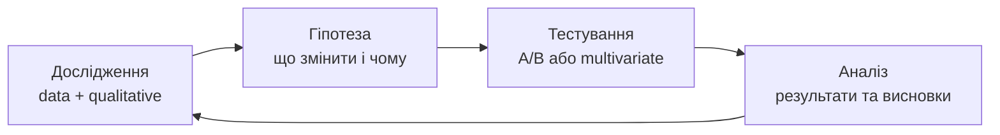
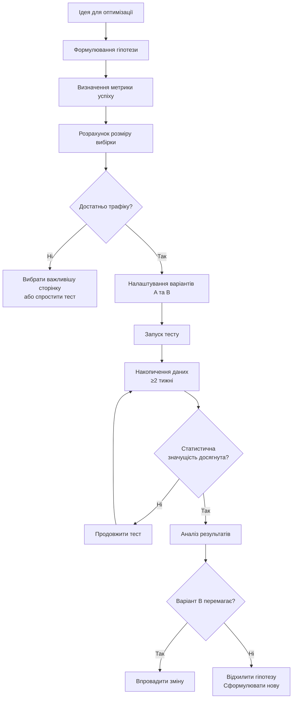

# Лабораторна робота 07 A/B тестування 🧪🖱️

## 🎯 Мета

Після виконання лабораторної роботи здобувач освіти зможе встановлювати Microsoft Clarity на вебсайт та інтерпретувати теплові карти (heatmaps) і записи сесій (session recordings) для виявлення проблем у взаємодії користувачів із сайтом, формулювати обґрунтовані гіпотези для A/B тестування на основі поведінкових даних, налаштовувати прості A/B тести для оптимізації заголовків та кнопок призову до дії (CTA), аналізувати результати тестів та приймати обґрунтовані рішення щодо впровадження змін, а також застосовувати методологію CRO (Conversion Rate Optimization) для систематичного покращення вебсайту.

## 📋 Завдання

1. Встановити Microsoft Clarity на вебсайт та верифікувати збір даних.
2. Проаналізувати теплові карти (click map, scroll map, move map) та виявити мінімум 3–5 інсайтів щодо поведінки користувачів.
3. Переглянути записи сесій та визначити friction points — місця, де користувачі стикаються з труднощами.
4. Сформулювати мінімум 2–3 обґрунтовані гіпотези для оптимізації на основі знайдених проблем.
5. Налаштувати та запустити принаймні один A/B тест (заголовок, CTA-кнопка або інший елемент).
6. Задокументувати методологію тестування та інтерпретувати отримані результати.

## ⭐ Критерії оцінювання

Максимальна кількість балів за лабораторну роботу: **7 балів**.

Розподіл балів за виконання завдань:

- Коректне встановлення Clarity та підтверджений збір даних (теплові карти та записи сесій наявні): **1 бал**.
- Глибина та обґрунтованість аналізу теплових карт і записів сесій (мінімум 3–5 конкретних інсайтів): **2 бали**.
- Якість сформульованих гіпотез за форматом «Якщо... то... тому що...»: **2 бали**.
- Коректне налаштування A/B тесту та логічна інтерпретація результатів: **1 бал**.
- Якість документації та висновків у звіті: **1 бал**.

## ⏰ Політика дедлайнів та штрафів

**Термін здачі:** Лабораторна робота має бути здана **протягом 2 тижнів** від дати проведення останнього аудиторного заняття з цієї теми.

**Система штрафів за прострочення:** Здача роботи в установлений термін дає можливість отримати повну оцінку 7 балів. Роботи, здані з запізненням, будуть оцінені максимум в 4 бали. Виняток становлять документально підтверджені поважні причини (хвороба, сімейні обставини), за яких термін може бути продовжений за погодженням з викладачем.

## 📚 Теоретичні відомості

### Концепція Conversion Rate Optimization

Conversion Rate Optimization (CRO) — це систематичний процес підвищення відсотку відвідувачів вебсайту, які виконують цільову дію (конверсію): купують товар, залишають заявку, реєструються або завантажують матеріал. На відміну від SEO, що спрямований на збільшення кількості відвідувачів, CRO фокусується на підвищенні цінності наявного трафіку.

Коефіцієнт конверсії (Conversion Rate, CR) розраховується за формулою: CR = (Кількість конверсій / Кількість відвідувачів) × 100%. Навіть незначне підвищення CR може суттєво вплинути на бізнес-показники: якщо сайт отримує 10 000 відвідувачів на місяць і CR зростає з 2% до 3%, кількість конверсій збільшується на 50% без жодного збільшення рекламного бюджету.

Методологія CRO базується на циклі з чотирьох фаз:



Фаза дослідження включає кількісний аналіз (GA4, воронки, теплові карти) та якісний (записи сесій, опитування, usability tests). Гіпотеза формулюється у структурованій формі. Тестування проводиться через A/B або мультиваріантні тести. Аналіз перетворює результати тесту на рішення та нову гіпотезу.

### Теплові карти та записи сесій

Теплові карти (Heatmaps) є інструментом візуалізації поведінки користувачів на сторінці. Вони агрегують дані тисяч сесій в один наочний образ, використовуючи кольорову шкалу від синього (низька активність) до червоного (висока активність).

Існує три основних типи теплових карт. Click Map відображає, де користувачі клікають найчастіше. Дозволяє виявити: на які елементи клікають, хоча вони не є посиланнями («мертві кліки»); які важливі кнопки ігноруються; чи є відволікаючі елементи, що перехоплюють увагу. Scroll Map показує, до якої глибини користувачі прокручують сторінку. Критично важливий для визначення, чи бачить більшість відвідувачів ключові елементи: CTA, форму, ціну. Якщо 60% користувачів не прокручують до форми заявки — це критична проблема. Move Map (карта руху курсора) відображає траєкторії руху миші. Оскільки рух миші корелює з рухом погляду, цей тип карти допомагає розуміти, куди спрямована увага на сторінці.

Записи сесій (Session Recordings) — це відеозаписи реальних сесій користувачів на сайті (знеособлені та без передачі особистих даних). Вони дозволяють побачити точну послідовність дій: де користувач рухав мишею, де зупинявся, де клікав і де залишав сторінку. Записи є незамінним інструментом для виявлення friction points — моментів, де відвідувачі стикаються з труднощами, плутаниною або розчаруванням.

«Розлючені кліки» (Rage Clicks) — один із ключових сигналів Clarity: серія швидких кліків по одному елементу, що вказує на розчарування користувача. Часто виникають, коли щось виглядає клікабельним, але не реагує.

### Microsoft Clarity: огляд інструменту

Microsoft Clarity — безкоштовний інструмент поведінкової аналітики від Microsoft, що надає теплові карти, записи сесій та аналітику «мертвих кліків» та «розлючених кліків» без обмежень за кількістю записів або сторінок.

Переваги Clarity порівняно з платними аналогами (Hotjar, FullStory): повністю безкоштовний без лімітів на трафік, пряма інтеграція з GA4 для збагачення даних, автоматичне виявлення аномалій (rage clicks, excessive scrolling), дотримання GDPR завдяки автоматичному маскуванню чутливих даних.

Clarity встановлюється через JavaScript-фрагмент, аналогічно до GA4. Дані починають з'являтись протягом кількох годин після встановлення.

### A/B тестування: методологія

A/B тест — це контрольований експеримент, у якому частина відвідувачів бачить оригінальну версію сторінки (Control, або варіант A), а інша частина — модифіковану версію (Treatment, або варіант B). Відсоток відвідувачів, що бачать кожну версію, визначається рандомно при завантаженні сторінки.

Формулювання гіпотези є найважливішим кроком перед запуском тесту. Ефективна гіпотеза будується за формулою:

«Якщо ми [зробимо конкретну зміну], то [метрика] зросте/знизиться на X%, тому що [обґрунтування на основі даних або принципу UX].»

Приклад слабкої гіпотези: «Якщо ми змінимо кнопку, конверсія зросте.» Приклад сильної гіпотези: «Якщо ми змінимо текст CTA-кнопки з "Відправити" на "Отримати безкоштовну консультацію", кількість кліків зросте на 15–20%, тому що конкретний опис результату знижує психологічний бар'єр порівняно з невизначеним "Відправити".»

Статистична значущість — ключова концепція A/B тестування. Результат тесту є значущим лише тоді, коли різниця між варіантами A та B не може бути пояснена випадковими коливаннями. Стандартний поріг значущості — p < 0,05 (confidence level 95%). Для досягнення статистично значущих результатів потрібна достатня вибірка; мінімальний рекомендований розмір — 100 конверсій на варіант.



### Типові помилки в A/B тестуванні

Розуміння поширених помилок допомагає уникнути хибних висновків.

**Peeking problem** — передчасне завершення тесту при отриманні «вражаючого» результату. Статистичні показники на початку тесту нестабільні; тест має тривати заздалегідь визначений мінімальний термін незалежно від проміжних результатів.

**Зміна тесту під час його проведення** — будь-яка модифікація сайту, рекламної кампанії або зовнішніх умов під час тесту може порушити валідність результатів.

**Тестування незначних змін** — зміна кольору кнопки з синього на темно-синій навряд чи дасть значущий результат. Тестуйте зміни, що мають теоретичне обґрунтування суттєво вплинути на поведінку.

**Ігнорування сегментів** — загальний результат може приховувати протилежні ефекти для різних сегментів. Завжди аналізуйте результати окремо для мобільних та десктоп-користувачів.

## 🔧 Хід роботи

### Крок 1. Встановлення Microsoft Clarity

Перейдіть на сторінку [clarity.microsoft.com](https://clarity.microsoft.com) та зареєструйтеся за допомогою акаунту Microsoft або Google.

Натисніть «New Project», вкажіть назву проєкту та URL вашого сайту. Після створення проєкту система надасть JavaScript-фрагмент для встановлення.

Розмістіть код Clarity на всіх сторінках вашого сайту (аналогічно до GA4). Для WordPress рекомендується плагін «Microsoft Clarity» (офіційний), що автоматизує встановлення.

**Інтеграція з GA4** (рекомендовано): у налаштуваннях Clarity перейдіть до «Settings» → «Connected integrations» → «Google Analytics». Введіть Measurement ID вашого GA4. Ця інтеграція дозволить бачити записи сесій безпосередньо в GA4 через розширення, а також передавати дані Clarity (rage clicks) як події в GA4.

Відкрийте ваш сайт у браузері та виконайте кілька тестових дій. Повернувшись до Clarity, оновіть сторінку та перевірте наявність даних у розділі «Dashboard». Зробіть screenshot дашборду Clarity із першими даними.

### Крок 2. Аналіз теплових карт

Після накопичення мінімально достатньої кількості сесій (рекомендується зачекати 2–3 дні або самостійно провести кілька десятків тестових сесій) перейдіть до розділу «Heatmaps».

Оберіть основну сторінку для аналізу (головна сторінка або сторінка з формою заявки). Перегляньте три типи теплових карт та заповніть таблицю інсайтів:

| Тип карти | Спостереження | Гіпотетична причина | Рекомендація |
|-----------|---------------|---------------------|--------------|
| Click Map | Користувачі клікають на зображення товару, що не є посиланням | Зображення виглядає клікабельним | Зробити зображення посиланням на картку товару |
| Scroll Map | 70% користувачів не прокручують до форми заявки | Форма розташована занадто низько | Перемістити форму вище або додати CTA-кнопку вгорі |
| Move Map | Увага концентрується у верхній лівій частині | F-pattern читання | Розмістити ключові елементи в зоні F-pattern |

Знайдіть та задокументуйте мінімум 3–5 конкретних інсайтів. Зафіксуйте screenshots кожного типу теплової карти.

### Крок 3. Аналіз записів сесій

Перейдіть до розділу «Recordings». Застосуйте фільтри для виявлення найбільш інформативних записів: «Rage Clicks» — записи, де користувач виявляв ознаки розчарування; «Quick Back» — записи, де користувач швидко повернувся з сторінки; записи з мобільних пристроїв (якщо є).

Перегляньте мінімум 5–10 записів сесій, звертаючи увагу на: моменти зупинки та коливань перед кліком; елементи, що не реагують на кліки; місця, де користувач відступає назад або закриває сторінку; неочевидні шляхи навігації.

Заповніть таблицю виявлених friction points:

| № | Сторінка | Опис проблеми | Частота виявлення | Критичність |
|---|----------|---------------|-------------------|-------------|
| 1 | Головна | Кнопка меню не реагує на мобільних | 3 з 5 переглянутих записів | Висока |
| 2 | Контакти | Форма не повертає підтвердження після відправки | 2 з 5 | Середня |

Зафіксуйте screenshots або опис щонайменше 3 конкретних friction points.

### Крок 4. Формулювання гіпотез

На основі аналізу теплових карт та записів сесій сформулюйте 2–3 гіпотези для A/B тестування.

Для кожної гіпотези заповніть структуровану картку:

**Гіпотеза №1**

- Проблема (що побачили в даних): [опис конкретної проблеми зі screenshots]
- Зміна (що плануємо змінити): [конкретна зміна]
- Очікуваний ефект: [метрика] зросте на [X]%
- Обґрунтування: [посилання на принцип UX або аналогічне дослідження]
- Метрика успіху: [конкретна вимірна метрика — кліки, конверсія, час на сторінці]
- Мінімальний термін тесту: [кількість тижнів або кількість конверсій]

Приклад заповненої картки:

**Гіпотеза №1**

- Проблема: Scroll Map показує, що лише 35% відвідувачів доскролюють до CTA-кнопки в нижній частині сторінки.
- Зміна: Додати ідентичну CTA-кнопку у верхній частині сторінки (above the fold).
- Очікуваний ефект: Кількість кліків по CTA зросте на 20–30%.
- Обґрунтування: Принцип «above the fold» — ключові елементи мають бути видимі без прокрутки; підтверджено дослідженнями Nielsen Norman Group.
- Метрика успіху: Кількість кліків по кнопці (подія `cta_click` у GA4).
- Мінімальний термін: 2 тижні або 100 кліків на варіант.

### Крок 5. Налаштування та проведення A/B тесту

Оберіть одну гіпотезу для реалізації. Існує кілька способів провести A/B тест залежно від ваших технічних можливостей.

**Варіант А: Google Optimize (застарілий — замінено).** Google Optimize було припинено у 2023 році. Замість нього рекомендується використовувати **VWO** (безкоштовна версія), **AB Tasty** або провести «ручний» A/B тест.

**Варіант Б: Ручний A/B тест через GTM.** У Google Tag Manager створіть змінну типу «Custom JavaScript», що з ймовірністю 50% повертає «A» або «B». На основі значення цієї змінної через тег «Custom HTML» вносьте зміну до сторінки для групи B. Передавайте призначений варіант як параметр події в GA4:

```javascript
// Змінна GTM: Random AB Split
function() {
  var stored = localStorage.getItem('ab_test_variant');
  if (!stored) {
    stored = Math.random() < 0.5 ? 'A' : 'B';
    localStorage.setItem('ab_test_variant', stored);
  }
  return stored;
}
```

```javascript
// Тег GTM: Apply B Variant
(function() {
  var variant = {{AB Test Variant}};
  if (variant === 'B') {
    // Наприклад, змінюємо текст CTA-кнопки
    var btn = document.querySelector('#main-cta');
    if (btn) btn.textContent = 'Отримати безкоштовну консультацію';
  }
  // Надсилаємо інформацію про варіант у GA4
  gtag('event', 'ab_test_exposure', {
    'test_name': 'cta_button_text',
    'variant': variant
  });
})();
```

**Варіант В: Спрощений тест через Clarity.** У Clarity доступні базові налаштування для відстеження різних версій сторінок через Custom Tags.

Незалежно від обраного методу, заплануйте мінімальний термін тесту (не менше 2 тижнів) та визначте критерій зупинки (мінімальна кількість конверсій або статистична значущість > 95%).

Зафіксуйте screenshots налаштування тесту.

### Крок 6. Моніторинг та інтерпретація результатів

Протягом терміну тесту щоденно перевіряйте в GA4: кількість сесій по кожному варіанту, кількість конверсій (цільової події) по кожному варіанту.

Після завершення тесту або накопичення достатньої кількості даних заповніть таблицю результатів:

| Варіант | Сесії | Конверсії | CR, % | Зміна CR, % |
|---------|-------|-----------|--------|--------------|
| A (Control) | | | | — |
| B (Treatment) | | | | +/– X% |

Для розрахунку статистичної значущості скористайтесь онлайн-калькулятором, наприклад [abtestguide.com/calc](https://abtestguide.com/calc). Введіть кількість відвідувачів та конверсій для кожного варіанту та отримайте p-value.

Інтерпретуйте результати: якщо p < 0,05 і варіант B показав вищий CR — гіпотеза підтверджена, рекомендується впровадити зміну. Якщо результат незначущий — гіпотеза відхилена, тест тривав недостатньо або зміна не впливає на поведінку. Якщо варіант B виявився гіршим — гіпотеза спростована, обов'язково поверніться до версії A.

Зафіксуйте screenshots результатів тесту та розрахунку значущості.

### Крок 7. Документування результатів

Підготуйте звіт із повним описом виконаної роботи відповідно до рекомендованої структури.

## 📄 Рекомендована структура звіту

Звіт має містити наступні обов'язкові розділи.

**Титульна сторінка** з назвою лабораторної роботи, ПІБ студента, групою.

**Розділ 1. Встановлення Microsoft Clarity** зі screenshots встановленого коду, підтвердженням збору даних у дашборді Clarity, описом налаштованої інтеграції з GA4 (якщо виконано).

**Розділ 2. Аналіз теплових карт** зі скріншотами Click Map, Scroll Map та Move Map для обраної сторінки, заповненою таблицею інсайтів (мінімум 3–5 спостережень), аналітичними висновками про поведінку користувачів.

**Розділ 3. Аналіз записів сесій** з описом переглянутих записів та методу відбору, таблицею виявлених friction points, screenshots або детальним описом найбільш показових сесій.

**Розділ 4. Гіпотези для оптимізації** зі структурованими картками для 2–3 гіпотез, обґрунтуванням кожної гіпотези посиланням на конкретні дані, пріоритизацією гіпотез з обґрунтуванням обраної для тестування.

**Розділ 5. A/B тест** зі screenshots налаштування тесту, описом обраного методу реалізації та обґрунтуванням вибору, таблицею результатів, розрахунком статистичної значущості, інтерпретацією результатів та рекомендацією щодо впровадження.

**Висновки** з оцінкою ефективності методу поведінкової аналітики для виявлення проблем UX, загальним висновком про стан досліджуваного сайту, рекомендаціями щодо пріоритетів оптимізації.

**Формат звіту — `pdf`.**

## ❓ Контрольні запитання

1. Поясніть різницю між кількісними та якісними методами дослідження поведінки користувачів. Які питання можна відповісти лише якісними методами?
2. Які три типи теплових карт надає Microsoft Clarity і яку специфічну інформацію дає кожен із них? Наведіть практичний приклад використання кожного типу.
3. Що таке «rage click» та «dead click» у Clarity? Про яку проблему на сайті може свідчити висока частка rage clicks?
4. Як правильно формулювати гіпотезу для A/B тесту? Чому формулювання «Давайте змінимо кнопку і подивимось» є неприйнятним?
5. Поясніть концепцію статистичної значущості та p-value. Чому не можна завершувати тест, як тільки побачили бажаний результат (peeking problem)?
6. Яка мінімальна кількість даних необхідна для отримання статистично значущих результатів A/B тесту? Від чого залежить ця кількість?
7. У яких випадках результат A/B тесту «B краще A» може бути хибним або оманливим? Які зовнішні фактори можуть впливати на валідність тесту?
