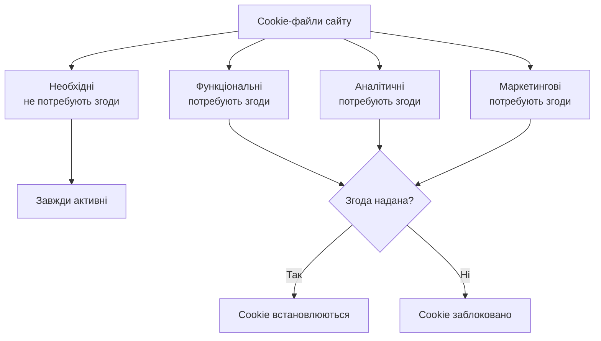
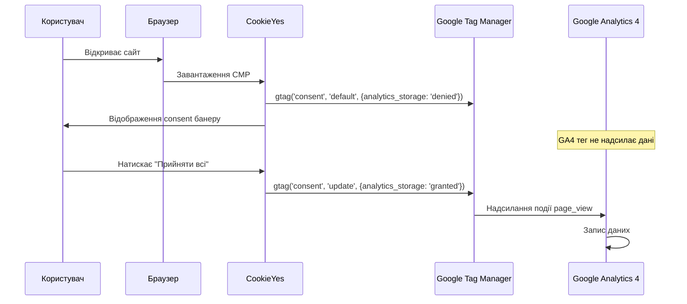

# Лабораторна робота 08 Cookie consent 🍪🔐

## 🎯 Мета

Після виконання лабораторної роботи здобувач освіти зможе розуміти основні вимоги GDPR та ePrivacy Directive до використання файлів cookie на вебсайтах, встановлювати та налаштовувати платформу управління згодою (CMP) CookieYes для забезпечення відповідності регуляторним вимогам, реалізовувати Consent Mode v2 для Google Analytics 4 та Google Tag Manager, перевіряти коректність роботи cookie consent через інструменти розробника браузера, а також формувати сторінку Privacy Policy з необхідними розділами щодо використання аналітичних cookie.

## 📋 Завдання

1. Ознайомитися з вимогами GDPR до cookie consent та класифікувати всі cookie вашого сайту.
2. Встановити платформу управління згодою CookieYes та налаштувати consent банер.
3. Реалізувати Consent Mode v2 для блокування GA4 до отримання згоди користувача.
4. Протестувати коректність роботи: GA4 не має збирати дані до надання згоди.
5. Налаштувати сторінку Privacy Policy з коректним описом використання cookie.
6. Перевірити compliance через інструменти браузера та задокументувати результати.

## ⭐ Критерії оцінювання

Максимальна кількість балів за лабораторну роботу: **7 балів**.

Розподіл балів за виконання завдань:

- Коректна класифікація cookie та встановлення CookieYes із налаштованим consent банером: **1 бал**.
- Правильна реалізація Consent Mode v2 із підтвердженим блокуванням GA4 до згоди: **2 бали**.
- Коректне тестування через інструменти розробника (Network, Application) із screenshots доказами: **2 бали**.
- Якість сторінки Privacy Policy: наявність обов'язкових розділів, точність формулювань: **1 бал**.
- Якість документації та висновків у звіті: **1 бал**.

## ⏰ Політика дедлайнів та штрафів

**Термін здачі:** Лабораторна робота має бути здана **протягом 2 тижнів** від дати проведення останнього аудиторного заняття з цієї теми.

**Система штрафів за прострочення:** Здача роботи в установлений термін дає можливість отримати повну оцінку 7 балів. Роботи, здані з запізненням, будуть оцінені максимум в 4 бали. Виняток становлять документально підтверджені поважні причини (хвороба, сімейні обставини), за яких термін може бути продовжений за погодженням з викладачем.

## 📚 Теоретичні відомості

### Регуляторна база: GDPR та ePrivacy Directive

Генеральний регламент захисту даних (GDPR, General Data Protection Regulation) — нормативний акт Євросоюзу, що набрав чинності 25 травня 2018 року. Він встановлює правила обробки персональних даних фізичних осіб у межах ЄС. Хоча Україна не є членом ЄС, GDPR екстериторіально застосовується до будь-якого вебсайту, що обробляє дані жителів ЄС — а це практично будь-який публічний сайт із міжнародною аудиторією.

Директива про електронну конфіденційність (ePrivacy Directive) доповнює GDPR та конкретно регулює використання cookie-файлів. Ключова вимога: необхідно отримати явну, попередню та обґрунтовану згоду користувача до встановлення будь-яких cookie, що не є суто необхідними для функціонування сайту.

З практичної точки зору для власника вебсайту це означає наступне: не можна встановлювати cookie Google Analytics, Meta Pixel або будь-яких рекламних платформ до того, як користувач дасть на це явну згоду. Порушення можуть призвести до штрафів до 4% від річного глобального обороту компанії або 20 мільйонів євро — залежно від того, яка сума більша.

### Класифікація cookie-файлів

Усі cookie поділяються на категорії залежно від їхньої функції:

**Необхідні (Strictly Necessary)** — це cookie, що забезпечують базове функціонування сайту: збереження стану авторизації, ідентифікатор сесії, налаштування мови, стан кошика. Вони не потребують згоди користувача та не можуть бути заблоковані без порушення роботи сайту.

**Функціональні (Functional/Preferences)** зберігають налаштування та вподобання користувача, що не є суто необхідними: збережений вибір теми (темна/світла), регіональні налаштування, що запам'ятовуються. Вимагають згоди.

**Аналітичні (Analytics/Performance)** збирають агреговані дані про поведінку користувачів для покращення сайту. До цієї категорії належать Google Analytics (_ga, _gid), Microsoft Clarity тощо. Вимагають згоди.

**Маркетингові (Marketing/Targeting)** використовуються для показу персоналізованої реклами. Meta Pixel, Google Ads remarketing, LinkedIn Insight Tag. Вимагають явної згоди.



### Платформи управління згодою (CMP)

Consent Management Platform (CMP) — це спеціалізоване програмне забезпечення, що автоматизує процес отримання та управління згодою на cookie. CMP відображає банер для нових відвідувачів, запам'ятовує вибір, надає можливість змінити налаштування пізніше та забезпечує аудит trail — журнал отриманих згод для доведення compliance.

CookieYes — безкоштовна (з обмеженими функціями) CMP із офіційними інтеграціями для WordPress, Shopify, Wix та інших платформ. Безкоштовний план дозволяє розмістити до 25 000 переглядів банеру на місяць, що достатньо для навчального проєкту.

Серед інших популярних CMP варто відзначити: Cookiebot, OneTrust (платні, enterprise-рівень), Osano, Termly (є безкоштовні плани).

### Google Consent Mode v2

Consent Mode v2 — інтеграційний механізм від Google, що дозволяє GA4 та Google Ads адаптувати своє функціонування залежно від наданої користувачем згоди. Це відповідь Google на вимоги GDPR.

Consent Mode v2 вводить шість типів згоди, найважливіші з яких: `analytics_storage` (дозвіл на аналітичні cookie), `ad_storage` (дозвіл на рекламні cookie), `ad_user_data` (дозвіл на використання даних для реклами), `ad_personalization` (дозвіл на персоналізовану рекламу).

Consent Mode підтримує два режими роботи. «Basic» (Базовий): до надання згоди Google теги взагалі не завантажуються — ні cookie, ні запити. «Advanced» (Розширений): Google теги завантажуються, але без ідентифікуючих cookie. Google збирає агреговані анонімні сигнали для моделювання конверсій.



Для правильної роботи Consent Mode команда `gtag('consent', 'default', ...)` зі станом `denied` має виконуватися до завантаження GA4 та будь-яких маркетингових тегів.

### Перевірка compliance через DevTools

Браузерні інструменти розробника (DevTools, відкриваються через F12) дозволяють перевірити коректність реалізації consent:

**Вкладка Application → Cookies** відображає всі встановлені cookie для поточного домену. До надання згоди тут не повинно бути cookie GA4 (`_ga`, `_gid`) або інших аналітичних/маркетингових cookie.

**Вкладка Network** відображає всі HTTP-запити сторінки. До надання згоди не повинно бути запитів до `google-analytics.com`, `analytics.google.com`, `googletagmanager.com/gtag` (якщо використовується Basic mode).

**Вкладка Console** дозволяє перевірити стан Consent Mode через команду `window.dataLayer` — масив подій, серед яких має бути `consent` подія зі станом `denied` до взаємодії з банером.

## 🔧 Хід роботи

### Крок 1. Аудит cookie на сайті

Перш ніж встановлювати CMP, необхідно з'ясувати, які саме cookie встановлює ваш сайт.

Відкрийте ваш сайт у браузері Chrome. Натисніть F12 → вкладка «Application» → «Cookies» → оберіть ваш домен у лівому меню. Зафіксуйте список усіх встановлених cookie.

Для кожного cookie визначте: ім'я (`_ga`, `session_id` тощо), термін дії (Session або дата завершення), призначення (аналітика, функціональне, маркетингове).

Заповніть таблицю аудиту:

| Ім'я cookie | Термін дії | Категорія | Сервіс | Потребує згоди? |
|-------------|-----------|-----------|--------|-----------------|
| `_ga` | 2 роки | Аналітичні | Google Analytics | Так |
| `_gid` | 24 год | Аналітичні | Google Analytics | Так |
| `PHPSESSID` | Сесія | Необхідні | PHP Session | Ні |
| `wp-settings` | 1 рік | Функціональні | WordPress | Так |

Зафіксуйте screenshots вкладки Application → Cookies з повним переліком cookie.

### Крок 2. Встановлення та налаштування CookieYes

Перейдіть на сторінку [cookieyes.com](https://www.cookieyes.com) та зареєструйте безкоштовний акаунт. Після входу натисніть «New Website» та вкажіть URL вашого сайту.

CookieYes автоматично просканує сайт та складе перелік виявлених cookie. Ознайомтеся зі звітом сканування та порівняйте його з вашим власним аудитом із Кроку 1.

Перейдіть до налаштувань банеру («Banner Settings»). Налаштуйте зовнішній вигляд:

- **Положення**: рекомендується «Bottom» або «Bottom Bar» для мінімального впливу на UX.
- **Кнопки**: обов'язкові — «Прийняти всі» та «Відхилити всі» (або «Відхилити необов'язкові»). Для відповідності GDPR обидві кнопки мають бути однаково помітними; не можна робити «Прийняти» яскравою, а «Відхилити» — сірою та непомітною.
- **Текст**: налаштуйте текст банеру українською мовою. Приклад: «Ми використовуємо cookie для аналізу відвідуваності та покращення функціональності сайту. Ви можете прийняти всі cookie або налаштувати свої вподобання.»
- **Посилання**: вкажіть посилання на сторінку Privacy Policy.

Скопіюйте код встановлення CookieYes та розмістіть його на сайті якомога вище в `<head>` — **обов'язково до** тегу GA4/GTM.

Зафіксуйте screenshots налаштувань банеру в адмін-панелі CookieYes.

### Крок 3. Реалізація Consent Mode v2

Для коректної роботи Consent Mode v2 необхідно встановити стан за замовчуванням (default) ДО завантаження GA4 та будь-яких маркетингових тегів.

**Якщо використовуєте GTM:** CookieYes має офіційний GTM template, що автоматизує налаштування Consent Mode. У GTM перейдіть до «Templates» → «Search Gallery» → знайдіть «CookieYes CMP» → додайте. Потім у «Tags» → «New» → оберіть шаблон CookieYes → налаштуйте відповідно до документації CookieYes. Цей тег має виконуватись із пріоритетом, що передує тегу конфігурації GA4 (встановіть Sequence Firing або пріоритет тегу).

**Якщо використовуєте gtag.js напряму:** додайте команду встановлення дефолтного стану безпосередньо після фрагменту завантаження gtag.js, але до команди `gtag('config', 'G-XXXXXXXXXX')`:

```html
<script async src="https://www.googletagmanager.com/gtag/js?id=G-XXXXXXXXXX"></script>
<script>
  window.dataLayer = window.dataLayer || [];
  function gtag(){dataLayer.push(arguments);}

  // Встановлюємо дефолтний стан: все заблоковано
  gtag('consent', 'default', {
    'analytics_storage': 'denied',
    'ad_storage': 'denied',
    'ad_user_data': 'denied',
    'ad_personalization': 'denied',
    'wait_for_update': 500  // мс очікування оновлення від CMP
  });

  gtag('js', new Date());
  // Конфігурація GA4 виконується, але без аналітичних cookie до згоди
  gtag('config', 'G-XXXXXXXXXX');
</script>
```

Після цього CookieYes автоматично надішле команду `gtag('consent', 'update', ...)` при взаємодії користувача з банером. Переконайтесь, що CookieYes налаштований на використання Consent Mode (у налаштуваннях CookieYes → «Integrations» → «Google Consent Mode»).

### Крок 4. Тестування коректності роботи

Це найважливіший крок лабораторної роботи. Відкрийте ваш сайт у **приватному вікні** браузера (Ctrl+Shift+N у Chrome) — це гарантує відсутність збережених налаштувань.

Натисніть F12 для відкриття DevTools.

**Тест 1: Cookie до надання згоди.**

Перейдіть до вкладки «Application» → «Cookies». Зафіксуйте screenshot: cookie `_ga` та `_gid` (GA4) **не мають бути присутні**. Має бути присутнім лише cookie CookieYes (для запам'ятовування стану банеру).

**Тест 2: Мережеві запити до надання згоди.**

Перейдіть до вкладки «Network». У рядку пошуку введіть `google-analytics`. Якщо реалізований Basic mode — запити до Google Analytics **не мають відображатись** до взаємодії з банером. Зафіксуйте screenshot порожнього або відфільтрованого результату.

**Тест 3: Стан Consent Mode у dataLayer.**

Перейдіть до вкладки «Console». Введіть `dataLayer` та натисніть Enter. У масиві подій знайдіть об'єкт `{event: "consent", ...}` і переконайтесь, що `analytics_storage: "denied"`. Зафіксуйте screenshot.

**Тест 4: Після надання згоди.**

Натисніть кнопку «Прийняти всі» у consent банері. Поверніться до вкладки «Application» → «Cookies»: тепер cookie `_ga` та `_gid` **мають з'явитись**. У вкладці «Network» мають з'явитись запити до Google Analytics. У «Console» виконайте `dataLayer` знову — знайдіть оновлений об'єкт consent із `analytics_storage: "granted"`. Зафіксуйте screenshots усіх трьох змін.

Заповніть таблицю результатів тестування:

| Тест | Очікуваний результат | Фактичний результат | Відповідність |
|------|---------------------|---------------------|---------------|
| GA cookie до згоди | Відсутні | | Так / Ні |
| GA запити до згоди | Відсутні | | Так / Ні |
| Consent default state | `denied` | | Так / Ні |
| GA cookie після згоди | Присутні | | Так / Ні |
| GA запити після згоди | Присутні | | Так / Ні |

### Крок 5. Налаштування сторінки Privacy Policy

Сторінка Privacy Policy є обов'язковою вимогою GDPR та необхідна для посилання з consent банеру. Вона має містити специфічні розділи стосовно використання cookie та аналітики.

Створіть окрему сторінку на вашому сайті з адресою `/privacy-policy/`. Мінімально необхідна структура Privacy Policy включає такі розділи.

**1. Загальна інформація** із зазначенням контролера даних (назва організації/ПІБ, контактна адреса), датою набрання чинності та датою останнього оновлення.

**2. Які дані ми збираємо** із переліком типів даних (поведінкові дані через GA4: IP-адреса в анонімізованому вигляді, тип пристрою, сторінки, що переглядалися).

**3. Файли cookie** — обов'язковий розділ! Наведіть таблицю всіх cookie з назвою, категорією, призначенням та терміном дії. Опишіть, як керувати налаштуваннями cookie (посилання на cookie preferences або вказівка щодо налаштувань браузера).

**4. Google Analytics** із поясненням, що сайт використовує Google Analytics 4 від Google LLC, яка обробляє дані у США відповідно до Privacy Shield або Standard Contractual Clauses. Вказати посилання на Privacy Policy Google: [https://policies.google.com/privacy](https://policies.google.com/privacy).

**5. Права користувачів** у межах GDPR: право на доступ, виправлення, видалення, обмеження обробки, переносимість даних та право заперечувати проти обробки. Вкажіть контактну адресу для реалізації цих прав.

**6. Зберігання даних** з визначенням строків зберігання (GA4 за замовчуванням — 14 місяців, cookie `_ga` — 2 роки).

CookieYes надає базовий генератор Privacy Policy у розділі «Privacy Policy Generator» — скористайтесь ним як відправною точкою та доопрацюйте відповідно до специфіки вашого сайту.

Зафіксуйте screenshot створеної сторінки Privacy Policy.

### Крок 6. Перевірка з різних пристроїв та браузерів

Протестуйте consent банер у двох різних сценаріях.

**Мобільний вигляд**: у DevTools натисніть іконку «Toggle device toolbar» (Ctrl+Shift+M) та оберіть профіль мобільного пристрою (iPhone 12 або Pixel 5). Перевірте, що банер відображається коректно на мобільному екрані та кнопки зручно натискаються. Зафіксуйте screenshot.

**Сценарій «Відхилити»**: у приватному вікні натисніть «Відхилити всі» або «Відхилити необов'язкові» замість «Прийняти». Перевірте, що GA cookie так і не з'являються після відхилення. Зафіксуйте screenshot Application → Cookies після відхилення.

### Крок 7. Документування результатів

Систематизуйте всі виконані кроки, таблиці та screenshots у звіт відповідно до рекомендованої структури.

## 📄 Рекомендована структура звіту

Звіт має містити наступні обов'язкові розділи.

**Титульна сторінка** з назвою лабораторної роботи, ПІБ студента, групою.

**Розділ 1. Аудит cookie** із заповненою таблицею всіх виявлених cookie з класифікацією, screenshots вкладки Application → Cookies до встановлення CMP, аналізом відповідності поточного стану вимогам GDPR.

**Розділ 2. Налаштування CookieYes** зі screenshots адмін-панелі CookieYes (налаштування банеру), screenshots consent банеру на сайті (desktop та mobile вигляд), описом налаштованих категорій cookie та текстів банеру.

**Розділ 3. Реалізація Consent Mode v2** з кодом або screenshots налаштувань GTM/gtag.js для Consent Mode, поясненням обраного підходу (Basic або Advanced) та обґрунтуванням, схемою або описом послідовності виконання Consent Mode.

**Розділ 4. Результати тестування compliance** із заповненою таблицею результатів тестування (усі 5 тестів), screenshots DevTools для кожного тесту (до та після надання згоди), screenshots Console із вмістом `dataLayer` та станом consent.

**Розділ 5. Сторінка Privacy Policy** зі screenshots сторінки Privacy Policy на сайті, оцінкою повноти розділів, посиланням на сторінку (якщо сайт публічний).

**Висновки** з оцінкою важливості GDPR compliance для реальних вебпроєктів, рефлексією щодо впливу cookie consent на якість аналітичних даних (Consent Mode vs відсутність будь-якого відстеження), рекомендаціями щодо покращення cookie consent на досліджуваному сайті.

**Формат звіту — `pdf`.**

## ❓ Контрольні запитання

1. Що таке GDPR та на кого він поширюється? Чому українські вебсайти також мають дотримуватись вимог GDPR, навіть якщо Україна не є членом ЄС?
2. Поясніть різницю між чотирма категоріями cookie (необхідні, функціональні, аналітичні, маркетингові). Чому необхідні cookie не потребують згоди?
3. Що таке Consent Management Platform (CMP) і яку роль вона виконує у забезпеченні GDPR compliance?
4. Поясніть різницю між Consent Mode v2 Basic та Advanced. У якому режимі GA4 продовжує збирати певні дані навіть без згоди користувача?
5. Чому команда `gtag('consent', 'default', {analytics_storage: 'denied'})` має виконуватися ДО завантаження тегу GA4? Що відбудеться, якщо порядок буде зворотним?
6. Які права надає GDPR фізичним особам стосовно їхніх персональних даних? Як ці права мають бути відображені на сторінці Privacy Policy?
7. Яким чином впровадження cookie consent може вплинути на якість та повноту аналітичних даних у GA4? Як Google Consent Mode намагається вирішити цю проблему?
