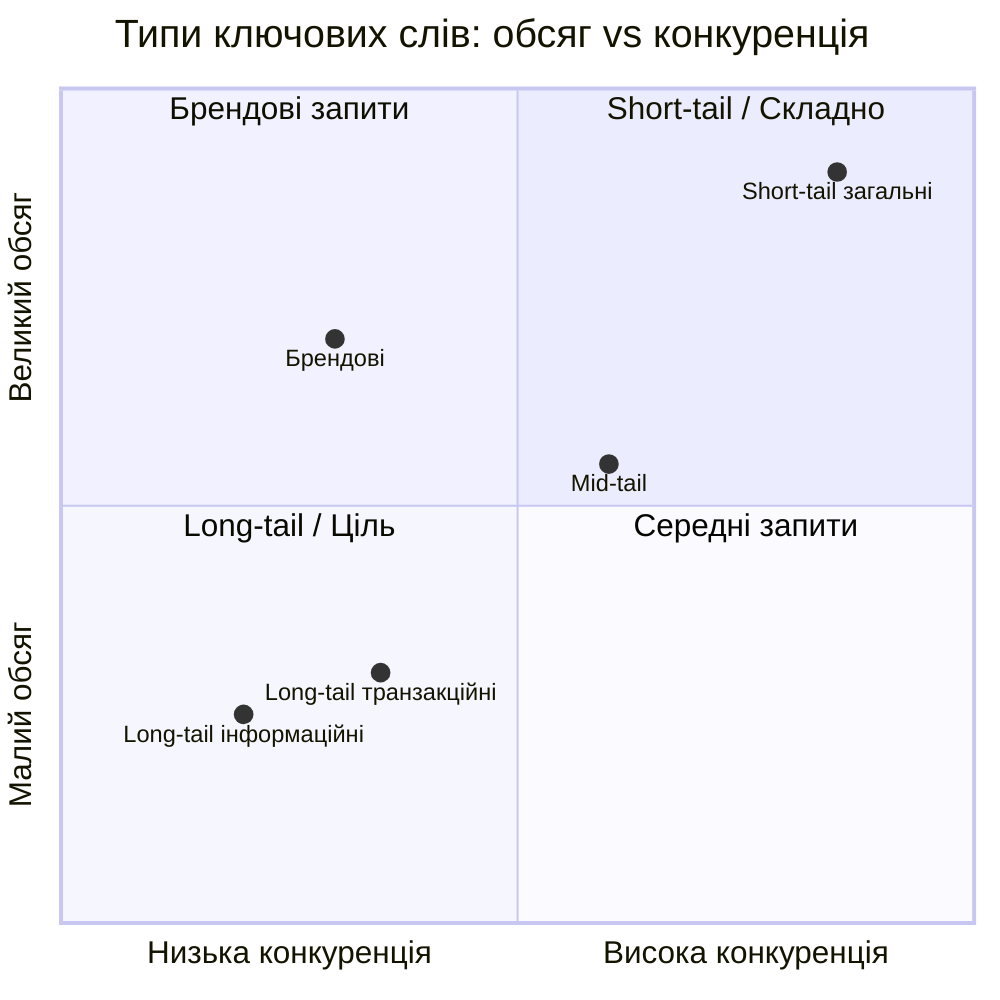
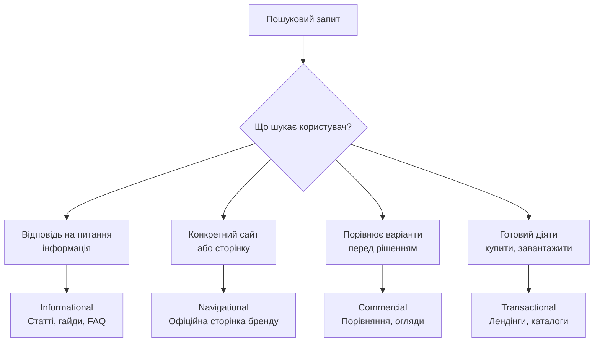
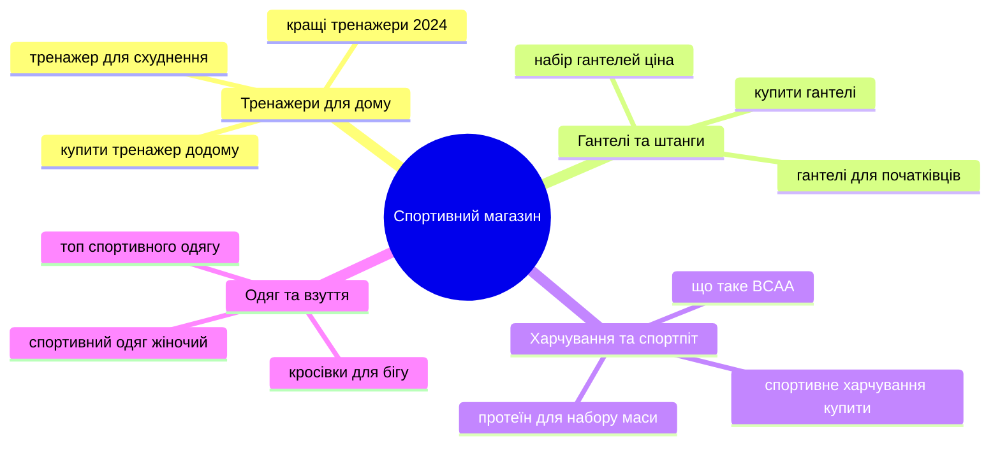

# Лабораторна робота 09 Кластеризація пошукових запитів 🔍📊

## 🎯 Мета

Після виконання лабораторної роботи здобувач освіти зможе самостійно збирати семантичне ядро з 100–200 пошукових запитів за допомогою Google Keyword Planner та Ubersuggest, групувати запити за типом пошукового наміру (search intent), кластеризувати їх у тематичні групи, будувати матрицю пріоритизації на основі обсягу трафіку, складності та релевантності, формувати семантичне ядро для 5 сторінок вебсайту та складати контент-календар.

## 📋 Завдання

1. Зібрати мінімум 100–200 пошукових запитів за обраною тематикою через Google Keyword Planner та Ubersuggest.
2. Експортувати зібрані дані до Google Sheets та впорядкувати у єдину таблицю.
3. Класифікувати кожен запит за типом пошукового наміру: informational, transactional, navigational, commercial investigation.
4. Згрупувати запити в 10–15 тематичних кластерів.
5. Побудувати матрицю пріоритизації кластерів за трьома критеріями: обсяг, складність, релевантність.
6. Сформувати семантичне ядро для 5 сторінок та скласти контент-календар на 3 місяці.

## ⭐ Критерії оцінювання

Максимальна кількість балів за лабораторну роботу: **7 балів**.

Розподіл балів за виконання завдань:

- Повнота та якість зібраного семантичного ядра (мінімум 100 запитів, різноманітність інструментів та типів запитів): **1 бал**.
- Коректна класифікація запитів за search intent з обґрунтуванням для неоднозначних випадків: **2 бали**.
- Якість кластеризації: логічність об'єднання, відсутність дублювання, коректні назви кластерів: **2 бали**.
- Матриця пріоритизації та семантичне ядро для 5 сторінок з обґрунтуванням вибору: **1 бал**.
- Контент-календар та якість оформлення звіту: **1 бал**.

## ⏰ Політика дедлайнів та штрафів

**Термін здачі:** Лабораторна робота має бути здана **протягом 2 тижнів** від дати проведення останнього аудиторного заняття з цієї теми.

**Система штрафів за прострочення:** Здача роботи в установлений термін дає можливість отримати повну оцінку 7 балів. Роботи, здані з запізненням, будуть оцінені максимум в 4 бали. Виняток становлять документально підтверджені поважні причини (хвороба, сімейні обставини), за яких термін може бути продовжений за погодженням з викладачем.

## 📚 Теоретичні відомості

### Типи ключових слів

Ключові слова класифікують за кількома критеріями, що впливають на стратегію їх використання.

За довжиною запиту розрізняють short-tail та long-tail ключові слова. Short-tail запити складаються з 1–2 слів, мають великий обсяг пошуку, але є висококонкурентними та часто неоднозначними: наприклад, «ноутбук» або «SEO». Long-tail запити містять 3 і більше слів, мають менший обсяг, але чіткіший намір та нижчу конкуренцію: наприклад, «купити ноутбук для навчання до 20000 гривень» або «як налаштувати GA4 самостійно».

За семантичним зв'язком виділяють LSI-ключові слова (Latent Semantic Indexing) — слова та фрази, тематично пов'язані з основним запитом, що підтверджують контекст сторінки. Наприклад, для сторінки про «кавоварку» LSI-словами будуть: еспресо, помел, капучино, зерна, температура заварювання.

### Search Intent: типи пошукового наміру

Search intent (пошуковий намір) — це мета, яку переслідує користувач, вводячи запит у пошукову систему. Розуміння наміру є ключовим для створення контенту, що задовольняє очікування як користувача, так і алгоритму Google.

**Informational (інформаційний)** — користувач шукає відповідь на питання або хоче дізнатися про щось. Типові маркери: «що таке», «як», «чому», «коли», «що означає». Приклади: «що таке SEO», «як зробити keyword research», «яка різниця між GA4 та UA». Контент для таких запитів: статті, гайди, визначення, FAQ.

**Navigational (навігаційний)** — користувач шукає конкретний вебсайт або сторінку. Типові маркери: назви брендів, «офіційний сайт», «вхід», «логін». Приклади: «Google Analytics вхід», «Ahrefs ціни», «Moodle НУХТ». Оптимізувати такі запити має сенс лише для власного бренду.

**Commercial investigation (комерційне дослідження)** — користувач порівнює варіанти перед покупкою. Типові маркери: «кращий», «порівняння», «відгуки», «топ», «vs». Приклади: «кращі SEO-інструменти 2024», «Ahrefs vs Semrush», «яку CMS обрати». Контент: порівняльні огляди, рейтинги, детальні огляди.

**Transactional (транзакційний)** — користувач готовий виконати дію (купити, замовити, завантажити, зареєструватися). Типові маркери: «купити», «замовити», «ціна», «безкоштовно завантажити», «реєстрація». Контент: лендінги, сторінки продуктів, форми.

### Кластеризація запитів

Кластеризація — це об'єднання пошукових запитів у тематичні групи (кластери) з метою визначення, яка сторінка вебсайту має охоплювати певну групу запитів. Кожен кластер відповідає одній сторінці або одній темі.

Основний принцип кластеризації: запити потрапляють в один кластер, якщо вони мають однаковий або дуже подібний search intent та описують одну й ту саму тему. Запити з різним intent, навіть тематично схожі, зазвичай відносяться до різних кластерів.

Практичний спосіб перевірки кластера — SERP-тест: якщо топ-10 результатів Google для двох запитів значною мірою перетинаються (5+ спільних URL), ці запити доцільно об'єднати в один кластер. Якщо видача принципово різна — запити потребують окремих сторінок.

### Метрики для оцінки ключових слів

При аналізі та пріоритизації ключових слів використовуються три основні метрики.

**Search Volume (обсяг пошуку)** — середня кількість пошукових запитів за місяць у вибраному регіоні. Важливо враховувати сезонність: запити типу «новорічні подарунки» матимуть різний обсяг у грудні та в червні.

**Keyword Difficulty / KD (складність)** — оцінка від 0 до 100, що показує, наскільки складно потрапити до топ-10 пошукової видачі. Обчислюється по-різному різними інструментами, але загалом відображає силу конкурентів у топі та кількість зворотних посилань, необхідних для ранжування.

**CPC (Cost Per Click)** — ціна кліку в контекстній рекламі. Хоча CPC безпосередньо не впливає на органічне SEO, він є непрямим індикатором комерційної цінності запиту: висока ціна кліку свідчить, що рекламодавці готові платити за цей трафік, а отже, конверсійний потенціал запиту є значним.

### Google Keyword Planner та Ubersuggest

**Google Keyword Planner (GKP)** — офіційний інструмент Google для дослідження ключових слів, розроблений для рекламодавців Google Ads, але широко використовується для SEO. GKP надає дані безпосередньо від Google, тому є найточнішим джерелом обсягів пошуку. Обмеження: для акаунтів без активних кампаній GKP показує діапазони обсягів (100–1000), а не точні цифри.

**Ubersuggest** — інструмент Ніла Пателя з безкоштовним рівнем доступу. Дозволяє отримати обсяг пошуку, KD та ідеї для розширення семантичного ядра. Безкоштовний план обмежений кількістю щоденних запитів.

Додаткові безкоштовні інструменти для розширення семантики: Google Trends (сезонність, регіональні відмінності), Answer The Public (питальні запити у формі «who», «what», «why», «how»), AlsoAsked (граф пов'язаних питань на основі розділу People Also Ask у Google), підказки Google (автозаповнення в пошуковому рядку).

## 🔧 Хід роботи

### Крок 1. Вибір тематики та підготовка інструментів

Оберіть тематику для побудови семантичного ядра. Рекомендовані варіанти: тематика вебсайту з попередніх лабораторних робіт, інтернет-магазин у будь-якій ніші, локальний бізнес або освітній ресурс. Важливо, щоб тематика мала достатній обсяг запитів для збору мінімум 100 ключових слів.

Підготуйте Google Sheets: створіть новий документ з назвою «Семантичне ядро — [Тематика]». Структура основного аркуша:

| Запит | Обсяг (міс.) | KD | CPC | Intent | Кластер | Пріоритет | Джерело |
|-------|--------------|-----|-----|--------|---------|-----------|---------|

Перейдіть до [Google Keyword Planner](https://ads.google.com/aw/keywordplanner) та [Ubersuggest](https://neilpatel.com/ubersuggest/).

### Крок 2. Збір запитів через Google Keyword Planner

Увійдіть до Google Ads (не потрібні активні кампанії — достатньо безкоштовного акаунту). Перейдіть до Інструменти → Keyword Planner → «Discover new keywords».

Введіть 5–10 базових seed keywords, що описують вашу тематику. Наприклад, для інтернет-магазину товарів для спорту: «спортивний інвентар», «купити гантелі», «тренування вдома», «фітнес обладнання».

Налаштуйте фільтри: мова — українська (та/або російська залежно від аудиторії), регіон — Україна. Отримайте список пропозицій. Натисніть «Download keyword ideas» та збережіть CSV-файл.

Повторіть процес для різних груп seed keywords, щоб охопити різні аспекти тематики. Мета — зібрати 150–200 початкових запитів до фільтрації.

Зробіть скріншот інтерфейсу GKP із результатами.

### Крок 3. Розширення семантики через Ubersuggest

Перейдіть до Ubersuggest та введіть основні ключові слова по одному. У розділі «Keyword Ideas» знайдіть підрозділи: Related, Questions, Comparisons, Prepositions. Скопіюйте релевантні запити до таблиці Google Sheets.

Зверніть окрему увагу на розділ «Questions» — питальні запити відмінно підходять для інформаційного контенту та мають шанс потрапити у блок Featured Snippet у Google.

Також скористайтеся підказками Google: введіть базове ключове слово в пошуковий рядок і зафіксуйте варіанти автозаповнення. Перевірте розділ «People Also Ask» для кількох ключових запитів і додайте знайдені питання до таблиці.

Після збору всіх запитів видаліть явні дублікати та запити, що є нерелевантними для вашої тематики. У результаті таблиця має містити мінімум 100 унікальних запитів.

### Крок 4. Класифікація за search intent

Для кожного запиту в колонці «Intent» визначте тип пошукового наміру: Informational, Navigational, Commercial, Transactional. Орієнтуйтесь на такі маркери:

- Informational: «що таке», «як», «чому», «навіщо», «коли», «де», «поясніть»;
- Navigational: назви конкретних брендів або сайтів, «офіційний сайт», «вхід», «кабінет»;
- Commercial: «кращий», «топ», «порівняння», «відгуки», «рейтинг», «vs»;
- Transactional: «купити», «замовити», «ціна», «вартість», «знижка», «безкоштовно».

Для запитів, що поєднують кілька ознак, перевірте фактичну видачу Google: якщо серед топ-10 переважають статті — це informational, якщо сторінки товарів — transactional.

Після класифікації підрахуйте розподіл: скільки запитів кожного типу. Зробіть зведену таблицю:

| Intent | Кількість запитів | % від загального |
|--------|-------------------|-----------------|
| Informational | | |
| Commercial | | |
| Transactional | | |
| Navigational | | |

### Крок 5. Кластеризація запитів

Згрупуйте всі запити в 10–15 тематичних кластерів. Для кожного кластера визначте:

- назву кластера (описова, відображає тему);
- головний (pillar) запит — найбільший за обсягом або найточніший;
- список усіх запитів кластера;
- переважний тип intent для кластера.

Практичний підхід до кластеризації: спочатку визначте 5–7 широких тем, потім розподіліть усі запити між ними. Якщо певна тема виявилась надто великою (20+ запитів), поділіть її на підкластери.

Приклад структури кластерів для спортивного магазину:

Для кожного кластера створіть окремий аркуш у Google Sheets або додайте колонку «Кластер» до основної таблиці.

### Крок 6. Матриця пріоритизації

Складіть матрицю пріоритизації кластерів. Для кожного кластера визначте оцінку за трьома критеріями за шкалою від 1 до 3:

| Кластер | Обсяг (1–3) | Складність (3–1, де 3 = легко) | Релевантність (1–3) | Сума | Пріоритет |
|---------|-------------|-------------------------------|---------------------|------|-----------|
| | | | | | |

Пояснення критеріїв: обсяг — сума обсягів пошуку всіх запитів кластера (1 = малий, 3 = великий); складність — середній KD кластера, але оцінка інвертована (1 = висока складність, 3 = низька складність); релевантність — наскільки кластер відповідає бізнес-цілям та аудиторії (оцінюється суб'єктивно).

Кластери з найвищою сумою балів є пріоритетними для першочергового створення контенту.

### Крок 7. Побудова семантичного ядра для 5 сторінок

Оберіть 5 кластерів з найвищим пріоритетом та для кожного визначте:

- тип сторінки (стаття, категорія каталогу, лендінг, порівняльний огляд тощо);
- заголовок H1;
- головний запит (target keyword);
- вторинні запити (secondary keywords) — 3–7 штук;
- орієнтовний обсяг контенту (слів);
- тип контенту (інформаційна стаття, сторінка продукту, огляд тощо).

Оформіть як таблицю «Семантичне ядро 5 сторінок».

### Крок 8. Складання контент-календаря

На основі пріоритизованих кластерів складіть контент-календар публікацій на 3 місяці. Реалістичний темп для навчального проєкту — 1–2 матеріали на тиждень.

| Місяць | Тиждень | Тема / Кластер | Intent | Тип контенту | Статус |
|--------|---------|---------------|--------|--------------|--------|
| Місяць 1 | Тиждень 1 | | | | Заплановано |

Починайте з кластерів із низькою складністю та чітким informational intent — такий контент легше ранжується та дає швидкі результати. Комерційні та транзакційні сторінки плануйте після побудови початкового авторитету сайту.

### Крок 9. Документування результатів

Систематизуйте всі матеріали та підготуйте звіт.

## 📄 Рекомендована структура звіту

**Титульна сторінка** з назвою лабораторної роботи, ПІБ студента, групою.

**Розділ 1. Тематика та вихідні дані** з описом обраної тематики та цільової аудиторії, переліком seed keywords, що використовувалися для початку збору, та посиланням на Google Sheets із повним семантичним ядром.

**Розділ 2. Збір семантичного ядра** зі скріншотами з інтерфейсів Google Keyword Planner та Ubersuggest, зведеною таблицею кількості зібраних запитів за джерелами, загальною кількістю запитів після дедублікації.

**Розділ 3. Класифікація за search intent** із зведеною таблицею розподілу запитів за типами, 3–5 прикладами неоднозначних запитів з обґрунтуванням обраного intent.

**Розділ 4. Кластеризація** зі структурою всіх 10–15 кластерів (назва, головний запит, кількість запитів, переважний intent) та матрицею пріоритизації з розрахунком балів.

**Розділ 5. Семантичне ядро для 5 сторінок** із таблицею для кожної з 5 пріоритетних сторінок (H1, target keyword, secondary keywords, тип сторінки).

**Розділ 6. Контент-календар** із таблицею публікацій на 3 місяці та поясненням логіки черговості.

**Висновки** з узагальненням результатів, коментарем щодо виявлених можливостей та очікуваного трафіку.

**Формат звіту — `pdf`.**

## ❓ Контрольні запитання

1. Чим відрізняються short-tail та long-tail ключові слова? Чому для нових сайтів рекомендують починати з long-tail запитів?
2. Охарактеризуйте чотири типи search intent. Наведіть по два приклади запитів кожного типу у вашій тематиці.
3. Що таке SERP-тест і як він допомагає при кластеризації запитів?
4. Яку роль відіграють LSI-ключові слова? Чому неприродне їх впровадження у текст є помилкою?
5. Поясніть, як правильно інтерпретувати метрику Keyword Difficulty. Чи варто уникати всіх запитів із KD вище 50?
6. Що означає «пріоритизація» кластерів і які критерії доцільно враховувати при складанні матриці пріоритетів?
7. Чому для контент-календаря рекомендують починати з informational запитів низької складності, а не одразу з транзакційних?
