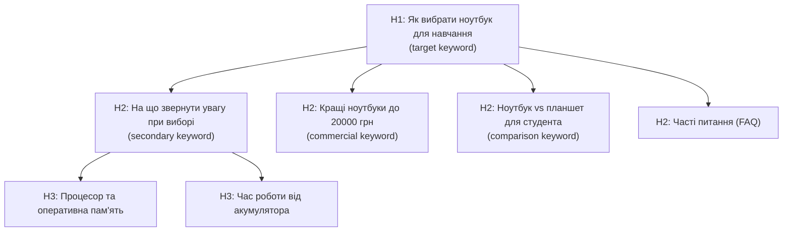
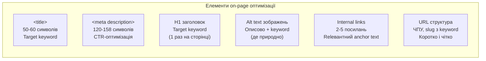

# Лабораторна робота 10 Написання та оптимізація SEO-контенту 📝🔍

## 🎯 Мета

Після виконання лабораторної роботи здобувач освіти зможе самостійно аналізувати конкурентний контент у топ-5 пошукової видачі, розробляти структуру статті на основі семантичного ядра, писати 1000–1500 слів оптимізованого SEO-тексту з природним вживанням ключових слів та LSI-фраз, застосовувати on-page оптимізацію (title, meta description, alt tags, internal links), перевіряти читабельність через Hemingway Editor і публікувати матеріал із подальшим відправленням до індексації в Google Search Console.

## 📋 Завдання

1. Обрати один тематичний кластер із лабораторної роботи 09 та провести аналіз топ-5 конкурентів у пошуковій видачі.
2. Розробити детальну структуру статті: H1, H2, H3 заголовки, орієнтовний зміст кожного розділу.
3. Написати оптимізований текст обсягом 1000–1500 слів із природним вживанням target та secondary keywords.
4. Вписати LSI-ключові слова органічно, без штучного «набивання» тексту.
5. Виконати повну on-page оптимізацію: title tag, meta description, alt tags для зображень, internal links.
6. Перевірити читабельність через Hemingway Editor та усунути виявлені проблеми.
7. Опублікувати матеріал та відправити URL до індексації в Google Search Console.

## ⭐ Критерії оцінювання

Максимальна кількість балів за лабораторну роботу: **7 балів**.

Розподіл балів за виконання завдань:

- Якість аналізу конкурентів: глибина аналізу структури, довжини, ключових елементів топ-5 сторінок: **1 бал**.
- Структура матеріалу: логічна ієрархія заголовків H1/H2/H3, відповідність search intent, повнота охоплення теми: **2 бали**.
- Якість тексту: читабельність, природність ключових слів, наявність LSI-фраз, відсутність переспаму: **2 бали**.
- Повнота on-page оптимізації: title, meta, alt tags, internal links: **1 бал**.
- Публікація та відправка до індексації в GSC зі скріншотом підтвердження: **1 бал**.

## ⏰ Політика дедлайнів та штрафів

**Термін здачі:** Лабораторна робота має бути здана **протягом 2 тижнів** від дати проведення останнього аудиторного заняття з цієї теми.

**Система штрафів за прострочення:** Здача роботи в установлений термін дає можливість отримати повну оцінку 7 балів. Роботи, здані з запізненням, будуть оцінені максимум в 4 бали. Виняток становлять документально підтверджені поважні причини (хвороба, сімейні обставини), за яких термін може бути продовжений за погодженням з викладачем.

## 📚 Теоретичні відомості

### Принцип E-E-A-T

E-E-A-T (Experience, Expertise, Authoritativeness, Trustworthiness) — концепція оцінки якості контенту, яку Google використовує при навчанні алгоритмів ранжування та роботі команди Quality Raters. Розуміння E-E-A-T допомагає створювати контент, який Google вважає якісним і гідним високих позицій.

**Experience (Досвід)** — наявність у автора особистого досвіду з темою. Google цінує контент, що написаний людиною, яка особисто стикалась із ситуацією, протестувала продукт або відвідала місце. Кейси, реальні приклади та фото з власного досвіду підсилюють цей сигнал.

**Expertise (Експертиза)** — глибина знань автора у відповідній сфері. Для медичних, юридичних і фінансових тем (YMYL — «Your Money or Your Life») вимоги до експертизи особливо високі. Профіль автора з підтвердженими кваліфікаціями підвищує E-E-A-T сторінки.

**Authoritativeness (Авторитетність)** — репутація автора та вебсайту у відповідній сфері, що підтверджується зовнішніми згадками, зворотними посиланнями від авторитетних джерел та цитуваннями.

**Trustworthiness (Достовірність)** — чесність та прозорість: актуальність інформації, наявність джерел, HTTPS, чіткі контактні дані, відсутність оманливих тверджень.

### Структурування SEO-тексту

Правильна структура матеріалу є важливим фактором як для користувача, так і для пошукових систем. Заголовки H1–H6 формують ієрархію контенту та допомагають Google розуміти тематичну структуру сторінки.

**H1** — головний заголовок сторінки, має зустрічатися лише один раз. Обов'язково містить цільовий ключовий запит, бажано ближче до початку. Має чітко відповідати search intent: якщо користувач шукає «як вибрати ноутбук», H1 повинен прямо відповідати на це питання.

**H2** — основні розділи статті. Зазвичай 3–7 заголовків H2, що покривають ключові аспекти теми. В H2 доцільно вживати secondary keywords та семантично пов'язані фрази.

**H3** — підрозділи всередині H2. Використовуються для деталізації, підпунктів, прикладів або FAQ-блоків.



### Keyword Density та уникнення переспаму

Keyword Density (щільність ключових слів) — відсоток входжень ключового слова відносно загальної кількості слів у тексті. У сучасному SEO це поняття має другорядне значення: алгоритми Google вже не підраховують відсотки, а оцінюють природність і семантичний контекст.

Проте надмірне повторення ключового слова (keyword stuffing) є негативним сигналом, що може призвести до пониження позицій. Практичне правило: текст має звучати природно вголос. Якщо читаючи речення вголос, ви відчуваєте незручність від повтору слова — це ознака переспаму.

Замість механічного повторення ключових слів використовуйте синоніми, займенники та LSI-фрази, що дозволяють уникнути монотонності й одночасно збагачують семантику тексту.

### LSI-ключові слова та семантичне збагачення тексту

LSI (Latent Semantic Indexing) у контексті SEO-копірайтингу означає вживання слів та фраз, тематично пов'язаних із основним запитом. Вони підтверджують для алгоритму, що сторінка дійсно присвячена певній темі та охоплює її повно.

Способи знаходження LSI-слів: розділ «Схожі запити» внизу видачі Google, підрозділ People Also Ask, розширені пропозиції в Ubersuggest та Google Keyword Planner, аналіз тексту топ-3 конкурентів (які слова вони вживають).

Приклад: для статті «як варити еспресо» LSI-слова будуть: темперування, портафільтр, екстракція, тиск 9 бар, крема, свіжозмелені зерна, кутер. Ці слова не є ключовими запитами, але підтверджують глибину розкриття теми.

### On-page оптимізація: ключові елементи

**Title tag** — HTML-елемент `<title>`, що відображається у вкладці браузера та як синій заголовок у результатах пошуку. Оптимальна довжина: 50–60 символів (до 580 px). Рекомендована структура: «Цільовий запит — Бренд» або «Цільовий запит: деталь». Title — найважливіший on-page елемент для ранжування.

**Meta description** — короткий опис сторінки, що відображається у пошуковій видачі під заголовком. Не є прямим фактором ранжування, але впливає на Click-Through Rate (CTR): хороший опис збільшує кількість кліків. Оптимальна довжина: 120–158 символів. Має містити ключовий запит та чіткий заклик до дії або опис цінності.

**Alt text для зображень** — атрибут `alt` тегу ``, що описує зображення для пошукових систем та людей з вадами зору. Має бути описовим і природним: «жінка робить йогу на килимку вдома», а не «йога_килимок_купити_київ».

**Internal links** — посилання на інші сторінки вашого вебсайту. Виконують дві функції: допомагають користувачам знаходити пов'язаний контент і розподіляють link equity між сторінками сайту. В кожній статті бажано мати 2–5 внутрішніх посилань на тематично суміжні матеріали.



### Читабельність та Hemingway Editor

Читабельність тексту (readability) впливає на поведінкові фактори: тривалість перебування на сторінці, scroll depth та показник відмов. Google враховує ці сигнали як непрямий індикатор якості контенту.

Hemingway Editor — безкоштовний інструмент для аналізу читабельності тексту. Він підсвічує надто довгі речення, пасивний стан, складні слова з простими замінниками та зайві прислівники. Інструмент показує «Grade Level» — рівень освіти, необхідний для розуміння тексту. Для більшості вебконтенту рекомендований рівень — від 6 до 8 (відповідає рівню розуміння підлітка).

Основні принципи читабельного тексту: короткі речення (оптимально 15–20 слів), один абзац — одна думка (3–5 речень), активний стан замість пасивного, конкретні слова замість абстрактних, підзаголовки кожні 200–300 слів.

## 🔧 Хід роботи

### Крок 1. Вибір кластера та визначення цільового запиту

Поверніться до результатів лабораторної роботи 09. З матриці пріоритизації оберіть один кластер для написання матеріалу. Рекомендовано обирати кластер з informational або commercial intent та середньою або низькою складністю — такий матеріал легше ранжується і є гарним стартом.

Зафіксуйте для обраного кластера:

- цільовий запит (target keyword): один головний запит, на який орієнтована сторінка;
- вторинні запити (secondary keywords): 3–5 додаткових запитів кластера;
- тип search intent: informational / commercial / transactional;
- орієнтовний тип матеріалу: стаття, огляд, гайд, порівняння тощо.

### Крок 2. Аналіз конкурентів у топ-5

Введіть цільовий запит у Google (в режимі інкогніто або із вимкненою персоналізацією) та відкрийте перші 5 органічних результатів (не рекламних). Для кожної сторінки-конкурента зафіксуйте в таблиці:

| № | URL | Приблизна довжина (слів) | Структура H2 (заголовки) | Тип контенту | Особливості |
|---|-----|--------------------------|--------------------------|--------------|-------------|
| 1 | | | | | |
| 2 | | | | | |
| 3 | | | | | |
| 4 | | | | | |
| 5 | | | | | |

Для підрахунку кількості слів використовуйте розширення для браузера (наприклад, Word Counter Plus) або скопіюйте текст до Google Docs.

Зробіть висновок: яка типова структура матеріалів у топі, яку довжину мають статті, які підтеми вони охоплюють, яких підтем бракує (це ваша можливість диференціюватись). Зробіть скріншоти топ-5 результатів пошукової видачі.

### Крок 3. Розробка структури матеріалу

На основі аналізу конкурентів розробіть структуру власного матеріалу. Структура має охоплювати всі ключові підтеми, виявлені в топі, та додатково включати унікальний кут або аспект, якого бракує конкурентам.

Приклад структури для статті «Як вибрати ноутбук для навчання»:

```
H1: Як вибрати ноутбук для навчання: повний гайд 2024

Вступ (100-150 слів): чому це питання актуальне, що буде в статті

H2: Які характеристики важливі для навчального ноутбука
    H3: Процесор та оперативна пам'ять
    H3: Час роботи від акумулятора
    H3: Дисплей: розмір та роздільна здатність
    H3: Сховище: SSD vs HDD

H2: На що не варто витрачати гроші студенту
H2: Найкращі ноутбуки для студентів у 2024 році
    H3: Бюджет до 15000 грн
    H3: Бюджет 15000–25000 грн
H2: Ноутбук чи планшет: що обрати студенту
H2: Часті запитання (FAQ)
    H3: Скільки ОЗП потрібно для навчання?
    H3: Чи підійде Chromebook для університету?

Висновок (100 слів)
```

Структура є вашим планом написання. Заповніть для кожного розділу орієнтовну кількість слів та ключові тези.

### Крок 4. Написання тексту

Напишіть матеріал за підготовленою структурою. Дотримуйтесь наступних правил.

Вступний абзац має містити цільовий ключовий запит та чітко описувати, що отримає читач після прочитання. Перше речення має «захоплювати» увагу: статистика, провокаційне питання або несподіваний факт.

Target keyword вживайте природно: у H1, у вступі (перші 100 слів), у першому або другому H2, в alt text ключового зображення та в кінці тексту. Уникайте механічного повторення: замість постійного «ноутбук для навчання» чергуйте з «студентський ноутбук», «пристрій для навчання», «технологія для університету».

Secondary keywords вписуйте у підзаголовки H2/H3 та тіло тексту, де це природно. LSI-слова мають з'являтися органічно — просто пишіть про тему детально, і вони з'являться самі.

Орієнтовний обсяг: 1000–1500 слів. Якщо конкуренти мають 2000+ слів у топі, орієнтуйтесь на їхній обсяг.

### Крок 5. On-page оптимізація

Після написання тексту виконайте повну on-page оптимізацію.

**Title tag.** Складіть title за формулою: «[Target keyword]: [деталь або перевага] | [Назва сайту]». Наприклад: «Як вибрати ноутбук для навчання: гайд 2024 | Tech Blog». Перевірте довжину через [SERPreview.com](https://serpreview.com) або аналогічний інструмент.

**Meta description.** Напишіть опис 130–155 символів, що містить цільовий запит та чіткий заклик. Наприклад: «Розібрались, які характеристики справді важливі для студентського ноутбука. Порівняли 10 моделей та обрали кращі під різний бюджет.»

**Alt text зображень.** Для кожного зображення у статті додайте описовий alt text. Головне зображення може містити target keyword. Решта — описові, природні тексти.

**Internal links.** Додайте 2–4 посилання на інші сторінки вашого вебсайту, що є тематично пов'язаними. Для кожного посилання використовуйте природний anchor text (не «клікни тут», а «огляд найкращих навушників для навчання»).

Занесіть всі елементи до таблиці:

| Елемент | Написаний варіант | Кількість символів | Містить target KW |
|---------|-------------------|--------------------|-------------------|
| Title tag | | | |
| Meta description | | | |
| H1 | | | |
| Alt text гол. зображення | | | |

### Крок 6. Перевірка читабельності через Hemingway Editor

Скопіюйте готовий текст до [Hemingway Editor](https://hemingwayapp.com) (безкоштовна онлайн-версія). Ознайомтеся з результатами перевірки.

Зверніть увагу на:

- жовте підсвічення — надто довгі речення (можна залишити 1–2 у статті);
- червоне підсвічення — дуже довгі речення, потребують розбивки;
- синє підсвічення — складні слова із простими замінниками;
- зелене підсвічення — пасивний стан (мінімізуйте).

Виправте критичні проблеми (червоні та більшість жовтих речень). Цільовий Grade Level — 6–9. Зробіть скріншот Hemingway Editor до та після редагування.

### Крок 7. Публікація та подача до індексації

Опублікуйте матеріал на вашому вебсайті. Якщо вебсайт розміщений на WordPress — використовуйте блок-редактор Gutenberg. Для статичного HTML-сайту — додайте нову сторінку вручну.

Налаштуйте URL (slug): він має бути коротким, читабельним та містити target keyword. Наприклад: `/yak-vybrat-noutbuk-dlya-navchannya` або `/choosing-laptop-for-students`.

Після публікації перейдіть до Google Search Console. Вставте URL опублікованої сторінки у рядок пошуку вгорі та натисніть «Request indexing» (Запросити індексацію). Зробіть скріншот підтвердження.

### Крок 8. Документування результатів

Систематизуйте всі матеріали та підготуйте звіт.

## 📄 Рекомендована структура звіту

**Титульна сторінка** з назвою лабораторної роботи, ПІБ студента, групою.

**Розділ 1. Вибір кластера та цільового запиту** з обґрунтуванням вибору кластера, зазначенням target та secondary keywords, типу search intent.

**Розділ 2. Аналіз конкурентів** із заповненою таблицею топ-5 конкурентів, скріншотами пошукової видачі, висновком щодо структури та можливостей для диференціації.

**Розділ 3. Структура матеріалу** з повним планом статті (H1, H2, H3) та орієнтовним змістом кожного розділу.

**Розділ 4. Написаний матеріал** із повним текстом статті (1000–1500 слів) або посиланням на опубліковану сторінку.

**Розділ 5. On-page оптимізація** із заповненою таблицею елементів (title, meta, H1, alt texts, internal links) та скріншотами з CMS або вихідного коду.

**Розділ 6. Результати Hemingway Editor** зі скріншотами до та після редагування та описом внесених змін.

**Розділ 7. Публікація та індексація** з посиланням на опублікований матеріал та скріншотом запиту індексації в GSC.

**Висновки** з оцінкою якості написаного матеріалу, порівнянням із конкурентами та прогнозом щодо позицій.

**Формат звіту — `pdf`.**

## ❓ Контрольні запитання

1. Що таке E-E-A-T і чому ця концепція є особливо важливою для медичних, юридичних та фінансових тематик (YMYL)?
2. Яка рекомендована структура title tag? Чому довжина title важлива і що відбувається, якщо він задовгий?
3. Чим відрізняються LSI-ключові слова від secondary keywords? Наведіть приклад для будь-якої теми.
4. Що таке keyword stuffing і чому він є шкідливим для SEO? Як уникнути переспаму, зберігаючи природне вживання ключових слів?
5. Яку роль відіграють internal links у SEO? Що таке anchor text і які вимоги до нього?
6. Як Hemingway Editor допомагає покращити SEO-контент? Який Grade Level вважається оптимальним для вебтекстів?
7. Чому важливо відправляти нові сторінки до індексації через Google Search Console? Чи гарантує це негайне потрапляння до результатів пошуку?
