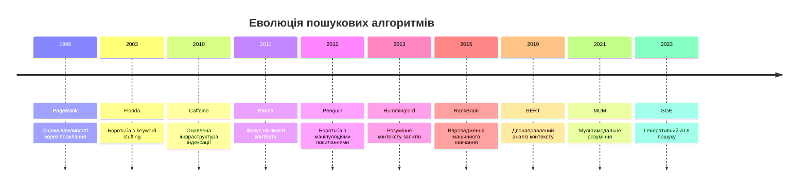
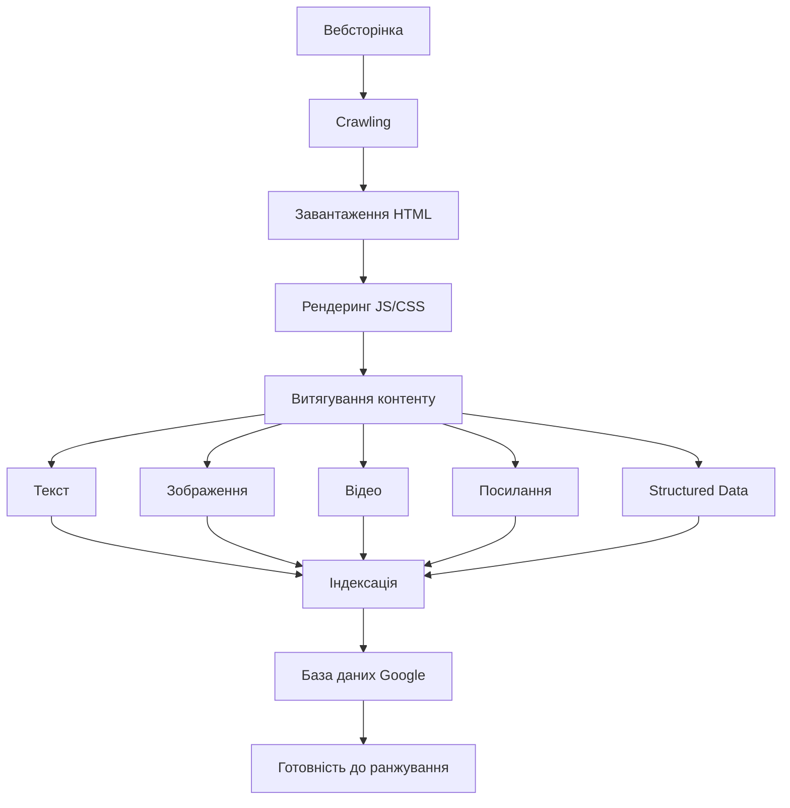
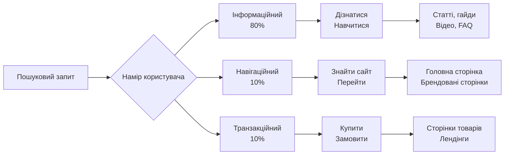

# Лекція 01: Вступ до SEO та принципи роботи пошукових систем

## Вступ

Пошукова оптимізація (SEO) є однією з ключових дисциплін у сучасному цифровому маркетингу та веброзробці. Розуміння принципів роботи пошукових систем дозволяє фахівцям створювати вебресурси, які ефективно взаємодіють з алгоритмами пошуку та забезпечують якісний користувацький досвід. У цій лекції ми розглянемо історичний контекст розвитку пошукових технологій, детально проаналізуємо механізми обходу та індексації вебсторінок, а також вивчимо класифікацію пошукових запитів.

## 1. Історія пошукових систем та еволюція алгоритмів

### 1.1 Зародження пошукових технологій

Перші пошукові системи з'явилися на початку 1990-х років разом із розвитком World Wide Web. Archie (1990) вважається першим інструментом для пошуку файлів в інтернеті, хоча він працював лише з FTP-серверами. Справжні вебпошукові системи почали з'являтися після 1993 року.

W3Catalog (1993) був одним із перших справжніх вебкаталогів. Однак найбільший вплив на розвиток пошукових технологій мали такі системи:

Wandex (1993) створений Метью Греєм у MIT, використовував веброботів для автоматичного збору інформації. WebCrawler (1994) став першою повнотекстовою пошуковою системою, яка індексувала весь текст вебсторінок, а не лише заголовки. Lycos (1994) та AltaVista (1995) значно розширили можливості пошуку та покращили релевантність результатів.

Yahoo! (1994) спочатку функціонував як рукотворний каталог вебсайтів, де редактори вручну організовували сайти за категоріями. Цей підхід забезпечував високу якість, але не міг масштабуватися відповідно до зростання інтернету.

### 1.2 Революція PageRank та поява Google

У 1998 році Ларрі Пейдж та Сергій Брін представили Google, який радикально змінив підхід до ранжування результатів пошуку. Інновація полягала в алгоритмі PageRank, який оцінював важливість сторінки на основі кількості та якості посилань, що вели на неї.

Математична основа PageRank базується на моделі випадкового серфінгу. Алгоритм обчислює ймовірність того, що користувач, який випадково переходить за посиланнями, потрапить на певну сторінку. Формула PageRank виглядає наступним чином:

```
PR(A) = (1-d) + d × (PR(T1)/C(T1) + ... + PR(Tn)/C(Tn))
```

Де PR(A) означає PageRank сторінки A, d представляє коефіцієнт затухання (зазвичай 0,85), T1...Tn є сторінками, які посилаються на A, а C(Ti) відображає кількість вихідних посилань на сторінці Ti.

Цей підхід дозволив автоматично визначати авторитетність сторінок без ручного втручання редакторів. Google швидко став домінуючою пошуковою системою завдяки релевантності результатів та простоті інтерфейсу.

### 1.3 Еволюція алгоритмів: від простих формул до машинного навчання

Протягом 2000-х років алгоритми пошукових систем значно ускладнилися. Спочатку SEO-фахівці могли маніпулювати результатами пошуку через надмірне використання ключових слів, приховування тексту, купівлю посилань та інші маніпулятивні техніки.

Google Florida (2003) став першим великим оновленням, спрямованим на боротьбу зі спамом. Це оновлення різко знизило позиції сайтів, які використовували надмірну оптимізацію ключових слів.

Введення Universal Search (2007) інтегрувало в результати пошуку зображення, відео, новини та інший контент поряд із традиційними текстовими посиланнями. Це суттєво змінило SERP та створило нові можливості для оптимізації різних типів контенту.

Google Caffeine (2010) повністю оновила інфраструктуру індексації, що дозволило швидше обробляти та індексувати новий контент. Це було особливо важливо для соціальних мереж та новинних сайтів.

Google Panda (2011) став революційним оновленням, спрямованим на якість контенту. Алгоритм навчився розпізнавати тонкий, дублікатний або низькоякісний контент. Сайти з якісним, оригінальним контентом отримали перевагу.

Google Penguin (2012) націлився на маніпуляції з посиланнями. Алгоритм почав карати сайти за неприродні посилання, куплені посилання та інші схеми штучного підвищення PageRank.

Google Hummingbird (2013) змістив акцент з окремих ключових слів на розуміння контексту запиту. Алгоритм почав краще інтерпретувати природну мову та наміри користувача.

### 1.4 Епоха штучного інтелекту в пошуку

RankBrain (2015) став першим великомасштабним впровадженням машинного навчання в алгоритм ранжування. Система використовує штучний інтелект для інтерпретації незнайомих запитів та виявлення зв'язків між словами і концепціями.

BERT (2019) означає Bidirectional Encoder Representations from Transformers. Ця технологія дозволяє краще розуміти контекст слів у реченні, аналізуючи їх зв'язки в обох напрямках. BERT значно покращив розуміння складних та довгих запитів, особливо тих, що містять прийменники та інші службові слова.

MUM (2021) представляє Multitask Unified Model, який у 1000 разів потужніший за BERT. MUM може розуміти інформацію з різних форматів (текст, зображення), працювати з 75 мовами одночасно та виконувати складні багатоаспектні завдання.

Search Generative Experience (2023) інтегрує генеративний штучний інтелект безпосередньо в результати пошуку, створюючи синтезовані відповіді на основі багатьох джерел.



## 2. Процес Crawling: як боти обходять веб

### 2.1 Архітектура та принцип роботи веброботів

Crawling є першим етапом роботи пошукової системи. Вебробот (також відомий як crawler, spider, bot) являє собою програмне забезпечення, яке автоматично обходить вебсторінки, переходячи за посиланнями та збираючи інформацію для подальшої індексації.

Googlebot є офіційним веброботом Google. Існує кілька версій Googlebot для різних типів контенту: Googlebot Desktop імітує поведінку звичайного користувача з комп'ютера, Googlebot Smartphone аналізує сайти з точки зору мобільного користувача, Googlebot Image спеціалізується на зображеннях, а Googlebot Video обробляє відеоконтент.

Процес обходу починається з переліку відомих URL-адрес, які система вже проіндексувала раніше, або з XML-карти сайту. Робот завантажує вебсторінку, аналізує її HTML-код, витягує всі посилання та додає їх до черги URL для обходу. Потім процес повторюється для кожної нової знайденої сторінки.

### 2.2 Алгоритми визначення пріоритетів обходу

Пошукові системи не можуть обходити весь інтернет одночасно через обмежені ресурси. Тому використовуються складні алгоритми пріоритизації, які визначають, які сторінки обходити в першу чергу та як часто їх переобходити.

Crawl budget означає кількість сторінок вашого сайту, які Googlebot обходить за певний період. Цей бюджет визначається двома основними факторами: швидкістю обходу (як швидко робот може завантажувати сторінки без перевантаження сервера) та попитом на обхід (наскільки популярні ваші сторінки серед користувачів).

Пріоритетність сторінок для обходу визначається кількома критеріями. PageRank або авторитетність сторінки відіграє важливу роль: сторінки з більшою кількістю якісних вхідних посилань обходяться частіше. Частота оновлень також впливає на пріоритет: сторінки, які регулярно змінюються, отримують вищий пріоритет. Популярність серед користувачів є важливим фактором: сторінки з високим трафіком обходяться частіше. Відстань від головної сторінки також має значення: сторінки, доступні за меншою кількістю кліків від головної, зазвичай обходяться швидше.

### 2.3 Технічні аспекти взаємодії з веброботами

Файл robots.txt розміщується в кореневій директорії сайту та надає інструкції веброботам щодо обходу. Приклад базового robots.txt виглядає наступним чином:

```
User-agent: *
Disallow: /admin/
Disallow: /private/
Allow: /public/

User-agent: Googlebot
Crawl-delay: 10

Sitemap: https://example.com/sitemap.xml
```

У цьому прикладі директива User-agent визначає, до якого робота застосовуються правила. Disallow забороняє обхід певних директорій. Allow явно дозволяє обхід, навіть якщо батьківська директорія заборонена. Crawl-delay встановлює затримку між запитами в секундах. Sitemap вказує на розташування XML-карти сайту.

Meta-тег robots у HTML-коді сторінки надає більш детальні інструкції:

```html
<meta name="robots" content="noindex, nofollow">
<meta name="googlebot" content="index, follow, max-snippet:150">
```

Параметри цього тегу включають index/noindex (чи індексувати сторінку), follow/nofollow (чи переходити за посиланнями), max-snippet (максимальна довжина фрагмента в результатах пошуку), max-image-preview (максимальний розмір превью зображення), max-video-preview (максимальна тривалість превью відео).

### 2.4 Оптимізація для ефективного обходу

Структура внутрішніх посилань суттєво впливає на ефективність обходу. Якщо важлива сторінка знаходиться на глибині 5-6 кліків від головної, робот може її не знайти або обійти дуже рідко. Рекомендується створювати плоску архітектуру сайту, де всі важливі сторінки доступні максимум за 3 кліки від головної.

XML-карта сайту допомагає пошуковим системам знаходити всі важливі сторінки. Приклад структури XML sitemap:

```xml
<?xml version="1.0" encoding="UTF-8"?>
<urlset xmlns="http://www.sitemaps.org/schemas/sitemap/0.9">
  <url>
    <loc>https://example.com/page1</loc>
    <lastmod>2024-02-01</lastmod>
    <changefreq>weekly</changefreq>
    <priority>0.8</priority>
  </url>
</urlset>
```

Елемент loc містить повну URL-адресу сторінки. lastmod вказує дату останньої модифікації. changefreq визначає приблизну частоту змін (always, hourly, daily, weekly, monthly, yearly, never). priority показує відносну важливість сторінки від 0.0 до 1.0.

Швидкість відповіді сервера критично важлива для crawl budget. Якщо сервер повільно відповідає, робот обійде меншу кількість сторінок за той самий час. Рекомендується оптимізувати час відповіді сервера до 200 мілісекунд або менше.

## 3. Індексація: як Google зберігає та структурує дані

### 3.1 Процес індексації та обробки контенту

Після того як Googlebot обійшов сторінку, починається процес індексації. Індексація передбачає аналіз контенту сторінки, визначення її теми, витягування ключової інформації та збереження цих даних в величезній базі даних Google.

Процес індексації включає кілька етапів. Спочатку відбувається рендеринг сторінки: Google виконує JavaScript та CSS для відображення сторінки так, як її бачить користувач. Це особливо важливо для одностранкових додатків та сайтів з динамічним контентом. Потім система аналізує текстовий контент, визначає мову сторінки та виявляє основні теми. На наступному етапі відбувається обробка зображень, відео та інших медіафайлів з витяганням метаданих та альтернативного тексту. Система також аналізує структуру сторінки через HTML-теги, заголовки, списки та семантичну розмітку. Нарешті, відбувається витягування та аналіз всіх посилань на сторінці.

### 3.2 Structured Data та Schema.org

Structured Data (структуровані дані) допомагають пошуковим системам краще розуміти зміст сторінки. Schema.org є найпопулярнішим словником для структурованих даних, який підтримують всі основні пошукові системи.

Приклад розмітки статті в форматі JSON-LD:

```html
<script type="application/ld+json">
{
  "@context": "https://schema.org",
  "@type": "Article",
  "headline": "Вступ до SEO",
  "author": {
    "@type": "Person",
    "name": "Іван Петренко"
  },
  "datePublished": "2024-02-01",
  "image": "https://example.com/image.jpg",
  "publisher": {
    "@type": "Organization",
    "name": "University",
    "logo": {
      "@type": "ImageObject",
      "url": "https://example.com/logo.jpg"
    }
  }
}
</script>
```

Існують різні типи структурованих даних для різних категорій контенту. Article використовується для статей та блогів. Product застосовується для товарів з ціною, наявністю та рейтингом. Recipe підходить для кулінарних рецептів з інгредієнтами та часом приготування. Event використовується для подій з датою, місцем та учасниками. Organization призначена для компаній з контактами та логотипом. Person застосовується для персоналій з біографією та досягненнями.



### 3.3 Канонізація та дублікатний контент

Канонізація є процесом вибору основної (канонічної) версії сторінки серед кількох дублікатів або подібних сторінок. Google автоматично вибирає канонічну версію, але вебмайстри можуть впливати на цей вибір.

Тег canonical вказує пошуковим системам на основну версію сторінки:

```html
<link rel="canonical" href="https://example.com/original-page">
```

Типові ситуації використання канонічних URL включають різні параметри URL для тієї самої сторінки, мобільну та десктопну версії сайту, HTTP та HTTPS версії, сторінки з UTM-параметрами або іншими трекінговими мітками, версії для друку або AMP-версії.

### 3.4 Проблеми індексації та їх вирішення

Навіть якщо сторінка була обійдена, це не гарантує її індексації. Google може вирішити не індексувати сторінку з кількох причин. Низька якість контенту призводить до того, що сторінки з тонким, дублікатним або автоматично згенерованим контентом часто не індексуються. Технічні помилки, такі як помилки 4xx або 5xx під час обходу, блокують індексацію. Директиви robots через meta-теги або заголовки HTTP можуть явно забороняти індексацію. Проблеми з рендерингом виникають, коли JavaScript не виконується правильно, що робить контент недоступним для індексації.

Інструменти для перевірки індексації включають Google Search Console, який показує статус індексації сторінок та виявляє проблеми. Інструмент URL Inspection дозволяє перевірити статус конкретної URL та запросити повторну індексацію. Команда site: у пошуку показує приблизну кількість проіндексованих сторінок.

## 4. Типи пошукових запитів: інформаційні, навігаційні, транзакційні

### 4.1 Класифікація запитів за наміром користувача

Розуміння типів пошукових запитів є критично важливим для ефективної оптимізації контенту. Різні типи запитів вимагають різних підходів до створення та оптимізації контенту.

### 4.2 Інформаційні запити

Інформаційні запити становлять близько 80% всіх пошукових запитів. Користувачі шукають відповідь на запитання, хочуть дізнатися щось нове або розібратися в темі.

Характеристики інформаційних запитів включають використання питальних слів (що, як, чому, коли, де), загальні терміни та концепції, запити на навчання або дослідження теми. Приклади таких запитів: "що таке SEO", "як працює Google", "чому небо блакитне", "історія інтернету", "приклади алгоритмів сортування".

Оптимізація для інформаційних запитів вимагає створення вичерпного, детального контенту, який повністю відповідає на запитання. Структурування інформації з чіткими заголовками та підзаголовками полегшує сприйняття. Використання різних форматів (текст, зображення, відео, інфографіка) робить контент більш привабливим. Додавання прикладів, кейсів, статистики підвищує довіру. Оптимізація під featured snippets дозволяє з'явитися у нульовій позиції.

Типи контенту для інформаційних запитів включають статті та посібники, які глибоко розкривають тему. Відеоуроки та вебінари забезпечують візуальне навчання. Інфографіка представляє складну інформацію візуально. FAQ-сторінки відповідають на типові запитання. Глосарії та довідники пояснюють термінологію.

### 4.3 Навігаційні запити

Навігаційні запити складають приблизно 10% від загальної кількості запитів. Користувач знає, який сайт йому потрібен, і використовує пошукову систему як швидкий спосіб до нього потрапити.

Характеристики навігаційних запитів включають назви брендів та компаній, власні назви продуктів або сервісів, комбінації бренду та типу сторінки. Приклади: "facebook", "youtube вхід", "google analytics", "amazon доставка", "wikipedia україна".

Оптимізація для навігаційних запитів передбачає чітку оптимізацію головної сторінки під назву бренду з використанням назви компанії в title, H1, URL. Створення брендованих сторінок для популярних запитів (логін, контакти, доставка) є важливим. Налаштування sitelinks в Search Console допомагає показувати додаткові посилання під основним результатом. Управління репутацією бренду в пошуку забезпечує позитивний імідж. Реєстрація компанії в Google Business Profile необхідна для локального бізнесу.

### 4.4 Транзакційні запити

Транзакційні запити становлять близько 10% від загальної кількості, але є найбільш цінними з комерційної точки зору. Користувач готовий виконати певну дію: купити, замовити, завантажити, зареєструватися.

Характеристики транзакційних запитів включають слова, що вказують на намір дії (купити, замовити, ціна, знижка), конкретні назви продуктів з модифікаторами, запити з локальними ознаками (поблизу, у місті). Приклади: "купити iPhone 15 Pro", "замовити піцу київ", "ціна на ноутбук ASUS", "знижка на взуття", "завантажити Photoshop".

Оптимізація для транзакційних запитів вимагає створення оптимізованих сторінок товарів з детальними описами, фото, характеристиками. Чіткі call-to-action з кнопками купити, замовити, завантажити є обов'язковими. Відгуки та рейтинги підвищують довіру та конверсію. Інформація про ціну, наявність, доставку має бути прозорою. Розмітка Schema для продуктів допомагає показувати багаті результати.

### 4.5 Комерційні дослідницькі запити

Окрім трьох основних типів, виділяють також комерційні дослідницькі запити. Користувач планує здійснити покупку в майбутньому, але спочатку хоче дослідити варіанти, порівняти продукти або знайти найкраще рішення.

Характеристики комерційних дослідницьких запитів включають слова порівняння та оцінки (найкращий, топ, огляд, порівняння), запити на рекомендації або альтернативи, пошук відгуків та досвіду. Приклади: "найкращий смартфон 2024", "порівняння iPhone vs Samsung", "огляд MacBook Pro", "альтернативи Photoshop", "відгуки про Tesla Model 3".

Оптимізація для комерційних дослідницьких запитів передбачає створення детальних оглядів та порівнянь продуктів з таблицями характеристик. Топи та рейтинги з обґрунтуванням вибору є популярними. Відеоогляди та розпакування демонструють продукт в дії. Реальні відгуки користувачів підвищують довіру. Порівняльні таблиці з характеристиками та цінами допомагають прийняти рішення.



## Висновки

У цій лекції ми розглянули фундаментальні принципи роботи пошукових систем. Історія розвитку від простих каталогів до складних систем зі штучним інтелектом демонструє постійну еволюцію алгоритмів у бік кращого розуміння потреб користувачів та якості контенту.

Процеси crawling та індексації формують основу роботи пошукових систем. Розуміння того, як веброботи обходять сайти, як оптимізувати crawl budget, і як Google індексує та структурує інформацію, дозволяє створювати технічно оптимізовані вебресурси.

Класифікація пошукових запитів за наміром користувача є ключовою для створення релевантного контенту. Різні типи запитів потребують різних підходів до оптимізації, і розуміння цих відмінностей критично важливе для успішного SEO.
