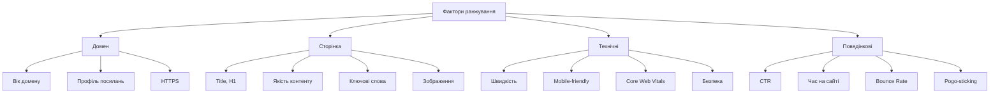
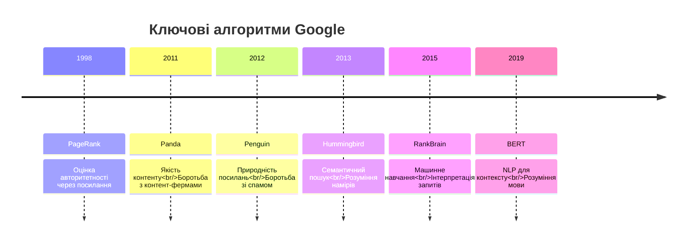
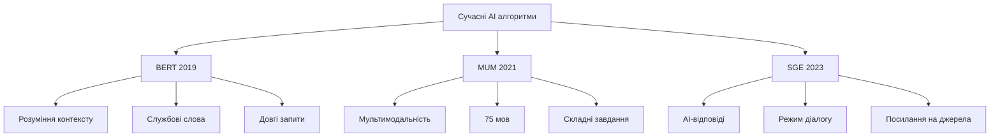
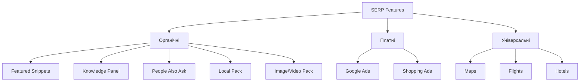

# Лекція 02: Алгоритми ранжування та SERP features

## Вступ

Після того як пошукова система обійшла та проіндексувала вебсторінки, настає найважливіший етап: визначення порядку відображення результатів у відповідь на запит користувача. Ранжування є складним процесом, який враховує сотні різних факторів та сигналів. У цій лекції ми детально розглянемо механізми ранжування, еволюцію ключових алгоритмів Google, сучасні технології на базі штучного інтелекту, а також різноманітні формати відображення результатів пошуку (SERP features), які значно змінили підходи до SEO-оптимізації.

## 1. Ранжування: фактори ranking (200+ сигналів)

### 1.1 Концепція ранжування та її еволюція

Ранжування представляє собою процес упорядкування результатів пошуку від найбільш до найменш релевантних для конкретного запиту користувача. На початку існування пошукових систем ранжування базувалося на простих метриках, таких як частота появи ключового слова на сторінці або в метатегах. Проте така система була вразливою до маніпуляцій, коли вебмайстри могли штучно підвищувати позиції своїх сайтів через надмірне використання ключових слів.

Сучасні алгоритми ранжування використовують понад 200 різних факторів, що робить практично неможливою маніпуляцію результатами через оптимізацію лише окремих елементів. Google офіційно не розкриває повний список факторів ранжування та їх вагу, але через численні дослідження, патенти та офіційні заяви представників компанії можна визначити основні категорії факторів.

### 1.2 Категорії факторів ранжування

Фактори ранжування можна класифікувати за різними критеріями. Розглянемо основні категорії детальніше.

#### 1.2.1 Фактори на рівні домену

Авторитетність домену впливає на загальну довіру пошукової системи до сайту. Вік домену має певне значення: старіші домени, які довгий час публікують якісний контент, зазвичай мають вищу довіру. Історія домену також важлива: якщо домен раніше використовувався для спаму або був покараний, це може негативно впливати навіть після зміни власника.

Зовнішні посилання на домен формують його авторитетність. Кількість унікальних доменів, що посилаються на ваш сайт, є важливішою за загальну кількість посилань. Якість посилань визначається авторитетністю сайтів-донорів. Релевантність посилань означає, що посилання з тематично близьких сайтів мають більшу вагу. Природність профілю посилань передбачає органічне зростання без різких стрибків.

HTTPS як фактор безпеки офіційно підтверджений Google як фактор ранжування з 2014 року. Сайти з SSL-сертифікатом отримують невелику перевагу в ранжуванні, а браузери позначають HTTP-сайти як небезпечні.

#### 1.2.2 Фактори на рівні сторінки

Оптимізація контенту залишається однією з найважливіших складових SEO. Title tag є одним із найсильніших on-page факторів, який має містити ключове слово та бути привабливим для користувача, з рекомендованою довжиною 50-60 символів. Meta description безпосередньо не впливає на ранжування, але впливає на CTR, який є поведінковим фактором. H1 заголовок має чітко відображати тему сторінки та містити основне ключове слово. H2-H6 підзаголовки структурують контент та допомагають Google зрозуміти ієрархію інформації.

Якість та унікальність контенту є критично важливими після впровадження алгоритму Panda. Унікальність тексту передбачає оригінальний, не скопійований контент. Глибина розкриття теми означає вичерпну інформацію з відповідями на всі можливі питання користувача. Експертність контенту демонструє знання автора в темі. Актуальність інформації особливо важлива для новинних та динамічних тем. Читабельність та структурованість тексту полегшують сприйняття.

Оптимізація ключових слів у сучасному SEO відійшла від точного входження до семантичного підходу. LSI-ключові слова (Latent Semantic Indexing) представляють синоніми та тематично пов'язані терміни. Природність використання передбачає органічне вплетення ключів у текст. Семантичне ядро охоплює всі аспекти теми. Довгі ключові фрази (long-tail) часто мають нижчу конкуренцію та вищу конверсію.

Внутрішня оптимізація зображень включає альтернативний текст (alt), який описує зображення для пошукових систем та користувачів з порушеннями зору. Назви файлів мають бути описовими та містити ключові слова. Оптимізація розміру файлу важлива для швидкості завантаження. Формати нового покоління (WebP, AVIF) забезпечують кращу компресію.

Внутрішні посилання допомагають розподіляти вагу між сторінками сайту. Якірний текст посилання має бути релевантним цільовій сторінці. Кількість внутрішніх посилань на важливі сторінки збільшує їх пріоритетність. Глибина вкладеності важливих сторінок не повинна перевищувати 3 кліки від головної. Логічна структура посилань створює зрозумілу навігацію для користувачів та роботів.

#### 1.2.3 Технічні фактори

Швидкість завантаження сторінки стала офіційним фактором ранжування з 2010 року для десктопу та з 2018 року для мобільних пристроїв. Core Web Vitals включає три ключові метрики: Largest Contentful Paint (LCP) вимірює час завантаження основного контенту (ідеально менше 2.5 секунд), First Input Delay (FID) вимірює час до першої взаємодії (ідеально менше 100 мс), Cumulative Layout Shift (CLS) вимірює візуальну стабільність (ідеально менше 0.1).

Мобільна оптимізація стала критично важливою після впровадження mobile-first indexing у 2019 році. Responsive design автоматично адаптує дизайн під різні розміри екрану. Mobile-friendly означає зручність використання на мобільних пристроях з читабельним текстом без зумування, кнопками достатнього розміру для натискання пальцем, відсутністю горизонтального скролу. Mobile page speed особливо важлива, оскільки мобільні користувачі часто мають повільніше з'єднання.

Структурованість коду HTML включає валідність HTML згідно зі стандартами W3C, семантичні HTML5 теги (article, section, nav, header, footer), правильну ієрархію заголовків без пропусків рівнів, чисту структуру без надлишкового коду.

Безпека сайту охоплює HTTPS-протокол як базову вимогу, відсутність шкідливого коду та вразливостей, регулярні оновлення CMS та плагінів, захист від DDoS-атак та хакерських втручань.

#### 1.2.4 Поведінкові фактори

Поведінкові фактори відображають, як користувачі взаємодіють з результатами пошуку та сайтом. CTR (Click-Through Rate) показує відсоток користувачів, які клікнули на результат серед тих, хто його побачив. Час на сайті (Dwell Time) вимірює, скільки користувач провів на сторінці після кліку з пошуку. Показник відмов (Bounce Rate) відображає відсоток користувачів, які покинули сайт, переглянувши лише одну сторінку. Pogo-sticking означає швидке повернення до результатів пошуку та вибір іншого результату, що сигналізує про нерелевантність. Повторні відвідування показують, що користувачі повертаються на сайт, що є сигналом високої якості.



### 1.3 Вага факторів та їх взаємодія

Важливо розуміти, що фактори ранжування не мають фіксованої ваги та взаємодіють між собою складним чином. Вага окремого фактору залежить від контексту запиту: для навігаційних запитів важливіші брендові сигнали, для інформаційних важливіша якість контенту, для транзакційних важливі комерційні сигнали та відгуки.

Компенсаторний ефект означає, що слабкість в одному факторі може бути компенсована силою в інших. Наприклад, новий сайт без авторитетності домену може ранжуватися добре завдяки винятковій якості контенту.

Алгоритми машинного навчання динамічно визначають вагу факторів для кожного запиту окремо на основі того, які результати користувачі вважають найбільш релевантними.

## 2. Алгоритми Google: PageRank, Panda, Penguin

### 2.1 PageRank: революція в оцінці авторитетності

PageRank став фундаментальним алгоритмом, на якому побудований успіх Google. Алгоритм базується на простій ідеї: важливість вебсторінки визначається кількістю та якістю посилань, які ведуть на неї.

Математична модель PageRank розглядає веб як орієнтований граф, де сторінки є вершинами, а посилання є ребрами. Алгоритм обчислює стаціонарний розподіл ймовірностей випадкового блукання по цьому графу.

Базова формула PageRank має вигляд:

```
PR(A) = (1-d) + d × Σ(PR(Ti) / C(Ti))
```

Параметр d є коефіцієнтом затухання (damping factor), зазвичай встановленим на 0.85. Цей коефіцієнт моделює ймовірність того, що користувач продовжить клікати на посилання замість того, щоб перейти на випадкову сторінку. Ti представляють сторінки, які посилаються на A. C(Ti) є кількістю вихідних посилань на сторінці Ti.

Інтерпретація формули така: кожна сторінка передає частину свого PageRank всім сторінкам, на які вона посилається. Якщо сторінка має багато вихідних посилань, кожне посилання передає меншу частку PageRank. Сторінка з високим PageRank, яка посилається на вашу сторінку, передає більше ваги, ніж сторінка з низьким PageRank.

Еволюція PageRank відбувалася протягом років. Спочатку PageRank відображався публічно як значення від 0 до 10 в Google Toolbar, що дозволяло вебмайстрам відстежувати авторитетність своїх сайтів. Проте це призвело до індустрії купівлі посилань з сайтів з високим PageRank. У 2016 році Google припинив публічне відображення PageRank, хоча сам алгоритм продовжує використовуватися внутрішньо як один із багатьох факторів ранжування.

Сучасна роль PageRank полягає в тому, що він залишається базовим елементом аналізу графа посилань, але його вага значно зменшилася порівняно з іншими факторами. Алгоритм еволюціонував у більш складні моделі, які враховують тематичну релевантність посилань, природність профілю посилань, контекст та позицію посилання на сторінці, поведінку користувачів після переходу за посиланням.

### 2.2 Google Panda: боротьба з низькоякісним контентом

Google Panda був запущений у лютому 2011 року та став одним із найбільш значущих оновлень в історії Google. Алгоритм був створений для боротьби з низькоякісним контентом, який заповнював результати пошуку.

Цілі алгоритму Panda включали зниження позицій сайтів з тонким контентом, що не надає реальної цінності користувачам. Боротьба з контент-фермами, які масово виробляли поверхневі статті оптимізовані під ключові слова. Покарання дублікатного контенту, скопійованого з інших джерел. Зниження позицій сайтів з надмірною рекламою, що заважає основному контенту.

Критерії якості контенту за Panda оцінюються через низку запитань. Чи довірили б ви інформації на цій сторінці своїм фінансам або здоров'ям. Чи написана стаття експертом або ентузіастом, який добре знає тему. Чи містить сайт дублікатний контент. Чи могли б ви довірити цьому сайту свою кредитну картку. Чи містить контент орфографічні або фактичні помилки. Чи створений контент з урахуванням інтересів читачів чи просто для пошукових систем.

Історія оновлень Panda включає версію Panda 1.0 у лютому 2011 року, яка вплинула на 12% запитів в англомовному сегменті. Численні ітерації з 2011 по 2015 рік постійно покращували алгоритм. Інтеграцію в основний алгоритм у січні 2016 року, після чого Panda став працювати в режимі реального часу.

Вплив на SEO-стратегії був революційним. Фокус змістився на створення якісного, унікального контенту замість кількості сторінок. Розвиток контент-маркетингу як стратегії створення цінного контенту для аудиторії. Підвищення вимог до експертності авторів та редакційних стандартів. Необхідність регулярного аудиту та оновлення старого контенту.

### 2.3 Google Penguin: фільтр проти маніпуляцій з посиланнями

Google Penguin був запущений у квітні 2012 року для боротьби з маніпулятивними схемами побудови посилань, які штучно підвищували позиції сайтів.

Цілі алгоритму Penguin спрямовані на виявлення та покарання неприродних профілів посилань з раптовим зростанням кількості посилань, купівлі посилань з SEO-метою, посилань з нерелевантних сайтів, надмірної оптимізації якірних текстів. Боротьбу з посиланнями низької якості зі спам-сайтів, автоматично згенерованих сайтів, каталогів низької якості, коментарів у блогах та форумах виключно для SEO. Покарання за участь у схемах обміну посиланнями.

Ознаки неприродного профілю посилань включають високий відсоток точних якірних текстів з ключовими словами, посилання з нерелевантних тематично сайтів, різке зростання кількості посилань за короткий період, багато посилань з сайтів низької якості або спаму, посилання з футерів або сайдбарів на багатьох сторінках, посилання з одного IP-діапазону або C-класу.

Історія оновлень Penguin показує версію Penguin 1.0 у квітні 2012 року, яка вплинула на 3.1% англомовних запитів. Подальші оновлення з 2012 по 2016 рік розширювали покриття та точність. Penguin 4.0 у вересні 2016 року інтегрувався в основний алгоритм та почав працювати в режимі реального часу, знецінюючи спамні посилання замість покарання всього сайту.

Еволюція підходу від покарання до знецінення означає, що ранні версії Penguin карали весь сайт, знижуючи позиції всіх його сторінок. Сучасна версія працює більш гранулярно, просто ігноруючи підозрілі посилання без покарання сайту. Це зробило відновлення після Penguin швидшим, оскільки не потрібно чекати наступного оновлення алгоритму.

Вплив на індустрію SEO був глибоким. Занепад індустрії купівлі посилань та приватних мереж блогів. Розвиток white-hat link building через гостьові пости на авторитетних сайтах, створення контенту, яким хочуть ділитися, PR та згадки в медіа, партнерства та співпраця. Важливість інструменту Google Disavow для відмови від токсичних посилань. Фокус на якості посилань замість кількості.



## 3. Сучасні алгоритми: BERT, MUM, Search Generative Experience

### 3.1 BERT: революція в розумінні природної мови

BERT (Bidirectional Encoder Representations from Transformers) був представлений у жовтні 2019 року та став найбільшим стрибком у розумінні мови за останні п'ять років, за словами Google.

Принцип роботи BERT базується на архітектурі трансформерів, які дозволяють модель одночасно аналізувати слова в обох напрямках (ліворуч та праворуч від кожного слова). Це кардинально відрізняється від попередніх моделей, які читали текст послідовно в одному напрямку.

Ключові можливості BERT включають розуміння контексту слова в реченні, де одне слово може мати різні значення залежно від контексту. Розуміння ролі службових слів (прийменників, сполучників), які раніше часто ігнорувалися, але часто змінюють значення речення. Інтерпретацію складних та довгих запитів з декількома умовами та нюансами. Розпізнавання намірів користувача навіть у нечітко сформульованих запитах.

Приклади впливу BERT на результати пошуку демонструють його потужність. Запит "2019 brazil traveler to usa need a visa" раніше мало інтерпретувався, оскільки Google фокусувався на словах "brazil" та "usa" без розуміння напрямку подорожі. BERT розуміє, що мова йде про громадянина Бразилії, який їде в США, а не навпаки.

Запит "can you get medicine for someone pharmacy" раніше міг показувати загальну інформацію про аптеки. BERT розуміє специфічний намір: чи може людина отримати ліки для когось іншого, і показує інформацію про правила та вимоги.

Вплив на SEO-стратегії змістив фокус на природну мову замість штучного впровадження ключових слів. Важливість відповідності на конкретні запитання користувачів стала критичною. Оптимізація під довгі, розмовні запити (особливо голосовий пошук) набула значення. Створення вичерпного контенту, який охоплює всі аспекти теми, стало необхідним.

### 3.2 MUM: мультимодальне розуміння інформації

MUM (Multitask Unified Model) був анонсований у травні 2021 року як алгоритм, який у 1000 разів потужніший за BERT та може виконувати набагато складніші завдання.

Унікальні можливості MUM включають мультимодальність через розуміння інформації з тексту, зображень та потенційно відео й аудіо. Мультилінгвальність дозволяє розуміти та генерувати інформацію на 75 мовах одночасно, переносячи знання між мовами. Контекстне розуміння допомагає зрозуміти складні, багатоаспектні запитання, які потребують синтезу інформації з різних джерел. Можливість відповідати на запитання, для яких потрібно зрозуміти контекст з попередніх запитів у сесії.

Приклади застосування MUM демонструють його універсальність. При запиті "I've hiked Mt. Adams, now I want to hike Mt. Fuji next fall, what should I do differently to prepare?" MUM розуміє порівняльний контекст між двома горами, враховує сезонність (осінь), синтезує інформацію про відмінності в клімат, висоті, складності, необхідному спорядженні та підготовці.

Візуальний пошук з MUM дозволяє користувачу завантажити фото велосипеда з пошкодженою деталлю та запитати, як це називається та як полагодити. MUM аналізує зображення, ідентифікує деталь, знаходит інформацію про ремонт і навіть може знайти відео-інструкції.

Переклад знань між мовами працює так: якщо детальна інформація про певну тему існує тільки японською мовою, MUM може синтезувати цю інформацію та надати англомовну відповідь, навіть якщо подібного англомовного контенту не існує.

Вплив на контент-стратегію вимагає створення комплексного контенту різних форматів: текст, інфографіка, відео, подкасти. Розвиток експертного контенту, який глибоко розкриває складні теми. Оптимізацію зображень та відео з детальними описами та метаданими. Створення контенту, який відповідає на комплексні запитання та синтезує інформацію з різних аспектів теми.

### 3.3 Search Generative Experience (SGE): майбутнє пошуку

Search Generative Experience був представлений у травні 2023 року на конференції Google I/O як експериментальна функція, яка інтегрує генеративний AI безпосередньо в результати пошуку.

Принцип роботи SGE полягає в тому, що для певних запитів Google генерує синтезовану відповідь на основі багатьох джерел, яка з'являється вгорі результатів пошуку. Ця відповідь створюється штучним інтелектом у режимі реального часу та включає посилання на використані джерела. Користувач може ставити уточнюючі запитання в діалоговому режимі, поглиблюючи пошук без переформулювання всього запиту.

Особливості SGE включають AI-згенеровані огляди з синтезом інформації з багатьох авторитетних джерел, прозорими посиланнями на всі використані джерела, структурованим форматуванням з підзаголовками, списками, ключовими пунктами. Режим розмови дозволяє ставити уточнюючі запитання без втрати контексту попередньої розмови, пропонує наступні можливі запитання для поглиблення теми. Візуальні елементи демонструють зображення та діаграми для кращого розуміння складних концепцій.

Типи запитів, для яких активується SGE, включають інформаційні запити, що потребують синтезу інформації з багатьох джерел, дослідницькі запитання з необхідністю порівняння різних аспектів теми, навчальні запити з потребою покрокових пояснень або інструкцій, запитання-порівняння, де потрібно зіставити різні опції або підходи.

Вплив SGE на SEO та вебтрафік викликає занепокоєння багатьох вебмайстрів. Потенційне зниження кліків на сайти через те, що користувачі отримують відповідь безпосередньо в пошуку. Важливість бути джерелом для AI відповідей вимагає створення авторитетного, якісного контенту. Підвищення значення E-E-A-T (Experience, Expertise, Authoritativeness, Trustworthiness) для визнання надійним джерелом. Можливості для нових форматів контенту, оптимізованих під AI-синтез.



## 4. SERP Features: featured snippets, knowledge panels, local pack, People Also Ask

### 4.1 Еволюція сторінки результатів пошуку

Традиційна SERP (Search Engine Results Page) складалася лише з 10 синіх посилань на вебсторінки. Сучасна SERP є набагато складнішою та може включати десятки різних форматів відображення результатів, які називаються SERP features.

Класифікація SERP features включає органічні features, які генеруються з вебконтенту (featured snippets, knowledge panels, people also ask, image packs, video results, news results, site links). Платні features з Google Ads (текстові оголошення, shopping ads, local service ads). Універсальні результати з інтеграцією різних типів контенту (maps, flights, hotels, jobs).

Значення SERP features для SEO полягає в тому, що позиція нуль (featured snippet) може приносити більше трафіку, ніж перша позиція. Візуально привабливі результати отримують вищий CTR навіть на нижчих позиціях. Домінування в SERP features підвищує видимість бренду та довіру користувачів. Деякі features знижують кліки на сайти, оскільки відповідь надається безпосередньо в пошуку.

### 4.2 Featured Snippets: позиція нуль

Featured snippet є виділеним блоком на вершині органічних результатів, який містить пряму відповідь на запит користувача, витягнуту з однієї з проіндексованих сторінок.

Типи featured snippets включають параграф з текстовою відповіддю на запитання зазвичай довжиною 40-60 слів. Список може бути нумерованим для покрокових інструкцій або маркованим для переліків без певного порядку. Таблиця використовується для структурованих даних, порівнянь, цін, характеристик. Відео з виділенням конкретного моменту, релевантного для запиту.

Критерії отримання featured snippet включають чітку, стислу відповідь на конкретне запитання. Структурований контент з використанням списків, таблиць, підзаголовків. Позицію в топ-10 результатів пошуку, оскільки snippets зазвичай витягуються з першої сторінки. Високу якість та авторитетність сторінки відповідно до критеріїв E-E-A-T.

Стратегії оптимізації під featured snippets передбачають ідентифікацію запитань через аналіз запитів типу "як", "що", "чому", "коли", використання інструментів типу AnswerThePublic, аналіз розділу "People Also Ask". Створення чітких відповідей шляхом формулювання прямої відповіді на запитання в 40-60 словах відразу після підзаголовка H2/H3 з питанням, використання визначень для термінологічних запитів. Структурування контенту через HTML-списки (ul, ol) для покрокових інструкцій, HTML-таблиці для порівняльної інформації, логічні підзаголовки з запитаннями. Оптимізацію зображень, оскільки featured snippet часто супроводжується зображенням з тієї ж сторінки.

### 4.3 Knowledge Panels та Knowledge Graph

Knowledge Panel є інформаційним блоком, який з'являється праворуч (на десктопі) або вгорі (на мобільних) від результатів пошуку та містить структуровану інформацію про об'єкт (персону, компанію, місце, подію).

Джерела даних для Knowledge Panel включають Knowledge Graph, що є базою знань Google про сутності та їх зв'язки. Wikipedia використовується як авторитетне джерело загальної інформації. Wikidata надає структуровані дані про сутності. Офіційні вебсайти та профілі в соцмережах компаній та персон. Структуровані дані на вебсайті через Schema.org markup.

Елементи Knowledge Panel можуть включати назву та короткий опис сутності, основне зображення або логотип, ключові факти (дата народження, заснування, локація), посилання на офіційний сайт та соцмережі, карту для місць та організацій, пов'язані сутності (люди також шукають), відгуки та рейтинги для бізнесів.

Стратегії для отримання Knowledge Panel включають створення профілю в Google Business для локального бізнесу. Створення та верифікацію сторінки у Wikipedia, якщо ви відповідаєте критеріям помітності. Імплементацію структурованих даних Organization або Person schema на офіційному сайті. Підтримку консистентності інформації про компанію в різних джерелах (NAP: Name, Address, Phone). Активну присутність у соцмережах з верифікованими профілями. Будівництво авторитетності через згадки в авторитетних медіа та публікаціях.

### 4.4 Local Pack та Local SEO

Local Pack (також відомий як Map Pack або Snack Pack) відображає три локальні бізнеси з картою для запитів з локальним наміром (наприклад, "ресторани поблизу", "автосервіс київ").

Фактори ранжування в Local Pack включають релевантність відповідності бізнесу запиту користувача. Відстань від місцезнаходження користувача до бізнесу. Промінентність, що означає наскільки відомий бізнес онлайн та офлайн, визначається відгуками, рейтингом, згадками, посиланнями.

Оптимізація Google Business Profile вимагає повноти інформації з заповненням всіх можливих полів (категорія, години роботи, атрибути, опис). Використання якісних фотографій бізнесу, інтер'єру, екстер'єру, товарів, команди. Отримання та відповідей на відгуки, особливо позитивні відгуки з ключовими словами. Регулярних постів з новинами, акціями, оновленнями. Вказання всіх локацій для мультилокаційних бізнесів.

On-page оптимізація для локального SEO включає NAP consistency з однаковою назвою, адресою, телефоном на всіх платформах. Локальні ключові слова в title, H1, контенті (наприклад, "автосервіс у Києві"). Локальний контент зі статтями про місцеві події, новини, гайдами по місту. Схему LocalBusiness з структурованими даними про адресу, години роботи, контакти.

Off-page фактори для локального SEO охоплюють локальні цитування (згадки NAP) в каталогах та довідниках. Локальні посилання з сайтів місцевих організацій, партнерів, ЗМІ. Соціальні сигнали з активності в локальних соцмережах та групах. Офлайн фактори через популярність бізнесу, трафік, згадки в пресі.

### 4.5 People Also Ask (PAA)

People Also Ask є динамічним блоком з пов'язаними запитаннями, які розширюються при кліку, показуючи короткі відповіді з різних вебсайтів.

Особливості PAA включають динамічність, оскільки при кліку на запитання з'являються нові пов'язані запитання. Різноманітність джерел, де відповіді можуть братися з різних сайтів. Можливість домінування, оскільки один сайт може з'являтися в декількох PAA. Зв'язок з featured snippets через схожий формат відповідей.

Стратегія оптимізації під PAA передбачає дослідження запитань через використання самого PAA для знаходження пов'язаних запитань, інструменти типу AlsoAsked.com для візуалізації PAA-графу, аналіз форумів та Q&A платформ для виявлення популярних запитань. Створення FAQ-розділів на сторінках з відповідями на всі виявлені запитання, використання структурованих даних FAQPage schema, стислі відповіді в 40-60 слів. Покриття повного воронки запитань від загальних до специфічних, від початкових до поглиблених.

### 4.6 Інші важливі SERP Features

Image Pack відображає горизонтальну стрічку зображень у результатах пошуку. Оптимізація включає якісні, релевантні зображення з описовими назвами файлів (product-name.jpg замість IMG001.jpg), alt-теги з природним описом, оптимізований розмір файлів для швидкого завантаження, структуровані дані ImageObject.

Video Results показують відеорезультати з YouTube або інших платформ. Оптимізація вимагає привабливих thumbnail з високою якістю та чітким зображенням, описових title та description з ключовими словами, транскрипції відео для кращого розуміння контенту, VideoObject schema з тривалістю, описом, thumbnail URL.

Sitelinks є додаткові посилання під основним результатом вашого сайту. Оптимізація включає чітку структуру сайту з логічною навігацією, внутрішні посилання на важливі розділи, використання Google Search Console для зниження пріоритету небажаних sitelinks, описові якірні тексти внутрішніх посилань.



## 5. Як оптимізувати контент під різні SERP Features

### 5.1 Комплексна стратегія охоплення SERP

Ефективна SEO-стратегія в сучасних умовах вимагає оптимізації не лише під традиційні органічні результати, але й під різноманітні SERP features, які можуть приносити значний трафік та видимість.

Аналіз SERP для цільових запитів є першим кроком. Ідентифікуйте, які features з'являються для ваших ключових запитів. Визначте, які features найбільш релевантні для вашого бізнесу та контенту. Проаналізуйте конкурентів, які домінують у цих features. Оцініть потенціал трафіку з кожного типу feature.

Пріоритизація зусиль базується на потенціалі трафіку з певного feature, складності досягнення (конкуренції), релевантності для бізнес-цілей, наявних ресурсах та експертизі.

### 5.2 Технічна реалізація оптимізації

Імплементація структурованих даних є критично важливою для багатьох SERP features. Використовуйте відповідні типи schema для вашого контенту: Article для статей та новин, Product для товарів з ціною та наявністю, Recipe для кулінарних рецептів, Event для подій та заходів, FAQPage для часто задаваних питань, HowTo для покрокових інструкцій, LocalBusiness для локальних бізнесів.

Валідація structured data проводиться через Google Rich Results Test для перевірки коректності імплементації, Schema Markup Validator для загальної валідації, Google Search Console для моніторингу помилок та попереджень.

### 5.3 Моніторинг та аналіз ефективності

Відстеження позицій у SERP features вимагає використання спеціалізованих інструментів, які відстежують не лише традиційні позиції, але й появу в різних features. Регулярного аудиту змін у SERP для ключових запитів. Аналізу трафіку з різних типів результатів через Google Analytics та Search Console.

Метрики успіху включають частоту появи у featured snippets для цільових запитань, кількість відгуків та середній рейтинг у Local Pack, трафік з People Also Ask, impressions та CTR з Image та Video Pack, загальну видимість у всіх SERP features.

## Висновки

Сучасне ранжування в пошукових системах є результатом взаємодії понад 200 факторів, які постійно еволюціонують та адаптуються під зміни в поведінці користувачів та технологічні інновації. Від простого підрахунку ключових слів та PageRank система прогресувала до складних алгоритмів машинного навчання, які розуміють природну мову, контекст та наміри користувачів.

Алгоритми Panda та Penguin назавжди змінили підходи до SEO, зробивши якість контенту та природність посилань основними пріоритетами. Сучасні AI-алгоритми BERT та MUM продовжують цю еволюцію, вимагаючи фокусу на експертності, авторитетності та довірі.

SERP features радикально трансформували сторінку результатів пошуку, створюючи нові можливості для видимості та трафіку. Успішна SEO-стратегія в сучасних умовах вимагає комплексного підходу до оптимізації під різні формати відображення результатів, від featured snippets до local pack та knowledge panels.

Розуміння принципів роботи алгоритмів ранжування та механізмів SERP features дозволяє створювати контент та технічну архітектуру сайту, які максимально ефективно взаємодіють з пошуковими системами та забезпечують якісний користувацький досвід.
