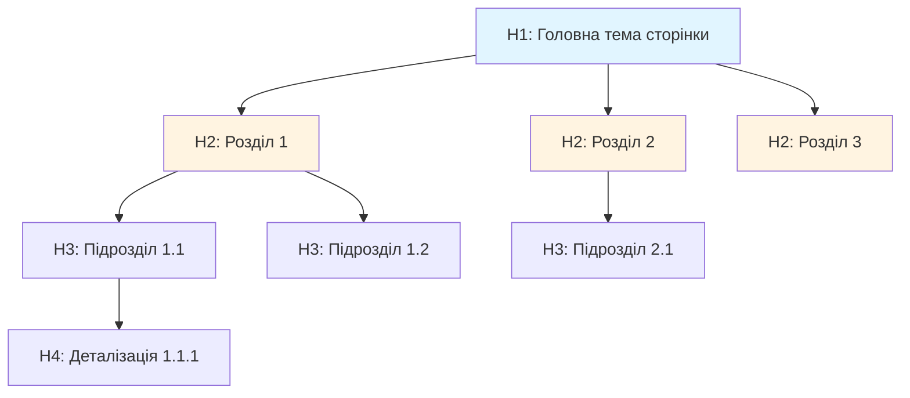
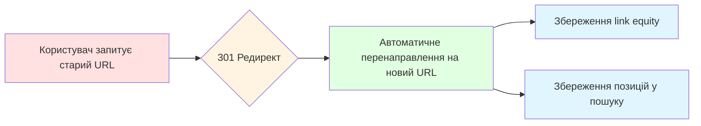
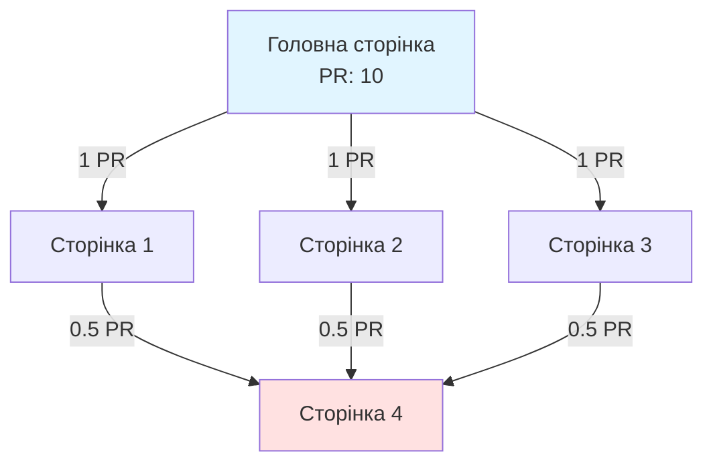
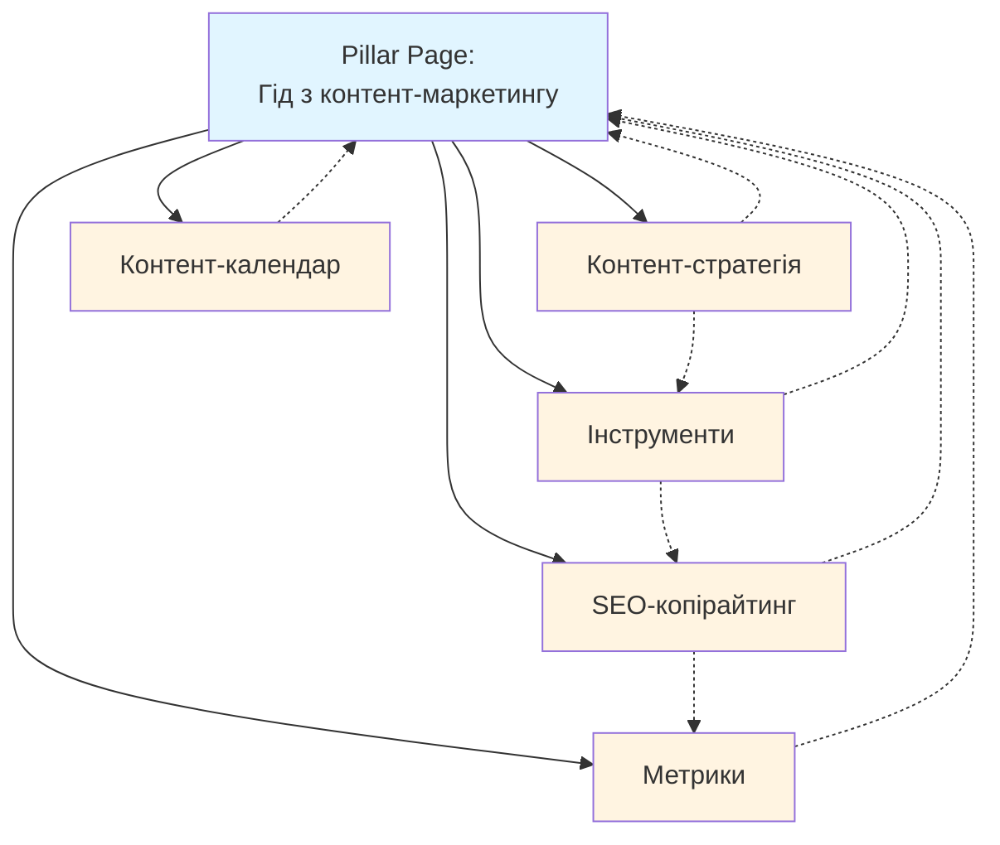

# Лекція 03: HTML-структура та on-page елементи

## Вступ

On-page оптимізація є фундаментом успішної SEO-стратегії. Це всі елементи, які знаходяться безпосередньо на вебсторінці і можуть бути контрольовані вебмайстром. Правильна HTML-структура не лише допомагає пошуковим системам краще зрозуміти контент, але й покращує користувацький досвід, що в свою чергу позитивно впливає на поведінкові фактори.

У цій лекції ми детально розглянемо ключові on-page елементи: від базової HTML-структури до стратегій внутрішнього зв'язування. Розуміння цих компонентів дозволить вам створювати сторінки, які ефективно ранжуються в пошукових системах та відповідають потребам користувачів.

## 1. HTML-структура: заголовки H1-H6, ієрархія контенту

### Роль заголовків у SEO

Заголовки є структурними елементами HTML, які визначають ієрархію інформації на сторінці. Вони виконують дві критичні функції: допомагають пошуковим роботам зрозуміти структуру контенту та покращують читабельність для користувачів.

HTML надає шість рівнів заголовків від H1 до H6, де H1 є найважливішим, а H6 найменш значущим. Ця ієрархічна система дозволяє організувати контент логічно та послідовно.

### Правила використання H1

Заголовок H1 є найважливішим елементом на сторінці. Він має відповідати кільком критеріям:

Унікальність на сторінці. Кожна сторінка повинна мати лише один H1. Це правило не є абсолютним технічним обмеженням HTML5, але з точки зору SEO наявність одного чіткого H1 допомагає пошуковим системам зрозуміти основну тему сторінки.

Релевантність до контенту. H1 має точно відображати основну тему сторінки та відповідати пошуковому запиту користувача.

Включення ключових слів. Ключове слово або фразу бажано розміщувати на початку заголовка, але природно, без переоптимізації.

Довжина заголовка. Оптимальна довжина H1 становить 20-70 символів. Занадто короткий заголовок може бути недостатньо інформативним, занадто довгий виглядає як параграф тексту.

Приклад ефективного H1:

```html
<h1>Пошукова оптимізація для інтернет-магазинів: повний гід 2025</h1>
```

Приклад неефективного H1:

```html
<h1>Головна</h1>
<h1>Дізнайтесь все про SEO</h1>
<h1>Ця стаття розповість вам про пошукову оптимізацію для інтернет-магазинів, включаючи технічні аспекти, контент-стратегію та link building</h1>
```

### Ієрархія H2-H6

Підзаголовки H2-H6 створюють логічну структуру контенту всередині сторінки. Правильна ієрархія виглядає як дерево, де кожен рівень підпорядкований попередньому.

H2 використовують для основних розділів сторінки. Вони поділяють контент на великі тематичні блоки. На типовій статті може бути від 3 до 8 заголовків H2.

H3 є підрозділами в межах секцій H2. Вони деталізують інформацію з попереднього рівня.

H4-H6 використовуються рідше, зазвичай в дуже довгих та детальних матеріалах, таких як технічна документація або академічні публікації.

Приклад правильної ієрархії:

```html
<h1>Гід з технічного SEO для початківців</h1>

<h2>Що таке технічне SEO</h2>
<p>Контент розділу...</p>

<h2>Основні елементи технічного SEO</h2>

<h3>Швидкість завантаження сторінки</h3>
<p>Контент підрозділу...</p>

<h4>Метрики Core Web Vitals</h4>
<p>Деталізація...</p>

<h4>Інструменти вимірювання</h4>
<p>Деталізація...</p>

<h3>Мобільна оптимізація</h3>
<p>Контент підрозділу...</p>

<h2>Інструменти для технічного аудиту</h2>
<p>Контент розділу...</p>
```

### Типові помилки в ієрархії заголовків

Пропуск рівнів. Не можна переходити від H2 безпосередньо до H4, пропускаючи H3. Така структура порушує логіку документа.

Множинні H1. Хоча HTML5 технічно дозволяє кілька H1, з точки зору SEO це створює плутанину щодо основної теми сторінки.

Використання заголовків для стилізації. Не можна використовувати H3 замість H2 лише тому, що він візуально виглядає краще. Для візуального оформлення використовується CSS.

Заголовки без контенту. Після кожного заголовка має йти відповідний контент, що розкриває заявлену тему.



### Оптимізація заголовків під Featured Snippets

Пошукові системи часто використовують заголовки для формування Featured Snippets. Щоб збільшити шанси потрапити в цю позицію, використовуйте питальні конструкції в H2 та давайте чіткі, структуровані відповіді одразу після заголовка.

Приклад оптимізації під snippet:

```html
<h2>Що таке Core Web Vitals?</h2>
<p>Core Web Vitals — це набір метрик, які Google використовує для оцінки користувацького досвіду на вебсторінці. До них входять три ключові показники: LCP (швидкість завантаження), INP (інтерактивність) та CLS (стабільність візуального контенту).</p>
```

## 2. Title tags: формули написання, довжина, keywords placement

### Функції title tag

Title tag є одним із найважливіших on-page елементів для SEO. Це HTML-елемент, який визначає заголовок вебсторінки та відображається в кількох критичних місцях:

Результати пошуку. Title відображається як синє посилання в SERP і є першим, що бачить користувач.

Вкладка браузера. Title показується у заголовку вкладки, допомагаючи користувачам орієнтуватися між відкритими сторінками.

Соціальні мережі. При шерингу посилання title часто використовується як заголовок превью.

Закладки браузера. Коли користувач додає сторінку в закладки, title стає її назвою.

Синтаксис title tag:

```html
<head>
    <title>Ваш заголовок сторінки тут</title>
</head>
```

### Оптимальна довжина title

Google відображає в результатах пошуку приблизно 50-60 символів title або 600 пікселів ширини. Якщо title довший, він обрізається з додаванням трьох крапок.

Рекомендації щодо довжини:

Мінімум 30 символів. Занадто короткі title виглядають неінформативно та не використовують доступний простір.

Оптимум 50-60 символів. Це дозволяє повністю відобразити title в більшості випадків.

Максимум 70 символів. Можна дозволити трохи довші title, розуміючи, що кінець може бути обрізаний.

Важливо розміщувати найважливішу інформацію та ключові слова на початку title, щоб вони гарантовано відображалися навіть при обрізанні.

Приклад правильної довжини:

```html
<title>Курси SEO онлайн: навчання з нуля за 3 місяці | SEO Academy</title>
```

Цей title містить 62 символи, включає ключове слово на початку, пропозицію цінності та назву бренду.

### Формули написання title tag

Існує кілька перевірених формул для створення ефективних title:

Формула 1: Ключове слово + Модифікатор + Бренд

```html
<title>Купити ноутбук Dell XPS 13 | Офіційний магазин TechStore</title>
```

Формула 2: Питання + Відповідь + Бренд

```html
<title>Як вибрати CRM систему? 7 критеріїв від IT Solutions</title>
```

Формула 3: Число + Прикметник + Ключове слово + Обіцянка

```html
<title>15 безкоштовних SEO інструментів для аудиту сайту 2025</title>
```

Формула 4: Як зробити + Дія + Результат

```html
<title>Як налаштувати Google Analytics 4: покрокова інструкція</title>
```

Формула 5: Продукт/Послуга + Вигода + Локація

```html
<title>Ремонт iPhone у Києві за 30 хвилин | Гарантія 6 місяців</title>
```

### Розміщення ключових слів у title

Ключові слова мають бути розміщені природньо, але з урахуванням їх ваги для SEO:

Основне ключове слово на початку. Слова на початку title мають більшу вагу для пошукових систем.

Природність важливіша за оптимізацію. Title має бути читабельним та привабливим для людини, а не просто набором ключових слів.

Уникайте keyword stuffing. Повторення одного й того ж слова кілька разів знижує ефективність та виглядає спамно.

Приклад поганого title з keyword stuffing:

```html
<title>SEO послуги, SEO оптимізація, SEO просування, SEO Київ, SEO агенція</title>
```

Приклад хорошого title:

```html
<title>SEO просування сайтів у Києві: комплексні послуги від агенції WebPro</title>
```

### Title tag та CTR

Title безпосередньо впливає на CTR у результатах пошуку. Навіть якщо ваша сторінка ранжується на високій позиції, погано написаний title може призвести до низького CTR.

Елементи, які підвищують CTR:

Цифри та дані. "10 способів", "збільшення на 150%", "за 24 години".

Сильні прикметники. "ефективний", "перевірений", "професійний", "безкоштовний".

Дужки та квадратні дужки. "[Гід 2025]", "(з прикладами)".

Емоційні тригери. "Вражаючі результати", "Зекономте час".

Терміновість. "2025", "Новинка", "Оновлено".

Приклад title з високим потенціалом CTR:

```html
<title>Google Ads для початківців [Гід 2025]: як запустити за 1 день</title>
```

### Динамічні title для різних типів сторінок

Різні типи сторінок потребують різних підходів до створення title:

Головна сторінка:

```html
<title>Назва Бренду: короткий опис діяльності + УТП</title>
<title>WebStudio: розробка сайтів та мобільних додатків у Львові</title>
```

Категорія товарів:

```html
<title>Категорія товарів | Бренд | Модифікатори</title>
<title>Смартфони Samsung: купити в Києві | Ціни, характеристики | Mobi</title>
```

Картка товару:

```html
<title>Назва Товару | Ключова характеристика | Ціна/Наявність | Магазин</title>
<title>iPhone 15 Pro 256GB Чорний | В наявності від 45990 грн | iStore</title>
```

Статті блогу:

```html
<title>Заголовок статті: підзаголовок або обіцянка | Назва блогу</title>
<title>10 трендів веб-дизайну 2025: що варто знати дизайнеру | DesignHub</title>
```

Локальні сторінки:

```html
<title>Послуга в Місті: адреса, контакти, години роботи | Компанія</title>
<title>Стоматологія в Одесі: вул. Дерибасівська 10 | Дент-Плюс</title>
```

### Тестування та оптимізація title

Title не є статичним елементом. Його можна та потрібно тестувати та оптимізувати:

Аналіз CTR в Google Search Console. Якщо сторінка має високу позицію, але низький CTR, варто переписати title.

A/B тестування. Змінюйте title та відстежуйте зміни в CTR та позиціях через 2-4 тижні.

Аналіз конкурентів. Вивчайте title сторінок, що ранжуються на топ-позиціях за вашими ключовими словами.

Моніторинг змін Google. Іноді Google сам переписує ваш title. Якщо це відбувається регулярно, варто адаптувати оригінальний title.

## 3. Meta descriptions: чому важливі, best practices

### Роль meta description

Meta description є HTML-атрибутом, який надає короткий опис змісту сторінки. Хоча meta description не є прямим фактором ранжування, він критично важливий для CTR у результатах пошуку.

Синтаксис meta description:

```html
<head>
    <meta name="description" content="Короткий опис сторінки тут">
</head>
```

Meta description відображається під title у результатах пошуку як сніпет тексту, що допомагає користувачу зрозуміти, чи релевантна сторінка його запиту.

### Оптимальна довжина meta description

Google відображає приблизно 120-155 символів meta description на десктопі та трохи менше на мобільних пристроях. Однак це не жорстке обмеження, і Google може показувати довші описи залежно від запиту.

Рекомендації:

Мінімум 70 символів. Занадто короткий опис не використовує доступний простір.

Оптимум 120-155 символів. Дозволяє повністю контролювати повідомлення.

Максимум 160 символів. Можна дозволити трохи довші описи, розуміючи ризик обрізання.

Найважливіша інформація на початку. Перші 120 символів гарантовано відображаються.

Приклад оптимального meta description:

```html
<meta name="description" content="Навчіться створювати адаптивні вебсайти з нуля за 3 місяці. Практичний курс з HTML, CSS, JavaScript. Сертифікат після завершення. Реєстрація відкрита.">
```

### Що включати в meta description

Ефективний meta description має містити:

Ключове слово. Google виділяє жирним слова з запиту користувача в description, що привертає увагу.

Унікальну пропозицію цінності. Чому користувач має вибрати саме вашу сторінку.

Заклик до дії. "Дізнайтеся більше", "Замовте зараз", "Завантажте безкоштовно".

Конкретику. Цифри, факти, деталі замість загальних фраз.

Приклад з усіма елементами:

```html
<meta name="description" content="Професійний аудит сайту за 24 години: аналіз 50+ SEO параметрів, детальний звіт, рекомендації. Безкоштовна консультація. Замовте аудит зараз.">
```

### Meta description для різних типів сторінок

Головна сторінка:

```html
<meta name="description" content="WebAgency — розробка сайтів, інтернет-магазинів та мобільних додатків з 2015 року. 200+ завершених проєктів. Замовте безкоштовну консультацію.">
```

Категорія товарів:

```html
<meta name="description" content="Ноутбуки Dell у Києві: 150+ моделей, ціни від 15000 грн. Офіційна гарантія 2 роки. Безкоштовна доставка. Купуйте в TechStore з 2010 року.">
```

Картка товару:

```html
<meta name="description" content="Dell XPS 13 9340 (i7, 16GB, 512GB SSD): ультрабук для роботи та навчання. Ціна 42990 грн. В наявності. Доставка по Україні за 1-2 дні. Гарантія 24 місяці.">
```

Стаття блогу:

```html
<meta name="description" content="Як налаштувати Google Analytics 4: покрокова інструкція з screenshots. Створення property, встановлення коду, налаштування подій та конверсій. Читайте гід 2025.">
```

### Типові помилки в meta description

Дублювання. Кожна сторінка має мати унікальний meta description. Дублікати знижують ефективність.

Переоптимізація ключовими словами. Description має бути читабельним для людини, а не списком keywords.

Відсутність призову до дії. Без CTA description виглядає пасивно.

Невідповідність контенту. Description має точно відображати зміст сторінки.

Приклад поганого meta description:

```html
<meta name="description" content="SEO, SEO оптимізація, SEO просування, замовити SEO, SEO послуги Київ">
```

Приклад хорошого meta description:

```html
<meta name="description" content="Комплексне SEO просування сайтів у Києві: технічний аудит, оптимізація контенту, link building. Гарантія результату за 3 місяці. Безкоштовна консультація.">
```

### Динамічна генерація meta description

Для великих сайтів з тисячами сторінок ручне написання meta description нереалістичне. У таких випадках використовують динамічну генерацію на основі шаблонів.

Приклад шаблону для товару:

```
{{product_name}}: {{main_features}}. Ціна {{price}} грн. {{availability_status}}. {{delivery_info}}. Гарантія {{warranty}}.
```

Результат:

```html
<meta name="description" content="Samsung Galaxy S24 Ultra: 200MP камера, 12GB RAM, 256GB пам'яті. Ціна 52990 грн. В наявності. Безкоштовна доставка по Україні. Гарантія 12 місяців.">
```

### Коли Google ігнорує meta description

Google не завжди використовує прописаний meta description. Пошукова система може генерувати свій варіант на основі контенту сторінки, якщо вважає, що він більш релевантний запиту користувача.

Причини, чому Google ігнорує description:

Занадто короткий або занадто довгий.

Не релевантний запиту користувача.

Містить багато ключових слів без змісту.

Не відповідає контенту сторінки.

Якщо Google регулярно ігнорує ваш description, це сигнал переписати його.

## 4. URL-структура: ЧПУ, breadcrumbs, параметри

### Що таке ЧПУ

ЧПУ (Людино-Прийнятний URL або Human-Readable URL) — це URL-адреса, яка містить зрозумілі слова замість числових ідентифікаторів чи складних параметрів.

Приклад поганого URL:

```
https://example.com/product.php?id=12345&cat=67&ref=xyz
```

Приклад хорошого ЧПУ:

```
https://example.com/elektronika/smartfony/samsung-galaxy-s24
```

### Чому URL важливий для SEO

URL є слабким фактором ранжування, але має декілька важливих функцій:

Читабельність для користувачів. Зрозумілий URL викликає більше довіри.

Показник релевантності. URL може містити ключові слова, які сигналізують про тему сторінки.

Структура сайту. URL відображає ієрархію та організацію контенту.

Anchor text для посилань. При копіюванні URL він часто стає anchor text, і наявність ключових слів у ньому корисна.

### Принципи створення SEO-friendly URL

Короткість. Оптимальна довжина URL до 60-80 символів. Довгі URL складно запам'ятати та мають меншу вагу.

Описовість. URL має чітко вказувати на зміст сторінки.

Використання дефісів. Слова в URL розділяються дефісами, а не підкресленнями.

Малі літери. URL регістрозалежні на деяких серверах, тому краще використовувати лише малі літери.

Уникнення спеціальних символів. Не використовуйте пробіли, кириличні символи без транслітерації, спецсимволи.

Логічна ієрархія. URL має відображати структуру сайту.

Приклади:

Хороший URL:

```
https://example.com/blog/seo-beginner-guide
```

Поганий URL:

```
https://example.com/Blog/SEO%20Beginner%20Guide!.html
```

### Структура URL для різних типів сторінок

Головна сторінка:

```
https://example.com/
```

Розділ каталогу:

```
https://example.com/category/subcategory/
```

Товар:

```
https://example.com/category/product-name/
```

Стаття блогу:

```
https://example.com/blog/article-title/
або
https://example.com/blog/2025/02/article-title/
```

Статична сторінка:

```
https://example.com/about/
https://example.com/contacts/
```

### Параметри URL та їх вплив на SEO

URL-параметри — це частина URL після знака питання, яка передає додаткову інформацію.

Приклад:

```
https://example.com/products?category=laptops&sort=price&color=black
```

Проблеми з параметрами:

Дублікат контенту. Одна сторінка може бути доступна за різними URL з різними параметрами.

Витрата crawl budget. Боти витрачають час на обхід непотрібних URL.

Складність для користувачів. Параметричні URL важко читати та запам'ятовувати.

Рішення:

Використання canonical tags для вказівки основної версії сторінки.

Налаштування параметрів у Google Search Console.

Використання статичних URL замість динамічних де можливо.

```html
<link rel="canonical" href="https://example.com/products/laptops/" />
```

### Breadcrumbs: навігаційні хлібні крихти

Breadcrumbs — це елемент навігації, який показує шлях користувача від головної сторінки до поточної.

Приклад візуального breadcrumb:

```
Головна > Електроніка > Смартфони > Samsung Galaxy S24
```

HTML-розмітка breadcrumbs:

```html
<nav aria-label="breadcrumb">
    <ol>
        <li><a href="/">Головна</a></li>
        <li><a href="/elektronika/">Електроніка</a></li>
        <li><a href="/elektronika/smartfony/">Смартфони</a></li>
        <li>Samsung Galaxy S24</li>
    </ol>
</nav>
```

Переваги breadcrumbs для SEO:

Покращення UX. Користувачі розуміють, де знаходяться на сайті.

Зменшення показника відмов. Легше навігувати назад по структурі.

Відображення в SERP. Google може показувати breadcrumbs замість URL у результатах пошуку.

Внутрішнє посилання. Breadcrumbs створюють додаткові внутрішні посилання.

Schema.org розмітка для breadcrumbs:

```html
<script type="application/ld+json">
{
  "@context": "https://schema.org",
  "@type": "BreadcrumbList",
  "itemListElement": [{
    "@type": "ListItem",
    "position": 1,
    "name": "Головна",
    "item": "https://example.com/"
  },{
    "@type": "ListItem",
    "position": 2,
    "name": "Електроніка",
    "item": "https://example.com/elektronika/"
  },{
    "@type": "ListItem",
    "position": 3,
    "name": "Смартфони",
    "item": "https://example.com/elektronika/smartfony/"
  }]
}
</script>
```

### Зміна URL існуючих сторінок

Зміна URL може призвести до втрати позицій, якщо не виконати правильні кроки:

301 редирект. Завжди налаштовуйте постійний 301 редирект зі старого URL на новий.

Оновлення внутрішніх посилань. Замініть всі внутрішні посилання на нові URL.

Оновлення sitemap. Видаліть старі URL та додайте нові.

Запит переіндексації. Використайте Google Search Console для прискорення індексації нових URL.

Приклад 301 редиректу в .htaccess:

```
Redirect 301 /old-url/ https://example.com/new-url/
```



## 5. Internal linking: стратегії, anchor texts, link equity distribution

### Що таке internal linking

Internal linking — це посилання між сторінками в межах одного домену. Це один із найпотужніших інструментів on-page SEO, який часто недооцінюють.

Функції внутрішнього посилання:

Передача link equity. Розподіл ваги між сторінками сайту.

Допомога у crawling. Полегшення роботи пошукових ботів.

Покращення UX. Навігація та доступ до релевантного контенту.

Збільшення часу на сайті. Користувачі переходять на інші сторінки.

Визначення важливості. Сторінки з більшою кількістю внутрішніх посилань розглядаються як більш важливі.

### Link equity та PageRank

Link equity (також званий link juice) — це цінність, яка передається через посилання. Концепція базується на алгоритмі PageRank, розробленому засновниками Google.

Спрощена логіка PageRank:

Кожна сторінка має певну цінність.

Ця цінність розподіляється між усіма вихідними посиланнями.

Чим більше посилань веде на сторінку, тим вища її цінність.

Якість посилань важливіша за кількість.

Приклад розподілу link equity:

Якщо головна сторінка має PageRank 10 і містить 10 посилань, кожне посилання передає приблизно 1 одиницю PageRank. Якщо на одну зі сторінок веде 5 посилань з різних місць сайту, вона отримає більше equity.



### Типи внутрішніх посилань

Навігаційні посилання. Меню, футер, sidebar. Присутні на всіх сторінках сайту.

Контекстні посилання. Посилання всередині тексту статті. Мають найбільшу вагу для SEO.

Посилання на споріднений контент. Блоки "Схожі статті", "Рекомендовані товари".

Breadcrumbs. Навігаційні хлібні крихти.

Посилання в автоматичних блоках. "Популярні статті", "Останні публікації".

Найбільшу цінність для SEO мають контекстні посилання, оскільки вони найбільш релевантні та природні.

### Стратегія внутрішнього посилання

Pyramid linking structure. Створення піраміди, де головна сторінка на вершині, категорії на другому рівні, підкатегорії на третьому, окремі сторінки на основі.

Topic clusters. Групування контенту навколо основних тем з pillar page у центрі.

Deep linking. Посилання на глибокі сторінки сайту, а не лише на головну та категорії.

Contextual relevance. Посилання мають бути релевантними контексту.

Reasonable number. Оптимальна кількість внутрішніх посилань на сторінці 50-100. Занадто багато розбавляє link equity.

### Topic Clusters модель

Topic Clusters — це організація контенту навколо центральної теми (pillar page) з підтемами (cluster pages), які посилаються на pillar page та одна на одну.

Структура Topic Cluster:

Pillar Page — комплексний гід з широкої теми.

Cluster Pages — детальні статті з окремих аспектів теми.

Hyperlinks — всі cluster pages посилаються на pillar page і навпаки.

Приклад:

Pillar Page: "Повний гід з контент-маркетингу"

Cluster Pages:
- "Як створити контент-стратегію"
- "10 інструментів для контент-маркетологів"
- "SEO-копірайтинг: best practices"
- "Як вимірювати ефективність контенту"
- "Контент-календар: шаблони та приклади"



### Anchor text оптимізація

Anchor text — це видимий текст посилання. Він дає пошуковим системам контекст про зміст сторінки, на яку веде посилання.

Типи anchor text:

Exact match. Точна відповідність ключовому слову.

```html
<a href="/seo-services/">SEO послуги</a>
```

Partial match. Часткова відповідність з додатковими словами.

```html
<a href="/seo-services/">професійні SEO послуги у Києві</a>
```

Branded. Назва бренду.

```html
<a href="/seo-services/">WebAgency</a>
```

Generic. Загальні фрази.

```html
<a href="/seo-services/">дізнайтесь більше</a>
<a href="/seo-services/">клікніть тут</a>
```

Naked URL.

```html
<a href="https://example.com/seo-services/">https://example.com/seo-services/</a>
```

Image. Коли посилання на зображенні, anchor text — це alt attribute.

```html
<a href="/seo-services/"></a>
```

Рекомендований розподіл anchor text для внутрішніх посилань:

40-50% exact/partial match
20-30% branded
20-30% generic
До 10% naked URL

Для зовнішніх посилань (backlinks) занадто багато exact match може виглядати маніпулятивно, але для внутрішніх посилань це менш критично.

### Практичні поради з internal linking

Посилання у першому екрані. Додавайте важливі посилання у верхній частині сторінки.

Посилання з високоавторитетних сторінок. Головна, популярні статті передають більше equity.

Оновлення старого контенту. Додавайте посилання на нові статті зі старих.

Використання descriptive anchor text. Уникайте "клікніть тут", використовуйте описові фрази.

Logical flow. Посилання має бути логічним продовженням думки.

Приклад поганого посилання:

```
Щоб дізнатись більше про SEO, клікніть тут.
```

Приклад хорошого посилання:

```
Детальніше про стратегії link building читайте в нашому повному гіді з побудови посилань.
```

### Внутрішні посилання та сирітські сторінки

Сирітські сторінки (orphan pages) — це сторінки, на які не веде жодне внутрішнє посилання. Вони можуть бути проіндексовані через sitemap, але не отримують link equity і їх складно знайти користувачам.

Як виявити сирітські сторінки:

Crawl сайту через Screaming Frog або Sitebulb.

Порівняння сторінок у sitemap зі сторінками, знайденими через crawl.

Аналіз у Google Analytics сторінок без internal traffic.

Як вирішити проблему:

Додати посилання на сирітські сторінки з релевантних сторінок.

Якщо сторінка не важлива, видалити її або додати noindex.

### Nofollow для внутрішніх посилань

За замовчуванням внутрішні посилання не потребують атрибуту nofollow. Однак є випадки, коли він доречний:

Посилання на сторінки входу/реєстрації. Щоб не витрачати crawl budget.

Посилання на параметричні URL. Фільтри, сортування.

Посилання на дубльовані версії сторінок.

Синтаксис nofollow:

```html
<a href="/login/" rel="nofollow">Увійти</a>
```

Однак краще використовувати robots.txt або noindex для таких сторінок, ніж покладатися лише на nofollow.

### Аудит структури внутрішнього посилання

Регулярний аудит допомагає виявити та виправити проблеми:

Broken links. Посилання на неіснуючі сторінки (404).

Redirect chains. Ланцюжки редиректів, що уповільнюють crawling.

Глибина кліків. Важливі сторінки мають бути доступні за 3 кліки від головної.

Розподіл link equity. Чи отримують важливі сторінки достатньо внутрішніх посилань.

Anchor text distribution. Чи збалансований розподіл типів anchor text.

Інструменти для аудиту:

Screaming Frog SEO Spider
Sitebulb
Ahrefs Site Audit
Semrush Site Audit

## Висновки

On-page оптимізація є фундаментом успішного SEO. Правильна HTML-структура з чіткою ієрархією заголовків, оптимізовані title та meta descriptions, SEO-friendly URL та продумана стратегія внутрішнього посилання створюють міцну основу для високих позицій у пошуку.
