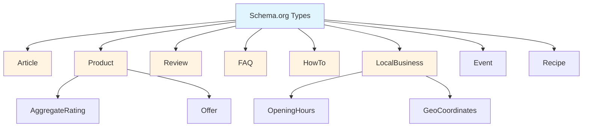
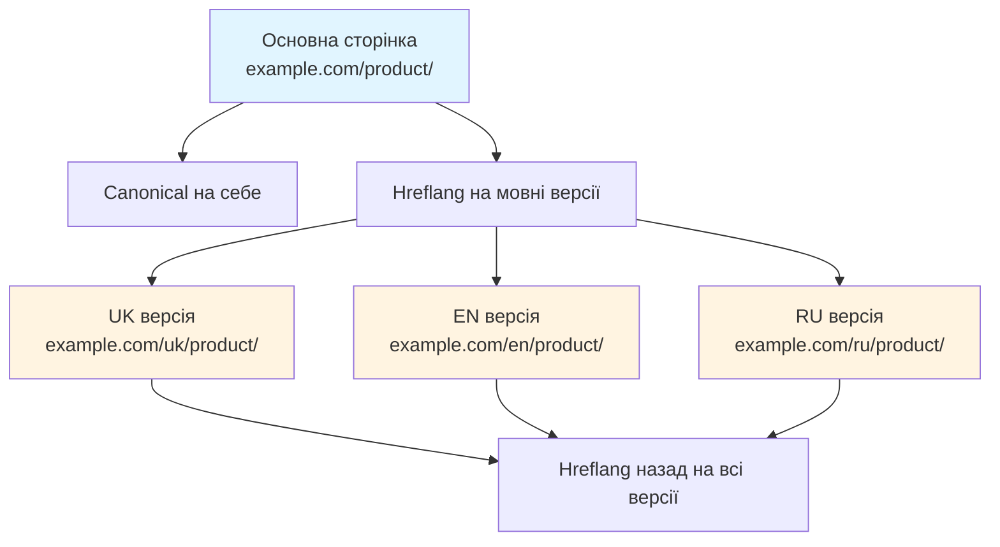

# Лекція 04: Schema.org та structured data

## Вступ

Structured data є одним із найпотужніших інструментів сучасного SEO, який дозволяє пошуковим системам глибше розуміти контент вебсторінок. Замість того, щоб покладатися лише на текстовий аналіз, structured data надає явні підказки про тип контенту, його властивості та взаємозв'язки.

Schema.org є найпопулярнішим словником для structured data, підтримуваним основними пошуковими системами: Google, Bing, Yahoo та Yandex. Правильна імплементація Schema.org може призвести до появи rich snippets у результатах пошуку, що значно підвищує видимість та CTR.

У цій лекції ми детально розглянемо, що таке structured data, як її імплементувати, які типи Schema.org найбільш корисні, а також додаткові елементи технічної оптимізації, такі як оптимізація зображень, canonical tags та hreflang.

## 1. Що таке structured data та навіщо потрібно

### Визначення structured data

Structured data — це стандартизований формат розмітки контенту вебсторінки, який допомагає пошуковим системам зрозуміти не лише текст, а й контекст та семантику інформації.

Без structured data пошукова система бачить вебсторінку як набір HTML-елементів та тексту. Їй потрібно використовувати складні алгоритми для визначення, що саме означає цей текст. Зі structured data ви явно вказуєте: це рецепт, це ціна товару, це рейтинг, це автор статті.

Аналогія: уявіть, що ви читаєте текст незнайомою мовою. Ви можете здогадатися про зміст з контексту, але якщо є переклад ключових слів — розуміння стає точнішим. Structured data є таким "перекладом" для пошукових систем.

### Навіщо потрібна structured data

Rich snippets. Розширені фрагменти в результатах пошуку з додатковою інформацією: зірками рейтингу, цінами, зображеннями, часом приготування рецепту.

Knowledge Graph. Інформація з вашого сайту може потрапити в Knowledge Panel Google.

Voice search optimization. Голосові асистенти використовують structured data для відповідей на запитання.

Краще розуміння контенту. Пошукові системи точніше визначають релевантність вашої сторінки запитам.

Підвищення CTR. Rich snippets привертають більше уваги та збільшують кількість кліків.

Конкурентна перевага. Якщо ваші конкуренти не використовують structured data, ви виділяєтесь у SERP.

### Статистика ефективності

Дослідження показують, що сторінки з rich snippets мають на 20-40% вищий CTR порівняно зі звичайними результатами. Для комерційних запитів з ціною та рейтингом підвищення може сягати 50-70%.

Однак важливо розуміти: structured data не є прямим фактором ранжування. Google неодноразово підтверджував, що наявність розмітки сама по собі не покращує позиції. Проте непрямий вплив через підвищення CTR та поліпшення користувацького досвіду може позитивно вплинути на ранжування.

### Історія та розвиток

Schema.org було запущено в 2011 році як спільний проєкт Google, Microsoft, Yahoo та Yandex. Мета — створити єдиний словник structured data замість множини несумісних форматів.

З того часу Schema.org значно розширився і тепер включає сотні типів об'єктів та тисячі властивостей. Словник постійно оновлюється, додаючи нові типи відповідно до еволюції вебу.

## 2. Формати: JSON-LD, Microdata, RDFa

Існує три основні формати для додавання structured data на вебсторінки: JSON-LD, Microdata та RDFa. Розглянемо кожен з них.

### JSON-LD (JavaScript Object Notation for Linked Data)

JSON-LD є рекомендованим Google форматом. Це окремий блок JavaScript-коду, який розміщується в секції head або body HTML-документа.

Переваги JSON-LD:

* Відділення від HTML. Розмітка не змішується з контентом, що спрощує підтримку.
* Простота додавання. Можна додати через Google Tag Manager без зміни HTML.
* Читабельність. Структура JSON легко читається та редагується.
* Гнучкість. Легко додавати декілька типів Schema на одній сторінці.

Приклад JSON-LD для статті:

```html
<script type="application/ld+json">
{
  "@context": "https://schema.org",
  "@type": "Article",
  "headline": "Повний гід з технічного SEO 2025",
  "author": {
    "@type": "Person",
    "name": "Іван Петренко"
  },
  "datePublished": "2025-02-01",
  "dateModified": "2025-02-01",
  "image": "https://example.com/images/tech-seo-guide.jpg",
  "publisher": {
    "@type": "Organization",
    "name": "SEO Blog",
    "logo": {
      "@type": "ImageObject",
      "url": "https://example.com/logo.png"
    }
  },
  "description": "Комплексний гід з технічного SEO: crawling, indexing, site speed optimization та багато іншого."
}
</script>
```

### Microdata

Microdata вбудовується безпосередньо в HTML-елементи за допомогою атрибутів itemscope, itemtype та itemprop.

Приклад Microdata для продукту:

```html
<div itemscope itemtype="https://schema.org/Product">
  <h1 itemprop="name">Apple iPhone 15 Pro</h1>
  
  <p itemprop="description">Найновіший флагман від Apple з титановим корпусом.</p>
  <div itemprop="offers" itemscope itemtype="https://schema.org/Offer">
    <span itemprop="price">45990</span>
    <span itemprop="priceCurrency">UAH</span>
    <link itemprop="availability" href="https://schema.org/InStock">В наявності
  </div>
</div>
```

Переваги Microdata:

* Безпосередній зв'язок з контентом. Розмітка знаходиться там, де візуальний контент.
* Відсутність дублювання. Не потрібно повторювати інформацію в окремому блоці.

Недоліки Microdata:

* Складність підтримки. Зміни в HTML можуть порушити розмітку.
* Захаращення коду. HTML стає менш читабельним.
* Складність з динамічним контентом.

### RDFa (Resource Description Framework in Attributes)

RDFa схожий на Microdata, але використовує інші атрибути: vocab, typeof, property.

Приклад RDFa:

```html
<div vocab="https://schema.org/" typeof="Event">
  <h1 property="name">Конференція з веб-розробки 2025</h1>
  <p property="description">Найбільша tech-конференція в Україні.</p>
  <time property="startDate" content="2025-05-15">15 травня 2025</time>
  <span property="location" typeof="Place">
    <span property="name">Київ Експо Плаза</span>
  </span>
</div>
```

RDFa менш популярний для SEO порівняно з JSON-LD та Microdata і рідко використовується на практиці.

### Порівняння форматів та рекомендації

| Критерій | JSON-LD | Microdata | RDFa |
|----------|---------|-----------|------|
| Рекомендація Google | Так | Підтримується | Підтримується |
| Простота додавання | Висока | Середня | Середня |
| Відділення від HTML | Так | Ні | Ні |
| Читабельність коду | Висока | Низька | Низька |
| Підтримка в GTM | Так | Ні | Ні |

Рекомендація: використовуйте JSON-LD як основний формат. Він найпростіший у підтримці, рекомендований Google та найгнучкіший.

## 3. Популярні типи Schema.org

Schema.org включає сотні типів, але для більшості вебсайтів достатньо знати декілька основних. Розглянемо найпопулярніші та найкорисніші типи.

### Article

Тип Article використовується для новин, статей блогу, дослідницьких публікацій. Він допомагає Google визначити автора, дату публікації, зображення та інші метадані статті.

Обов'язкові поля:

headline — заголовок статті.
image — зображення статті (array з мінімум однією URL).
datePublished — дата публікації в ISO 8601 форматі.
dateModified — дата останньої зміни.

Рекомендовані поля:

author — автор статті.
publisher — видавець.
description — короткий опис.

Повний приклад:

```html
<script type="application/ld+json">
{
  "@context": "https://schema.org",
  "@type": "Article",
  "headline": "10 трендів контент-маркетингу у 2025 році",
  "image": [
    "https://example.com/images/content-trends-2025.jpg",
    "https://example.com/images/content-trends-2025-wide.jpg"
  ],
  "datePublished": "2025-02-01T08:00:00+02:00",
  "dateModified": "2025-02-01T15:30:00+02:00",
  "author": {
    "@type": "Person",
    "name": "Олена Коваленко",
    "url": "https://example.com/authors/olena-kovalenko"
  },
  "publisher": {
    "@type": "Organization",
    "name": "Marketing Insights",
    "logo": {
      "@type": "ImageObject",
      "url": "https://example.com/logo.png",
      "width": 600,
      "height": 60
    }
  },
  "description": "Аналіз основних тенденцій контент-маркетингу: від AI-генерації до персоналізованого контенту.",
  "mainEntityOfPage": {
    "@type": "WebPage",
    "@id": "https://example.com/blog/content-trends-2025"
  }
}
</script>
```

Результат у Google: можливе відображення карусельних результатів Top Stories, відображення автора та дати публікації.

### Product

Тип Product використовується для товарів в інтернет-магазинах. Дозволяє відображати ціну, наявність, рейтинг безпосередньо в результатах пошуку.

Обов'язкові поля:

name — назва товару.
image — зображення товару.
offers — пропозиція з ціною та наявністю.

Рекомендовані поля:

description — опис товару.
brand — бренд.
aggregateRating — агрегований рейтинг з відгуків.
review — окремі відгуки.

Приклад Product з рейтингом:

```html
<script type="application/ld+json">
{
  "@context": "https://schema.org",
  "@type": "Product",
  "name": "Бездротові навушники Sony WH-1000XM5",
  "image": [
    "https://example.com/images/sony-wh1000xm5-black.jpg",
    "https://example.com/images/sony-wh1000xm5-silver.jpg"
  ],
  "description": "Преміальні бездротові навушники з активним шумозаглушенням та 30 годинами автономності.",
  "brand": {
    "@type": "Brand",
    "name": "Sony"
  },
  "offers": {
    "@type": "Offer",
    "url": "https://example.com/products/sony-wh1000xm5",
    "priceCurrency": "UAH",
    "price": "12990",
    "priceValidUntil": "2025-12-31",
    "availability": "https://schema.org/InStock",
    "seller": {
      "@type": "Organization",
      "name": "TechStore Ukraine"
    }
  },
  "aggregateRating": {
    "@type": "AggregateRating",
    "ratingValue": "4.7",
    "reviewCount": "127"
  },
  "review": {
    "@type": "Review",
    "reviewRating": {
      "@type": "Rating",
      "ratingValue": "5",
      "bestRating": "5"
    },
    "author": {
      "@type": "Person",
      "name": "Андрій Шевченко"
    },
    "reviewBody": "Чудові навушники з ідеальним шумозаглушенням. Музика звучить фантастично!"
  }
}
</script>
```

Результат: зірки рейтингу, ціна, наявність товару відображаються в SERP.

### Review та AggregateRating

Review дозволяє розмічати окремі відгуки, AggregateRating — загальний рейтинг на основі багатьох відгуків.

Важливо: Google має суворі правила щодо відгуків. Вони мають бути реальними, від справжніх користувачів. Фальшиві відгуки можуть призвести до manual action.

Приклад окремого Review:

```html
<script type="application/ld+json">
{
  "@context": "https://schema.org",
  "@type": "Review",
  "itemReviewed": {
    "@type": "Restaurant",
    "name": "Ресторан Солоха",
    "address": {
      "@type": "PostalAddress",
      "streetAddress": "вул. Хрещатик, 15",
      "addressLocality": "Київ",
      "postalCode": "01001",
      "addressCountry": "UA"
    }
  },
  "reviewRating": {
    "@type": "Rating",
    "ratingValue": "4",
    "bestRating": "5"
  },
  "author": {
    "@type": "Person",
    "name": "Марія Іванова"
  },
  "reviewBody": "Чудова українська кухня та атмосфера. Рекомендую вареники з вишнею!",
  "datePublished": "2025-01-28"
}
</script>
```

### FAQ (Frequently Asked Questions)

Тип FAQ дозволяє розмічати сторінки з питаннями та відповідями. Google може відображати їх як розгорнутий список безпосередньо в результатах пошуку.

Структура:

Кожне питання та відповідь є окремою сутністю в масиві mainEntity.

Приклад FAQ:

```html
<script type="application/ld+json">
{
  "@context": "https://schema.org",
  "@type": "FAQPage",
  "mainEntity": [{
    "@type": "Question",
    "name": "Що таке SEO?",
    "acceptedAnswer": {
      "@type": "Answer",
      "text": "SEO (Search Engine Optimization) — це комплекс заходів для покращення видимості вебсайту в результатах пошукових систем. Включає технічну оптимізацію, роботу з контентом та link building."
    }
  }, {
    "@type": "Question",
    "name": "Скільки часу потрібно для результатів SEO?",
    "acceptedAnswer": {
      "@type": "Answer",
      "text": "Перші результати SEO зазвичай помітні через 3-6 місяців регулярної роботи. Для конкурентних ніш термін може бути довшим. SEO — це довгострокова стратегія, а не швидке рішення."
    }
  }, {
    "@type": "Question",
    "name": "Чи потрібне SEO для невеликого бізнесу?",
    "acceptedAnswer": {
      "@type": "Answer",
      "text": "Так, SEO критично важливе для малого бізнесу. Локальне SEO допомагає клієнтам знайти ваш бізнес в Google Maps та локальних результатах пошуку. Це один із найефективніших каналів залучення клієнтів."
    }
  }]
}
</script>
```

Результат: Google може відображати accordion з питаннями та відповідями прямо в SERP.

Обмеження: не використовуйте FAQ для рекламних питань. Питання мають бути справжніми запитами користувачів.

### HowTo

Тип HowTo використовується для покрокових інструкцій. Google може відображати кроки у вигляді карусел�� або списку.

Структура:

Кожен крок має name, text та опціонально image чи video.

Приклад HowTo:

```html
<script type="application/ld+json">
{
  "@context": "https://schema.org",
  "@type": "HowTo",
  "name": "Як налаштувати Google Analytics 4",
  "description": "Покрокова інструкція з налаштування GA4 для вашого вебсайту",
  "image": "https://example.com/images/ga4-setup-guide.jpg",
  "totalTime": "PT30M",
  "estimatedCost": {
    "@type": "MonetaryAmount",
    "currency": "UAH",
    "value": "0"
  },
  "tool": {
    "@type": "HowToTool",
    "name": "Обліковий запис Google"
  },
  "step": [{
    "@type": "HowToStep",
    "name": "Створення GA4 Property",
    "text": "Увійдіть в Google Analytics, натисніть Admin, виберіть Create Property та оберіть GA4.",
    "image": "https://example.com/images/ga4-step1.jpg",
    "url": "https://example.com/guide/ga4-setup#step1"
  }, {
    "@type": "HowToStep",
    "name": "Встановлення tracking коду",
    "text": "Скопіюйте measurement ID з Admin > Data Streams та додайте gtag.js код на всі сторінки сайту.",
    "image": "https://example.com/images/ga4-step2.jpg",
    "url": "https://example.com/guide/ga4-setup#step2"
  }, {
    "@type": "HowToStep",
    "name": "Налаштування подій",
    "text": "В Events створіть custom події для відстеження конкретних дій користувачів на сайті.",
    "image": "https://example.com/images/ga4-step3.jpg",
    "url": "https://example.com/guide/ga4-setup#step3"
  }]
}
</script>
```

### LocalBusiness

Тип LocalBusiness критично важливий для бізнесів з фізичним розташуванням. Допомагає відображатися в Google Maps та локальному пакеті результатів.

Обов'язкові поля:

name — назва бізнесу.
address — адреса.
telephone — телефон.

Рекомендовані поля:

geo — геокоординати.
openingHoursSpecification — години роботи.
priceRange — діапазон цін.

Приклад LocalBusiness:

```html
<script type="application/ld+json">
{
  "@context": "https://schema.org",
  "@type": "Restaurant",
  "name": "Піцерія Наполі",
  "image": "https://example.com/napoli-restaurant.jpg",
  "address": {
    "@type": "PostalAddress",
    "streetAddress": "вул. Саксаганського, 45",
    "addressLocality": "Київ",
    "postalCode": "01033",
    "addressCountry": "UA"
  },
  "geo": {
    "@type": "GeoCoordinates",
    "latitude": "50.4392",
    "longitude": "30.5161"
  },
  "url": "https://napoli-pizza.ua",
  "telephone": "+380442345678",
  "servesCuisine": "Італійська кухня",
  "priceRange": "$$",
  "openingHoursSpecification": [{
    "@type": "OpeningHoursSpecification",
    "dayOfWeek": [
      "Monday",
      "Tuesday",
      "Wednesday",
      "Thursday",
      "Friday"
    ],
    "opens": "11:00",
    "closes": "23:00"
  }, {
    "@type": "OpeningHoursSpecification",
    "dayOfWeek": [
      "Saturday",
      "Sunday"
    ],
    "opens": "12:00",
    "closes": "00:00"
  }],
  "aggregateRating": {
    "@type": "AggregateRating",
    "ratingValue": "4.6",
    "reviewCount": "89"
  }
}
</script>
```

### Інші корисні типи Schema

BreadcrumbList — для навігаційних хлібних крихт.
Event — для подій, концертів, конференцій.
VideoObject — для відео контенту.
Recipe — для рецептів з часом приготування, калоріями, інгредієнтами.
JobPosting — для вакансій.
Course — для онлайн курсів та навчальних програм.



## 4. Інструменти валідації

Після додавання structured data критично важливо перевірити її коректність. Помилки в розмітці можуть призвести до того, що Google просто ігнорує її.

### Rich Results Test

Rich Results Test від Google перевіряє, чи може ваша сторінка відображатися як rich result в Google Search.

URL: https://search.google.com/test/rich-results

Як використовувати:

Введіть URL сторінки або вставте HTML код.

Інструмент покаже, які типи rich results виявлено.

Будуть показані помилки та попередження.

Можна переглянути попередній вигляд rich snippet.

Типи повідомлень:

Errors (червоні). Критичні помилки, що заважають індексації розмітки.

Warnings (жовті). Некритичні проблеми, рекомендації до виправлення.

Valid items (зелені). Коректно розмічені елементи.

Приклад помилки: "Missing field 'image'" для Article означає, що не вказано обов'язкове поле image.

### Schema Markup Validator

Schema.org Validator перевіряє синтаксичну коректність розмітки, але не специфічні вимоги Google.

URL: https://validator.schema.org/

Корисний для перевірки структури JSON-LD перед додаванням на сайт.

### Google Search Console

Google Search Console показує, як Google бачить вашу structured data після індексації.

Перейдіть в розділ Enhancements.

Там ви побачите секції для різних типів rich results: Articles, Products, FAQs, тощо.

GSC показує кількість валідних сторінок, сторінок з попередженнями та з помилками.

Можна запросити переіндексацію після виправлення помилок.

### Плагіни для CMS

Для популярних CMS існують плагіни, що автоматично додають structured data:

WordPress: Yoast SEO, Rank Math, Schema Pro.

Shopify: автоматична розмітка Product для товарів.

Wix: вбудована підтримка Schema.

Переваги плагінів: автоматизація, зменшення помилок.

Недоліки: менше контролю, можливі конфлікти між плагінами.

### Налагодження помилок

Типові помилки та їх вирішення:

"Missing required field". Додайте обов'язкове поле, згідно документації.

"Invalid URL". Переконайтеся, що URL абсолютні (включають https://).

"Invalid date format". Використовуйте ISO 8601 формат (2025-02-01T10:00:00+02:00).

"Mismatched structured data and page content". Дані в розмітці мають відповідати візуальному контенту.

## 5. Оптимізація зображень

Зображення є критично важливим елементом вебсторінок, але часто є основною причиною повільного завантаження. Правильна оптимізація зображень покращує швидкість сайту, що є фактором ранжування.

### Alt tags: доступність та SEO

Alt attribute (альтернативний текст) описує зміст зображення. Він виконує дві функції:

Доступність. Screen readers читають alt text для людей з порушеннями зору.

SEO. Пошукові системи використовують alt text для розуміння змісту зображення.

Синтаксис:

```html

```

Правила написання хорошого alt text:

Описовість. Описуйте, що зображено на картинці.

Стислість. 125 символів або менше.

Ключові слова природньо. Включайте релевантні ключові слова, але не stuffing.

Контекст. Alt має відповідати контексту навколо зображення.

Уникайте "зображення", "фото". Screen reader вже каже, що це зображення.

Приклади:

Погано: alt="IMG_1234"

Погано: alt="фото"

Погано: alt="купити ноутбук Dell XPS 13 ціна київ інтернет магазин"

Добре: alt="Dell XPS 13 ультрабук зі срібним корпусом"

Для декоративних зображень використовуйте порожній alt:

```html

```

### Розміри зображень

Кожне зображення має бути оптимізованого розміру для свого використання. Завантаження зображення 3000x2000px для відображення 300x200px марнує bandwidth та сповільнює сайт.

Рекомендації:

Створюйте кілька версій зображення для різних розмірів екранів.

Використовуйте responsive images з srcset.

Вказуйте width та height атрибути для запобігання layout shift.

Приклад responsive image:

```html

```

Пояснення:

srcset визначає доступні версії зображення.

sizes вказує браузеру, яку версію завантажити залежно від ширини екрану.

width та height запобігають CLS (Cumulative Layout Shift).

### Формати зображень

Різні формати мають різні переваги:

JPEG. Найпопулярніший для фотографій. Хороша компресія з втратами.

PNG. Підтримка прозорості, краще для графіки з чіткими краями.

WebP. Сучасний формат від Google. На 25-35% менший розмір при тій самій якості. Підтримується всіма сучасними браузерами.

AVIF. Новіший формат, ще краща компресія ніж WebP. Підтримка браузерів зростає.

SVG. Векторний формат для логотипів, іконок. Масштабується без втрати якості.

Рекомендована стратегія:

Використовуйте WebP як основний формат для фото.

Надавайте JPEG fallback для старих браузерів.

Використовуйте AVIF для критичних зображень де розмір критичний.

SVG для логотипів та іконок.

Приклад з picture element:

```html
<picture>
  <source srcset="image.avif" type="image/avif">
  <source srcset="image.webp" type="image/webp">
  
</picture>
```

Браузер спробує завантажити AVIF, якщо не підтримується — WebP, якщо ні — JPEG.

### Компресія зображень

Перед завантаженням на сайт зображення мають бути стиснуті. Існують інструменти для lossless та lossy компресії:

TinyPNG / TinyJPG. Онлайн сервіс для компресії PNG та JPEG.

ImageOptim. Десктоп додаток для Mac.

Squoosh. Веб-додаток від Google для компресії зображень.

Sharp. Node.js бібліотека для автоматизації.

Рекомендації:

Для фотографій використовуйте lossy компресію з якістю 75-85%.

Для графіки з текстом використовуйте lossless компресію.

Автоматизуйте компресію в build process.

### Lazy Loading

Lazy loading відкладає завантаження зображень, які знаходяться поза viewport, до моменту прокрутки до них.

HTML атрибут loading:

```html

```

Переваги:

Швидше початкове завантаження сторінки.

Економія bandwidth для користувачів.

Покращення LCP для зображень above the fold.

Важливо: не використовуйте lazy loading для зображень у першому екрані (above the fold), це уповільнить LCP.

### Структуровані дані для зображень

Додавання ImageObject structured data допомагає зображенням з'являтися в Google Images з додатковою інформацією.

Приклад:

```html
<script type="application/ld+json">
{
  "@context": "https://schema.org",
  "@type": "ImageObject",
  "contentUrl": "https://example.com/image.jpg",
  "license": "https://creativecommons.org/licenses/by/4.0/",
  "acquireLicensePage": "https://example.com/image-license",
  "creditText": "Фото: Іван Петренко",
  "creator": {
    "@type": "Person",
    "name": "Іван Петренко"
  },
  "copyrightNotice": "© 2025 Example Company"
}
</script>
```

## 6. Canonical tags та hreflang

### Canonical tags: управління дублікатами

Canonical tag вказує пошуковим системам, яка версія сторінки є основною (канонічною), коли існують дублікати або дуже схожі сторінки.

Синтаксис:

```html
<link rel="canonical" href="https://example.com/preferred-url/" />
```

### Випадки використання canonical

Параметри URL. Один товар доступний з різними параметрами сортування чи фільтрації.

```
https://example.com/products?sort=price
https://example.com/products?sort=name
https://example.com/products?color=red
```

Всі ці URL мають canonical на основну версію:

```html
<link rel="canonical" href="https://example.com/products/" />
```

HTTP vs HTTPS. Якщо сайт доступний через обидва протоколи.

```html
<link rel="canonical" href="https://example.com/page/" />
```

WWW vs non-WWW. Обираєте одну версію як канонічну.

Пагінація. Сторінки пагінації посилаються самі на себе як canonical.

```html
<!-- На сторінці /blog/page/2/ -->
<link rel="canonical" href="https://example.com/blog/page/2/" />
```

Синдикований контент. Якщо ваша стаття публікується на іншому сайті, вони можуть вказати canonical на ваш оригінал.

### Правила використання canonical

Абсолютні URL. Завжди використовуйте повні URL з протоколом.

Погано: /page/

Добре: https://example.com/page/

Один canonical на сторінку. Не додавайте декілька canonical tags.

Self-referencing canonical. Кожна сторінка може мати canonical на саму себе для запобігання параметричних дублікатів.

Консистентність. Canonical в HTML має відповідати canonical в HTTP заголовку якщо використовується.

### Hreflang для мультимовних сайтів

Hreflang вказує пошуковим системам, яка мовна або регіональна версія сторінки має показуватися користувачам з різних локацій.

Синтаксис:

```html
<link rel="alternate" hreflang="uk" href="https://example.com/uk/page/" />
<link rel="alternate" hreflang="en" href="https://example.com/en/page/" />
<link rel="alternate" hreflang="ru" href="https://example.com/ru/page/" />
<link rel="alternate" hreflang="x-default" href="https://example.com/en/page/" />
```

Пояснення:

uk, en, ru — ISO 639-1 коди мов.

x-default — версія за замовчуванням для користувачів з невизначеною мовою.

Hreflang може також включати регіон:

```html
<link rel="alternate" hreflang="en-US" href="https://example.com/us/" />
<link rel="alternate" hreflang="en-GB" href="https://example.com/uk/" />
```

### Типові помилки з hreflang

Відсутність зворотного посилання. Якщо сторінка A посилається на сторінку B через hreflang, сторінка B має посилатися на A.

Невірні коди мов. Використовуйте ISO 639-1 формат.

Відсутність x-default. Завжди додавайте версію за замовчуванням.

Hreflang на неіснуючі URL. Всі URL в hreflang мають повертати 200 OK.

### Перевірка hreflang

Google Search Console показує помилки hreflang в розділі International Targeting (у старій версії) або в загальних помилках індексації.

Інструменти перевірки:

Hreflang Tags Testing Tool від Aleyda Solis.
Screaming Frog SEO Spider може аудитувати hreflang.

### Взаємодія canonical та hreflang

Canonical та hreflang можуть використовуватися разом:

Hreflang вказує на альтернативні мовні версії.

Canonical вказує на основну версію в межах однієї мови.

Приклад:

Англійська версія товару має canonical на себе:

```html
<link rel="canonical" href="https://example.com/en/product/" />
<link rel="alternate" hreflang="uk" href="https://example.com/uk/product/" />
<link rel="alternate" hreflang="en" href="https://example.com/en/product/" />
```

Англійська версія з параметром має canonical на версію без параметра:

```html
<link rel="canonical" href="https://example.com/en/product/" />
```



## Висновки

Structured data та технічна оптимізація є потужними інструментами сучасного SEO. Правильна імплементація Schema.org через JSON-LD дозволяє пошуковим системам краще розуміти ваш контент та відображати його в rich results, що значно підвищує видимість та CTR.
