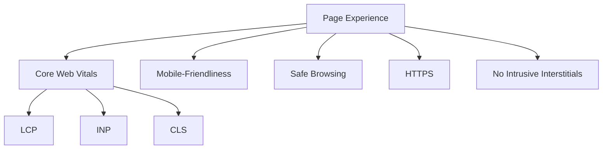
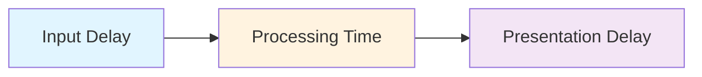
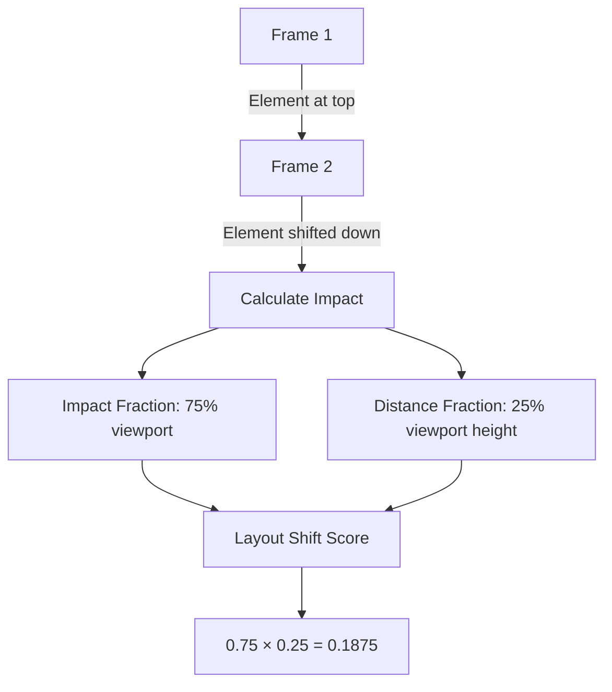

# Лекція 05 Core Web Vitals та продуктивність

## Вступ

Продуктивність вебсайту давно перестала бути лише технічною характеристикою — сьогодні це один із ключових факторів ранжування у пошукових системах. Google офіційно включив метрики швидкості завантаження до своїх алгоритмів, що робить оптимізацію продуктивності обов'язковою складовою будь-якої SEO-стратегії. У цій лекції ми детально розглянемо Core Web Vitals — набір метрик, які Google використовує для оцінки користувацького досвіду, а також інструменти вимірювання та методи оптимізації.

## 1. Що таке Core Web Vitals та чому це важливо для SEO

### 1.1. Історія та контекст

У травні 2020 року Google анонсував оновлення алгоритму ранжування, яке отримало назву Page Experience Update. Це оновлення офіційно включило користувацький досвід як фактор ранжування, причому центральну роль у ньому відіграють саме Core Web Vitals.

Core Web Vitals — це підмножина метрик Web Vitals, які Google вважає найбільш важливими для оцінки якості користувацького досвіду на вебсторінці. Ці метрики фокусуються на трьох аспектах взаємодії користувача зі сторінкою: швидкості завантаження, інтерактивності та візуальній стабільності.

### 1.2. Чому продуктивність впливає на SEO

Зв'язок між продуктивністю та SEO базується на кількох ключових факторах:

**Користувацький досвід.** Повільні сайти призводять до високого показника відмов (bounce rate). Дослідження Google показують, що ймовірність відмови зростає на 32% при збільшенні часу завантаження з 1 до 3 секунд, а при затримці до 5 секунд цей показник сягає 90%. Пошукові системи інтерпретують високий bounce rate як сигнал низької якості контенту.

**Мобільна оптимізація.** З введенням mobile-first indexing Google в першу чергу аналізує мобільну версію сайту. Мобільні користувачі особливо чутливі до швидкості завантаження через обмеження мобільних мереж та потужності пристроїв.

**Конкурентна перевага.** За умови рівності інших факторів (релевантність контенту, авторитетність домену, структура посилань) продуктивніший сайт матиме перевагу в ранжуванні. Google прагне надавати користувачам найкращий можливий досвід.

**Конверсії та бізнес-метрики.** Amazon підрахували, що кожні 100 мілісекунд затримки завантаження коштують їм 1% продажів. Walmart виявив, що покращення часу завантаження на 1 секунду збільшує конверсію на 2%.

### 1.3. Структура метрик Page Experience

Page Experience складається з кількох компонентів:



Кожен із цих компонентів вносить свій вклад у загальну оцінку користувацького досвіду, але саме Core Web Vitals є найбільш технічно складними та потребують детального розуміння.

## 2. LCP (Largest Contentful Paint)

### 2.1. Що таке LCP

Largest Contentful Paint вимірює час, за який найбільший видимий елемент контенту з'являється у viewport користувача. Це може бути зображення, відео або великий текстовий блок. LCP є важливим показником сприйнятої швидкості завантаження — момент, коли користувач бачить основний контент сторінки.

### 2.2. Які елементи враховуються в LCP

LCP розглядає наступні типи елементів:

- Елементи `` (включно з зображеннями всередині `<svg>`).
- Елементи `<image>` всередині SVG.
- Елементи `<video>` з атрибутом poster або першим кадром відео.
- Елементи з фоновим зображенням, завантаженим через CSS `url()`.
- Блокові елементи, що містять текстові вузли або інші текстові дочірні елементи.

Важливо розуміти, що браузер визначає LCP динамічно під час завантаження сторінки. Коли з'являється більший елемент, попередній LCP замінюється новим.

### 2.3. Пороги LCP

Google визначає наступні пороги для LCP:

- Добре (Good): 2.5 секунди або менше.
- Потребує покращення (Needs Improvement): від 2.5 до 4 секунд.
- Погано (Poor): понад 4 секунди.

Важливо розуміти, що Google оцінює LCP на рівні 75-го перцентиля всіх завантажень сторінки. Це означає, що принаймні 75% відвідувань мають досягати порогу "Good" для позитивної оцінки.

### 2.4. Як вимірювати LCP

Існує два основних підходи до вимірювання LCP:

**Лабораторні дані (Lab Data).** Вимірювання в контрольованому середовищі за допомогою інструментів як Lighthouse або PageSpeed Insights. Ці дані корисні для налагодження під час розробки.

**Польові дані (Field Data).** Реальні дані від користувачів, зібрані через Chrome User Experience Report (CrUX). Ці дані відображають фактичний досвід користувачів з різними пристроями та мережевими умовами.

Вимірювання LCP програмно можна здійснити через Performance Observer API:

```javascript
new PerformanceObserver((entryList) => {
  const entries = entryList.getEntries();
  const lastEntry = entries[entries.length - 1];

  console.log('LCP:', lastEntry.renderTime || lastEntry.loadTime);
  console.log('LCP element:', lastEntry.element);
}).observe({ type: 'largest-contentful-paint', buffered: true });
```

### 2.5. Як оптимізувати LCP

Оптимізація LCP базується на чотирьох основних напрямках:

**Оптимізація серверного часу відповіді.** Час до першого байта (TTFB) критично впливає на LCP. Рекомендації включають:

- Використання CDN для географічно розподіленої доставки контенту.
- Кешування HTML-відповідей на краю мережі (edge caching).
- Встановлення ранніх з'єднань до сторонніх джерел через `<link rel="preconnect">`.
- Мінімізація серверної обробки через оптимізацію баз даних та бекенд-логіки.

**Усунення ресурсів, що блокують рендеринг.** JavaScript та CSS можуть затримувати відображення контенту:

- Відкладене завантаження некритичного CSS через атрибут `media` або розділення на критичний та некритичний CSS.
- Використання `defer` або `async` для скриптів, які не потрібні для початкового рендерингу.
- Мінімізація та стиснення CSS і JavaScript файлів.

**Оптимізація ресурсів.** Зображення часто є LCP-елементом:

- Використання сучасних форматів зображень (WebP, AVIF) з fallback на JPEG/PNG.
- Responsive images через атрибут `srcset` для адаптації до розміру екрану.
- Compression без втрати якості через інструменти як ImageOptim або Squoosh.
- Пріоритизація завантаження LCP-зображення через `<link rel="preload">`:

```html
<link rel="preload" as="image" href="hero-image.webp"
      imagesrcset="hero-320.webp 320w, hero-640.webp 640w, hero-1280.webp 1280w"
      imagesizes="100vw">
```

**Оптимізація доставки контенту.** Використання сучасних технік завантаження:

- Server-Side Rendering (SSR) або Static Site Generation (SSG) для миттєвого відображення HTML.
- HTTP/2 або HTTP/3 для мультиплексування запитів.
- Brotli compression замість gzip для кращого стиснення текстових ресурсів.

Практичний приклад оптимізації LCP-зображення:

```html
<!-- До оптимізації -->


<!-- Після оптимізації -->
<link rel="preload" as="image" href="hero.webp"
      imagesrcset="hero-320.webp 320w, hero-640.webp 640w"
      imagesizes="(max-width: 640px) 100vw, 640px">

<picture>
  <source type="image/webp"
          srcset="hero-320.webp 320w, hero-640.webp 640w"
          sizes="(max-width: 640px) 100vw, 640px">
  <source type="image/jpeg"
          srcset="hero-320.jpg 320w, hero-640.jpg 640w"
          sizes="(max-width: 640px) 100vw, 640px">
  
</picture>
```

## 3. INP (Interaction to Next Paint)

### 3.1. Що таке INP та його відмінності від FID

У березні 2024 року Google замінив First Input Delay (FID) на Interaction to Next Paint (INP) як офіційну метрику Core Web Vitals. Це була важлива еволюція, оскільки FID мав суттєві обмеження.

First Input Delay вимірював лише затримку до обробки першої взаємодії користувача, ігноруючи час фактичної обробки та оновлення інтерфейсу. INP натомість враховує повний цикл взаємодії: від моменту дії користувача до моменту, коли браузер візуально відображає результат цієї дії.

INP оцінює всі взаємодії на сторінці (кліки, натискання клавіш, тап на сенсорних екранах) та звітує про найгіршу (або близьку до найгіршої) затримку. Це робить метрику більш репрезентативною для загального досвіду користувача.

### 3.2. Як вимірюється INP

INP складається з трьох фаз:



**Input Delay.** Час від моменту взаємодії користувача до початку виконання обробників подій (event handlers). Затримка виникає, коли основний потік зайнятий іншими завданнями.

**Processing Time.** Час виконання всіх синхронних обробників подій, пов'язаних з взаємодією.

**Presentation Delay.** Час, необхідний браузеру для розрахунку layout, paint та composite після завершення обробників подій.

### 3.3. Пороги INP

Google встановлює наступні пороги:

- Добре (Good): 200 мілісекунд або менше.
- Потребує покращення (Needs Improvement): від 200 до 500 мілісекунд.
- Погано (Poor): понад 500 мілісекунд.

### 3.4. Вимірювання INP

Вимірювання INP програмно через Event Timing API:

```javascript
new PerformanceObserver((list) => {
  for (const entry of list.getEntries()) {
    const duration = entry.processingStart - entry.startTime;
    const processingTime = entry.processingEnd - entry.processingStart;
    const presentationDelay = entry.duration - processingTime - duration;

    console.log('Total INP:', entry.duration);
    console.log('Input Delay:', duration);
    console.log('Processing Time:', processingTime);
    console.log('Presentation Delay:', presentationDelay);
  }
}).observe({ type: 'event', buffered: true, durationThreshold: 16 });
```

### 3.5. Best practices для оптимізації INP

**Розбиття довгих завдань.** JavaScript-завдання, що виконуються довше 50 мілісекунд, блокують основний потік:

```javascript
// Погано: блокує потік
function processLargeArray(items) {
  items.forEach(item => {
    heavyComputation(item);
  });
}

// Добре: розбиття на менші завдання
async function processLargeArray(items) {
  for (let i = 0; i < items.length; i++) {
    heavyComputation(items[i]);

    // Передача управління браузеру після кожного елемента
    if (i % 50 === 0) {
      await new Promise(resolve => setTimeout(resolve, 0));
    }
  }
}
```

**Оптимізація обробників подій.** Мінімізація роботи в event handlers:

```javascript
// Погано: важкі обчислення в обробнику
button.addEventListener('click', () => {
  const result = expensiveCalculation();
  updateUI(result);
});

// Добре: відкладене виконання
button.addEventListener('click', () => {
  requestIdleCallback(() => {
    const result = expensiveCalculation();
    updateUI(result);
  });
});
```

**Debouncing та throttling.** Обмеження частоти виконання обробників для подій як scroll або resize:

```javascript
function debounce(func, wait) {
  let timeout;
  return function executedFunction(...args) {
    clearTimeout(timeout);
    timeout = setTimeout(() => func(...args), wait);
  };
}

window.addEventListener('scroll', debounce(() => {
  // Виконується лише після припинення скролу
  updateScrollPosition();
}, 150));
```

**Web Workers для важких обчислень.** Переміщення складних операцій з основного потоку:

```javascript
// main.js
const worker = new Worker('worker.js');

button.addEventListener('click', () => {
  worker.postMessage({ data: largeDataset });
});

worker.onmessage = (e) => {
  updateUI(e.data.result);
};

// worker.js
self.onmessage = (e) => {
  const result = heavyComputation(e.data);
  self.postMessage({ result });
};
```

**Content Visibility для lazy rendering.** Використання CSS `content-visibility` для відкладеного рендерингу невидимого контенту:

```css
.off-screen-content {
  content-visibility: auto;
  contain-intrinsic-size: 0 500px;
}
```

## 4. CLS (Cumulative Layout Shift)

### 4.1. Що таке CLS

Cumulative Layout Shift вимірює візуальну стабільність сторінки — наскільки елементи зміщуються під час завантаження. Несподівані зміни layout створюють негативний користувацький досвід: користувач може випадково натиснути не на ту кнопку або втратити місце читання.

CLS є сумою всіх індивідуальних зсувів layout, що відбулися під час життєвого циклу сторінки.

### 4.2. Як розраховується CLS

Оцінка кожного зсуву розраховується за формулою:

```
Layout Shift Score = Impact Fraction × Distance Fraction
```

**Impact Fraction** — частка viewport, яку займають нестабільні елементи (елементи, що змінили позицію між двома кадрами).

**Distance Fraction** — максимальна відстань, на яку будь-який нестабільний елемент змістився (відносно розміру viewport).

Візуалізація розрахунку:



### 4.3. Пороги CLS

Рекомендовані значення:

- Добре (Good): 0.1 або менше.
- Потребує покращення (Needs Improvement): від 0.1 до 0.25.
- Погано (Poor): понад 0.25.

### 4.4. Вимірювання CLS

Програмне вимірювання через Layout Instability API:

```javascript
let clsScore = 0;

new PerformanceObserver((list) => {
  for (const entry of list.getEntries()) {
    if (!entry.hadRecentInput) {
      clsScore += entry.value;
      console.log('Current CLS:', clsScore);
      console.log('Affected elements:', entry.sources);
    }
  }
}).observe({ type: 'layout-shift', buffered: true });
```

### 4.5. Причини та усунення CLS

**Зображення без розмірів.** Найпоширеніша причина CLS:

```html
<!-- Погано: браузер не знає розмір до завантаження -->


<!-- Добре: явне вказання розмірів -->


<!-- Ще краще: responsive з aspect-ratio -->

```

**Динамічний контент та реклама.** Резервування простору для асинхронного контенту:

```css
.ad-container {
  min-height: 250px;
  background: #f0f0f0;
}

.dynamic-content {
  /* Резервування простору через aspect-ratio */
  aspect-ratio: 16 / 9;
  background: linear-gradient(90deg, #f0f0f0 25%, #e0e0e0 50%, #f0f0f0 75%);
}
```

**Веб-шрифти.** Використання `font-display` для контролю відображення тексту:

```css
@font-face {
  font-family: 'CustomFont';
  src: url('font.woff2') format('woff2');
  font-display: swap; /* або optional */
}
```

Значення `font-display`:

- `swap` — негайно показує fallback шрифт, замінює після завантаження (може викликати CLS).
- `optional` — використовує кастомний шрифт лише якщо він завантажився швидко, інакше залишає fallback (мінімізує CLS).

**Анімації та трансформації.** Використання CSS-властивостей, які не викликають reflow:

```css
/* Погано: викликає layout shift */
.element {
  transition: height 0.3s;
}

/* Добре: transform не впливає на layout */
.element {
  transition: transform 0.3s;
  transform: scaleY(1.5);
}
```

Безпечні для анімації властивості: `transform` та `opacity`.

**Інжекція контенту через JavaScript.** Додавання елементів без зміщення існуючого контенту:

```javascript
// Погано: вставка зверху зміщує контент вниз
document.body.insertBefore(newElement, document.body.firstChild);

// Добре: додавання в кінець або з абсолютним позиціонуванням
document.body.appendChild(newElement);

// Або резервування простору заздалегідь
const placeholder = document.getElementById('content-placeholder');
placeholder.replaceWith(actualContent);
```

## 5. Інструменти вимірювання Core Web Vitals

### 5.1. PageSpeed Insights

PageSpeed Insights (PSI) — безкоштовний інструмент Google, який комбінує лабораторні та польові дані.

**Переваги:**

- Інтеграція з CrUX для реальних даних користувачів.
- Детальні рекомендації щодо оптимізації.
- Окремі звіти для мобільних та десктопних версій.

**Використання:**

1. Відкрити https://pagespeed.web.dev/.
2. Ввести URL сторінки для аналізу.
3. Переглянути Core Web Vitals у секції "Field Data" (реальні дані) та "Lab Data" (симуляція).

**Інтерпретація результатів.** PSI надає оцінку від 0 до 100:

- 90-100: Добре (зелений).
- 50-89: Потребує покращення (помаранчевий).
- 0-49: Погано (червоний).

### 5.2. Lighthouse

Lighthouse — інструмент аудиту, вбудований у Chrome DevTools.

**Запуск аудиту:**

1. Відкрити Chrome DevTools (F12).
2. Перейти на вкладку "Lighthouse".
3. Вибрати категорії (Performance, Accessibility, Best Practices, SEO).
4. Натиснути "Analyze page load".

**Ключові метрики Lighthouse:**

- First Contentful Paint (FCP) — час до першого відображення контенту.
- Speed Index — наскільки швидко контент візуально заповнює сторінку.
- Time to Interactive (TTI) — час до повної інтерактивності.
- Total Blocking Time (TBT) — сума часу блокування основного потоку.

Lighthouse використовує симуляцію повільних з'єднань (4G) та пристроїв середнього рівня для об'єктивної оцінки.

### 5.3. Chrome User Experience Report (CrUX)

CrUX — публічний датасет реальних даних користувачів Chrome.

**Доступ до CrUX:**

- BigQuery — SQL-запити до повного датасету.
- CrUX API — програмний доступ до даних конкретного origin або URL.
- CrUX Dashboard — готовий дашборд у Data Studio.

Приклад запиту до CrUX API:

```bash
curl -X POST https://chromeuxreport.googleapis.com/v1/records:queryRecord \
  -H "Content-Type: application/json" \
  -d '{
    "origin": "https://example.com",
    "formFactor": "PHONE",
    "metrics": ["largest_contentful_paint", "cumulative_layout_shift"]
  }'
```

### 5.4. Search Console

Google Search Console інтегрує звіти Core Web Vitals у розділ "Experience":

- Відображення проблемних URL, згрупованих за типом проблеми.
- Розділення на мобільні та десктопні версії.
- Історичні дані для відстеження прогресу оптимізації.

Рекомендації роботи з Search Console:

1. Регулярно моніторити звіт "Core Web Vitals".
2. Пріоритизувати виправлення URL із статусом "Poor".
3. Використовувати "Validate Fix" після оптимізації для перевірки покращень.

### 5.5. Web Vitals Extension

Браузерне розширення від Google для Chrome, яке відображає Core Web Vitals у реальному часі під час перегляду сайту.

**Можливості:**

- Overlay з поточними значеннями LCP, INP, CLS.
- Історія метрик для поточної сесії.
- Console logging для детального аналізу.

Корисно для швидкого тестування під час розробки та налагодження.

## 6. Mobile-first indexing та responsive design

### 6.1. Що таке mobile-first indexing

У березні 2021 року Google повністю перейшов на mobile-first indexing для всіх сайтів. Це означає, що індексування та ранжування базуються виключно на мобільній версії контенту, навіть для десктопних пошукових запитів.

**Наслідки для SEO:**

- Мобільна версія повинна містити весь ключовий контент з десктопної версії.
- Structured data має бути присутня як на мобільній, так і на десктопній версії.
- Metadata (title, description) повинні бути ідентичними.
- Зображення повинні бути доступні та оптимізовані для мобільних пристроїв.

### 6.2. Перевірка готовності до mobile-first indexing

**Google Search Console.** Розділ "Mobile Usability" показує проблеми:

- Текст занадто малий для читання.
- Кнопки розташовані занадто близько одна до одної.
- Контент ширший за екран.
- Viewport не налаштований.

**Mobile-Friendly Test.** Інструмент Google для перевірки мобільної сумісності окремих URL: https://search.google.com/test/mobile-friendly.

**Chrome DevTools Device Mode.** Симуляція різних мобільних пристроїв для тестування responsive design.

### 6.3. Responsive design best practices

**Viewport meta tag.** Обов'язковий тег для адаптивного дизайну:

```html
<meta name="viewport" content="width=device-width, initial-scale=1">
```

**Fluid layouts.** Використання відносних одиниць замість фіксованих:

```css
/* Погано */
.container {
  width: 1200px;
}

/* Добре */
.container {
  width: 100%;
  max-width: 1200px;
  padding: 0 1rem;
}
```

**Responsive images.** Адаптація зображень до розміру екрану:

```html

```

**Media queries.** Breakpoints для різних розмірів екранів:

```css
/* Mobile-first підхід */
.content {
  font-size: 16px;
}

@media (min-width: 768px) {
  .content {
    font-size: 18px;
  }
}

@media (min-width: 1024px) {
  .content {
    font-size: 20px;
  }
}
```

**Touch targets.** Мінімальний розмір інтерактивних елементів для touch-пристроїв:

```css
button, a {
  min-height: 48px;
  min-width: 48px;
  padding: 12px 16px;
}
```

Google рекомендує мінімум 48×48 пікселів для touch targets з відстанню принаймні 8 пікселів між ними.

### 6.4. Тестування продуктивності на мобільних пристроях

**Remote Debugging.** Підключення реального мобільного пристрою до Chrome DevTools:

1. Увімкнути режим розробника на Android-пристрої.
2. Підключити пристрій через USB.
3. Відкрити `chrome://inspect` у десктопному Chrome.
4. Інспектувати вкладки мобільного браузера.

**Throttling.** Симуляція повільних мережевих умов у DevTools:

- Network: Fast 3G, Slow 3G, Offline.
- CPU: 4× slowdown, 6× slowdown.

**WebPageTest.** Тестування з реальних мобільних пристроїв у різних географічних локаціях: https://www.webpagetest.org/.

## 7. Практичні рекомендації та чек-лист оптимізації

### 7.1. Аудит продуктивності

Систематичний підхід до виявлення проблем:

1. Запустити PageSpeed Insights для ключових сторінок сайту.
2. Ідентифікувати метрики зі статусом "Poor" або "Needs Improvement".
3. Проаналізувати конкретні рекомендації для кожної метрики.
4. Перевірити Search Console для масштабу проблем на рівні сайту.
5. Використати Lighthouse для детального аналізу завантаження.

### 7.2. Пріоритизація оптимізацій

**Вплив vs зусилля.** Матриця для визначення пріоритетів:

- Високий вплив, низькі зусилля: оптимізація зображень, встановлення розмірів елементів.
- Високий вплив, високі зусилля: міграція на CDN, імплементація SSR.
- Низький вплив, низькі зусилля: мінімізація CSS/JS, видалення невикористаного коду.
- Низький вплив, високі зусилля: повна переробка архітектури (розглядати лише для критичних випадків).

### 7.3. Чек-лист оптимізації

**LCP оптимізація:**

- [ ] Зображення LCP-елемента використовує WebP або AVIF.
- [ ] Встановлено `<link rel="preload">` для критичних ресурсів.
- [ ] TTFB менше 600 мілісекунд.
- [ ] Використовується CDN для статичних ресурсів.
- [ ] Видалено render-blocking CSS та JavaScript.

**INP оптимізація:**

- [ ] Немає JavaScript-завдань довше 50 мілісекунд.
- [ ] Event handlers мінімізовані та оптимізовані.
- [ ] Використовуються Web Workers для важких обчислень.
- [ ] Застосовано debouncing/throttling для частих подій.

**CLS оптимізація:**

- [ ] Всі зображення мають явно вказані розміри або aspect-ratio.
- [ ] Зарезервовано простір для реклами та embed-контенту.
- [ ] Використовується `font-display: optional` або `font-display: swap`.
- [ ] Анімації використовують `transform` та `opacity` замість layout-властивостей.

**Mobile optimization:**

- [ ] Налаштовано viewport meta tag.
- [ ] Розмір touch targets принаймні 48×48 пікселів.
- [ ] Контент не виходить за межі viewport.
- [ ] Тестування на реальних мобільних пристроях.

### 7.4. Моніторинг та регресії

**Автоматизація моніторингу.** Налаштування регулярних перевірок:

- Lighthouse CI для перевірки кожного деплою.
- Synthetic monitoring через WebPageTest або SpeedCurve.
- Real User Monitoring (RUM) через інструменти як Cloudflare Web Analytics або New Relic.

**Встановлення бюджетів продуктивності.** Визначення максимально допустимих значень:

```json
{
  "budgets": [
    {
      "resourceSizes": [
        { "resourceType": "script", "budget": 300 },
        { "resourceType": "image", "budget": 500 },
        { "resourceType": "total", "budget": 1000 }
      ],
      "timings": [
        { "metric": "interactive", "budget": 3000 },
        { "metric": "first-contentful-paint", "budget": 1500 }
      ]
    }
  ]
}
```

Бюджети дозволяють запобігти регресіям продуктивності на етапі розробки.

## Висновки

Core Web Vitals стали невід'ємною частиною SEO-стратегії, трансформуючи продуктивність із технічної характеристики на ключовий фактор успіху. Оптимізація LCP, INP та CLS вимагає системного підходу, який охоплює як технічні аспекти (оптимізація серверу, мережі, коду), так і дизайнерські рішення (responsive layout, візуальна стабільність).

Важливо розуміти, що Core Web Vitals — це не разова оптимізація, а постійний процес моніторингу та покращення. Регулярне відстеження метрик через PageSpeed Insights, Search Console та RUM-інструменти дозволяє виявляти проблеми на ранніх стадіях та підтримувати високий рівень користувацького досвіду.

З переходом Google на mobile-first indexing оптимізація для мобільних пристроїв стала критичною. Responsive design, адаптивні зображення та оптимізація touch-взаємодій повинні бути пріоритетом для кожного вебсайту.

Інвестиції в продуктивність приносять вимірні результати: зниження bounce rate, підвищення часу на сайті, покращення конверсій та, врешті-решт, кращі позиції в пошуковій видачі. У конкурентному цифровому середовищі продуктивність може стати вирішальним фактором успіху.
