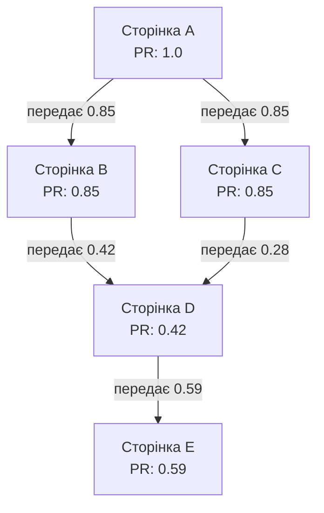
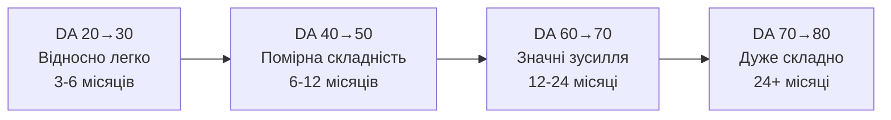
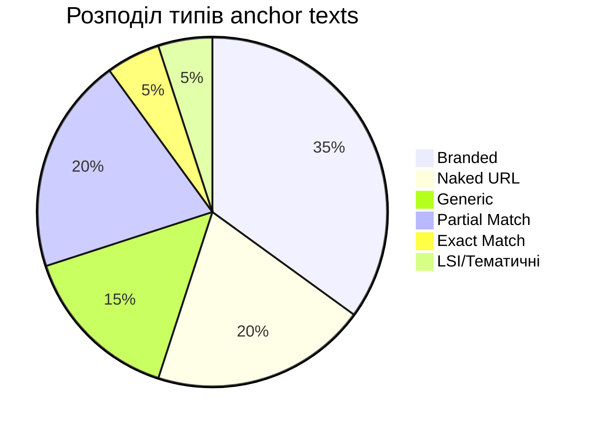

# Лекція 07 Link building та off-page SEO

## Вступ

Off-page SEO є критично важливою складовою успішної стратегії пошукової оптимізації, яка виходить за межі технічних налаштувань та контенту безпосередньо на вашому вебсайті. Якщо on-page оптимізація визначає те, що ви говорите про себе, то off-page SEO демонструє, що інші говорять про вас. Центральним елементом цієї діяльності є побудова зовнішніх посилань, які пошукові системи інтерпретують як сигнали довіри, авторитетності та релевантності вашого ресурсу.

У цій лекції ми детально розглянемо фундаментальні концепції, що лежать в основі link building, вивчимо алгоритмічні принципи оцінювання посилань та дослідимо практичні стратегії отримання якісних backlinks у сучасному цифровому середовищі.

## Концепція PageRank та link equity

### Історичні передумови та еволюція PageRank

PageRank є алгоритмом ранжування вебсторінок, розробленим Ларрі Пейджем та Сергієм Бріном у 1996 році в Стенфордському університеті. Цей алгоритм став революційним підходом до оцінки важливості вебсторінок і заклав основу для створення пошукової системи Google.

Основна ідея PageRank полягає у тому, що важливість сторінки визначається не лише кількістю посилань на неї, а й важливістю сторінок, з яких ці посилання походять. Це створює рекурсивну систему оцінювання, де авторитетність передається через посилання подібно до того, як наукові цитування підвищують значущість академічних робіт.

### Математична модель PageRank

Базова формула PageRank виражається таким чином:

```
PR(A) = (1-d) + d × (PR(T1)/C(T1) + PR(T2)/C(T2) + ... + PR(Tn)/C(Tn))
```

Де компоненти формули мають наступне значення:

- PR(A) — PageRank сторінки A, який ми обчислюємо.
- d — damping factor, коефіцієнт затухання, зазвичай встановлений на рівні 0.85. Цей параметр моделює ймовірність того, що користувач продовжить переходити за посиланнями, а не почне новий пошук.
- PR(Ti) — PageRank кожної сторінки Ti, яка посилається на сторінку A.
- C(Ti) — кількість вихідних посилань на сторінці Ti.
- (1-d) — базова ймовірність, яка гарантує, що навіть ізольовані сторінки отримують мінімальний рейтинг.

Ця формула демонструє ключовий принцип: посилання з авторитетної сторінки передає більше "ваги" ніж посилання з менш авторитетної, при цьому ця вага розподіляється між усіма вихідними посиланнями пропорційно.

### Візуалізація розподілу PageRank



Діаграма ілюструє, як PageRank передається через мережу посилань. Сторінка A має найвищий рейтинг і розподіляє його між сторінками B та C. Сторінка D отримує PageRank від двох джерел, що збільшує її сумарний рейтинг.

### Сучасна інтерпретація PageRank

Хоча Google офіційно припинив публічне оновлення показника PageRank у 2016 році, сам алгоритм продовжує функціонувати як один із сотень сигналів ранжування. Сучасні варіації алгоритму враховують додаткові фактори:

Тематична релевантність посилань отримала критичне значення. Посилання з сайтів тієї ж тематичної ніші мають більшу вагу, ніж посилання з нерелевантних джерел. Наприклад, для медичного вебсайту посилання з авторитетного медичного журналу матиме значно більший вплив, ніж посилання з блогу про садівництво.

Свіжість посилань також впливає на їхню цінність. Нові посилання зазвичай мають більшу вагу, ніж старі, оскільки вони свідчать про актуальну релевантність та активність ресурсу. Це пояснює, чому постійне отримання нових якісних посилань є важливішим за одноразову масову кампанію.

Поведінкові фактори користувачів тепер також враховуються. Якщо користувачі активно переходять за посиланням і взаємодіють з цільовою сторінкою, це посилання отримує додаткову вагу в очах пошукової системи.

### Концепція link equity та її розподіл

Link equity, часто називана "link juice", представляє собою цінність або авторитетність, що передається через посилання від однієї сторінки до іншої. Розуміння механізмів розподілу цієї цінності є критично важливим для ефективної внутрішньої та зовнішньої оптимізації.

Коли сторінка має кілька вихідних посилань, link equity розподіляється між ними. Якщо сторінка з PageRank 1.0 має 10 посилань, кожне з них теоретично передає приблизно 0.085 одиниць (враховуючи damping factor 0.85). Тому концентрація link equity на меншій кількості стратегічно важливих посилань може бути ефективнішою.

Атрибути посилань також впливають на передачу link equity. Посилання з атрибутом rel="nofollow" традиційно не передавали PageRank, хоча з 2019 року Google розглядає цей атрибут як підказку, а не абсолютну директиву. Атрибути rel="sponsored" та rel="ugc" дозволяють більш точно категоризувати типи посилань.

## Domain Authority та Page Authority: метрики третіх сторін

### Природа та походження метрик авторитетності

Domain Authority та Page Authority є пропрієтарними метриками, розробленими компанією Moz для оцінки потенціалу вебсайту або окремої сторінки займати високі позиції в результатах пошуку. Важливо розуміти, що ці показники не є офіційними метриками Google і не використовуються безпосередньо в алгоритмах ранжування пошукової системи.

Domain Authority оцінює загальну силу домену за шкалою від 1 до 100, враховуючи множину факторів, включаючи кількість і якість зовнішніх посилань, що вказують на домен. Page Authority використовує подібну методологію, але оцінює окрему сторінку, а не весь домен.

### Методологія обчислення

Moz використовує алгоритм машинного навчання, який аналізує мільйони пошукових запитів та результатів ранжування, намагаючись знайти кореляцію між характеристиками вебсайтів та їхніми позиціями в SERP. Основні фактори включають:

Профіль зовнішніх посилань аналізується з точки зору кількості унікальних доменів, що посилаються на ресурс. Різноманітність джерел посилань є важливішою за абсолютну кількість посилань з одного домену.

Якість посилаючих доменів оцінюється рекурсивно. Посилання з доменів, що самі мають високий DA, передають більше авторитетності. Це створює ієрархічну систему, подібну до PageRank.

Структура внутрішніх посилань впливає на розподіл авторитетності всередині вебсайту. Добре організована архітектура посилань дозволяє ефективно розподіляти link equity на стратегічно важливі сторінки.

### Логарифмічна природа шкали

Шкала Domain Authority є логарифмічною, що означає суттєву різницю в складності підвищення показника на різних рівнях. Збільшити DA з 20 до 30 відносно просто і може зайняти кілька місяців активної роботи. Проте підвищення з 70 до 80 вимагає експоненційно більше зусиль, часу та ресурсів.



### Альтернативні метрики авторитетності

Крім Moz, інші платформи розробили власні метрики:

Ahrefs використовує Domain Rating та URL Rating, які обчислюються на основі власного індексу посилань Ahrefs. Ці метрики фокусуються виключно на профілі посилань, не враховуючи інші фактори.

Majestic пропонує Trust Flow та Citation Flow. Trust Flow вимірює якість посилань на основі відстані від насіннєвого набору довірених сайтів, тоді як Citation Flow оцінює кількісний аспект посилань.

Semrush розробив Authority Score, який комбінує дані про посилання з органічним пошуковим трафіком та поведінковими метриками.

### Практичне застосування метрик

Незважаючи на те, що ці метрики не є офіційними сигналами ранжування Google, вони залишаються корисними інструментами для:

Порівняльного аналізу конкурентів, що дозволяє швидко оцінити відносну силу посилань різних доменів у вашій ніші. Якщо топ-10 конкурентів мають DA понад 60, а ваш сайт має DA 35, це індикатор необхідності посиленої роботи над профілем посилань.

Оцінювання потенційних партнерів для link building. Метрики авторитетності допомагають швидко фільтрувати можливості, ідентифікуючи сайти, посилання з яких матимуть найбільшу цінність.

Моніторингу прогресу власної стратегії link building. Хоча короткострокові коливання є нормальними, довгострокова тенденція зростання DA та PA свідчить про ефективність ваших зусиль.

## Типи зовнішніх посилань та їхня цінність

### Класифікація за атрибутами: dofollow та nofollow

Фундаментальна відмінність між типами посилань визначається HTML-атрибутами, які інструктують пошукові системи щодо обробки цих посилань.

Dofollow посилання є стандартним типом посилань, які не містять обмежуючих атрибутів. Вони передають link equity та PageRank від джерела до цільової сторінки, сигналізуючи пошуковим системам про рекомендацію або схвалення контенту. Синтаксис такого посилання виглядає просто:

```html
<a href="https://example.com/page">Текст анкора</a>
```

Nofollow посилання містять атрибут rel="nofollow", який історично інструктував пошукові роботи не переходити за посиланням і не передавати link equity:

```html
<a href="https://example.com/page" rel="nofollow">Текст анкора</a>
```

Проте з вересня 2019 року Google змінив інтерпретацію nofollow з директиви на підказку. Це означає, що пошукова система може вирішити врахувати таке посилання для цілей ранжування, особливо якщо воно має високу релевантність та контекстуальну цінність.

### Розширена таксономія атрибутів посилань

Google запровадив додаткові атрибути для більш детальної класифікації посилань:

Атрибут rel="sponsored" призначений для позначення посилань, розміщених на комерційній основі, включаючи рекламу та спонсорований контент:

```html
<a href="https://example.com/product" rel="sponsored">Спонсорований продукт</a>
```

Атрибут rel="ugc" означає user-generated content і використовується для посилань у коментарях, форумах та інших формах контенту, створеного користувачами:

```html
<a href="https://example.com/article" rel="ugc">Корисна стаття</a>
```

Ці атрибути можуть комбінуватися для точнішої класифікації:

```html
<a href="https://example.com" rel="nofollow ugc">Посилання у коментарі</a>
```

### Якість versus кількість: парадигмальний зсув

Еволюція алгоритмів Google демонструє чіткий зсув від кількісних до якісних показників посилань. У ранні роки SEO кількість посилань була домінуючим фактором, що призвело до масового поширення маніпулятивних практик, таких як link farms та автоматизовані мережі посилань.

Оновлення алгоритму Penguin у 2012 році радикально змінило ландшафт link building. Google почав активно штрафувати сайти з неприродніми профілями посилань, характерними ознаками яких були:

Надмірна кількість посилань з низькоякісних або нерелевантних джерел створює червоний прапорець для алгоритмів виявлення спаму. Сайти з тисячами посилань з каталогів, коментарів або footer-посилань піддаються ретельному аналізу.

Однорідність anchor texts, особливо з точним входженням комерційних ключових слів, сигналізує про штучність профілю. Природні посилання мають різноманітні формулювання анкорів.

Відсутність контекстуальної релевантності між посилаючою та цільовою сторінками знижує цінність посилання. Посилання з кулінарного блогу на сайт юридичних послуг виглядає підозріло.

### Характеристики високоякісних посилань

Якісні посилання мають кілька ключових атрибутів, які відрізняють їх від посилань низької якості:

Редакційна природа посилання означає, що воно було розміщене вебмайстром або автором контенту за власним рішенням, а не куплене або обмінене. Такі посилання зазвичай знаходяться в основному контенті сторінки, а не в футері чи сайдбарі.

Контекстуальна інтеграція передбачає, що посилання природно вписується в навколишній текст, доповнюючи його та надаючи додаткову цінність читачеві. Посилання має логічне обґрунтування для свого існування.

Авторитетність джерела визначається через множину сигналів: тривалість існування домену, історію контенту, метрики посилань, соціальні сигнали та репутацію в галузі.

Тематична релевантність забезпечує відповідність між нішею посилаючого сайту та цільового контенту. Посилання з авторитетного блогу про цифровий маркетинг на статтю про SEO має вищу цінність, ніж посилання з загального новинного сайту.

## Профіль природних посилань

### Анатомія органічного профілю посилань

Природний профіль посилань характеризується різноманітністю та збалансованістю, відображаючи те, як реальні люди та вебсайти природно посилаються на якісний контент. Розуміння цих характеристик є критичним для розробки стратегії link building, яка не викличе санкцій з боку пошукових систем.

### Різноманітність типів anchor texts

Anchor text, або текст посилання, є одним з найсильніших сигналів релевантності для пошукових систем, проте неправильне використання може призвести до штрафів. Природний профіль демонструє широку варіативність:

Branded anchors використовують назву бренду або домену:

```html
<a href="https://example.com">Example Company</a>
<a href="https://example.com">example.com</a>
```

Ці анкори складають зазвичай 30-40% природного профілю посилань та є найбезпечнішими з точки зору over-optimization.

Naked URL anchors представляють собою просто URL без обгортання в описовий текст:

```html
<a href="https://example.com/guide">https://example.com/guide</a>
```

Вони зазвичай складають 15-25% профілю і часто з'являються в коментарях, форумах та інформаційних згадках.

Generic anchors використовують загальні фрази, що не несуть специфічної ключової інформації:

```html
<a href="https://example.com/article">клікніть тут</a>
<a href="https://example.com/page">читати далі</a>
<a href="https://example.com/guide">дізнатися більше</a>
```

Такі анкори становлять 10-20% природного профілю і часто використовуються для покращення читабельності контенту.

Partial match anchors містять ключові слова разом з додатковими словами:

```html
<a href="https://example.com/seo-guide">докладний гайд з SEO оптимізації</a>
```

Вони забезпечують релевантність без надмірної оптимізації і повинні складати 15-25% профілю.

Exact match anchors точно відповідають цільовому ключовому запиту:

```html
<a href="https://example.com/buy-shoes">купити взуття</a>
```

Ці анкори найбільш ризиковані з точки зору over-optimization і повинні становити не більше 5-10% профілю, особливо для комерційних запитів.

LSI та тематичні варіації використовують синоніми та пов'язані терміни:

```html
<a href="https://example.com/seo-services">послуги пошукової оптимізації</a>
```

### Розподіл anchor texts у здоровому профілі



### Різноманітність джерел посилань

Природний профіль посилань походить з множини різнотипних джерел, що відображає органічне поширення контенту:

Редакційні посилання з блогів та медіа представляють високоякісні згадки від журналістів, блогерів та контент-криейторів. Ці посилання зазвичай контекстуальні, мають високу релевантність та рідко можуть бути отримані через пряму комерційну угоду.

Соціальні медіа, хоча більшість посилань з цих платформ є nofollow, все ще відіграють роль у загальному профілі та можуть генерувати опосередковані SEO-переваги через трафік та видимість.

Форуми та спільноти, де посилання розміщуються в контексті відповідей на питання або обговорень, додають природності профілю, навіть якщо вони часто мають атрибут ugc.

Бізнес-директорії та листинги, особливо галузеві та географічні, забезпечують фундаментальні посилання для локального SEO та загального профілю авторитетності.

Освітні та урядові домени з доменами .edu та .gov традиційно розглядаються як особливо авторитетні джерела, хоча отримання таких посилань вимагає створення контенту виняткової якості.

### Темпоральні характеристики профілю

Природний ріст посилань демонструє певні темпоральні патерни:

Поступове зростання з часом відображає органічне виявлення та поширення контенту. Раптові сплески посилань можуть свідчити про маніпуляції, якщо вони не пов'язані з віральним контентом або PR-кампаніями.

Сезонні коливання можуть бути природними для певних індустрій. Наприклад, сайт про податкове планування може природно отримувати більше посилань у січні-квітні.

Втрата посилань також є природною частиною екосистеми вебу. Сайти закриваються, контент видаляється, посилання змінюються. Профіль, де ніколи не втрачаються посилання, може виглядати підозріло.

## Стратегії link building

### Guest posting: створення цінності через контент

Guest blogging залишається однією з найефективніших стратегій white-hat link building, якщо виконується з фокусом на якість та релевантність, а не на масштаб.

Ідентифікація відповідних можливостей починається з пошуку вебсайтів у вашій ніші, які приймають гостьові публікації. Пошукові оператори можуть допомогти:

```
"ключове слово вашої ніші" + "написати для нас"
"ключове слово вашої ніші" + "гостьовий пост"
"ключове слово вашої ніші" + "прийняти гостьові статті"
```

Оцінка якості потенційних платформ має включати аналіз їхнього Domain Authority, релевантності аудиторії, стандартів контенту та редакційних вимог. Ідеальна платформа має активну аудиторію в вашій цільовій ніші та репутацію публікації якісного контенту.

Створення виняткового контенту є критичним фактором успіху. Гостьові пости повинні надавати значну цінність аудиторії платформи, часто перевершуючи за якістю стандартні публікації. Включення оригінальних досліджень, експертних інсайтів або унікальних кейс-стадіз підвищує шанси прийняття.

Стратегічне розміщення посилань має бути природним та контекстуальним. Одне-два релевантних посилання в тілі статті мають більшу цінність, ніж десяток посилань в авторській біографії. Посилання повинні додавати цінність для читача, а не просто служити SEO-цілям.

### Digital PR: заробляння посилань через новинну цінність

Digital PR трансформує традиційні PR-практики для цифрового середовища, фокусуючись на отриманні редакційних посилань через створення новинно-цінного контенту.

Newsjacking передбачає створення контенту, що швидко реагує на актуальні новини або тренди в індустрії. Коли відбувається значна подія, швидка публікація експертного коментаря або аналізу може привернути увагу журналістів, що шукають джерела для своїх матеріалів.

Дослідження та дані є потужним інструментом для digital PR. Проведення оригінальних досліджень, опитувань або аналізу даних створює цитовані ресурси, на які природно посилаються журналісти та блогери. Наприклад, щорічний звіт про стан індустрії може генерувати десятки якісних посилань.

Інфографіки та візуалізації даних особливо ефективні для digital PR, оскільки вони легко споживаються та поширюються. Якісна інфографіка може бути перепублікована на множині сайтів з посиланням на оригінальне джерело.

### Broken link building: надання рішення для вебмайстрів

Ця стратегія полягає в знаходженні неробочих посилань на авторитетних сайтах та пропонуванні вашого контенту як альтернативи.

Процес ідентифікації починається з використання інструментів, таких як Ahrefs Site Explorer або Check My Links розширення для Chrome, щоб знайти битті посилання на релевантних вебсайтах у вашій ніші.

Створення відповідного контенту передбачає розробку ресурсу, який відповідає або перевершує контент, на який раніше вказувало неробоче посилання. Це може вимагати створення нового контенту спеціально для цієї можливості.

Outreach має бути ввічливим та корисним, інформуючи вебмайстра про неробоче посилання та пропонуючи ваш контент як альтернативу без агресивного просування. Шаблон повідомлення може виглядати так:

```
Тема: Знайшов неробоче посилання на [URL сторінки]

Привіт [Ім'я],

Під час дослідження матеріалів з [тема] я натрапив на вашу статтю
"[назва]". Це чудовий ресурс для [аудиторія]!

Я помітив, що посилання на [тема неробочого посилання] веде на 404
сторінку. Здається, сайт більше не існує.

Я нещодавно опублікував [тип контенту] з [тема], який охоплює
подібні аспекти. Можливо, це може бути корисним для ваших читачів:
[URL]

У будь-якому випадку, дякую за чудовий контент!

[Ваше ім'я]
```

### HARO: позиціонування як експерт

Help A Reporter Out є платформою, що з'єднує журналістів, які шукають експертів для своїх матеріалів, з фахівцями, готовими надати коментарі.

Реєстрація як джерела на HARO.com дозволяє отримувати щоденні email-дайджести з запитами від журналістів. Кожен запит описує тему статті та тип експертизи, який потрібен.

Відбір релевантних запитів вимагає фокусування на темах, де ви маєте справжню експертизу та цінні інсайти. Відповіді на нерелевантні запити марнують час і можуть зашкодити репутації.

Створення цінних відповідей має включати конкретні приклади, дані або унікальні перспективи, що виділяють вашу відповідь серед десятків інших. Швидкість також має значення, оскільки журналісти часто працюють з тайт дедлайнами.

Результатом успішної HARO-кампанії можуть бути посилання з високоавторитетних медіа-ресурсів, які важко отримати іншими способами. Навіть одне посилання з Forbes, Entrepreneur або галузевої публікації може мати значний вплив на профіль посилань.

## Висновки

Off-page SEO та link building залишаються критично важливими компонентами комплексної стратегії пошукової оптимізації, незважаючи на еволюцію алгоритмів Google та зростання значення інших факторів ранжування.

Сучасний підхід до link building має базуватися на принципах створення справжньої цінності, автентичності відносин та довгострокової перспективи. Маніпулятивні тактики не лише ризиковані з точки зору потенційних санкцій, але й неефективні в довгостроковій перспективі порівняно зі стратегіями, що фокусуються на заробленні посилань через якісний контент та digital PR.

Розуміння фундаментальних принципів PageRank та link equity дозволяє приймати обґрунтовані рішення про пріоритизацію можливостей link building. Метрики третіх сторін, такі як Domain Authority, хоча і не є офіційними сигналами Google, надають корисні орієнтири для порівняльного аналізу та стратегічного планування.

Природність профілю посилань має бути основним орієнтиром при плануванні та виконанні link building кампаній. Різноманітність джерел, типів анкорів та темпоральних патернів відображає органічне зростання авторитетності вебсайту та мінімізує ризики алгоритмічних штрафів.
