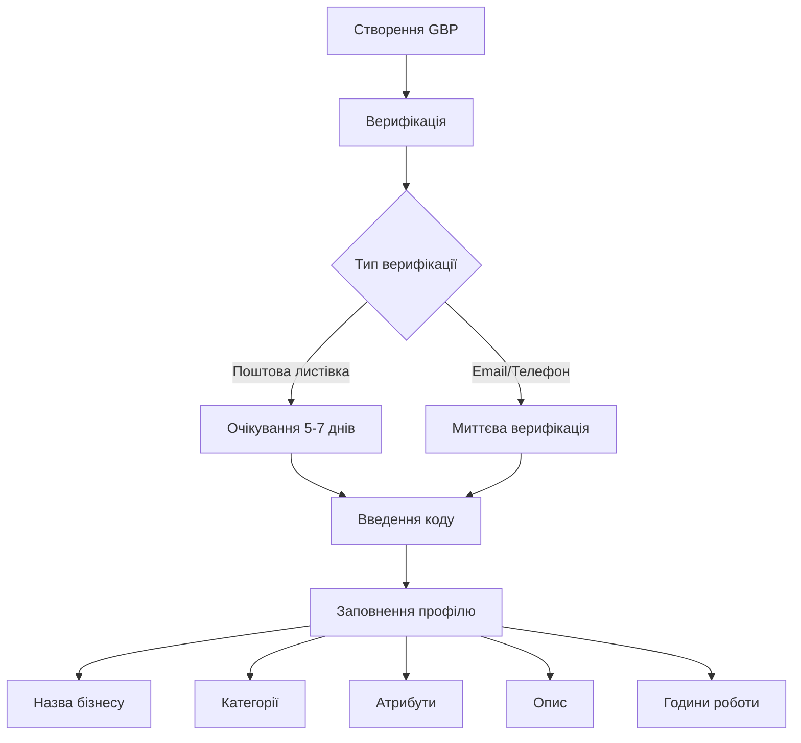

# Лекція 08 Локальне SEO та токсичні посилання

## Вступ

Локальна пошукова оптимізація представляє собою спеціалізований напрямок SEO, що фокусується на підвищенні видимості бізнесу в географічно-релевантних пошукових запитах. У часи, коли значна частина пошуків здійснюється з мобільних пристроїв з наміром знайти найближчі товари або послуги, локальне SEO стало критично важливим для бізнесів, що мають фізичну присутність або обслуговують конкретні географічні регіони.

Паралельно з побудовою позитивного профілю посилань, сучасні SEO-фахівці мають також займатися захистом від негативних факторів, таких як токсичні посилання та атаки negative SEO. Ця лекція охоплює як проактивні стратегії локального SEO, так і захисні механізми проти шкідливих практик конкурентів.

## Локальне SEO: оптимізація Google Business Profile

### Еволюція локального пошуку Google

Локальний пошук пройшов значну еволюцію від простих географічних модифікаторів у пошукових запитах до складних систем, що враховують локацію користувача, контекст запиту та множину сигналів релевантності. Google My Business трансформувався у Google Business Profile, інтегруючись глибше в екосистему Google Maps та Search.

Алгоритм локального ранжування Google базується на трьох фундаментальних факторах: релевантність, відстань та prominence (видатність, авторитетність). Релевантність визначає, наскільки бізнес відповідає пошуковому запиту користувача. Відстань враховує фізичну близькість бізнесу до локації користувача або до локації, вказаної в запиті. Prominence оцінює загальну відомість та авторитетність бізнесу на основі інформації з вебу, відгуків, посилань та інших факторів.

### Створення та оптимізація Google Business Profile

Процес створення профілю бізнесу починається з верифікації права на управління локацією. Google надсилає поштову листівку з кодом верифікації на фізичну адресу бізнесу, хоча для деяких категорій доступна миттєва верифікація через електронну пошту або телефон.

Після верифікації критично важливо заповнити всі можливі поля профілю з максимальною точністю та детальністю:

Назва бізнесу має точно відповідати офіційній назві компанії без додавання ключових слів або географічних модифікаторів. Google активно штрафує профілі з keyword-stuffed назвами типу "Пекарня Київ найкращі торти центр міста". Правильна назва просто "Пекарня Смачний Хліб".

Категорія бізнесу є одним з найважливіших сигналів релевантності. Основна категорія має максимально точно описувати основну діяльність бізнесу. Google дозволяє додати до 9 додаткових категорій для бізнесів з диверсифікованими послугами, проте варто обирати лише справді релевантні категорії.

Опис бізнесу надає можливість використати до 750 символів для детального пояснення того, чим займається компанія, що її відрізняє та які послуги надає. Цей текст має бути написаний для людей, а не для пошукових систем, природно включаючи релевантні ключові слова без over-optimization.



### Атрибути та спеціальні функції

Google Business Profile пропонує численні атрибути, специфічні для різних категорій бізнесу. Ресторани можуть вказати особливості, такі як наявність Wi-Fi, прийняття кредитних карток, доступність для людей з обмеженими можливостями. Готелі можуть додати інформацію про зручності, політику щодо домашніх тварин, наявність басейну.

Функція Products дозволяє локальним бізнесам демонструвати товари безпосередньо в Google Search та Maps. Кожен продукт може мати назву, опис, ціну та зображення, створюючи мікро-каталог всередині профілю.

Services надає можливість детально описати послуги з індивідуальними цінами або ціновими діапазонами. Для сервісних бізнесів це критично важлива функція, що підвищує прозорість та довіру потенційних клієнтів.

Регулярні Posts дозволяють ділитися оновленнями, акціями, подіями та новинами. Ці пости з'являються безпосередньо в результатах пошуку та на Google Maps, забезпечуючи додатковий канал комунікації з потенційними клієнтами. Posts мають обмежений термін активності, тому регулярність публікацій є важливою.

### Візуальний контент: фотографії та відео

Профілі з якісними зображеннями отримують значно більше взаємодій та конверсій порівняно з профілями без візуального контенту. Google надає детальні рекомендації щодо оптимальних характеристик зображень:

Логотип має бути квадратним з мінімальним розміром 250×250 пікселів, рекомендовано 720×720 пікселів. Формат файлу JPG або PNG.

Cover photo має бути горизонтальним з рекомендованими розмірами 1024×576 пікселів, співвідношення сторін 16:9.

Додаткові фотографії мають демонструвати різні аспекти бізнесу: екстер'єр будівлі, інтер'єр приміщення, команду, продукти, процес роботи. Мінімальний розмір 720×720 пікселів для квадратних або 720×540 для горизонтальних.

Відео стають все більш впливовими для локального SEO. 30-секундний тур бізнесом або демонстрація процесу створення продукту може значно підвищити engagement та довіру. Рекомендована тривалість 30 секунд, максимальна 30 секунд для cover video та до 75 секунд для додаткових відео.

## NAP consistency: фундамент локального SEO

### Концепція NAP та її критичність

NAP є абревіатурою для Name, Address, Phone number — трьох базових елементів інформації про бізнес, консистентність яких через весь веб є критичним фактором локального ранжування.

Google використовує NAP-дані для ідентифікації та верифікації легітимності бізнесу. Коли пошукова система знаходить однакову інформацію про бізнес на множині незалежних джерел, це підвищує довіру до автентичності компанії. Навпаки, розбіжності в NAP можуть створювати плутанину, знижувати довіру та негативно впливати на ранжування.

### Стандартизація NAP-форматування

Назва бізнесу має використовуватися в точно однаковій формі всюди. Варіації, навіть незначні, можуть створювати проблеми:

```
Правильно (консистентно):
- ТОВ "Технологічні Рішення"
- ТОВ "Технологічні Рішення"
- ТОВ "Технологічні Рішення"

Неправильно (інконсистентно):
- ТОВ "Технологічні Рішення"
- Технологічні Рішення
- ТОВ Технологічні Рішення
- Tech Solutions LLC (англійська варіація)
```

Адреса вимагає особливої уваги до деталей форматування:

```
Консистентний формат:
вул. Хрещатик, 22, офіс 5, Київ, 01001, Україна

Уникати варіацій:
Хрещатик 22, оф. 5
вулиця Хрещатик, буд. 22
Khreshchatyk St, 22
```

Номер телефону має включати міжнародний код та форматуватися однаково:

```
Рекомендований формат:
+380 44 123 4567

Уникати:
044 123 4567
(044) 123-45-67
+38 (044) 123 4567
```

### Аудит та виправлення NAP inconsistencies

Процес забезпечення консистентності починається з аудиту існуючих citations:

Інвентаризація всіх локацій, де згадується ваш бізнес, включає Google Business Profile, Facebook, інші соціальні мережі, бізнес-директорії, галузеві каталоги, локальні листинги, review-платформи.

Створення стандартизованого шаблону NAP, який буде використовуватися як еталон для всіх майбутніх citations та для виправлення існуючих.

Систематичне оновлення інформації на всіх платформах, починаючи з найбільш авторитетних та видимих джерел, таких як Google, Facebook, основні директорії.

Моніторинг нових citations через Google Alerts або спеціалізовані інструменти, такі як Moz Local або BrightLocal, щоб швидко виявляти та виправляти нові інконсистентності.

## Локальні citations та directories

### Типологія citations

Citations можна класифікувати за кількома параметрами, що визначають їхню цінність та застосування:

Structured citations містять NAP-інформацію в стандартизованому форматі всередині бізнес-директорій або каталогів. Приклади включають listings у Google Business Profile, Yelp, Yellow Pages, галузевих каталогах.

Unstructured citations представляють згадки бізнесу в контексті контенту без формалізованої структури. Це можуть бути згадки в новинних статтях, блог-постах, press releases, де NAP-інформація природно інтегрована в текст.

General citations знаходяться в загальних бізнес-директоріях, доступних для всіх типів бізнесів незалежно від індустрії або локації.

Industry-specific citations розміщуються в каталогах, специфічних для певної галузі. Для ресторану це можуть бути TripAdvisor, OpenTable, Zomato. Для медичного закладу — спеціалізовані медичні директорії.

Local citations фокусуються на географічно-специфічних платформах, таких як регіональні торгові палати, локальні новинні сайти, міські довідники.

### Пріоритизація citations

Не всі citations мають однакову цінність. Стратегічний підхід передбачає фокусування на найбільш впливових платформах:

Tier 1 citations включають основні платформи з максимальним впливом: Google Business Profile, Facebook, Apple Maps, Bing Places. Ці платформи є абсолютними пріоритетами і мають бути заповнені повністю та точно.

Tier 2 citations охоплюють популярні загальні директорії та основні галузеві платформи: Yelp, Foursquare, YellowPages, основні галузеві каталоги для вашої індустрії.

Tier 3 citations включають менш впливові загальні каталоги та нішеві галузеві платформи, локальні бізнес-асоціації, регіональні директорії.

### Процес побудови citation-стратегії

Дослідження конкурентів надає інсайти щодо того, де ваші конкуренти мають listings. Інструменти, такі як BrightLocal або Whitespark, можуть автоматизувати виявлення citations конкурентів.

Створення базового набору universal citations забезпечує фундамент присутності у найбільш авторитетних та релевантних джерелах незалежно від специфіки бізнесу.

Розширення через галузево-специфічні та локальні citations дозволяє охопити більш цільову аудиторію та демонструє глибину присутності в екосистемі індустрії та регіону.

Регулярний моніторинг та підтримка citations включає перевірку точності інформації, оновлення при змінах, видалення duplicate listings.

## Reviews management та вплив на rankings

### Роль відгуків у локальному SEO

Відгуки користувачів стали одним з найбільш впливових факторів локального ранжування. Google офіційно підтверджує, що кількість, якість, швидкість отримання та різноманітність відгуків впливають на позиції в локальних результатах пошуку.

Кількість відгуків корелює з видимістю в локальному пакеті. Бізнеси з більшою кількістю відгуків зазвичай мають кращі позиції, хоча це не абсолютне правило. Важливіше мати постійний потік нових відгуків, ніж одноразово зібрати велику кількість.

Середній рейтинг впливає як на ранжування, так і на конверсію. Дослідження показують, що бізнеси з рейтингом 4.5+ зірок мають значно вищі показники кліків та конверсій порівняно з бізнесами з рейтингом нижче 4.0.

Свіжість відгуків сигналізує про активність та поточну релевантність бізнесу. Профіль, що отримує регулярні відгуки, виглядає більш активним та надійним порівняно з профілем, де всі відгуки залишені кілька років тому.

Різноманітність платформ також має значення. Хоча Google Reviews є найбільш критичними для Google Search ранжування, відгуки на інших платформах, таких як Facebook, Yelp, галузевих сайтах, також враховуються та додають довіри.

### Етична стратегія генерації відгуків

Google категорично забороняє купівлю відгуків, incentivized reviews за винагороду або залишання fake reviews. Порушення цих правил може призвести до suspension профілю та втрати всіх відгуків.

Легітимні методи генерації відгуків включають:

Пряме прохання після позитивного досвіду є найпростішим та найефективнішим методом. Коли клієнт виражає задоволення продуктом або послугою, персонал може ввічливо попросити залишити відгук.

Email follow-up після транзакції дозволяє автоматизувати процес. Через 2-3 дні після покупки або завершення послуги клієнт отримує email з подякою та запрошенням поділитися досвідом, якщо він був позитивним.

QR-коди в фізичних локаціях надають зручний спосіб для клієнтів залишити відгук безпосередньо на місці. Розміщення QR-кодів біля каси, на чеках, в зоні очікування знижує friction.

SMS-запрошення можуть бути ефективними для бізнесів, що збирають номери телефонів клієнтів. Коротке повідомлення з прямим посиланням на форму відгуку має вищу ймовірність отримання відповіді.

### Управління негативними відгуками

Негативні відгуки неминучі для будь-якого бізнесу, проте правильне управління ними може перетворити їх на можливості демонстрації відмінного обслуговування.

Швидкість відповіді є критичною. Відповідь на негативний відгук протягом 24 годин демонструє уважність та турботу про клієнтський досвід. Затримки можуть посилити незадоволення та створити враження байдужості.

Тон відповіді має бути професійним, емпатичним та рішуче-орієнтованим:

```
Приклад відповіді на негативний відгук:

"Дякуємо за відгук та за те, що звернули нашу увагу на цю проблему.
Нам дуже прикро чути про ваш досвід, оскільки це не відповідає
стандартам обслуговування, які ми прагнемо надавати.

Ми хотіли б краще зрозуміти ситуацію та знайти рішення. Будь ласка,
зв'яжіться з нами безпосередньо за [контакт], щоб ми могли це обговорити
та виправити.

З повагою,
[Ім'я], [Посада]"
```

Публічна відповідь має зберігати приватність деталей та переводити розмову в приватний канал для вирішення специфічних проблем.

Внутрішній аналіз негативних відгуків може виявити системні проблеми, що потребують уваги. Регулярний моніторинг патернів у скаргах дозволяє проактивно покращувати слабкі місця.

### Відповіді на позитивні відгуки

Хоча це часто ігнорується, відповіді на позитивні відгуки також важливі для демонстрації вдячності та побудови відносин:

```
Приклад відповіді на позитивний відгук:

"Дякуємо за теплі слова! Нам дуже приємно знати, що ви залишилися
задоволені [специфічний аспект, згаданий у відгуку].

Ми з нетерпінням чекаємо можливості обслужити вас знову!

З найкращими побажаннями,
[Ім'я команди]"
```

Персоналізовані відповіді, що згадують специфічні деталі з відгуку, створюють більш автентичне враження порівняно з generic шаблонами.

## Токсичні backlinks: ідентифікація та мітигація

### Природа токсичних посилань

Токсичні посилання є backlinks, що потенційно можуть завдати шкоди SEO-профілю вебсайту через порушення Google Webmaster Guidelines або асоціацію з низькоякісними або spam-ресурсами.

Категорії токсичних посилань включають:

* Посилання з PBN (Private Blog Networks) — мереж вебсайтів, створених виключно для маніпуляції ранжуванням через посилання. Ці мережі зазвичай мають взаємопов'язану структуру посилань, подібні IP-адреси та низькоякісний контент.
* Spam-коментарі на блогах та форумах, де посилання розміщуються автоматизовано або масово без релевантного контексту. Ці посилання часто мають commercial anchor texts та не надають жодної цінності для читачів.
* Посилання з дорвеїв та spam-сайтів, які існують лише для розміщення посилань або перенаправлення трафіку. Ці сайти часто мають тонкий або автоматично генерований контент.
* Footer та sidebar посилання, розміщені на множині сторінок сайту в обмін на плату або взаємні посилання. Google розглядає такі site-wide посилання як маніпулятивні.
* Посилання з нерелевантних або підозрілих сайтів для дорослих, ігрових ресурсів, особливо якщо ваш бізнес не має відношення до цих індустрій.

### Інструменти ідентифікації токсичних посилань

Google Search Console надає базову інформацію про backlinks у розділі Links. Хоча GSC не класифікує посилання як токсичні, він дозволяє побачити, які сайти посилаються на ваш ресурс.

Ahrefs Site Explorer пропонує metrics Spam Score та Domain Rating для швидкої оцінки якості посилаючих доменів. Високий Spam Score часто корелює з токсичністю.

Semrush Backlink Audit Tool автоматично категоризує посилання за рівнем токсичності, використовуючи власний алгоритм оцінювання множини факторів.

Moz Link Explorer надає Spam Score для кожного посилаючого домену, допомагаючи ідентифікувати потенційно проблемні посилання.

### Критерії мануальної оцінки посилань

Автоматичні інструменти корисні, проте мануальний аудит залишається важливим для точної оцінки:

Релевантність джерела має бути першим критерієм. Посилання з сайту про садівництво на фінансовий вебсайт виглядає підозріло, якщо немає логічного контекстуального зв'язку.

Якість контенту на посилаючій сторінці індикує загальну якість ресурсу. Сторінки з автоматично генерованим текстом, множиною помилок, тонким контентом є червоними прапорцями.

Anchor text distribution має бути природною. Якщо 80% посилань мають exact match commercial anchors, це сигналізує про маніпуляцію.

Контекст розміщення посилання важливий. Посилання в основному контенті мають більшу цінність та легітимність порівняно з посиланнями в footer, sidebar або коментарях.

Загальна екосистема сайту може виявити PBN або spam-мережі. Множина сайтів з подібним дизайном, структурою, тематикою, що посилаються на ваш сайт, можуть бути частиною маніпулятивної схеми.

## Disavow file: коли та як використовувати

### Концепція дезавуювання посилань

Google Disavow Links Tool дозволяє вебмайстрам інструктувати Google ігнорувати певні посилання при оцінюванні сайту. Цей інструмент був створений у відповідь на проблеми negative SEO та для надання можливості вебмайстрам "очищати" профілі посилань після минулих порушень.

Проте використання disavow має бути останнім ресурсом, а не рутинною практикою. Google неодноразово підкреслював, що їхні алгоритми зазвичай ефективно ігнорують spam-посилання без необхідності мануального втручання.

### Ситуації, коли disavow є доцільним

Manual action penalty від Google за unnatural links є найбільш очевидним випадком, коли disavow необхідний. Якщо ви отримали повідомлення в Google Search Console про manual action, disavow токсичних посилань стає частиною процесу reconsideration request.

Negative SEO attack, де конкуренти масово створюють токсичні посилання на ваш сайт, може вимагати використання disavow. Якщо ви помічаєте раптовий сплеск низькоякісних посилань, особливо з adult, gambling або pharmaceutical тематик, це може бути атакою.

Legacy issues з минулого, коли сайт використовував маніпулятивні практики link building, можуть залишити токсичний слід. Під час ребрендингу або зміни SEO-стратегії може бути доцільно очистити профіль.

### Створення disavow файлу

Disavow file є простим текстовим файлом з розширенням .txt, що містить список URL або доменів для дезавуювання.

Синтаксис файлу підтримує два формати:

Дезавуювання конкретного URL:
```
http://spam-site.com/page-with-link.html
```

Дезавуювання цілого домену (включаючи всі субдомени):
```
domain:spam-site.com
```

Коментарі можуть додаватися для документації, використовуючи символ #:
```
# Spam коментарі від 15.01.2024
domain:spammy-blog.com

# PBN мережа виявлена 20.01.2024
domain:pbn-network1.com
domain:pbn-network2.com
```

### Процес submission та очікування результатів

Завантаження disavow file здійснюється через Google Search Console в інструменті Disavow Links під розділом Security & Manual Actions.

Після submission Google починає обробляти файл під час наступних crawl cycles та переоцінки профілю посилань. Процес не є миттєвим і може займати кілька тижнів або навіть місяців для повного ефекту.

Моніторинг результатів має включати відстеження органічного трафіку, позицій ключових запитів та будь-яких змін у повідомленнях Search Console.

Оновлення disavow file можливе в будь-який час. Новий файл повністю заміняє попередній, тому важливо зберігати комплексний список всіх дезавуйованих посилань.

## Negative SEO: захист та протидія

### Форми negative SEO атак

Negative SEO представляє собою маліційні практики, спрямовані на шкоду SEO-профілю конкурента. Хоча Google намагається мінімізувати ефективність таких атак, вони залишаються реальною загрозою.

Link-based attacks включають масове створення токсичних посилань на цільовий сайт з надією викликати алгоритмічний або мануальний штраф. Атакуючі можуть використовувати автоматизовані інструменти для створення тисяч spam-посилань з adult-сайтів, коментарів, каталогів низької якості.

Content scraping полягає в копіюванні контенту з цільового сайту та масовій публікації на множині інших доменів, створюючи duplicate content issues. Якщо scraped контент індексується швидше за оригінал, Google може помилково ідентифікувати original site як джерело дублікатів.

Fake negative reviews на Google Business Profile, Yelp та інших платформах можуть шкодити репутації та локальному ранжуванню.

Hacking та malware injection на сайт конкурента може призвести до blacklisting в пошукових системах та повного deindexing.

DDoS attacks можуть зробити сайт недоступним для пошукових роботів, що призводить до проблем з crawling та потенційно до втрати позицій.

### Проактивні захисні заходи

Регулярний моніторинг backlink profile через Ahrefs, Semrush або Moz дозволяє швидко виявляти підозрілі сплески посилань. Налаштування alerts для нових посилань забезпечує оперативне виявлення атак.

Моніторинг brand mentions через Google Alerts, Brand24 або Mention допомагає виявляти несанкціоноване використання вашого контенту або бренду.

Регулярні security audits та використання security plugins, таких як Wordfence або Sucuri для WordPress сайтів, захищають від hacking attempts.

Налаштування Google Search Console alerts забезпечує швидке повідомлення про security issues, manual actions або проблеми з індексацією.

### Реагування на атаки

Документування атаки з screenshots, датами та деталями забезпечує доказову базу для потенційних reconsideration requests або скарг до Google.

Контакт з вебмайстрами spam-сайтів для видалення посилань є першим кроком, хоча зазвичай неефективним для справжніх negative SEO кампаній.

Використання Disavow Tool стає необхідним, якщо кількість токсичних посилань значна та не може бути видалена через outreach.

DMCA complaints можуть використовуватися для scraped content через Google's DMCA complaint process для деіндексації дублікатів.

Посилення загального профілю через позитивні SEO-практики, якісний контент, legitimate link building допомагає пом'якшити вплив negative attacks через збільшення загальної авторитетності.

## Висновки

Локальне SEO та захист від negative factors представляють собою критично важливі, проте часто недооцінені аспекти комплексної стратегії пошукової оптимізації.

Для бізнесів з фізичною присутністю або географічно-таргетованими послугами оптимізація Google Business Profile, забезпечення NAP consistency, побудова якісних citations та активне управління відгуками можуть драматично впливати на видимість у локальних результатах пошуку та, відповідно, на потік клієнтів.

Паралельно з побудовою позитивного SEO-профілю, сучасні оптимізатори мають також розуміти та бути готовими протидіяти негативним факторам, таким як токсичні посилання та negative SEO attacks. Проактивний моніторинг, розуміння інструментів захисту та здорове скептичне ставлення до підозрілих активностей у профілі посилань є необхідними навичками.

Важливо пам'ятати, що як локальне SEO, так і захист від negative factors є довгостроковими процесами, що вимагають постійної уваги, регулярного моніторингу та адаптації до змін в алгоритмах та конкурентному ландшафті.
