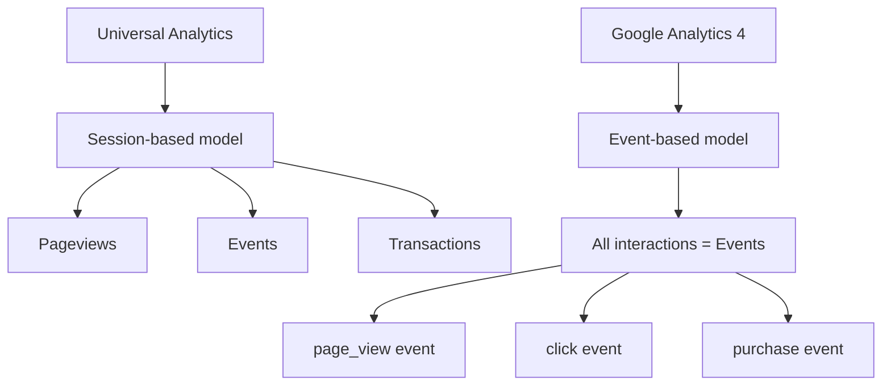
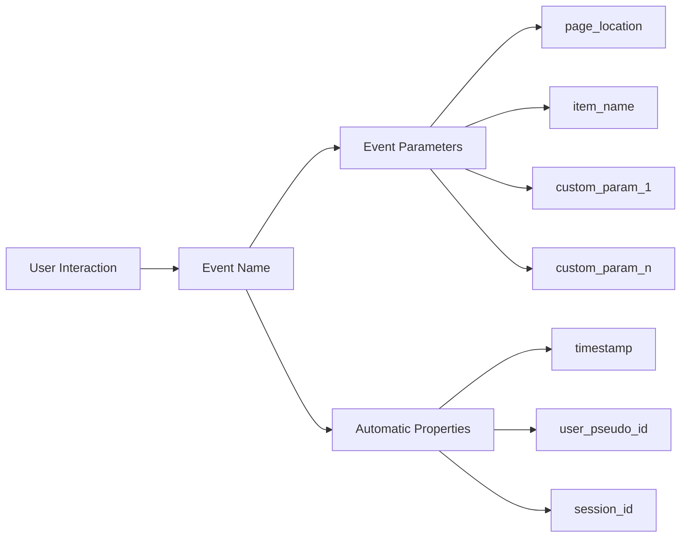
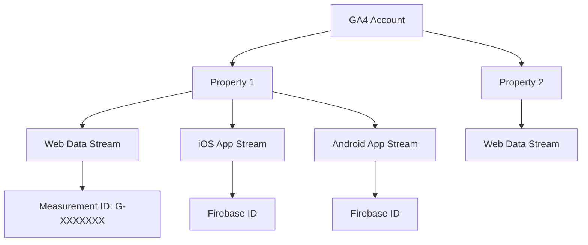
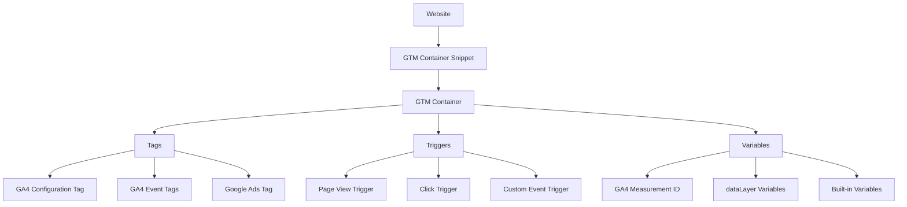
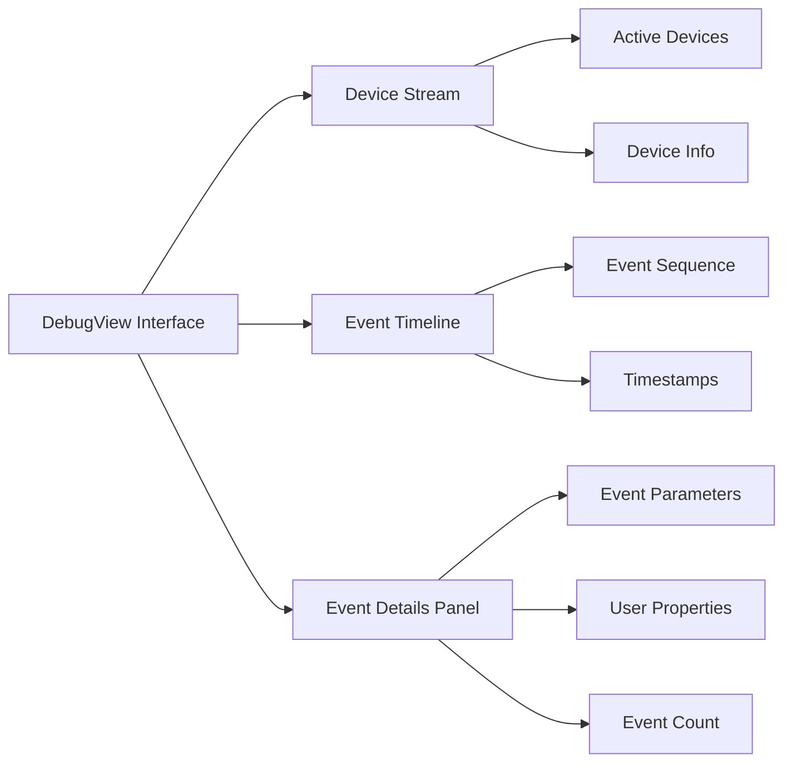

# Лекція 09 Google Analytics 4 — основи

## Вступ

Google Analytics 4 представляє собою революційну зміну в підході до вебаналітики, яка відображає еволюцію користувацької поведінки в епоху багатоканальної взаємодії. Розуміння архітектури GA4 та її фундаментальних відмінностей від попередніх версій є критично важливим для ефективного аналізу даних та прийняття обґрунтованих рішень щодо оптимізації вебресурсів.

## 1. Різниця між Universal Analytics та GA4

### 1.1. Історичний контекст

Universal Analytics, запущений у 2012 році, став стандартом вебаналітики на понад десятиліття. Однак зміни в цифровому середовищі, зростання мобільного трафіку, поява додатків та посилення вимог до приватності даних зумовили необхідність створення нової платформи. Google Analytics 4, анонсований у жовтні 2020 року як еволюція App+Web property, став відповіддю на ці виклики.

Офіційне припинення обробки даних Universal Analytics відбулося 1 липня 2023 року для стандартних властивостей та 1 липня 2024 року для Analytics 360. Це рішення підкреслює стратегічну важливість переходу на нову платформу.

### 1.2. Фундаментальні архітектурні відмінності

Основна різниця між двома платформами полягає в способі збору та структурування даних. Universal Analytics побудований навколо концепції сесій, тоді як GA4 використовує event-based модель, де кожна взаємодія користувача розглядається як окрема подія.



У Universal Analytics сесія визначається як група взаємодій користувача протягом певного часового періоду, зазвичай 30 хвилин неактивності. Всередині сесії відбуваються різні типи hitів: pageviews, events, social interactions, transactions. Кожен тип має власну структуру даних та обмеження.

GA4 відмовляється від цієї ієрархії. Замість різних типів hitів всі взаємодії стають подіями з параметрами. Перегляд сторінки це подія page_view, клік це подія з власним іменем, покупка це подія purchase. Така уніфікація спрощує збір даних та забезпечує гнучкість у їх аналізі.

### 1.3. Порівняльна таблиця ключових відмінностей

Розглянемо детальніше основні аспекти, в яких GA4 відрізняється від Universal Analytics.

**Модель даних.** Universal Analytics оперує сесіями як базовою одиницею виміру. Метрики розраховуються на основі кількості сесій, pageviews per session, bounce rate визначається як відсоток сесій з одним переглядом. GA4 використовує події як атомарну одиницю. Сесії існують, але розраховуються на основі послідовності подій, а не навпаки.

**Ідентифікація користувачів.** У Universal Analytics ідентифікація базується переважно на cookies, зокрема Client ID, що зберігається в cookie _ga. GA4 впроваджує концепцію User ID spaces, яка включає Google signals для крос-девайсної атрибуції, User-ID для ідентифікованих користувачів, Device ID для анонімних, та modeling для заповнення прогалин у даних через consent mode.

**Метрики та виміри.** В Universal Analytics є чіткий поділ на dimensions та metrics, кожен з яких має фіксований тип та обмеження на комбінування. GA4 використовує event parameters як universal dimensions, що дозволяє створювати до 50 custom dimensions та 50 custom metrics на property, з можливістю змінювати їх scope та тип.

**Звітність.** Universal Analytics пропонує преконфігуровані звіти з обмеженими можливостями кастомізації через custom reports та dashboards. GA4 надає менше готових звітів, натомість фокусується на Explorations, потужному інструменті для ad-hoc аналізу з можливостями, що нагадують Google Data Studio.

**Machine Learning.** Universal Analytics має базові функції прогнозування в Intelligence Events. GA4 інтегрує машинне навчання на глибокому рівні, пропонуючи predictive metrics (purchase probability, churn probability, revenue prediction), anomaly detection, та insights на основі автоматичного аналізу даних.

**Приватність та consent.** Universal Analytics має обмежені можливості роботи з consent, здебільшого через IP anonymization. GA4 впроваджує Consent Mode v2 з advanced та basic режимами, behavior modeling для відновлення даних у разі відсутності cookies, та cookieless measurement через server-side tagging.

### 1.4. Практичні наслідки переходу

Міграція з Universal Analytics на GA4 не є простим оновленням інтерфейсу. Це зміна парадигми, яка вимагає переосмислення підходів до аналізу даних.

Історичні дані з Universal Analytics не можуть бути перенесені до GA4 через фундаментальну несумісність моделей даних. Організації, які почали перехід пізно, втратили можливість порівнювати year-over-year метрики. Рекомендувалося запускати GA4 паралельно з UA принаймні за рік до shutdown, щоб накопичити достатньо даних для базового аналізу.

Метрики розраховуються по-різному, що призводить до розбіжностей у цифрах. Наприклад, bounce rate у UA визначався як відсоток сесій з одним переглядом сторінки без interaction events. У GA4 це Engaged sessions rate, обернена метрика, що показує відсоток сесій тривалістю понад 10 секунд, з conversion event або двома і більше page views.

Інтеграції потребують переналаштування. Google Ads, Search Console, BigQuery всі вони працюють з GA4 інакше, ніж з UA. API також змінилися: замість Reporting API v4 тепер використовується Data API v1 з іншою структурою запитів та відповідей.

## 2. Event-based модель даних vs session-based

### 2.1. Концептуальні основи session-based моделі

Session-based модель Universal Analytics відображає традиційне розуміння вебаналітики, коли користувач приходить на сайт, здійснює серію дій і йде. Сесія починається з першого звернення до сайту і закінчується після 30 хвилин неактивності або о півночі за часовим поясом property.

Всередині сесії відбуваються різні типи взаємодій. Pageview фіксує перегляд сторінки, передаючи параметри page title, page location, hostname. Event реєструє дію користувача з чотирма фіксованими параметрами: category, action, label, value. Social interaction відстежує активність у соціальних мережах. Transaction записує комерційну транзакцію з продуктами, цінами, податками.

Кожен тип взаємодії має власну структуру і не може бути легко змінений. Наприклад, event завжди має category, action, label, value і не може мати додаткових параметрів без складних workarounds через custom dimensions.

### 2.2. Архітектура event-based моделі GA4

GA4 радикально спрощує цю структуру. Кожна взаємодія це подія з іменем та необмеженою кількістю параметрів. Перегляд сторінки це page_view event з параметрами page_location, page_referrer, page_title. Клік по кнопці це user_engagement або custom event з параметрами, які ви самі визначаєте.



Кожна подія автоматично отримує набір системних параметрів: timestamp у мікросекундах, user_pseudo_id як унікальний ідентифікатор пристрою, session_id для групування подій у сесії, ga_session_number для підрахунку сесій користувача, source та medium для атрибуції джерела трафіку.

До події можна додати до 25 кастомних параметрів для конкретного event та використовувати 50 user-scoped parameters, які зберігаються з користувачем протягом усіх його сесій.

### 2.3. Переваги event-based підходу

Гнучкість є основною перевагою event-based моделі. Замість того, щоб вписувати дані в обмежені структури pageview чи event, ви визначаєте власні події з релевантними параметрами. Наприклад, для відеоплеєра можна створити події video_start, video_progress, video_complete з параметрами video_title, video_duration, video_percent.

Уніфікація збору даних спрощує імплементацію. Немає потреби вибирати між event, social interaction чи іншим типом hit. Все це події. Код стає простішим та передбачуванішим.

Кросплатформенність стає природною. Події з вебсайту та мобільного додатку використовують однакову структуру, що дозволяє аналізувати user journey незалежно від платформи. Користувач почав пошук товару в додатку, продовжив на вебсайті і завершив покупку через мобільний браузер. GA4 може відстежити цей шлях як єдину послідовність подій.

Machine learning отримує структуровані дані, які легше аналізувати. Предиктивні моделі GA4 використовують event parameters для прогнозування ймовірності покупки чи відтоку користувача.

### 2.4. Сесії в event-based моделі

Незважаючи на фокус на подіях, GA4 все ще використовує концепцію сесій, але визначає їх інакше. Сесія це група подій з однаковим session_id, згенерованим на основі session_start події та часових правил.

Нова сесія починається при першому відвідуванні сайту, після 30 хвилин неактивності, або якщо змінюються campaign parameters (utm_source, utm_medium, utm_campaign). На відміну від UA, сесія не скидається о півночі.

Сесійні метрики розраховуються з подій. Engaged session це сесія тривалістю понад 10 секунд або з conversion event або з двома і більше page views. Session duration сума часу між першою та останньою подією в сесії. Pages per session кількість page_view подій у сесії.

### 2.5. Практичний приклад порівняння моделей

Розглянемо конкретний сценарій: користувач приходить на сайт електронної комерції, дивиться три товари, додає один до кошика і йде.

В Universal Analytics це виглядає як одна сесія з чотирма pageviews, трьома events типу view_item, одним event add_to_cart, і bounce rate 0% якщо був interaction event.

У GA4 це буде 10-15 подій: session_start, page_view для головної, view_item для кожного товару з параметрами items array, page_view для сторінок товарів, add_to_cart з інформацією про товар, можливо scroll події якщо увімкнений Enhanced Measurement, user_engagement події для вимірювання тривалості, і остання page_view перед виходом.

Кожна подія несе детальну інформацію через параметри. Подія view_item має parameters: currency, value, items array з item_id, item_name, item_category, price, quantity. Ця деталізація дозволяє аналізувати не просто кількість переглядів товарів, а які саме товари дивилися, в якій послідовності, як це корелює з покупками.

## 3. Налаштування: property, data streams, measurement ID

### 3.1. Ієрархія структури GA4

Google Analytics 4 використовує трирівневу ієрархію для організації даних: Account, Property, Data Stream.



Account це організаційна одиниця найвищого рівня, яка зазвичай відповідає компанії або великому проєкту. Один обліковий запис може містити до 100 properties у безкоштовній версії або 400 у Analytics 360. На рівні account налаштовуються користувачі та їхні ролі: Administrator, Editor, Analyst, Viewer.

Property відповідає конкретному вебсайту, мобільному додатку або їх комбінації. Це основна одиниця для збору та аналізу даних. У межах property налаштовуються data streams, події, конверсії, аудиторії, інтеграції з іншими сервісами Google.

Data Stream це джерело даних, яке надсилає події до property. Існує три типи streams: Web для вебсайтів, iOS для додатків iOS через Firebase, Android для додатків Android через Firebase. Одна property може мати кілька streams, що дозволяє збирати дані з різних платформ в одному місці.

### 3.2. Створення property та налаштування основних параметрів

Процес створення нового GA4 property починається з Account. У налаштуваннях account вибираємо Create Property та вводимо базову інформацію.

Property name повинна бути описовою та зрозумілою, наприклад "Main Website Production" чи "Mobile App iOS". Reporting time zone визначає, о котрій годині починається новий день у звітах, зазвичай встановлюється відповідно до основного географічного ринку. Currency встановлює валюту для всіх грошових метрик, її не можна змінити після створення property.

Industry category та Business size використовуються Google для надання релевантних insights та benchmarking даних. Ці параметри не впливають на збір даних, але можуть налаштувати інтерфейс під специфіку бізнесу.

Business objectives дозволяють обрати пріоритетні цілі: Generate leads, Raise brand awareness, Examine user behavior, Drive online sales. На основі цього вибору GA4 створює recommended events та налаштовує деякі звіти за замовчуванням.

### 3.3. Налаштування Web Data Stream

Після створення property необхідно додати Data Stream. Для вебсайту вибираємо Web та вводимо параметри.

Website URL має бути повним, включаючи протокол, наприклад https://www.example.com. Stream name зазвичай дублює домен або описує призначення, наприклад "Main Website" чи "Blog Subdomain".

Enhanced Measurement це набір подій, які GA4 може відстежувати автоматично без додаткового коду. За замовчуванням увімкнені: Page views для кожної зміни URL, Scrolls коли користувач прокручує 90% висоти сторінки, Outbound clicks для посилань на зовнішні домени, Site search для внутрішнього пошуку на основі query parameters, Video engagement для YouTube відео, вбудованих через iframe, File downloads для кліків на файли типу pdf, xlsx, docx, txt, rtf, csv, zip.

Кожну з цих подій можна налаштувати або вимкнути залежно від потреб. Наприклад, для site search можна вказати конкретні query parameters (q, s, search), за якими GA4 визначатиме пошукові запити.

### 3.4. Measurement ID та його використання

Після створення Web Data Stream GA4 генерує унікальний Measurement ID у форматі G-XXXXXXXXXX, де X це буквено-цифрова комбінація. Цей ідентифікатор використовується для надсилання даних до конкретного stream.

Measurement ID відображається в налаштуваннях stream у розділі Stream details. Його потрібно скопіювати та вставити в код вебсайту або налаштування Google Tag Manager.

На відміну від Universal Analytics, де використовувався Tracking ID формату UA-XXXXXXXX-Y, GA4 Measurement ID прив'язаний до конкретного data stream, а не до всієї property. Це означає, що якщо у вас є окремі streams для різних піддоменів або версій сайту, кожен матиме власний Measurement ID.

### 3.5. Додаткові налаштування Data Stream

У налаштуваннях stream доступні додаткові опції для контролю збору даних.

Google signals дозволяє збирати дані від користувачів, які увійшли в Google аккаунт і дали згоду на персоналізацію реклами. Це дає змогу відстежувати cross-device behavior та використовувати Demographics та Interests дані у звітах. Увімкнення Google signals потребує згоди користувачів відповідно до GDPR та інших регуляцій приватності.

User-ID дає можливість надсилати власний ідентифікатор користувача для більш точного відстеження між сесіями та пристроями. Це корисно для сайтів з авторизацією, де можна зв'язати дії анонімного користувача з його профілем після входу.

Data retention визначає, як довго GA4 зберігає детальні event-level та user-level дані. За замовчуванням це 2 місяці, але можна змінити на 14 місяців. Після закінчення терміну детальні дані видаляються, але агреговані звіти залишаються. Для Analytics 360 можлива необмежена retention через BigQuery export.

## 4. Встановлення tracking code: gtag.js vs Google Tag Manager

### 4.1. Огляд методів імплементації

Існує кілька способів інтегрувати GA4 з вебсайтом: безпосередня установка gtag.js, використання Google Tag Manager, серверна імплементація через Server-side GTM, або гібридні підходи.

Вибір методу залежить від технічних можливостей команди, складності трекінгу, вимог до продуктивності та приватності даних. Для більшості проєктів рекомендується Google Tag Manager через його гнучкість та можливість управління тегами без змін коду сайту.

### 4.2. Встановлення через gtag.js

Gtag.js це JavaScript бібліотека Google для відправки подій до різних продуктів: Google Analytics 4, Google Ads, Google Marketing Platform. Це найпростіший спосіб почати збір даних.

Код складається з двох частин. Спочатку завантажується скрипт бібліотеки:

```javascript
<script async src="https://www.googletagmanager.com/gtag/js?id=G-XXXXXXXXXX"></script>
```

Параметр async дозволяє браузеру не блокувати рендеринг сторінки під час завантаження скрипта. ID в URL це ваш Measurement ID.

Далі йде ініціалізаційний код:

```javascript
<script>
  window.dataLayer = window.dataLayer || [];
  function gtag(){dataLayer.push(arguments);}
  gtag('js', new Date());
  gtag('config', 'G-XXXXXXXXXX');
</script>
```

Тут створюється глобальний масив dataLayer, який використовується для зберігання даних перед їх відправкою. Функція gtag це обгортка для додавання команд у dataLayer. Виклик gtag('js', new Date()) встановлює час завантаження скрипта. Команда gtag('config', 'G-XXXXXXXXXX') ініціалізує GA4 з вашим Measurement ID та автоматично надсилає page_view подію.

Обидва блоки коду розміщуються в секції head HTML документа, якомога вище, щоб tracking почався якнайшвидше.

### 4.3. Налаштування додаткових параметрів gtag.js

Команда config приймає об'єкт з додатковими параметрами для налаштування поведінки tracking.

```javascript
gtag('config', 'G-XXXXXXXXXX', {
  'send_page_view': false,
  'cookie_domain': 'auto',
  'cookie_expires': 63072000,
  'cookie_prefix': '_ga',
  'cookie_update': true,
  'cookie_flags': 'SameSite=None;Secure'
});
```

Параметр send_page_view за замовчуванням true, що призводить до автоматичної відправки page_view при кожному завантаженні. Встановлення false корисне для Single Page Applications, де ви вручну контролюєте надсилання page views.

Cookie_domain визначає домен для cookies. Значення auto автоматично встановлює найвищий рівень домену, що дозволяє відстежувати користувачів між піддоменами.

Cookie_expires встановлює термін дії cookie в секундах. За замовчуванням 63072000 секунд, що дорівнює двом рокам.

Cookie_flags дозволяє додати атрибути до cookies, наприклад SameSite=None;Secure для cross-site tracking, що вимагає HTTPS.

### 4.4. Відправка кастомних подій через gtag.js

Для відстеження специфічних взаємодій використовується команда event.

```javascript
gtag('event', 'newsletter_signup', {
  'method': 'email_form',
  'campaign': 'summer_2024',
  'value': 5
});
```

Перший аргумент це ім'я події. Рекомендується використовувати snake_case та описові назви. Другий аргумент це об'єкт з параметрами події, які можуть бути будь-якими key-value парами, релевантними для аналізу.

Для e-commerce подій GA4 має рекомендовані імена та структуру параметрів:

```javascript
gtag('event', 'purchase', {
  'transaction_id': 'T_12345',
  'value': 150.00,
  'currency': 'USD',
  'tax': 15.00,
  'shipping': 10.00,
  'items': [
    {
      'item_id': 'SKU_123',
      'item_name': 'Product Name',
      'item_category': 'Category',
      'price': 125.00,
      'quantity': 1
    }
  ]
});
```

Використання рекомендованої структури дає переваги: автоматичне заповнення e-commerce звітів, сумісність з Google Ads enhanced conversions, можливість використання predictive audiences.

### 4.5. Google Tag Manager: архітектура та переваги

Google Tag Manager це система управління тегами, яка дозволяє додавати та оновлювати теги без зміни коду вебсайту. Це особливо корисно для команд, де маркетологи та аналітики не мають прямого доступу до кодової бази.



GTM складається з трьох основних компонентів. Tags це фрагменти коду, які виконують конкретні дії, наприклад надсилають дані до GA4 або завантажують Facebook Pixel. Triggers визначають, коли тег повинен спрацювати, наприклад при завантаженні сторінки, кліку на кнопку або кастомній події. Variables зберігають значення, які можна використовувати в тегах та тригерах, наприклад Measurement ID, дані з dataLayer, URL сторінки.

### 4.6. Встановлення Google Tag Manager

Процес починається з створення облікового запису на tagmanager.google.com. Після створення account та container, GTM надає два фрагменти коду.

Перший розміщується в секції head:

```html
<!-- Google Tag Manager -->
<script>(function(w,d,s,l,i){w[l]=w[l]||[];w[l].push({'gtm.start':
new Date().getTime(),event:'gtm.js'});var f=d.getElementsByTagName(s)[0],
j=d.createElement(s),dl=l!='dataLayer'?'&l='+l:'';j.async=true;j.src=
'https://www.googletagmanager.com/gtm.js?id='+i+dl;f.parentNode.insertBefore(j,f);
})(window,document,'script','dataLayer','GTM-XXXXXX');</script>
<!-- End Google Tag Manager -->
```

Другий у тілі документа одразу після відкриваючого тегу body:

```html
<!-- Google Tag Manager (noscript) -->
<noscript><iframe src="https://www.googletagmanager.com/ns.html?id=GTM-XXXXXX"
height="0" width="0" style="display:none;visibility:hidden"></iframe></noscript>
<!-- End Google Tag Manager (noscript) -->
```

Noscript версія забезпечує базовий tracking для браузерів без JavaScript, хоча функціональність обмежена.

### 4.7. Налаштування GA4 в Google Tag Manager

Після встановлення container код, налаштування GA4 відбувається в інтерфейсі GTM.

Спочатку створюється GA4 Configuration Tag. Це базовий тег, який ініціалізує GA4 та надсилає автоматичні події. У GTM обираємо Tags, New, Tag Configuration, вибираємо Google Analytics: GA4 Configuration.

У полі Measurement ID вводимо G-XXXXXXXXXX з налаштувань data stream. Опція Send a page view event when this configuration loads за замовчуванням увімкнена, що автоматично надсилає page_view при завантаженні сторінки.

Configuration tag повинен спрацьовувати на всіх сторінках, тому в Triggering вибираємо All Pages або Initialization - All Pages для більш раннього завантаження.

Для відстеження кастомних подій створюються окремі Event Tags. Наприклад, для відстеження кліків на кнопку CTA:

Створюємо новий тег типу Google Analytics: GA4 Event. У Configuration Tag вибираємо щойно створений GA4 Configuration Tag для зв'язку. Event Name вводимо cta_button_click. Event Parameters додаємо релевантні дані, наприклад button_text, page_location.

Trigger налаштовується на клік по конкретному елементу. Створюємо Click trigger з умовами: Click Element matches CSS selector .cta-button або Click Text contains "Get Started".

### 4.8. Використання dataLayer в GTM

DataLayer це JavaScript об'єкт, який слугує проміжним шаром між вебсайтом та GTM. Він дозволяє передавати структуровані дані, які GTM може використовувати в тегах.

Базова структура dataLayer push:

```javascript
window.dataLayer = window.dataLayer || [];
dataLayer.push({
  'event': 'user_login',
  'userId': '12345',
  'userType': 'premium',
  'loginMethod': 'google'
});
```

Команда push додає новий об'єкт до dataLayer. Параметр event є спеціальним і використовується GTM для ідентифікації тригерів. Інші параметри це довільні дані, які можна використовувати як змінні.

У GTM створюємо Data Layer Variables для доступу до цих значень. Variables, New, Data Layer Variable, Data Layer Variable Name вводимо userId. Ця змінна тепер доступна в тегах та тригерах.

Для створення події в GA4 на основі dataLayer push налаштовуємо Custom Event Trigger з Event name user_login. Коли dataLayer отримує об'єкт з цим event, тригер спрацює.

Event Tag надсилає дані до GA4, використовуючи dataLayer Variables як Event Parameters:

```
Event Name: login
Parameters:
  user_id: {{userId}}
  user_type: {{userType}}
  method: {{loginMethod}}
```

### 4.9. Порівняння gtag.js та GTM: коли що використовувати

Gtag.js підходить для простих сайтів з мінімальними потребами в tracking, де розробники мають повний контроль над кодом. Переваги: швидка імплементація, менше залежностей, пряме управління через код. Недоліки: кожна зміна потребує deploy коду, складно управляти багатьма тегами, обмежені можливості для нетехнічних спеціалістів.

Google Tag Manager рекомендується для більшості проєктів, особливо коли: є кілька маркетингових інструментів (GA4, Google Ads, Facebook, etc.), маркетологи потребують незалежності від розробників, необхідна гнучкість у налаштуванні tracking, важливі version control та testing для тегів.

Гібридний підхід можливий, коли критичні events надсилаються через gtag.js безпосередньо з коду, а додаткові marketing теги управляються через GTM. Однак це ускладнює підтримку та може призвести до дублювання подій.

## 5. Enhanced Measurement: автоматичні події

### 5.1. Концепція Enhanced Measurement

Enhanced Measurement це функція GA4, яка автоматично відстежує поширені взаємодії користувачів без необхідності писати код. Вона увімкнена за замовчуванням при створенні нового Web Data Stream та значно спрощує початкову імплементацію tracking.

Основна ідея полягає в тому, що GA4 аналізує структуру сторінки та поведінку користувача, автоматично генеруючи події для типових дій. Це дозволяє швидко отримати базові дані про взаємодію користувачів, навіть без налаштування кастомних подій.

### 5.2. Типи автоматичних подій

Enhanced Measurement включає сім категорій подій, кожна з яких відстежує певний тип взаємодії.

Page views генерує подію page_view щоразу, коли URL сторінки змінюється. Це працює не лише для традиційних переходів між сторінками, але й для Single Page Applications, де зміна URL відбувається через History API. Подія включає параметри page_location (повний URL), page_referrer (попередня сторінка), page_title (заголовок документа).

Scrolls відстежує, коли користувач прокручує сторінку до певної глибини. За замовчуванням подія scroll спрацьовує, коли користувач вперше досягає 90% висоти сторінки. Це корисно для розуміння engagement: якщо багато користувачів не прокручують сторінку, контент може бути непривабливим або погано структурованим.

Outbound clicks реєструє кліки на посилання, які ведуть на зовнішні домени. Подія click з параметром outbound: true та link_url надсилається, коли користувач клікає на посилання з іншим доменом, ніж поточний сайт. Це дозволяє аналізувати, куди користувачі йдуть з вашого сайту.

Site search автоматично визначає внутрішній пошук на основі параметрів URL. GA4 шукає поширені query parameters: q, s, search, query, keyword. Якщо такий параметр є в URL, генерується подія view_search_results з параметром search_term, що містить пошуковий запит. Це критично важливо для розуміння, що користувачі шукають на вашому сайті.

Video engagement відстежує взаємодію з YouTube відео, вбудованими через iframe з увімкненим JS API. Генеруються події video_start, video_progress (на 10%, 25%, 50%, 75%), video_complete з параметрами video_title, video_url, video_provider, visible: true/false.

File downloads реєструє кліки на файли певних типів. За замовчуванням відстежуються: pdf, xlsx, docx, txt, rtf, csv, exe, key, pps, ppt, pptx, 7z, pkg, rar, gz, zip, avi, mov, mp4, mpeg, wmv, midi, mp3, wav, wma. Подія file_download містить параметри file_extension, file_name, link_url.

Form interactions відстежують взаємодію з HTML формами. Подія form_start генерується, коли користувач вперше взаємодіє з полем форми. Подія form_submit надсилається при успішній відправці форми. Параметри включають form_id, form_name, form_destination.

### 5.3. Налаштування Enhanced Measurement

Enhanced Measurement налаштовується в інтерфейсі GA4 на рівні Data Stream. Переходимо в Admin, Data Streams, вибираємо потрібний stream, знаходимо розділ Enhanced measurement.

Кожен тип події можна увімкнути або вимкнути незалежно. Клік на іконку settings біля конкретної події відкриває додаткові опції.

Для Page views можна налаштувати, чи враховувати зміни в hash частині URL. За замовчуванням зміна від /page#section1 до /page#section2 не генерує нову page_view. Увімкнення опції Page changes based on browser history events враховує такі зміни.

Site search дозволяє вказати кастомні query parameters. Якщо ваш сайт використовує нестандартний параметр, наприклад find або lookup, його можна додати до списку. Також можна увімкнути Use a regular expression для більш складних патернів.

File downloads дає можливість розширити список розширень файлів або використати regex для гнучкішого визначення. Наприклад, якщо потрібно відстежувати завантаження всіх зображень, можна додати png, jpg, jpeg, gif, svg.

Outbound clicks має опцію Tag clicks as outbound when destination hostname contains, де можна вказати домени, які слід вважати внутрішніми, навіть якщо вони відрізняються від основного. Наприклад, якщо ваш блог на blog.example.com, а основний сайт на www.example.com, можна додати обидва домени.

### 5.4. Обмеження та недоліки Enhanced Measurement

Попри зручність, Enhanced Measurement має певні обмеження, які важливо розуміти.

Недостатня деталізація. Автоматичні події містять базову інформацію, але часто не вистачає контексту. Наприклад, click event фіксує URL посилання, але не текст кнопки, не розташування на сторінці, не візуальний стан елемента.

Складність фільтрації. Outbound clicks реєструють всі зовнішні посилання, включаючи технічні (CDN, analytics scripts), що може створювати шум у даних. Site search може хибно спрацювати на параметри, які не є пошуковими запитами.

Відсутність контролю над параметрами. Ви не можете додати кастомні параметри до автоматичних подій. Якщо потрібна додаткова інформація, необхідно створювати окрему кастомну подію.

Проблеми з Single Page Applications. Хоча Enhanced Measurement підтримує History API, складні SPA frameworks можуть потребувати додаткових налаштувань. React Router або Vue Router іноді змінюють URL способами, які не детектуються автоматично.

### 5.5. Рекомендації щодо використання

Enhanced Measurement слід розглядати як стартову точку, а не повноцінне рішення для tracking. Рекомендується:

Увімкнути Enhanced Measurement на етапі запуску для отримання базових даних. Регулярно переглядати згенеровані події в DebugView та звітах, щоб зрозуміти, що саме відстежується. Поступово замінювати автоматичні події кастомними з додатковими параметрами для критичних взаємодій.

Наприклад, замість автоматичного file_download створити кастомну подію download_whitepaper з параметрами whitepaper_title, whitepaper_category, user_segment, download_source. Це дасть набагато більше інсайтів для аналізу ефективності контенту.

Для click events на важливих CTA кнопках краще налаштувати окремі події через GTM з параметрами button_text, button_color, page_section, ab_test_variant. Це дозволить детально аналізувати, які елементи найбільше сприяють конверсіям.

## 6. DebugView: тестування подій у реальному часі

### 6.1. Призначення та можливості DebugView

DebugView це інструмент у GA4, який показує події в реальному часі під час їх надсилання з вебсайту або додатку. Це критично важливо для валідації імплементації tracking перед запуском у production.

На відміну від стандартних звітів, які оброблюються з затримкою до 24-48 годин, DebugView показує дані миттєво. Це дозволяє негайно бачити результати змін у коді tracking та швидко виявляти проблеми.

### 6.2. Увімкнення Debug mode

Для використання DebugView необхідно увімкнути debug mode на вебсайті. Існує кілька способів це зробити.

Для gtag.js додаємо параметр debug_mode до config:

```javascript
gtag('config', 'G-XXXXXXXXXX', {
  'debug_mode': true
});
```

Для Google Tag Manager найпростіший спосіб використовувати Preview mode. Натискаємо Preview у GTM, вводимо URL сайту, і GTM автоматично увімкне debug mode для поточної сесії браузера.

Альтернативно можна встановити Chrome extension Google Analytics Debugger, яка увімкне debug mode для всіх сайтів з GA4 tracking у поточному браузері.

Ще один спосіб додати query parameter ?debug_mode=true до URL сайту, якщо це налаштовано в коді tracking.

### 6.3. Інтерфейс DebugView

DebugView знаходиться в GA4 Admin, в розділі Configure під Data display. Після увімкнення debug mode на сайті, інтерфейс DebugView починає показувати дані через кілька секунд.



Ліва панель показує активні пристрої у debug mode. Кожен пристрій ідентифікується за device ID та показує основну інформацію: платформа (web/iOS/Android), версія ОС, браузер.

Центральна частина відображає timeline подій у хронологічному порядку. Кожна подія показується з іменем, часом отримання та іконкою, яка вказує на тип (automatic, recommended, custom).

Права панель містить детальну інформацію про вибрану подію. Тут відображаються всі event parameters, user properties, та кількість разів, коли ця подія була надіслана в поточній сесії.

### 6.4. Аналіз подій у DebugView

Розглянемо типовий сценарій тестування. Припустимо, ми налаштували відстеження кліків на кнопку підписки на newsletter.

Відкриваємо сайт у браузері з увімкненим debug mode. У DebugView з'являється наш пристрій у списку активних. Переходимо на сторінку з формою підписки. В timeline з'являється подія page_view з параметрами:

```
page_view
  page_location: https://example.com/newsletter
  page_referrer: https://example.com/
  page_title: Newsletter Signup | Example
  engagement_time_msec: 1
```

Заповнюємо форму і натискаємо кнопку підписки. Якщо tracking налаштований правильно, в timeline з'явиться наша кастомна подія:

```
newsletter_signup
  method: email
  newsletter_type: weekly_digest
  user_segment: new_visitor
```

Якщо події немає, це сигналізує про проблему. Можливі причини: trigger у GTM не спрацював, dataLayer push не виконався, event name написаний неправильно, є JavaScript помилка на сторінці.

### 6.5. Типові проблеми та їх діагностика

DebugView допомагає виявити поширені помилки в імплементації.

Дубльовані події проявляються як кілька однакових event entries з однаковим timestamp. Причина зазвичай у тому, що один тригер спрацьовує кілька разів або є кілька тегів, що надсилають одну подію.

Відсутні параметри події видно, коли event з'являється, але не має очікуваних parameters. Це може означати, що dataLayer variable не заповнена або її ім'я написано неправильно.

Неправильний тип даних параметра можна помітити, коли числове значення приходить як string або навпаки. GA4 автоматично визначає тип на основі перших подій, тому важливо, щоб з самого початку дані надсилалися в правильному форматі.

Подія надсилається на неправильній сторінці видно через page_location параметр. Якщо тригер налаштований некоректно, подія може спрацьовувати на всіх сторінках замість конкретної.

### 6.6. Best practices для використання DebugView

Систематичне тестування після кожної зміни в tracking. Не чекайте, поки накопичиться багато змін. Тестуйте кожен новий тег або подію одразу після створення.

Використовуйте різні пристрої та браузери. DebugView може показувати кілька активних пристроїв одночасно, що дозволяє порівнювати поведінку на desktop та mobile.

Документуйте очікувану поведінку. Перед тестуванням запишіть, які події повинні спрацювати в якій послідовності та з якими параметрами. Це дасть clear checklist для валідації.

Не залишайте debug mode увімкненим у production. Після завершення тестування обов'язково вимкніть debug_mode у gtag config або закрийте Preview mode у GTM. Debug events не враховуються в стандартних звітах, але створюють додаткове навантаження.

Зберігайте screenshots критичних подій. DebugView не зберігає історію після закриття сесії, тому корисно мати візуальне підтвердження правильності налаштування.

## Висновки

Google Analytics 4 являє собою фундаментальну зміну парадигми вебаналітики. Перехід від session-based до event-based моделі відображає еволюцію digital ecosystem, де користувачі взаємодіють з брендами через множину пристроїв та каналів.

Розуміння архітектури GA4, починаючи від structure property та data streams до методів імплементації та автоматичних подій, є необхідним для ефективного використання платформи. Кожен елемент системи, від Measurement ID до Enhanced Measurement та DebugView, відіграє роль у створенні надійної інфраструктури аналітики.

Успішна імплементація GA4 вимагає не просто технічних навичок, але й стратегічного мислення. Вибір між gtag.js та Google Tag Manager, налаштування автоматичних подій, планування кастомних events все це має узгоджуватися з бізнес-цілями та аналітичними потребами організації.

Інвестиції в правильне налаштування GA4 на початковому етапі окупаються можливістю отримувати точні, деталізовані дані про поведінку користувачів, що є основою для data-driven оптимізації вебресурсів та маркетингових стратегій.
