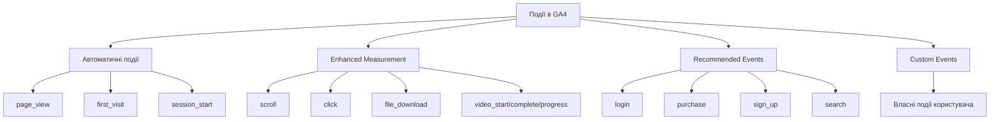
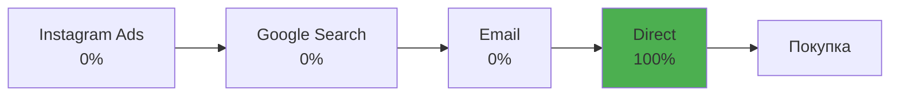
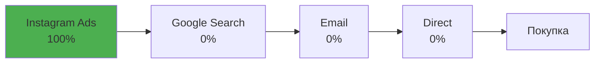
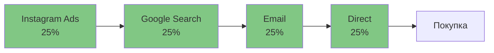
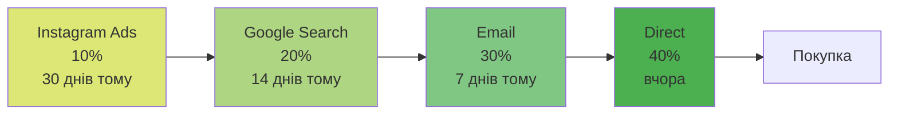
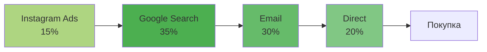
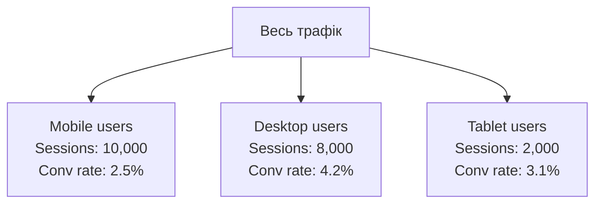
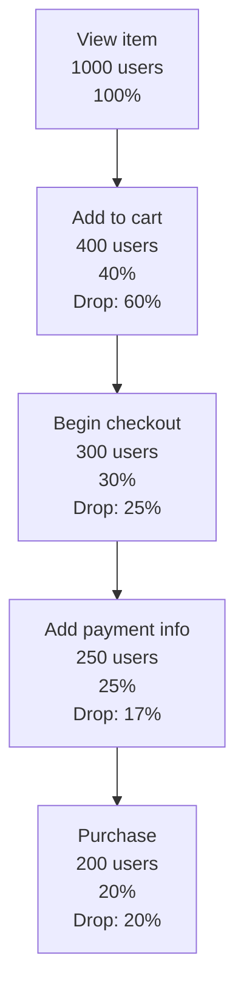

# Лекція 10 Google Analytics 4 — події, конверсії та атрибуція

## Вступ

Google Analytics 4 побудований на принципово іншій архітектурі порівняно з Universal Analytics. Якщо Universal Analytics базувався на сесіях та переглядах сторінок, то GA4 використовує event-based модель, де абсолютно все є подією. Розуміння того, як працюють події, конверсії та атрибуція в GA4, є критично важливим для ефективного вимірювання результатів вебсайту та маркетингових кампаній.

У цій лекції ми детально розглянемо систему подій GA4, навчимося правильно налаштовувати конверсії, зрозуміємо різницю між моделями атрибуції та освоїмо інструменти сегментації даних. Ці знання дозволять вам отримувати максимум користі від аналітики та приймати обґрунтовані рішення щодо оптимізації вебсайту.

## 1. Типи подій у Google Analytics 4

### 1.1. Ієрархія подій

У GA4 існує чітка ієрархія типів подій, яка визначає, як і коли вони відстежуються. Розуміння цієї ієрархії допомагає ефективно планувати систему вимірювання.



### 1.2. Автоматичні події

Автоматичні події збираються GA4 без будь-яких додаткових налаштувань одразу після встановлення коду відстеження. Ці події є фундаментом для всієї аналітики.

**page_view** фіксується кожного разу, коли користувач завантажує сторінку. Це базова подія, яка містить інформацію про URL сторінки, заголовок та referrer. Важливо розуміти, що в односторінкових додатках (SPA) на React або Vue необхідно додатково налаштувати відстеження віртуальних переглядів сторінок, оскільки фізичного перезавантаження не відбувається.

**session_start** позначає початок нової сесії користувача. GA4 автоматично визначає, коли починається нова сесія на основі таймауту неактивності (за замовчуванням 30 хвилин) або зміни кампанії UTM-параметрів. Ця подія критично важлива для розрахунку кількості сесій та показників залученості.

**first_visit** спрацьовує лише один раз для кожного унікального користувача при його першому відвідуванні сайту. Ця подія дозволяє відокремлювати нових користувачів від тих, що повертаються, та аналізувати ефективність каналів залучення нової аудиторії.

**user_engagement** фіксується періодично протягом активної взаємодії користувача з сайтом. GA4 вважає сесію активною, якщо додаток знаходиться на передньому плані протягом принаймні однієї секунди. Ця подія містить параметр engagement_time_msec, який показує тривалість активної взаємодії.

### 1.3. Enhanced Measurement

Enhanced Measurement - це набір подій, які можна увімкнути або вимкнути простим перемиканням у налаштуваннях data stream. Ці події відстежують типову поведінку користувачів без необхідності писати код.

**scroll** спрацьовує, коли користувач прокручує сторінку до 90% її висоти. Це важливий індикатор того, що контент є достатньо цікавим для повного прочитання. Метрика особливо корисна для блогів та довгих інформаційних статей, оскільки дозволяє оцінити якість залучення аудиторії.

**click** фіксує кліки по вихідних посиланнях, які ведуть на інші домени. GA4 автоматично визначає, чи є посилання зовнішнім, та записує URL призначення. Це дозволяє аналізувати, на які зовнішні ресурси користувачі найчастіше переходять з вашого сайту.

**file_download** відстежує завантаження файлів з розширеннями pdf, xlsx, docx, txt, rtf, csv, exe, key, pps, ppt, 7z, pkg, rar, gz, zip, avi, mov, mp4, mpeg, wmv, midi, mp3, wav, wma. GA4 автоматично розпізнає ці розширення та фіксує назву файлу та його розташування.

**video_engagement** включає три події для відео, вбудованих через YouTube з підтримкою JS API: video_start (початок відтворення), video_progress (прогрес на 10%, 25%, 50%, 75%), video_complete (завершення перегляду). Ці події дозволяють детально аналізувати, як користувачі взаємодіють з відеоконтентом.

**form_start** та **form_submit** відстежують взаємодію з HTML-формами на сайті. Перша подія спрацьовує при першій взаємодії з будь-яким полем форми, друга - при її відправці. Це дозволяє розрахувати коефіцієнт конверсії форм та виявити проблемні місця.

**site_search** активується, коли користувач використовує пошук на сайті. GA4 автоматично намагається визначити пошуковий запит з URL-параметрів, але часто потрібне додаткове налаштування для коректного розпізнавання.

### 1.4. Recommended Events

Recommended Events - це набір подій зі стандартизованими назвами та параметрами, які Google рекомендує використовувати для певних типів взаємодій. Хоча ці події потрібно налаштовувати вручну через Google Tag Manager або код, використання рекомендованих назв дає важливі переваги.

По-перше, рекомендовані події автоматично з'являються в стандартних звітах GA4 та мають готові шаблони візуалізації. По-друге, деякі рекомендовані події (наприклад, purchase, begin_checkout) автоматично інтегруються з Google Ads та іншими платформами Google Marketing Platform. По-третє, використання стандартних назв спрощує порівняння метрик між різними проєктами та забезпечує сумісність з майбутніми функціями GA4.

**login** відстежує вхід користувача в систему. Подія містить параметр method, який вказує метод аутентифікації (Google, Facebook, email тощо). Це дозволяє аналізувати, які методи входу є найпопулярнішими.

**sign_up** фіксує реєстрацію нового користувача. Аналогічно login, містить параметр method. Разом ці дві події дозволяють побудувати воронку від реєстрації до активного використання продукту.

**search** відстежує пошукові запити користувачів. Ключовий параметр search_term містить сам запит. Аналіз цих даних допомагає зрозуміти, що саме шукають користувачі, та оптимізувати контент під їхні потреби.

**select_content** використовується для відстеження кліків по елементах контенту, наприклад, банерах, рекламних блоках або пунктах меню. Параметри content_type та content_id дозволяють ідентифікувати конкретний елемент.

**share** фіксує поширення контенту через соціальні мережі або інші канали. Параметри method, content_type та item_id дозволяють детально проаналізувати, який контент є найбільш вірусним.

Для електронної комерції GA4 пропонує розширений набір рекомендованих подій: view_item, add_to_cart, remove_from_cart, view_cart, begin_checkout, add_payment_info, add_shipping_info, purchase, refund. Ці події формують повну воронку покупки та дозволяють відстежувати кожен крок користувача від перегляду товару до завершення транзакції.

### 1.5. Custom Events

Custom Events дозволяють відстежувати будь-яку взаємодію, специфічну для вашого вебсайту або додатку. Створення кастомних подій вимагає розуміння JavaScript та роботи з Google Tag Manager або безпосереднього коду.

Приклад відправки кастомної події через gtag.js:

```javascript
gtag('event', 'calculator_used', {
  calculation_type: 'mortgage',
  result_value: 250000,
  currency: 'UAH'
});
```

У цьому прикладі ми створюємо подію calculator_used, яка фіксує використання калькулятора на сайті. Параметри calculation_type, result_value та currency дозволяють детально аналізувати, які саме розрахунки виконують користувачі.

Важливі правила для custom events: назва події має починатися з літери, містити лише літери, цифри та підкреслення, бути не довшою за 40 символів. GA4 чутливий до регістру, тому event_name та Event_Name - це різні події. Рекомендується використовувати snake_case для назв подій (слова в нижньому регістрі, розділені підкреслюванням).

## 2. Параметри подій

Параметри подій - це додаткова інформація, яка передається разом з подією та дозволяє деталізувати аналіз. Кожна подія може мати до 25 кастомних параметрів.

### 2.1. Автоматичні параметри

GA4 автоматично додає до кожної події набір системних параметрів, які не потрібно налаштовувати вручну.

**page_location** містить повний URL сторінки, включно з протоколом, доменом, шляхом та параметрами запиту. Цей параметр дозволяє аналізувати, на яких конкретних сторінках відбуваються події.

**page_referrer** зберігає URL попередньої сторінки, з якої користувач перейшов. Для першого відвідування це буде зовнішнє джерело, для наступних сторінок - внутрішні переходи.

**engagement_time_msec** показує час активної взаємодії користувача з сторінкою в мілісекундах. GA4 вважає час, коли вкладка браузера знаходиться на передньому плані та користувач виконує дії.

### 2.2. Кастомні параметри

Кастомні параметри дозволяють передавати специфічну для вашого бізнесу інформацію. Існує кілька типів даних, які можна передавати як параметри.

**Текстові параметри** (string) використовуються для категорій, назв, ідентифікаторів. Наприклад, category, product_name, user_tier.

**Числові параметри** (number) містять кількісні дані: ціни, кількості, рейтинги. Наприклад, value, quantity, rating.

**Булеві параметри** (boolean) для бінарних значень: is_logged_in, has_discount, is_premium_user.

Приклад події з множинними параметрами:

```javascript
gtag('event', 'product_view', {
  item_id: 'SKU_12345',
  item_name: 'Ноутбук ASUS',
  item_category: 'Електроніка',
  item_category2: 'Комп\'ютери',
  item_brand: 'ASUS',
  price: 25000,
  currency: 'UAH',
  user_type: 'registered',
  in_stock: true
});
```

### 2.3. Dimension vs Metrics

Важливо розуміти різницю між вимірами (dimensions) та метриками (metrics) у контексті параметрів подій.

Виміри - це якісні характеристики, які описують подію. Вони відповідають на питання "що?" або "який?". Приклади: назва події, категорія товару, тип користувача, назва сторінки. У звітах виміри відображаються як рядки в таблицях.

Метрики - це кількісні показники, числові значення, які можна підсумовувати, усереднювати, порівнювати. Вони відповідають на питання "скільки?". Приклади: кількість подій, сума покупки, час на сторінці, кількість користувачів. У звітах метрики відображаються як стовпці з числами.

У GA4 текстові параметри автоматично стають вимірами, а числові - метриками. Однак для використання кастомних параметрів у звітах їх потрібно спочатку зареєструвати в налаштуваннях GA4 як custom dimensions або custom metrics.

## 3. Конверсії та ключові події

### 3.1. Концепція конверсій у GA4

У GA4 конверсія - це будь-яка подія, яку ви позначили як важливу для вашого бізнесу. На відміну від Universal Analytics, де конверсії були окремою сутністю з обмеженою кількістю (20 цілей на views), у GA4 будь-яку подію можна позначити як конверсію простим перемиканням.

Система дозволяє мати до 30 конверсій на property. Це набагато гнучкіший підхід, який дозволяє швидко адаптувати систему вимірювання під зміни бізнес-цілей без необхідності перенастроювання складних правил.

### 3.2. Типи конверсій

**Macro-conversions** - це головні бізнес-цілі, які безпосередньо пов'язані з доходом або ключовими результатами. Для інтернет-магазину це purchase (покупка), для SaaS-сервісу - sign_up (реєстрація) або subscribe (оформлення підписки), для медіа-сайту - subscribe_newsletter (підписка на розсилку).

**Micro-conversions** - це проміжні дії, які вказують на зростання залученості користувача та підвищують ймовірність досягнення головної мети. Приклади: add_to_cart (додавання в кошик), video_complete (перегляд відео до кінця), file_download (завантаження прайс-листа або каталогу), click_contact (клік на контактну інформацію).

Рекомендується налаштовувати як мінімум одну macro-conversion та кілька micro-conversions. Це дає змогу аналізувати повну воронку користувача та виявляти місця, де потенційні клієнти "відвалюються".

### 3.3. Налаштування конверсій

Процес позначення події як конверсії є надзвичайно простим. У інтерфейсі GA4 потрібно перейти до розділу Configure → Events, знайти потрібну подію в списку та перемкнути тумблер "Mark as conversion". Після цього подія автоматично з'являється в звіті Conversions та враховується при розрахунку показника conversion rate.

Важлива деталь: конверсії в GA4 рахуються не унікально на рівні сесії (як в Universal Analytics), а як загальна кількість подій. Якщо користувач двічі додав товар до кошика протягом однієї сесії і add_to_cart позначена як конверсія, це буде зараховано як 2 конверсії. Для деяких бізнес-моделей це логічно (наприклад, для subscription-based сервісів), для інших може потребувати додаткової логіки дедуплікації.

### 3.4. Key Events (нова термінологія)

З лютого 2024 року Google почав поступово змінювати термінологію в GA4. Те, що раніше називалося "conversions", тепер називається "key events" (ключові події). Ця зміна відображає філософію GA4, де все є подією, а деякі події просто важливіші за інші.

Функціональність залишилася ідентичною - ви позначаєте важливі події перемиканням, і вони враховуються в звітах як ключові метрики. Однак у нових property ви побачите термін "key events", тоді як у старіших може залишатися "conversions". Google планує повністю перейти на нову термінологію протягом 2024 року.

### 3.5. Розрахунок Conversion Rate

Conversion Rate (коефіцієнт конверсії) в GA4 розраховується як відсоток сесій, під час яких відбулася хоча б одна конверсія:

```
Conversion Rate = (Сесії з конверсією / Загальна кількість сесій) × 100%
```

Якщо в сесії відбулося кілька конверсій різних типів, вона все одно рахується лише один раз для загального conversion rate. Однак для кожної окремої конверсії розраховується індивідуальний conversion rate.

Наприклад, якщо за день було 1000 сесій, під час 50 з них відбулася покупка, а під час 150 - завантаження файлу, то:
- Purchase conversion rate = 5%
- File download conversion rate = 15%
- Overall conversion rate = 15% (оскільки 150 сесій містили хоча б одну конверсію)

## 4. Моделі атрибуції

### 4.1. Що таке атрибуція

Атрибуція - це процес визначення, яким маркетинговим каналам чи точкам контакту слід приписати заслугу за конверсію. У реальності користувач рідко купує після першого відвідування сайту. Зазвичай відбувається кілька взаємодій через різні канали: користувач може спочатку побачити рекламу в Instagram, потім загуглити назву компанії, прочитати відгуки, підписатися на розсилку і лише через тиждень повернутися за прямим посиланням та зробити покупку.

Питання полягає в тому, який з цих каналів "заслуговує" на визнання конверсії. Це не має однозначної відповіді - це залежить від ваших маркетингових цілей та специфіки бізнесу.

### 4.2. Last Click (останній клік)

Модель Last Click приписує всю заслугу за конверсію останньому каналу, через який користувач прийшов перед конверсією. Це найпростіша модель атрибуції і стандартна в більшості систем аналітики.



Переваги цієї моделі: простота розуміння та реалізації, легко відстежити безпосередній тригер конверсії, добре працює для імпульсивних покупок або коротких циклів прийняття рішення.

Недоліки: ігнорує всі попередні точки контакту, які могли бути критичними для формування інтересу, недооцінює роль awareness-каналів (медійна реклама, соціальні мережі), може призвести до неправильного розподілу бюджету між каналами.

Last Click найкраще підходить для бізнесів з короткими циклами покупки, де рішення приймається швидко (їжа, квитки на події, дешеві товари).

### 4.3. First Click (перший клік)

Модель First Click приписує всю заслугу першому каналу, через який користувач дізнався про ваш бренд. Ця модель цінує канали, що залучають нову аудиторію.



Переваги: підкреслює важливість каналів залучення, корисна для оцінки ефективності awareness-кампаній, допомагає зрозуміти, звідки приходять нові користувачі.

Недоліки: ігнорує канали, які "дожимають" користувача до покупки, може переоцінювати роль верхньої частини воронки, не враховує складність customer journey.

First Click найкраще використовувати для аналізу каналів залучення нових користувачів, особливо в B2B, де важливо розуміти початкові точки контакту.

### 4.4. Linear (лінійна модель)

Лінійна модель рівномірно розподіляє заслугу між всіма точками контакту в customer journey. Якщо було 4 взаємодії, кожна отримує 25% заслуги.



Переваги: враховує всі точки контакту, справедливий підхід, коли всі канали рівноцінно важливі, простота розуміння.

Недоліки: не розрізняє важливість різних взаємодій, випадковий клік по рекламі має таку ж вагу, як і цілеспрямований пошук перед покупкою, може розмивати розуміння ключових драйверів конверсії.

Лінійна модель підходить для бізнесів, де кожна взаємодія з брендом рівноцінно важлива, наприклад, для luxury-брендів або складних B2B-продуктів з тривалим циклом прийняття рішення.

### 4.5. Time Decay (затухання в часі)

Модель Time Decay дає більшу вагу точкам контакту, які відбулися ближче до моменту конверсії. Стандартний період напіврозпаду - 7 днів, тобто взаємодія, яка відбулася 7 днів тому, отримує вдвічі меншу вагу, ніж вчорашня.



Переваги: логічна для бізнесів з тривалим циклом покупки, віддає належне каналам, що "закривають" продаж, все одно враховує ранні взаємодії, хоч і з меншою вагою.

Недоліки: може недооцінювати важливість каналів awareness, складніша для розуміння стейкхолдерами, період напіврозпаду потрібно налаштовувати під специфіку бізнесу.

Time Decay оптимальна для B2B-компаній та бізнесів з довгим циклом покупки (нерухомість, автомобілі, складне обладнання).

### 4.6. Data-Driven Attribution (атрибуція на основі даних)

Data-Driven Attribution - це найскладніша модель, яка використовує машинне навчання для аналізу ваших фактичних даних та визначення реального впливу кожного каналу на ймовірність конверсії. GA4 порівнює шляхи користувачів, які конвертувалися, з тими, що не конвертувалися, та визначає, які саме точки контакту підвищують ймовірність покупки.



У цьому прикладі ML-модель визначила, що Google Search має найбільший вплив (35%), оскільки користувачі, які проходять через цей канал, конвертуються значно частіше.

Переваги: найточніша модель, базується на реальних даних вашого бізнесу, динамічно адаптується до змін у поведінці користувачів, враховує складність сучасних customer journeys.

Недоліки: вимагає значного обсягу даних (мінімум 400 конверсій за 30 днів для кожної конверсії), менш прозора - складно зрозуміти логіку розподілу, доступна не для всіх (потрібне з'єднання з Google Ads), може бути нестабільною при малих обсягах даних.

Data-Driven Attribution - це золотий стандарт для великих вебсайтів з достатньою кількістю даних. Google активно просуває цю модель як майбутнє атрибуції.

### 4.7. Вибір моделі атрибуції

У GA4 можна переглядати дані конверсій через різні моделі атрибуції в розділі Advertising → Model comparison. Це дозволяє порівняти, як один і той самий набір конверсій виглядає через призму різних моделей.

Рекомендації щодо вибору моделі:

Використовуйте Last Click, якщо у вас короткий цикл покупки і більшість конверсій відбувається за 1-2 відвідування.

Використовуйте First Click для аналізу каналів залучення і планування бюджету на awareness.

Використовуйте Linear для збалансованого погляду на customer journey, коли важливі всі точки контакту.

Використовуйте Time Decay для бізнесів з довгим циклом прийняття рішення, де важливо розуміти, які канали допомагають "дожати" користувача.

Використовуйте Data-Driven, якщо маєте достатньо даних і хочете найточнішого розуміння впливу кожного каналу.

Важливо розуміти, що модель атрибуції не змінює реальність - вона лише змінює спосіб інтерпретації даних. Жодна модель не є "правильною" у абсолютному сенсі. Краще використовувати кілька моделей для різних цілей: Data-Driven для загального розуміння, Last Click для оцінки каналів конверсії, First Click для аналізу залучення.

## 5. Аудиторії

### 5.1. Концепція аудиторій у GA4

Аудиторії в GA4 - це сегменти користувачів, які відповідають визначеним вами критеріям. На відміну від сегментів, які використовуються лише для аналізу в звітах, аудиторії можуть бути експортовані до Google Ads, Display & Video 360, Search Ads 360 для таргетингу рекламних кампаній.

GA4 дозволяє створювати до 100 аудиторій на property. Аудиторії формуються в реальному часі - як тільки користувач відповідає критеріям, він додається до аудиторії і може бути використаний для ремаркетингу протягом кількох хвилин.

### 5.2. Типи аудиторій

**Predefined Audiences** - це готові шаблони аудиторій, які пропонує GA4. Вони покривають типові сценарії використання і можуть бути активовані одним кліком. Приклади: Purchasers (користувачі, які здійснили покупку), All Users (всі користувачі), Recently Active Users (активні за останні 7 днів).

**Custom Audiences** - аудиторії, створені на основі ваших специфічних критеріїв. Можна комбінувати умови за подіями, параметрами подій, властивостями користувачів, послідовністю дій.

**Predictive Audiences** - аудиторії на основі машинного навчання, які прогнозують майбутню поведінку користувачів. GA4 може автоматично визначати користувачів з високою ймовірністю покупки (likely to purchase in next 7 days) або відтоку (likely to churn). Для роботи predictive audiences потрібен значний обсяг даних.

### 5.3. Створення кастомної аудиторії

Приклад створення аудиторії "Користувачі, які переглянули товар, але не купили":

Крок 1: визначаємо умову включення - подія view_item відбулася мінімум 1 раз за останні 30 днів.

Крок 2: додаємо умову виключення - подія purchase НЕ відбулася за останні 30 днів.

Крок 3: налаштовуємо membership duration (тривалість перебування в аудиторії) - наприклад, 30 днів. Користувач залишається в аудиторії 30 днів з моменту останньої відповідності критеріям.

Ця аудиторія ідеально підходить для ремаркетингу - показу реклами саме тих товарів, які користувач переглядав, але не купив.

### 5.4. Послідовності у аудиторіях

GA4 дозволяє створювати аудиторії на основі послідовності подій. Це потужний інструмент для виявлення користувачів на певному етапі воронки.

Приклад: аудиторія користувачів, які почали checkout, але не завершили покупку протягом 24 годин.

Умова 1: подія begin_checkout відбулася
Умова 2: подія purchase НЕ відбулася протягом 1 дня після begin_checkout

Така аудиторія дозволяє швидко реагувати на покинуті кошики через ремаркетингові кампанії або email-розсилки (якщо ви зібрали email під час checkout).

### 5.5. Використання аудиторій

Після створення аудиторії її можна:

Експортувати до Google Ads для створення ремаркетингових кампаній. Налаштування експорту займає кілька хвилин, після чого аудиторія стає доступною в Google Ads.

Використовувати у звітах GA4 як dimension. Це дозволяє аналізувати поведінку різних сегментів користувачів.

Налаштувати як тригер для personalization. Наприклад, показувати різний контент для користувачів з різних аудиторій.

Важливо розуміти, що аудиторії в GA4 працюють prospectively - користувачі додаються до аудиторії з моменту її створення. Ви не можете створити аудиторію і отримати історичні дані за попередні місяці. Тому критично важливо створювати ключові аудиторії якомога раніше.

## 6. Сегментація даних

### 6.1. Comparisons у стандартних звітах

Comparisons - це найпростіший спосіб сегментації даних безпосередньо в стандартних звітах GA4. На відміну від Universal Analytics, де сегменти були окремою сутністю, у GA4 comparisons вбудовані в інтерфейс кожного звіту.

Щоб створити comparison, потрібно натиснути на "+Comparison" у будь-якому звіті та визначити критерії фільтрації. Наприклад, можна порівняти мобільний та десктопний трафік, новіх користувачів та тих, що повертаються, трафік з різних джерел.



Comparisons дозволяють швидко виявити відмінності в поведінці різних сегментів користувачів. Наприклад, якщо conversion rate на мобільних пристроях значно нижчий, це сигналізує про проблеми з mobile experience.

### 6.2. Explorations - розширені можливості аналізу

Explorations - це потужний інструмент для ad-hoc аналізу даних, який дозволяє створювати кастомні звіти з глибокою сегментацією. На відміну від стандартних звітів, explorations дають повну свободу в виборі dimensions, metrics та способу візуалізації.

**Free Form Exploration** - найгнучкіший тип, що дозволяє створювати таблиці та графіки з будь-якою комбінацією вимірів та метрик. Можна додавати до 9 dimensions та необмежену кількість metrics, застосовувати фільтри та сегменти.

**Funnel Exploration** дозволяє візуалізувати воронку конверсії та виявити етапи з найбільшим відвалом користувачів. Наприклад, класична e-commerce воронка:



Аналіз воронки показує, що найбільший відвал відбувається на етапі додавання в кошик (60%), що може вказувати на проблеми з UX кнопки "Купити" або недостатню мотивацію користувачів.

**Path Exploration** візуалізує шляхи користувачів через сайт - які сторінки вони відвідують і в якій послідовності. Це дозволяє виявити популярні маршрути навігації та нетипові patterns, які можуть вказувати на проблеми.

**Segment Overlap** показує перетин між різними сегментами користувачів. Наприклад, скільки користувачів одночасно належать до сегментів "Мобільний трафік" та "Користувачі з покупкою".

**User Lifetime** аналізує поведінку користувачів протягом усього їх lifetime - від першого відвідування до останнього. Це критично важливо для розуміння customer lifetime value.

**Cohort Exploration** дозволяє групувати користувачів за датою першого відвідування (cohort) та аналізувати, як змінюється їх поведінка з часом. Наприклад, чи повертаються користувачі, залучені в січні, частіше за тих, що прийшли в лютому.

### 6.3. Segments у Explorations

У explorations можна створювати три типи сегментів:

**User segments** фільтрують користувачів на основі їх характеристик або поведінки протягом усього lifetime. Приклад: користувачі, які здійснили хоча б одну покупку за весь час.

**Session segments** фільтрують сесії на основі подій, які відбулися під час конкретної сесії. Приклад: сесії, під час яких користувач переглянув більше 5 сторінок.

**Event segments** фільтрують конкретні події. Приклад: події purchase з сумою більше 100 USD.

Різниця критично важлива. Якщо ви створите user segment "Користувачі з покупкою" та подивитеся на їх sessions, ви побачите ВСІ сесії цих користувачів, включно з тими, де покупки не було. Якщо створите session segment "Сесії з покупкою", ви побачите тільки ті сесії, де фактично відбулася покупка.

## 7. Інтеграція з Google Ads та іншими платформами

### 7.1. Google Ads Integration

Інтеграція GA4 з Google Ads відкриває доступ до потужних можливостей оптимізації рекламних кампаній на основі даних аналітики.

Після з'єднання акаунтів GA4 та Google Ads автоматично стають доступними:

Імпорт конверсій з GA4 до Google Ads. Всі події, позначені як конверсії в GA4, можуть використовуватися як цілі в стратегіях smart bidding (Target CPA, Target ROAS, Maximize Conversions).

Експорт аудиторій GA4 до Google Ads для ремаркетингу та similar audiences. Це дозволяє створювати надзвичайно точний таргетинг на основі поведінкових даних.

Персоналізація рекламних оголошень на основі GA4 audiences. Можна показувати різні креативи різним сегментам користувачів.

Автоматичне тегування Google Ads UTM-параметрів. GA4 автоматично відстежує джерело трафіку з Google Ads без необхідності ручного додавання UTM-міток.

### 7.2. BigQuery Export

GA4 пропонує безкоштовний експорт raw event data до Google BigQuery. Це революційна зміна порівняно з Universal Analytics, де BigQuery був доступний лише для GA360.

BigQuery дозволяє:

Виконувати SQL-запити до raw data з необмеженою гнучкістю. Ви не обмежені попередньо визначеними звітами GA4 і можете аналізувати дані будь-яким способом.

Об'єднувати дані GA4 з іншими джерелами (CRM, email-платформи, offline-продажі) для створення єдиної картини customer journey.

Будувати кастомні дашборди в Looker Studio або Tableau на основі BigQuery data.

Тренувати ML-моделі на історичних даних для прогнозування поведінки користувачів.

Зберігати historical data без обмежень. GA4 зберігає детальні дані лише 14 місяців, тоді як BigQuery дозволяє зберігати дані необмеженим періодом.

Експорт налаштовується одним кліком у розділі Admin → BigQuery Linking. Після активації GA4 щоденно експортує всі нові події до BigQuery.

### 7.3. Measurement Protocol

Measurement Protocol - це API, який дозволяє відправляти події до GA4 з будь-якого джерела: серверів, мобільних додатків, IoT-пристроїв, offline-систем (POS-термінали, call-центри).

Це критично важливо для бізнесів з omnichannel customer journey, де взаємодії відбуваються не лише на вебсайті. Наприклад, користувач може побачити рекламу онлайн, зателефонувати до call-центру, а потім прийти в офлайн-магазин для покупки. За допомогою Measurement Protocol всі ці touchpoints можуть бути об'єднані в єдиний user journey.

Приклад відправки offline-конверсії через Measurement Protocol:

```http
POST /mp/collect?measurement_id=G-XXXXXXXXXX&api_secret=SECRET HTTP/1.1
Host: www.google-analytics.com
Content-Type: application/json

{
  "client_id": "123456.7890123456",
  "events": [{
    "name": "offline_purchase",
    "params": {
      "transaction_id": "OFF-12345",
      "value": 99.99,
      "currency": "UAH",
      "store_location": "Kyiv Central"
    }
  }]
}
```

### 7.4. Server-Side Tagging

Server-Side Google Tag Manager дозволяє переносити логіку відстеження з браузера користувача на ваш власний сервер. Це вирішує кілька критичних проблем:

Ad blockers блокують скрипти GA4, що призводить до втрати до 30-40% даних. Server-side tagging обходить блокування, оскільки запити йдуть на ваш домен, а не на google-analytics.com.

Покращення швидкості завантаження сторінок. Замість завантаження множини сторонніх скриптів браузер завантажує один легкий контейнер.

Повний контроль над даними. Ви можете фільтрувати, трансформувати або збагачувати дані перед відправкою до GA4, що підвищує privacy compliance та якість даних.

Однак server-side tagging вимагає налаштування власного сервера (зазвичай через Google Cloud Platform) та технічної експертизи для імплементації.

## Висновки

Google Analytics 4 представляє фундаментально новий підхід до веб-аналітики, де в центрі знаходяться події, а не сесії. Розуміння ієрархії подій, правильне налаштування конверсій, вибір відповідної моделі атрибуції та використання аудиторій для персоналізації - це ключові навички, необхідні для ефективної роботи з GA4.

Event-based архітектура надає безпрецедентну гнучкість у вимірюванні будь-яких взаємодій користувачів. Рекомендовані події забезпечують стандартизацію та інтеграцію з екосистемою Google, тоді як кастомні події дозволяють відстежувати специфічні для вашого бізнесу метрики.

Система атрибуції GA4 дозволяє аналізувати customer journey з різних перспектив. Data-driven attribution представляє майбутнє маркетингової аналітики, використовуючи машинне навчання для визначення реального впливу кожного каналу. Однак традиційні моделі (Last Click, First Click, Linear) залишаються цінними інструментами для specific use cases.

Аудиторії та сегментація перетворюють сирі дані на actionable insights. Можливість експортувати аудиторії до Google Ads для ремаркетингу створює замкнений цикл оптимізації: аналіз поведінки → створення аудиторій → таргетингова реклама → аналіз результатів → уточнення аудиторій.

Інтеграція з BigQuery відкриває доступ до advanced analytics, який раніше був доступний лише корпоративним клієнтам. Це демократизація даних, яка дозволяє навіть малому бізнесу використовувати enterprise-level інструменти аналізу.
