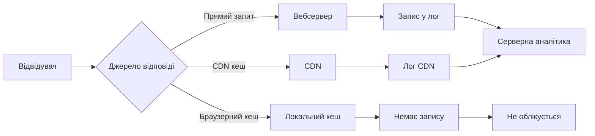
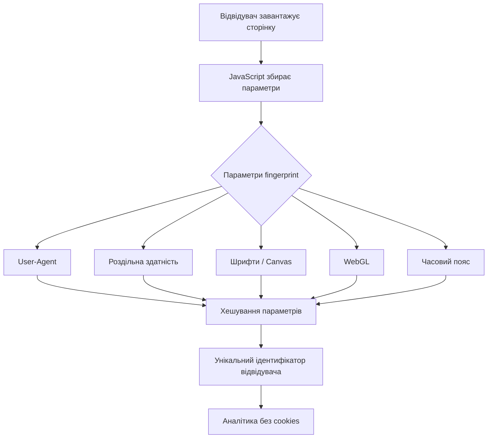

# Лекція 11. Альтернативні платформи аналітики

## 1. Огляд Matomo: self-hosted vs cloud, privacy-first підхід

### 1.1. Що таке Matomo

Matomo (до 2018 року відома як Piwik) — відкрита платформа вебаналітики, яка є найпопулярнішою альтернативою Google Analytics. Головна ідея, що відрізняє Matomo від більшості конкурентів, полягає в повному контролі над даними: власник сайту сам вирішує, де зберігаються дані відвідувачів і хто до них має доступ.

Matomo використовує принцип privacy-first — тобто конфіденційність є не додатковою функцією, а фундаментальним архітектурним рішенням. Це означає, що за замовчуванням платформа мінімізує збір персональних даних і надає інструменти для дотримання вимог GDPR без значних налаштувань.

### 1.2. Self-hosted варіант

Self-hosted Matomo — це варіант розгортання, за якого весь програмний стек встановлюється на власному сервері або на орендованому VPS. Адміністратор повністю контролює базу даних, сервер і конфігурацію.

Технічні вимоги для встановлення:

- PHP версії 7.2.5 або вище.
- MySQL або MariaDB для зберігання даних.
- Вебсервер Apache або Nginx.

Процес встановлення зводиться до завантаження дистрибутива, розгортання на сервері та запуску майстра встановлення через браузер. Після встановлення на сайт додається трекінговий код, аналогічний за структурою до коду GA4.

Переваги self-hosted варіанту:

- Повна власність над даними: жодна третя сторона не має доступу до аналітики.
- Відсутність ліміту відвідувань або обсягу даних.
- Можливість зберігати дані нескінченно довго (у GA4 є обмеження 14 місяців для необроблених даних).
- Безкоштовність основного функціоналу.
- Можливість кастомізації через плагіни.

Недоліки:

- Потрібні технічні навички для адміністрування сервера.
- Відповідальність за безпеку, оновлення та резервне копіювання лежить на власнику.
- Витрати на хостинг (зазвичай від 5 до 20 USD на місяць).

### 1.3. Cloud-варіант (Matomo Cloud)

Matomo Cloud — це SaaS-версія тієї самої платформи, де Matomo Inc. бере на себе всю інфраструктурну роботу. Користувач отримує готову до роботи аналітику без необхідності налаштовувати сервер.

Ключові характеристики:

- Безкоштовний тріальний період 21 день.
- Тарифи починаються від 19 USD на місяць (залежать від кількості відвідувань).
- Дані зберігаються на серверах Matomo, але не передаються третім сторонам і не використовуються для реклами.
- Matomo Cloud сертифікована для використання у Франції та відповідає стандартам CNIL (французький регулятор захисту даних).

### 1.4. Privacy-first підхід Matomo

Matomo реалізує конфіденційність через кілька механізмів:

Анонімізація IP-адрес є функцією, за якої система зберігає лише частину IP-адреси відвідувача. Наприклад, адреса `203.0.113.42` зберігається як `203.0.113.0`, що не дозволяє ідентифікувати конкретного користувача.

Опція «Поважати Do Not Track» дозволяє платформі автоматично ігнорувати трекінг для користувачів, які увімкнули відповідний заголовок браузера.

Функція cookie-less tracking дозволяє відстежувати відвідувачів без використання файлів cookie на основі fingerprinting або збереження ідентифікатора сесії лише в межах поточного сеансу.

Matomo також надає інструмент opt-out для відвідувачів — спеціальний iframe, який можна вбудувати в сторінку політики конфіденційності, де користувач може самостійно відмовитися від відстеження.


## 2. Plausible Analytics: мінімалістичний, cookie-less tracking

### 2.1. Концепція Plausible

Plausible Analytics — це мінімалістична відкрита платформа вебаналітики, що була створена з єдиною метою: надавати найважливіші метрики у найпростішому інтерфейсі без порушення конфіденційності відвідувачів. Проєкт розробляється невеликою командою з Естонії і позиціонується як «Аналітика для людей, які цінують конфіденційність».

Plausible сповідує радикальний підхід до мінімалізму — замість сотень метрик та звітів платформа фокусується на кількох ключових показниках: унікальні відвідувачі, перегляди сторінок, показник відмов, середній час на сайті та джерела трафіку.

### 2.2. Архітектура cookie-less tracking

Ключова технічна особливість Plausible полягає у тому, що платформа не використовує файли cookie взагалі — ні першого, ні третього боку. Це принципово відрізняє її від GA4, де cookies є основним механізмом ідентифікації.

Замість cookies Plausible використовує хешування для ідентифікації унікальних відвідувачів. Для кожного запиту платформа генерує хеш на основі IP-адреси, User-Agent рядка, назви домену та поточної дати. Цей хеш:

- не зберігається у базі даних (обчислюється щоразу заново);
- є унікальним лише в межах одного дня (щодня перегенеровується);
- не дозволяє відстежувати одного користувача між різними сайтами;
- не може бути використаний для ідентифікації конкретної особи.

Такий підхід означає, що Plausible не вимагає банера cookie consent у більшості юрисдикцій Євросоюзу, оскільки не обробляє персональні дані у розумінні GDPR.

### 2.3. Технічні характеристики

Розмір скрипта Plausible становить менше 1 KB, що є приблизно в 45 разів меншим за скрипт GA4. Це позитивно впливає на продуктивність сайту та показники Core Web Vitals.

Plausible пропонує два варіанти використання:

- Хмарна версія з тарифами від 9 USD на місяць (100 000 відвідувань).
- Self-hosted версія (безкоштовна) — розгортається через Docker.

Платформа надає публічні дашборди, які можна зробити відкритими для загального доступу без автентифікації. Це корисно для відкритих проєктів або медіа, що хочуть демонструвати свою аудиторію.

### 2.4. Обмеження Plausible

Попри привабливу простоту, Plausible має значні обмеження порівняно з GA4:

- Відсутність детальних звітів по поведінці користувачів (flow звіти, воронки продажів).
- Обмежені можливості для електронної комерції.
- Немає інтеграції з рекламними платформами (Google Ads, Facebook Ads).
- Відсутність machine learning функцій та прогнозів.
- Не підходить для великих корпоративних сайтів з комплексними аналітичними потребами.


## 3. Microsoft Clarity: heat maps, session recordings, безкоштовний інструмент

### 3.1. Що таке Microsoft Clarity

Microsoft Clarity — це безкоштовний інструмент поведінкової аналітики від Microsoft, що дозволяє розуміти, як користувачі взаємодіють із сайтом. На відміну від Matomo або Plausible, Clarity не є заміною Google Analytics — це доповнювальний інструмент, що фокусується на якісній стороні взаємодії, а не на кількісних метриках.

Ключова перевага Clarity — це повна безкоштовність без будь-яких лімітів на кількість сесій, розмір сайту або тривалість зберігання даних. Це робить платформу особливо привабливою для малого бізнесу та стартапів.

### 3.2. Heat maps

Heat maps (теплові карти) — це візуальне відображення активності користувачів на сторінці. Clarity пропонує три типи теплових карт.

Click maps відображають, де саме користувачі клікають на сторінці. Більш насичений колір (від синього до червоного) означає вищу концентрацію кліків. Це дозволяє виявити:

- елементи, на які натискають, але які не є посиланнями («rage clicks»);
- CTA кнопки з низькою клікабельністю;
- навігаційні елементи, якими користуються найчастіше.

Scroll maps показують, як далеко прокручують сторінку відвідувачі. Стандартна проблема, яку виявляють scroll maps, — це розташування важливого контенту нижче «лінії прокрутки» (fold), де його бачать лише 20-30% відвідувачів.

Move maps відображають рух курсора миші. Дослідження показують кореляцію між рухом очей та рухом курсора, тому move maps дають непрямий доказ того, які ділянки сторінки привертають увагу.

### 3.3. Session recordings

Session recordings (записи сесій) — це відтворення реальних сесій відвідувачів у вигляді відео. Clarity автоматично записує взаємодії: рухи курсора, кліки, прокрутку, введення тексту (у захищеному режимі, без відображення паролів).

Clarity автоматично виявляє та маркує проблемні сесії за такими критеріями:

- Dead clicks — кліки на елементи, що не реагують.
- Rage clicks — серія швидких кліків на одному місці, що свідчить про розчарування користувача.
- Excessive scrolling — надмірна прокрутка, яка може означати труднощі з пошуком потрібного контенту.
- Quick backs — ситуації, коли користувач заходить на сторінку та одразу повертається назад.

Фільтрація записів дозволяє знаходити конкретні сценарії: наприклад, сесії, де користувач дійшов до сторінки оформлення замовлення, але не завершив покупку.

### 3.4. Встановлення та інтеграції

Встановлення Clarity відбувається через додавання невеликого JavaScript-фрагменту в секцію `<head>` HTML-сторінки або через Google Tag Manager. Процес займає кілька хвилин.

Clarity має вбудовану інтеграцію з Google Analytics 4: після підключення в GA4 з'являється новий параметр, що дозволяє безпосередньо відкривати запис сесії для конкретного відвідувача зі звіту GA4.

```html
<!-- Приклад коду встановлення Clarity -->
<script type="text/javascript">
    (function(c,l,a,r,i,t,y){
        c[a]=c[a]||function(){(c[a].q=c[a].q||[]).push(arguments)};
        t=l.createElement(r);t.async=1;t.src="https://www.clarity.ms/tag/"+i;
        y=l.getElementsByTagName(r)[0];y.parentNode.insertBefore(t,y);
    })(window, document, "clarity", "script", "ВАШ_PROJECT_ID");
</script>
```

### 3.5. Обмеження та питання конфіденційності

Безкоштовність Clarity має свою ціну: Microsoft використовує зібрані дані для навчання своїх моделей машинного навчання та покращення власних продуктів, зокрема пошукової системи Bing. Це важливо враховувати при оцінці відповідності платформи вимогам GDPR.

Clarity автоматично маскує поля введення (пароли, номери банківських карток), однак відповідальність за налаштування маскування чутливих даних лежить на власнику сайту.


## 4. Серверна аналітика: аналіз логів, переваги та недоліки

### 4.1. Що таке серверні логи

Серверна аналітика базується на аналізі log-файлів вебсервера. Кожен HTTP-запит до сервера автоматично записується у лог у такому форматі:

```
203.0.113.42 - - [21/Feb/2026:14:35:22 +0000] "GET /about-us HTTP/1.1" 200 4523
"https://google.com/search?q=..." "Mozilla/5.0 (Windows NT 10.0; Win64; x64)..."
```

Кожен рядок містить IP-адресу відвідувача, дату та час запиту, HTTP-метод та URL, код статусу відповіді (200, 404, 301 тощо), розмір відповіді у байтах, URL реферера та рядок User-Agent браузера.

### 4.2. Інструменти аналізу логів

Для обробки великих об'ємів лог-файлів використовуються спеціалізовані інструменти.

AWStats — безкоштовний інструмент з відкритим кодом, що генерує HTML-звіти зі статистикою відвідувань, географією, браузерами та іншими параметрами. Простий у налаштуванні, але має обмежений функціонал.

Screaming Frog Log File Analyser — інструмент від розробників популярного краулера, орієнтований на SEO-аналіз логів. Дозволяє аналізувати активність краулерів пошукових систем та виявляти технічні проблеми.

ELK Stack (Elasticsearch + Logstash + Kibana) — потужне рішення для enterprise-рівня, що дозволяє обробляти мільярди записів та будувати складні аналітичні дашборди.

### 4.3. SEO-переваги аналізу логів

З точки зору SEO, аналіз серверних логів надає унікальну інформацію, яку неможливо отримати через клієнтські трекінгові скрипти.

Активність краулерів — у логах видно кожен запит від Googlebot, Bingbot та інших краулерів. Це дозволяє зрозуміти, які сторінки Google сканує найчастіше, а які ігнорує. Наприклад, якщо Googlebot витрачає весь «crawl budget» на нерелевантні URL (параметризовані сторінки, сторінки пагінації), це може пояснити повільну індексацію важливого контенту.

Виявлення 404 помилок для SEO-ботів. Деякі помилки можуть не відображатися в Google Search Console або виникати лише за певних умов, але логи фіксують їх усі без виключень.

Аналіз реального трафіку без фільтрів. JavaScript-трекери (GA4, Matomo) не фіксують відвідування від ботів, спайдерів та API-запитів, тоді як у логах є повна картина.

### 4.4. Недоліки серверної аналітики

Серверні логи мають суттєві обмеження, що роблять їх доповненням, а не заміною клієнтській аналітиці.

По-перше, логи не надають контекст поведінки користувача на сторінці. Сервер фіксує лише факт завантаження URL, але не відстежує прокрутку, кліки, заповнення форм або час, проведений на сторінці.

По-друге, кешування унеможливлює повний облік відвідувань. Якщо сторінку завантажено з CDN або з кешу браузера, сервер не отримує запит і не записує відвідування в лог.

По-третє, для великих сайтів лог-файли можуть займати гігабайти даних щодня. Їх зберігання, обробка та аналіз вимагають додаткових ресурсів.




## 5. Порівняльна таблиця платформ

### 5.1. Комплексне порівняння

Нижче наведено зведену таблицю основних характеристик розглянутих платформ та Google Analytics 4 для порівняння.

| Параметр | Google Analytics 4 | Matomo Self-Hosted | Matomo Cloud | Plausible | Microsoft Clarity |
|---|---|---|---|---|---|
| Вартість | Безкоштовно | Безкоштовно | від 19 USD/міс | від 9 USD/міс | Безкоштовно |
| Власність даних | Google | Повна | Часткова | Частково | Microsoft |
| Cookie-less | Частково | Так | Так | Так | Ні |
| Потребує consent | Так | Залежить від налаштувань | Залежить від налаштувань | Ні | Так |
| Heat maps | Ні | Платний плагін | Включено | Ні | Так |
| Session recordings | Ні | Платний плагін | Включено | Ні | Так |
| E-commerce | Так | Так | Так | Обмежено | Ні |
| Рекламні інтеграції | Так | Ні | Ні | Ні | Ні |
| Складність налаштування | Середня | Висока | Низька | Низька | Дуже низька |
| Відкритий код | Ні | Так | Так | Так | Ні |

### 5.2. Рекомендації щодо вибору платформи

Вибір аналітичного інструменту залежить від контексту та пріоритетів проєкту.

Google Analytics 4 залишається стандартом де-факто для більшості комерційних проєктів завдяки безкоштовності, глибині функціоналу та інтеграції з рекламними платформами. Однак його складна модель даних та питання конфіденційності змушують шукати альтернативи.

Matomo Self-Hosted є оптимальним вибором для проєктів з високими вимогами до конфіденційності даних: державні установи, медичні платформи, фінансові сервіси. Самостійне розгортання забезпечує повний контроль, але вимагає технічних ресурсів.

Plausible підходить для медіапроєктів, блогів та невеликих вебзастосунків, де достатньо базових метрик і важлива простота без необхідності банера cookie consent.

Microsoft Clarity є обов'язковим доповненням до будь-якої основної аналітики для сайтів, де важливо розуміти поведінку користувачів. Особливо корисний для оптимізації лендингів, форм та e-commerce сторінок.


## 6. Cookie-less tracking: методи fingerprinting та server-side аналітика

### 6.1. Контекст: чому зникають cookies

Протягом 2020–2025 років ринок цифрової аналітики переживає фундаментальні зміни, пов'язані з обмеженням третьосторонніх cookies. Safari (через ITP — Intelligent Tracking Prevention) та Firefox вже блокують сторонні cookies за замовчуванням. Chrome поступово впроваджує обмеження через Privacy Sandbox.

Навіть першосторонні cookies (first-party cookies), які встановлює власний сайт, зазнають тиску: Safari обмежує їхній термін дії до 7 днів (або 24 годин для cookies, встановлених через JavaScript), що значно знижує точність вимірювання повернень користувачів.

У відповідь на ці зміни галузь розробляє альтернативні методи трекінгу без cookies.

### 6.2. Browser fingerprinting

Browser fingerprinting (відбиток браузера) — це метод ідентифікації відвідувача на основі унікального набору параметрів його браузерного середовища без зберігання будь-яких даних на пристрої користувача.

Типові параметри, що збираються для формування fingerprint:

- User-Agent рядок (браузер, версія, операційна система).
- Роздільна здатність та глибина кольору екрана.
- Часовий пояс та мова браузера.
- Список встановлених шрифтів (через Canvas API).
- Підтримувані MIME-типи та плагіни.
- WebGL renderer (назва відеокарти).
- Результати Canvas fingerprint (унікальне зображення, що генерує GPU).
- Підтримка технологій: WebRTC, localStorage, ServiceWorker.



Комбінація цих параметрів є настільки унікальною, що дослідження показують: 83–94% пристроїв можна ідентифікувати з точністю до одного браузера.

Etичні та правові аспекти fingerprinting викликають дискусії. Оскільки fingerprint не зберігає нічого на пристрої користувача, не всі юрисдикції вимагають для нього cookie consent. Однак Робоча група Article 29 ЄС визнає fingerprinting обробкою персональних даних, що підпадає під GDPR. FLoC (Federated Learning of Cohorts) від Google, як і інші API Privacy Sandbox, намагаються запропонувати компроміс між вимірюваністю та конфіденційністю.

### 6.3. Server-side tracking

Server-side tracking — це архітектурний підхід, за якого трекінговий код виконується не у браузері користувача (client-side), а на стороні сервера.

Традиційна (client-side) схема трекінгу виглядає так:

```
Браузер → JavaScript → GA4/GTM → Сервери Google
```

При server-side tracking схема змінюється:

```
Браузер → Власний сервер → Обробка → GA4/Matomo/інший endpoint
```

Реалізація зазвичай відбувається через Google Tag Manager Server-Side або через власний endpoint на Node.js, Python Flask тощо.

Переваги server-side tracking:

По-перше, обхід блокувальників реклами (Ad blockers). Більшість блокувальників реклами блокують запити до відомих доменів трекерів (google-analytics.com, clarity.ms). Запити до власного домену (analytics.mysite.com) блокувальники зазвичай не ідентифікують як трекінг.

По-друге, повний контроль над переданими даними. Перед відправкою даних у GA4 чи інший інструмент сервер може анонімізувати IP-адреси, видаляти персональні дані або трансформувати events за власною логікою.

По-третє, консолідація даних. Сервер може збагачувати аналітичні події даними з CRM, бази замовлень або інших внутрішніх систем, формуючи повнішу картину.

По-четверте, краща точність вимірювання. ITP та інші механізми блокування cookies не впливають на серверний трекінг, оскільки cookies встановлює сам сервер як first-party cookies HTTP Set-Cookie заголовком.

### 6.4. Порівняння методів cookie-less tracking

| Метод | Точність | Складність реалізації | Відповідність GDPR | Стійкість до блокувань |
|---|---|---|---|---|
| First-party cookies | Висока | Низька | Потребує consent | Середня |
| Browser fingerprinting | Середня | Середня | Спірна | Висока |
| Server-side tracking | Висока | Висока | Залежить від реалізації | Дуже висока |
| LocalStorage ID | Висока | Низька | Потребує consent | Низька |
| Plausible-метод (денний хеш) | Низька | Низька | Відповідає | Висока |

### 6.5. Практичний приклад: server-side endpoint

Нижче наведено спрощений приклад сервера на Node.js, що приймає аналітичні події від браузера та пересилає їх до GA4 Measurement Protocol:

```javascript
const express = require('express');
const fetch = require('node-fetch');

const app = express();
app.use(express.json());

// Endpoint для отримання подій від браузера
app.post('/analytics/event', async (req, res) => {
    const { eventName, params, clientId } = req.body;

    // Анонімізуємо IP перед відправкою
    const anonymizedIp = req.ip.split('.').slice(0, 3).join('.') + '.0';

    // Відправляємо до GA4 Measurement Protocol
    await fetch('https://www.google-analytics.com/mp/collect', {
        method: 'POST',
        body: JSON.stringify({
            client_id: clientId,
            events: [{
                name: eventName,
                params: {
                    ...params,
                    // Видаляємо персональні дані
                    user_ip: anonymizedIp
                }
            }]
        })
    });

    res.json({ status: 'ok' });
});
```


## Підсумок

Лекція розглянула альтернативні платформи вебаналітики та сучасні підходи до трекінгу в умовах зростаючих вимог до конфіденційності даних.

Matomo пропонує найповніший функціонал серед відкритих платформ з повним контролем над даними у self-hosted варіанті, тоді як Plausible обирає радикальну простоту та privacy-by-default. Microsoft Clarity займає унікальну нішу безкоштовного інструменту поведінкової аналітики без аналогів у безкоштовному сегменті. Серверна аналітика через аналіз логів надає незамінну інформацію про активність краулерів та реальний трафік, але не замінює клієнтські рішення.

Cookie-less tracking через fingerprinting та server-side архітектуру є відповіддю галузі на обмеження браузерів та вимоги GDPR, але кожен метод має власний компроміс між точністю, складністю та відповідністю вимогам конфіденційності.

Сучасний підхід до аналітики часто передбачає комбінацію кількох інструментів: GA4 або Matomo для кількісних даних, Microsoft Clarity для якісної поведінкової аналітики та серверних логів для SEO-моніторингу.
