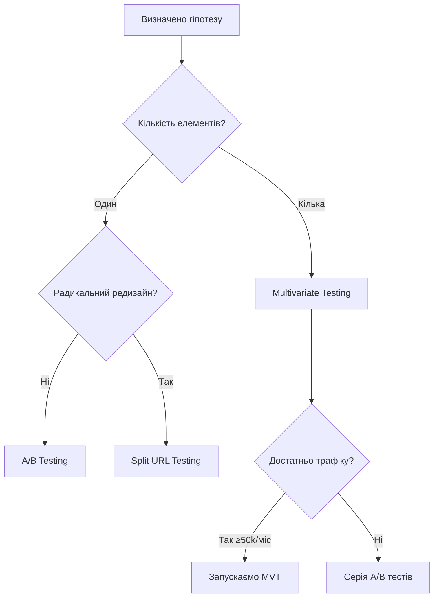
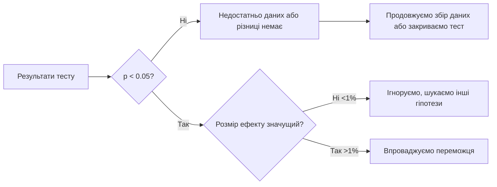
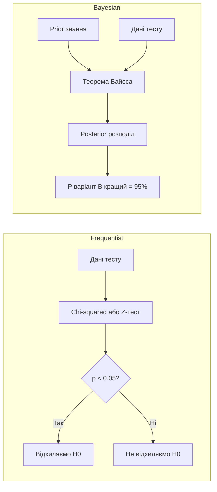

# Лекція 12. A/B тестування — теорія

## 1. Conversion Rate Optimization: методологія та фреймворки

Conversion Rate Optimization (CRO) — це систематичний процес підвищення частки відвідувачів вебсайту, які виконують цільову дію: купують товар, залишають контакт, завантажують матеріал або реєструються. На відміну від SEO, яке залучає більше трафіку, CRO зосереджується на тому, щоб наявний трафік конвертувався ефективніше.

Коефіцієнт конверсії (Conversion Rate, CR) обчислюється за формулою:

$$CR = \frac{\text{Кількість конверсій}}{\text{Кількість відвідувачів}} \times 100\%$$

Наприклад, якщо вебсайт отримує 5 000 відвідувачів на місяць і 150 з них здійснюють покупку, CR = 3%. Навіть незначне підвищення цього показника до 3,5% дає +25% доходу без збільшення рекламного бюджету.

### Методологія CRO

Ефективна CRO-практика будується на наукоподібному підході: спостереження → гіпотеза → експеримент → аналіз → впровадження. Це циклічний процес, де кожен раунд тестування дає знання для наступного.

Серед найпоширеніших фреймворків виділяють:

- **PIE** (Potential, Importance, Ease) — оцінює потенціал сторінки до покращення, важливість для бізнесу та простоту реалізації тесту за шкалою 1–10. Пріоритет отримують сторінки з найвищим середнім балом.
- **ICE** (Impact, Confidence, Ease) — схожий підхід, але включає рівень впевненості команди в гіпотезі на основі наявних даних.
- **HEART** (Happiness, Engagement, Adoption, Retention, Task success) — фреймворк Google для вимірювання якості користувацького досвіду, особливо корисний для складних продуктів.

### Де шукати можливості для оптимізації

Дані для CRO надходять з кількох джерел. Кількісні джерела включають аналітику (Google Analytics 4, Hotjar, Microsoft Clarity), яка показує, де користувачі відходять з воронки продажів. Якісні джерела — опитування, інтерв'ю з користувачами, записи сесій — допомагають зрозуміти чому це відбувається. Поєднання обох підходів дає найповнішу картину.

## 2. Hypothesis-driven testing: як формулювати гіпотези

Гіпотеза в A/B тестуванні — це чітко сформульоване припущення про те, що зміна певного елементу призведе до визначеного результату. Погано сформульована гіпотеза робить неможливим аналіз результатів, навіть якщо тест технічно успішний.

### Структура правильної гіпотези

Найпоширеніший шаблон виглядає так:

> «Якщо ми [змінимо X на Y], то [метрика Z] збільшиться/зменшиться на [N%], тому що [обґрунтування на основі даних]».

Приклад слабкої гіпотези: «Змінимо колір кнопки з сірого на зелений».

Приклад сильної гіпотези: «Якщо ми змінимо колір CTA-кнопки "Купити зараз" з сірого (#9E9E9E) на яскраво-помаранчевий (#FF6B35), коефіцієнт кліків на сторінці продукту зросте на 15%, тому що heat map показує, що 60% користувачів не помічають поточну кнопку через низький контраст з фоном».

Ключові елементи сильної гіпотези:

- конкретний елемент, який змінюється;
- конкретна вимірювана метрика;
- кількісна ціль;
- обґрунтування, що спирається на реальні дані.

### Пріоритизація гіпотез

Команди зазвичай мають більше гіпотез, ніж ресурсів для тестування. Фреймворк PIE або ICE допомагає вибрати, з чого почати. Додатково варто враховувати обсяг трафіку на сторінці (мало трафіку = довгий тест), технічну складність реалізації та стратегічну важливість для бізнесу.

## 3. A/B testing vs multivariate testing vs split URL testing

Існує кілька типів тестування, кожен з яких підходить для різних ситуацій.

### A/B тестування

A/B тест порівнює дві версії однієї сторінки або елементу: контрольну (A) і варіант (B). Трафік ділиться між ними, як правило, 50/50. Це найпоширіший тип тесту через простоту аналізу та мінімальні технічні вимоги.

Коли використовувати: тестування одного конкретного елементу (заголовок, CTA, зображення, ціна).

Обмеження: не дозволяє одночасно тестувати взаємодію кількох елементів.

### Multivariate testing (MVT)

MVT тестує кілька елементів одночасно й усі можливі їхні комбінації. Наприклад, якщо тестується 2 варіанти заголовку та 3 варіанти зображення, виникає 6 комбінацій (2 × 3). MVT дозволяє виявити не лише кращий варіант кожного елементу, а й їхню синергію або конфлікт.

Коли використовувати: на сторінках з великим трафіком, коли треба оптимізувати кілька елементів одночасно.

Обмеження: потребує набагато більшого трафіку для статистичної значущості. Для 6 комбінацій потрібно приблизно в 6 разів більше трафіку, ніж для простого A/B тесту.

### Split URL testing

На відміну від A/B тесту, де варіанти живуть на тій самій URL (контент змінюється динамічно через JavaScript), split URL тест направляє користувачів на різні URL-адреси. Наприклад, `/checkout-v1` проти `/checkout-v2`.

Коли використовувати: тестування радикально нових дизайнів або архітектурних змін, де динамічна заміна контенту технічно складна або неможлива.

Обмеження: може впливати на SEO, оскільки два URL конкурують між собою; потребує налаштування canonical tags або тимчасового виключення тестових URL з індексації.

## 4. Статистична значущість: p-value та confidence level

Статистична значущість — це ймовірність того, що спостережуваний результат не є випадковим. Без її розуміння неможливо відрізнити реальне покращення від звичайного коливання даних.

### P-value

P-value (p-значення) — це ймовірність отримати такий самий або більш екстремальний результат за умови, що нульова гіпотеза (різниці між варіантами немає) є істинною.

Нульова гіпотеза в A/B тесті: «Варіант B не відрізняється від варіанту A».

- Якщо p = 0,03, це означає: якби різниці не існувало, ми б спостерігали такий результат лише в 3% випадків.
- Загальноприйнятий поріг: p < 0,05 (тобто менше ніж 5% ймовірність випадкового результату).

Важливо: p-value не говорить про розмір ефекту або практичну значущість результату. Можна мати статистично значуще, але практично незначуще покращення (наприклад, конверсія виросла з 3,00% до 3,01%).

### Confidence level та confidence interval

Confidence level (рівень достовірності) — це доповнення p-value до 1: при p < 0,05 confidence level = 95%. Це найчастіше використовуваний стандарт в A/B тестуванні. Для критично важливих бізнес-рішень іноді використовують 99% (p < 0,01).

Confidence interval (довірчий інтервал) показує діапазон, в якому з заданою ймовірністю знаходиться справжній розмір ефекту. Наприклад: «Конверсія зросла на 12% ± 4% з 95% довірчим інтервалом» означає, що реальне покращення, скоріш за все, знаходиться між 8% і 16%.

### Практичне застосування

## 5. Sample size calculation: скільки потрібно трафіку

Одна з найчастіших помилок — запускати тест без попереднього розрахунку необхідного розміру вибірки. Завершення тесту до досягнення достатньої кількості учасників призводить до хибних висновків.

### Фактори, що впливають на розмір вибірки

На необхідний розмір вибірки впливають чотири ключових параметри.

Базовий CR (Baseline Conversion Rate) — поточний коефіцієнт конверсії. Чим він нижчий, тим більше учасників потрібно, щоб виявити зміну. Тест на сторінці з CR = 1% потребує приблизно втричі більше трафіку, ніж тест на сторінці з CR = 10%.

Мінімальний виявлюваний ефект (MDE, Minimum Detectable Effect) — найменше відносне покращення, яке вважається практично значущим. Якщо CR = 5%, а MDE = 10%, очікується зростання до 5,5%. Чим менший MDE, тим більша вибірка потрібна.

Statistical power (статистична потужність) — ймовірність виявити реальний ефект, якщо він існує. Стандарт: 80% (β = 0,20). Це означає 20% ймовірність хибнонегативного результату.

Significance level — поріг p-value, зазвичай 0,05.

### Формула та онлайн-калькулятори

Для двосторонніх тестів (two-tailed) формула розміру вибірки:

$$n = \frac{(Z_{\alpha/2} + Z_{\beta})^2 \cdot (p_1(1-p_1) + p_2(1-p_2))}{(p_1 - p_2)^2}$$

де $p_1$ — базовий CR, $p_2$ — очікуваний CR після зміни, $Z_{\alpha/2}$ = 1,96 (для α = 0,05), $Z_{\beta}$ = 0,84 (для 80% потужності).

На практиці використовують калькулятори: Optimizely Sample Size Calculator, AB Testguide, VWO Sample Size Calculator.

Приклад: базовий CR = 3%, очікуване покращення = 15% відносних (тобто новий CR = 3,45%), significance level = 5%, power = 80%. Необхідний розмір вибірки ≈ 15 000 відвідувачів на варіант, тобто 30 000 загалом.

## 6. Типові помилки в A/B тестуванні

### Peeking (Підглядання)

Peeking — це передчасне завершення тесту, коли результати виглядають обнадійливо, ще до досягнення запланованого розміру вибірки. Це одна з найпоширеніших і найнебезпечніших помилок.

Проблема полягає в тому, що при багаторазовій перевірці результатів у процесі тесту ймовірність хибнопозитивного висновку різко зростає. Якщо перевіряти результати щодня, реальний рівень значущості може досягати 20–30% замість декларованих 5%.

Вирішення: визначити заздалегідь мінімальний розмір вибірки та тривалість тесту і не зупиняти його достроково, навіть якщо один варіант виглядає кращим.

### Multiple testing problem (Проблема множинного тестування)

Якщо проводити багато незалежних тестів одночасно, статистично значущий «переможець» з'явиться випадково. При 20 тестах з порогом p < 0,05 в середньому один тест дасть хибнопозитивний результат суто через випадковість.

Вирішення: використовувати поправку Бонферроні (ділити поріг значущості на кількість тестів) або Sequential testing методи.

### Seasonality bias (Сезонний зсув)

Тест, що проводиться в понеділок-середу, показуватиме інші результати, ніж тест у вихідні, навіть якщо насправді варіанти однакові. Трафік у різні дні тижня, місяці чи сезони складається з різних аудиторій.

Вирішення: тест має тривати мінімум два повних тижні та охоплювати всі дні тижня.

### Sample ratio mismatch (SRM)

SRM виникає, коли реальний розподіл трафіку між варіантами суттєво відрізняється від запланованого (наприклад, 50/50, а реально вийшло 53/47). Причини: помилки в реалізації, кешування, bot traffic. SRM робить результати тесту ненадійними.

Перевірка: chi-squared тест для розподілу трафіку до аналізу основних метрик.

### Новизна ефект (Novelty effect)

Коли варіант B виглядає краще лише тому, що користувачі реагують на новизну змін, а не на реальне покращення UX. Через певний час ефект зникає.

Вирішення: аналізувати когорти — окремо переглядати результати нових та повернутих відвідувачів.

## 7. Bayesian vs Frequentist підходи

У A/B тестуванні існують два фундаментально різні статистичні підходи, і вибір між ними впливає як на методологію, так і на інтерпретацію результатів.

### Frequentist підхід (Частотний)

Це класичний підхід, який лежить в основі p-value та confidence intervals. Він відповідає на питання: «Якщо нульова гіпотеза істинна, наскільки ймовірно спостерігати такі дані?»

Переваги: широко зрозумілий, чітко визначені процедури, простота формалізації критеріїв зупинки тесту.

Недоліки: не можна безпосередньо сказати «є 95% ймовірність, що варіант B кращий» (це поширена помилка інтерпретації). Тест не можна зупиняти достроково (проблема peeking).

### Bayesian підхід (Баєсівський)

Байєсівський підхід використовує попереднє знання (prior) і оновлює його на основі нових даних. Він відповідає на питання: «Яка ймовірність того, що варіант B кращий за A?»

Формула Байєса:

$$P(H|D) = \frac{P(D|H) \cdot P(H)}{P(D)}$$

де P(H|D) — posterior (ймовірність гіпотези після отримання даних), P(D|H) — likelihood (ймовірність даних за умови гіпотези), P(H) — prior (попередня ймовірність гіпотези).

Переваги: можна безпосередньо говорити про ймовірність («є 92% ймовірність, що B кращий за A»), дозволяє зупиняти тести раніше без накопичення помилки, природно враховує попередній досвід.

Недоліки: вибір prior впливає на результати (суб'єктивність), складніший для пояснення стейкхолдерам, важчий для стандартизації.

### Що обирати на практиці

Для більшості команд Frequentist підхід є достатнім та простішим у впровадженні. Bayesian підходи набувають популярності в платформах типу Optimizely та Google Optimize (колишній), оскільки дозволяють більш інтуїтивну інтерпретацію. Незалежно від вибору підходу, принципи правильного збору даних, уникнення peeking та коректного розміру вибірки залишаються однаково важливими.

## Підсумок

A/B тестування — це не просто технічний інструмент, а повноцінна наукова методологія. Правильно організований тест вимагає: чіткої гіпотези на основі даних, попереднього розрахунку розміру вибірки, дотримання дисципліни (не зупиняти тест достроково), коректної статистичної інтерпретації та системного підходу до пріоритизації. CRO — це марафон, а не спринт: сотні малих, добре сформульованих та коректно проведених тестів за рік дають значно більший ефект, ніж кілька великих реструктуризацій сайту без аналітики.
