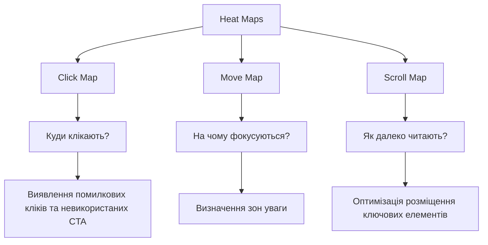
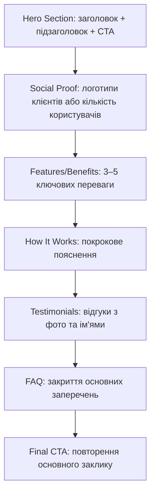

# Лекція 13. CRO інструменти та UX аналіз

## 1. Heat maps: типи, принцип роботи та інтерпретація

Heat map (теплова карта) — це візуальне представлення поведінки користувачів на сторінці, де кольори відображають інтенсивність взаємодії. «Гарячі» зони (червоний, жовтий) позначають місця з найвищою активністю, «холодні» (синій, зелений) — з низькою.

### Типи теплових карт

Існує три основні типи теплових карт, кожен з яких фіксує різний аспект поведінки.

Click map (карта кліків) показує, куди користувачі клікають на сторінці. Це найінформативніший тип: він виявляє помилкові кліки (клацання на не інтерактивні елементи, які виглядають як кнопки), невикористані CTA (кнопка "Купити" майже без кліків) та несподівані патерни навігації.

Move map (карта руху миші) фіксує траєкторії переміщення курсору. Є досліди, що рух миші корелює з рухом погляду приблизно на 60–80%, тому move map може замінити дороге eye-tracking дослідження. Зони, де курсор зупиняється надовго, свідчать про увагу або сумніви користувача.

Scroll map (карта прокрутки) показує, яка частка відвідувачів доходить до певного рівня сторінки. Це критично важливо для розміщення ключових елементів: якщо 70% користувачів іде зі сторінки, не доскролюючи до форми, форму треба підняти вище.

### Як інтерпретувати теплові карти

При аналізі click map звертайте увагу на:

- клацання на не інтерактивні елементи (це означає, що вони виглядають як посилання або кнопки, але не є ними — розчарування користувача);
- розподіл кліків між навігаційними посиланнями та контентними CTA;
- клацання «в порожнечу» — ознака того, що користувач шукає функціональність, якої немає.

При аналізі scroll map ключова метрика — рівень сторінки, до якого доходять 50% і 80% відвідувачів. Усі критичні елементи (основна пропозиція, CTA, соціальні докази) мають бути вище точки 50%. Якщо важливий контент знаходиться нижче рівня, до якого доходять лише 20% користувачів, він фактично не існує для більшості аудиторії.

## 2. Session recordings: що дивитися та червоні прапорці

Session recording (запис сесії) — це відеозапис навігації реального користувача: рухи миші, кліки, прокрутка, заповнення форм, помилки. Це найбільш «людський» інструмент аналітики, який показує реальний контекст поведінки.

### Де відбувається найбільша цінність

Session recordings найефективніші у трьох сценаріях. По-перше, після виявлення аномалій в аналітиці: GA4 показує, що 80% користувачів іде зі сторінки оформлення замовлення — записи пояснять чому. По-друге, при тестуванні нових функцій: як реально поводяться користувачі з новим UI-компонентом? По-третє, при аналізі звернень до підтримки: якщо користувачі постійно скаржаться на одну функцію, перегляд записів покаже де саме виникає проблема.

### Червоні прапорці в session recordings

Rage clicks — повторні швидкі кліки на один елемент. Це класичний сигнал розчарування: кнопка не реагує, форма не відправляється, посилання не спрацьовує. Microsoft Clarity та Hotjar автоматично виявляють і теґують такі сесії.

U-turn behavior — користувач відкриває сторінку, починає взаємодіяти (прокручує, рухає мишею) і швидко повертається назад. Частіше означає невідповідність між очікуваннями (з пошуку або реклами) та контентом сторінки.

Form abandonment — користувач починає заповнювати форму, але не завершує. Особлива увага до точки виходу: якщо більшість залишає форму на полі "Телефон" або "Адреса", це сигнал зайвого запиту даних.

Dead clicks — кліки в місця, де нічого не відбувається. Часто свідчать про неочевидну навігацію або порушену функціональність.

## 3. Form analytics: де і чому користувачі кидають форми

Форма (реєстрація, оформлення замовлення, контактна форма) — одна з найкритичніших точок конверсії на більшості сайтів. Form analytics надає детальну інформацію про поведінку в межах кожного конкретного поля форми.

### Ключові метрики form analytics

Completion rate — частка відвідувачів, які розпочали та завершили форму. Середній показник для форм оформлення замовлення — 46–68% залежно від галузі.

Field drop-off rate — частка користувачів, які залишили форму після взаємодії з конкретним полем. Поля з найвищим drop-off — першочергові кандидати для оптимізації або видалення.

Time on field — час, витрачений на заповнення конкретного поля. Надто довгий час на простому полі (ім'я, email) може свідчити про незрозумілий лейбл або помилку валідації.

Return rate — частка користувачів, що повертаються до вже заповненого поля. Часто означає, що форма показала помилку валідації або умова заповнення незрозуміла.

### Рекомендації на основі аналітики форм

Якщо конкретне поле має drop-off > 30%, потрібно перевірити: чи обов'язкове це поле? Чи чітко сформульований лейбл? Чи є підказка (placeholder або tooltip)? Чи не запитує форма надто чутливі дані (телефон, дата народження) без пояснення навіщо?

Загальний принцип: кожне додаткове поле зменшує conversion rate приблизно на 11%. Мінімально необхідна кількість полів — завжди найкращий вибір.

## 4. UX аналіз: usability heuristics та friction points

UX-аналіз у контексті CRO — це систематичне виявлення місць, де досвід користувача ускладнений, незрозумілий або незадовільний. Friction point (точка тертя) — будь-який елемент, що уповільнює або перешкоджає конверсії.

### Евристики зручності використання Якоба Нільсена

10 евристик Нільсена — це класичний фреймворк для оцінювання інтерфейсів, розроблений у 1994 році і досі актуальний. Серед найбільш релевантних для CRO:

Видимість системного статусу: користувач завжди має знати, що відбувається. Якщо кнопка "Відправити" не показує індикатор завантаження, користувач натисне її декілька разів.

Відповідність системи та реального світу: терміни та концепції мають бути зрозумілі без спеціальної підготовки. Кнопка "Валідувати кошик" — поганий приклад; "Перевірити замовлення" — кращий.

Контроль та свобода користувача: завжди має бути очевидний спосіб вийти або скасувати дію. Відсутність кнопки "Назад" у checkout-процесі — типова friction point.

Запобігання помилкам: валідація форм у реальному часі (inline validation) зменшує кількість помилкових відправок і покращує conversion rate порівняно з валідацією після сабміту.

Розпізнавання замість пригадування: UI не повинен вимагати від користувача пам'ятати інформацію між кроками. Відображення обраних товарів у правій панелі checkout-сторінки — приклад застосування цього принципу.

### Типові friction points на вебсайтах

Обов'язкова реєстрація перед покупкою — одна з найбільш задокументованих причин відмов. Дослідження Baymard Institute показують, що 34% покупців залишають кошик через необхідність реєстрації. Рішення: "Guest checkout" з опційною реєстрацією після покупки.

Неочевидна вартість доставки — якщо ціна доставки стає відома лише на фінальному кроці checkout, 49% покупців відмовляться. Рішення: показувати вартість доставки якомога раніше або пропонувати безкоштовну доставку від певної суми.

Повільне завантаження — кожна додаткова секунда завантаження знижує conversion rate на 7%. Це технічний, але прямий friction point.

## 5. CTA optimization: розташування, колір, текст, розмір

CTA (Call to Action) — один з найвпливовіших елементів сторінки з точки зору конверсії. Навіть незначні зміни в CTA можуть дати статистично значущий результат у A/B тестах.

### Розташування

Above the fold (вище лінії прокрутки) — традиційне правило CRO. CTA має бути видимим без прокрутки на більшості пристроїв. Це особливо критично для мобільних користувачів.

Proximity to decision trigger — CTA розміщують поруч з елементами, що підштовхують до рішення: ціна, соціальний доказ (відгуки), гарантія повернення. Послідовність "Переваги → Ціна → CTA → Відгуки → CTA" (повторний CTA після відгуків) статистично показує кращі результати, ніж одиночне розміщення.

Sticky CTA для довгих сторінок — фіксована кнопка, яка залишається видимою при прокрутці (sticky header або floating button), може суттєво підвищити CR на landing pages зі значним контентом.

### Колір і контраст

Не існує «найкращого кольору для CTA» — це один з найпоширеніших міфів CRO. Ефективний колір CTA — той, який виділяється на фоні сторінки завдяки контрасту, а не той, що відповідає якомусь психологічному шаблону.

Практичне правило: коефіцієнт контрасту між кнопкою та фоном сторінки (відповідно до WCAG) має бути не менше ніж 4,5:1 для тексту нормального розміру. Перевірити можна через WebAIM Contrast Checker.

Колір кнопки не повинен повторюватися в інших елементах дизайну — ексклюзивність кольору підкреслює унікальність дії.

### Текст CTA

Мікрокопі CTA — слова на кнопці — має бути конкретним, орієнтованим на дію та відображати цінність, а не зусилля.

Порівняння:

- «Відправити» → нейтральний, не відображає цінності.
- «Отримати безкоштовну консультацію» → конкретний, орієнтований на вигоду.
- «Почати безкоштовно» → знижує сприймане зусилля.
- «Завантажити PDF (3,2 МБ)» → конкретика знижує невизначеність.

Персоналізація від першої особи: «Хочу отримати гайд» статистично показує кращі результати, ніж «Отримати гайд», особливо в SaaS-продуктах.

### Розмір і оточення

Кнопка має бути достатньо великою для натискання на мобільному пристрої (мінімум 44×44 px відповідно до рекомендацій Apple HIG та Google Material Design) та мати достатньо «повітря» навколо (whitespace), щоб виділятися серед інших елементів.

## 6. Landing page best practices

Landing page (цільова сторінка) — це сторінка, спеціально призначена для конверсії трафіку з конкретного джерела. На відміну від звичайних сторінок сайту, landing page зазвичай має одну чітку мету та мінімальну кількість відволікаючих елементів.

### Структурні принципи ефективної landing page

Message match — відповідність між рекламним оголошенням і заголовком landing page. Якщо реклама обіцяє «Безкоштовний аудит SEO за 24 години», а заголовок сторінки «Послуги SEO для бізнесу», користувач відчує розрив і піде. Коефіцієнт відповідності повідомлень прямо корелює з conversion rate.

Single objective — кожна landing page має одну ціль та один основний CTA. Наявність кількох конкуруючих CTA (реєстрація, завантаження, консультація) розпорошує увагу і знижує ефективність кожного з них.

Trust signals — елементи, що знижують сприймане ризик: відгуки з іменами та фото, логотипи клієнтів або ЗМІ, сертифікати та нагороди, гарантія повернення коштів, кількість клієнтів або транзакцій.

Above the fold — у видимій без прокрутки зоні має бути: заголовок з чіткою ціннісною пропозицією, підзаголовок з уточненням, основний CTA, (за можливістю) одне сильне зображення або ілюстрація.

### Типова структура high-converting landing page

### Видалення елементів навігації

На landing pages, що отримують трафік з реклами, видалення глобальної навігації (header menu) зазвичай підвищує CR. Навігація дає користувачу "вихід" зі сторінки до того, як він конвертується. Виняток: сторінки з органічного SEO-трафіку, де навігація потрібна для вивчення сайту.

## 7. Case studies успішних CRO оптимізацій

Аналіз реальних кейсів допомагає розуміти не лише техніки, а й процес прийняття рішень — від виявлення проблеми до вибору гіпотези і вимірювання результату.

### Кейс 1: Переформулювання CTA

Компанія Unbounce (платформа для landing pages) провела тест, в якому змінила текст CTA з «Start your free 30-day trial» на «Start my free 30-day trial». Зміна однієї букви — від другої особи до першої — дала +90% до CR на конкретній сторінці. Висновок: персоналізація мікрокопії, навіть мінімальна, може мати значний вплив.

### Кейс 2: Видалення полів форми

Компанія Imaginary Landscape прибрала 3 поля з контактної форми (з 11 до 8). Результат: +120% до submission rate при незначному зниженні якості лідів. Висновок: кожне зайве поле — це friction point, що знижує конверсію.

### Кейс 3: Додавання соціального доказу поруч з CTA

Компанія Highrise (SaaS-продукт від 37signals) протестувала кілька варіантів landing page. Варіант з реальним фото клієнта та його відгуком безпосередньо поруч з кнопкою реєстрації показав +102,5% конверсій порівняно з контрольним варіантом. Висновок: розміщення trust signals в безпосередній близькості від CTA підсилює ефект обох елементів.

### Кейс 4: Спрощення checkout процесу

ASOS (великий fashion e-commerce) додав опцію Guest Checkout після того, як аналіз показав масове покидання кошика на кроці реєстрації. Результат: +50% до завершених покупок від нових користувачів. Висновок: зниження бар'єрів для нових клієнтів часто має більший ефект, ніж оптимізація дизайну.

### Загальні уроки з кейсів

Кейси демонструють кілька закономірностей. По-перше, найбільший ефект часто дають не великі редизайни, а точкові зміни в критичних місцях конверсійної воронки. По-друге, рішення завжди мають спиратися на дані (аналітика, heat maps, записи сесій), а не на інтуїцію або тренди. По-третє, результат завжди треба перевіряти тестом — те, що спрацювало для одного сайту, може не спрацювати для іншого через відмінності аудиторії та контексту.

## Підсумок

CRO — це синтез кількісних даних (аналітика, heat maps, form analytics) і якісних спостережень (session recordings, usability testing). Жоден інструмент окремо не дає повної картини. Теплові карти покажуть куди клікають, але не пояснять чому. Записи сесій пояснять поведінку конкретного користувача, але не дадуть статистично значущого узагальнення. Саме поєднання інструментів, структурований процес формулювання гіпотез і дисциплінований підхід до A/B тестування перетворюють CRO з мистецтва на систематичну практику, що дає вимірюваний і відтворюваний результат.
