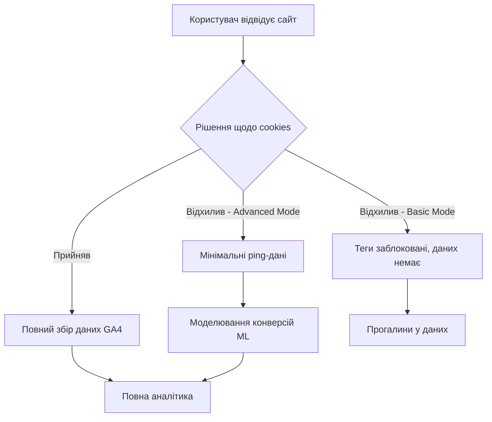
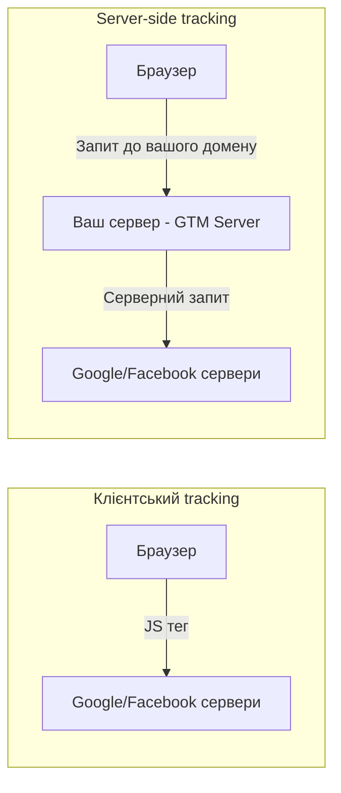
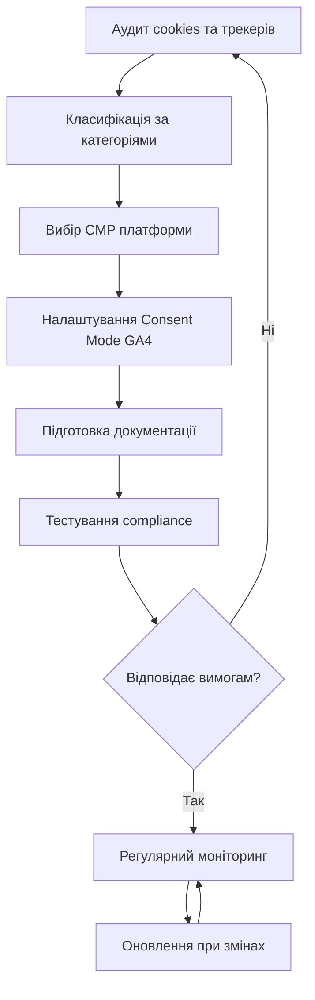

# Лекція 14 Приватність, GDPR та cookie-less майбутнє

## Вступ

Цифрова аналітика протягом десятиліть будувалась на здатності відстежувати поведінку користувачів у деталях, які самі користувачі часто не усвідомлювали. Cookies дозволяли ідентифікувати того самого відвідувача через місяці, треті сторони накопичували профілі по тисячах сайтів, а аналітичні платформи зберігали дані без жодних обмежень. Ця модель давала маркетологам надзвичайно точні інструменти, однак породжувала серйозні ризики для приватності людей.

Починаючи з 2018 року, законодавство та технологічні зміни докорінно перетворюють цей ландшафт. Регламент GDPR у Європейському Союзі, закон CCPA у Каліфорнії, поступова відмова браузерів від сторонніх cookies — усе це разом формує нову реальність, в якій веб-аналітика повинна функціонувати. Для спеціаліста з SEO та веб-аналітики розуміння правових вимог і технічних альтернатив є не менш важливим, ніж знання самих аналітичних інструментів.

## 1. GDPR та CCPA: ключові вимоги для веб-аналітики

### Загальний регламент захисту даних (GDPR)

GDPR — це регламент Європейського Союзу (Regulation 2016/679), що набув чинності 25 травня 2018 року. Він встановлює єдині правила обробки персональних даних громадян ЄС незалежно від того, де знаходиться компанія, яка ці дані обробляє. Тобто якщо ваш сайт відвідують користувачі з Німеччини або Франції, GDPR поширюється на вас навіть якщо ваша компанія зареєстрована в Україні.

Ключова концепція GDPR — персональні дані. До них належить будь-яка інформація, що дозволяє ідентифікувати фізичну особу: ім'я, адреса електронної пошти, IP-адреса, ідентифікатори cookies, мобільні ідентифікатори пристроїв. У контексті веб-аналітики майже всі дані, що збирає Google Analytics або подібні платформи, потенційно є персональними.

Регламент встановлює шість правових підстав для обробки персональних даних. Для веб-аналітики найбільш релевантні дві: згода суб'єкта даних (consent) та законний інтерес (legitimate interest). Однак використання законного інтересу для аналітичних cookies є спірним та ризикованим з точки зору регуляторів — більшість наглядових органів ЄС наполягають саме на явній згоді.

Права суб'єктів даних за GDPR включають право на доступ до своїх даних, право на їх видалення (право бути забутим), право на переносимість, право заперечувати проти обробки. Ваш сайт повинен мати механізми, що дозволяють користувачам реалізовувати ці права — зазвичай через контактну форму або спеціальну сторінку.

Штрафи за порушення GDPR вражаючі: до 20 мільйонів євро або 4% від річного глобального обороту компанії — залежно від того, яка сума більша. Серед реальних прикладів — штраф Google у розмірі 50 мільйонів євро від французького регулятора CNIL у 2019 році та ряд штрафів, пов'язаних саме з використанням Google Analytics без відповідної налаштування.

### Закон CCPA (Каліфорнія)

California Consumer Privacy Act набув чинності у 2020 році та встановлює права жителів штату Каліфорнія щодо їхніх персональних даних. Незважаючи на географічну прив'язку до одного штату, CCPA впливає на глобальну практику через розмір каліфорнійського ринку та схильність великих компаній застосовувати єдині стандарти для всіх користувачів.

На відміну від GDPR, CCPA не вимагає активної згоди перед збором даних — натомість він надає право відмовитись від продажу персональних даних третім сторонам (opt-out). Сайти, що підпадають під дію закону, зобов'язані розміщувати посилання "Do Not Sell My Personal Information" на видному місці. У 2023 році закон оновлено як CPRA, який розширив права споживачів і включив поняття "обмін даними" поряд із їхнім продажем.

Ключові відмінності між двома регуляторними системами можна узагальнити таким чином:

| Параметр | GDPR (ЄС) | CCPA (Каліфорнія) |
|---|---|---|
| Модель | Opt-in (потрібна явна згода) | Opt-out (відмова від продажу) |
| Суб'єкти | Громадяни ЄС | Жителі Каліфорнії |
| Поріг дії | Будь-який сайт, що обробляє дані громадян ЄС | Компанії з доходом >25 млн $ або >50 тис. споживачів |
| Штрафи | До 4% обороту | До $7,500 за навмисне порушення |

### Що це означає для веб-аналітики конкретно

Практичні наслідки для роботи аналітика такі: Google Analytics 4 без правильного налаштування не відповідає вимогам GDPR. Кілька країн ЄС — Австрія, Франція, Данія, Нідерланди — видали офіційні рішення про те, що GA у стандартному режимі порушує регламент через передачу IP-адрес та ідентифікаторів на сервери Google у США. Це вимагає або переходу на privacy-first альтернативи, або ретельного налаштування consent mode та анонімізації.

## 2. Cookie consent: вимоги та правильна імплементація

### Що таке cookies і чому вони регулюються

HTTP cookie — це невеликий текстовий файл, який вебсервер зберігає у браузері відвідувача. Cookies бувають різних типів залежно від їхнього призначення та джерела:

- Необхідні (essential) cookies забезпечують базове функціонування сайту: сесії авторизації, кошик покупок, мовні налаштування. Вони не потребують згоди користувача.
- Функціональні cookies запам'ятовують вподобання користувача, які не є критичними для роботи сайту.
- Аналітичні cookies збирають статистику про поведінку відвідувачів — саме такі використовує Google Analytics.
- Маркетингові cookies використовуються для таргетованої реклами та відстеження конверсій між різними сайтами.

За GDPR для всіх категорій, крім необхідних, потрібна явна попередня згода (prior, freely given, specific, informed and unambiguous consent). Це означає, що cookies не можуть встановлюватись до того, як користувач натиснув кнопку "Прийняти" або іншим чином виразив згоду.

### Вимоги до cookie consent banner

Регулятори визначили чіткі вимоги до того, як має виглядати та функціонувати банер згоди:

Банер повинен з'являтись до встановлення будь-яких не-необхідних cookies. Це перевіряється технічно — через браузерні інструменти розробника або спеціалізовані сервіси аудиту.

Відмовитись від cookies має бути так само легко, як і прийняти. Кнопка "Відхилити" або рівноцінна їй за помітністю та розташуванням повинна бути присутня поряд із кнопкою "Прийняти". Схеми, де кнопка відмови прихована або вимагає кількох кліків — визнані незаконними у більшості країн ЄС.

Необхідно зазначити, хто є контролером даних, які саме cookies встановлюються, для яких цілей і як довго зберігаються. Зазвичай це реалізується через посилання на детальну Cookie Policy.

Передвибрані (pre-checked) чекбокси не вважаються дійсною згодою. Користувач має активно обирати категорії, які хоче дозволити.

### Поширені помилки імплементації

Серед найчастіших помилок, які виявляють аудитори: встановлення GA cookie ще до взаємодії користувача з банером, відсутність кнопки відмови або її приховане розташування, збереження cookies після відкликання згоди, відсутність механізму повторного налаштування переваг.

Правильно побудована система consent управляється через Consent Management Platform (CMP). Серед безкоштовних або freemium рішень варто відзначити CookieYes, Cookiebot (обмежений безкоштовний план), Osano. Ці інструменти автоматично блокують скрипти до отримання відповідної згоди та зберігають записи про рішення користувачів.

## 3. Consent Mode у Google Analytics 4

### Концепція Consent Mode

Google Consent Mode — це механізм, що дозволяє GA4 та Google Ads адаптувати свою поведінку залежно від рішення користувача щодо cookies. Замість того щоб просто вимикатись при відмові від cookies, Consent Mode переходить у режим обмеженого збору даних та використовує моделювання для відновлення статистичної картини.

Consent Mode оперує кількома параметрами згоди. Два основні — `analytics_storage` (дозвіл на аналітичні cookies) та `ad_storage` (дозвіл на рекламні cookies). У новіших версіях додались `ad_user_data` та `ad_personalization`.

### Basic vs Advanced Consent Mode

Існують два режими роботи Consent Mode, і їхня відмінність принципова.

Basic Consent Mode (базовий режим) означає, що теги GA4 та Google Ads повністю блокуються до отримання згоди. Якщо користувач відмовляється від cookies, жодні дані не відправляються в Google. Це найбільш консервативний підхід — ви втрачаєте дані про тих, хто відмовився, але маєте абсолютну впевненість у відповідності вимогам.

Advanced Consent Mode (розширений режим) дозволяє тегам спрацьовувати навіть без згоди, але в цьому випадку вони не встановлюють ідентифікаційних cookies і передають лише мінімальний набір даних (так звані pings). Google використовує машинне навчання для моделювання конверсій на основі цих обмежених даних та патернів від користувачів, які дали згоду. Це дозволяє зберегти значну частину аналітичної картини попри відмову частини користувачів.



### Технічна імплементація Consent Mode

Для правильної роботи Consent Mode необхідно встановити стан згоди до ініціалізації тегів GA4. Це реалізується через функцію `gtag('consent', 'default', {...})`, яка повинна виконуватись якомога раніше у коді сторінки — ідеально до завантаження будь-яких Google-скриптів.

```javascript
// Налаштування стану за замовчуванням - усе заблоковано
gtag('consent', 'default', {
  analytics_storage: 'denied',
  ad_storage: 'denied',
  ad_user_data: 'denied',
  ad_personalization: 'denied',
  wait_for_update: 500
});

// Після отримання згоди від користувача через CMP:
gtag('consent', 'update', {
  analytics_storage: 'granted',
  ad_storage: 'granted'
});
```

При використанні Google Tag Manager Consent Mode налаштовується через вбудовані шаблони або через спеціальні теги вашої CMP — більшість сучасних платформ управління згодою мають готові інтеграції з GTM.

## 4. Анонімізація IP-адрес та Data Retention

### Чому IP-адреса є персональними даними

IP-адреса вважається персональними даними відповідно до GDPR, оскільки в поєднанні з іншою інформацією вона може бути використана для ідентифікації конкретної особи. Передача повної IP-адреси на сервери Google у США була однією з головних підстав для рішень регуляторів проти Google Analytics.

У GA4 анонімізація IP реалізована автоматично на рівні архітектури — дані обробляються в Європі перед передачею до США (при увімкненій відповідній опції), а повна IP-адреса ніколи не зберігається. Однак ця налаштування повинні бути свідомо активовані.

### Data Retention (термін зберігання даних)

GDPR вимагає, щоб персональні дані не зберігались довше, ніж це необхідно для досягнення мети їх збору. У GA4 термін зберігання даних про події за замовчуванням складає 2 місяці, але може бути збільшений до 14 місяців. Агреговані дані зберігаються без обмежень.

Налаштування знаходиться в Admin → Data Settings → Data Retention. Вибір терміну залежить від ваших аналітичних потреб та вимог регуляторів у відповідних юрисдикціях. Для більшості аналітичних задач 14 місяців достатньо і дозволяє порівнювати дані рік до року.

Важливо розуміти, що зміна терміну зберігання не впливає на агреговані звіти у розділі Reports — вона впливає лише на можливість використання сирих даних у розділі Explore для детальних досліджень.

### Deletion requests та право бути забутим

Якщо користувач подає запит на видалення своїх даних (право бути забутим), GA4 надає механізм видалення даних за конкретним ідентифікатором клієнта через User Deletion API. На практиці реалізація цього механізму вимагає збереження зв'язку між ідентифікаторами GA та конкретними особами — що саме по собі може бути проблематичним з точки зору приватності. Деякі організації вирішують це через зберігання такого зв'язку у власній CRM з обмеженим доступом.

## 5. Privacy-first аналітика: що змінюється

### Зміна парадигми

Традиційна веб-аналітика будувалась на принципі "збирай все, потім вирішиш що використати". Privacy-first підхід перевертає цю логіку: збирай лише те, що дійсно потрібно, і лише коли є законна підстава.

Ця зміна має конкретні практичні наслідки. По-перше, дані стають неповними за визначенням — частина користувачів відмовляється від tracking, і це нормально. По-друге, аналітики повинні навчитись працювати з моделюванням та статистичними оцінками, а не тільки з точними числами. По-третє, перший рівень — first-party data — стає критично важливим активом.

### Платформи Privacy-first

Matomo у режимі self-hosted дозволяє зберігати всі дані на власних серверах, що принципово усуває питання передачі даних третім сторонам. Він підтримує анонімізацію IP, geoIP-агрегацію на рівні міста або країни (без точної IP), а також повністю cookie-free режим відстеження через JavaScript fingerprinting. При правильному налаштуванні Matomo може функціонувати без cookie consent для базових аналітичних задач.

Plausible Analytics — мінімалістична платформа, що взагалі не використовує cookies та не збирає персональних даних у традиційному розумінні. Вона рахує перегляди та відвідувачів через агреговані метрики без збереження індивідуальних профілів. Це дозволяє використовувати її без consent banner у більшості юрисдикцій ЄС, хоча юридична консультація рекомендована в будь-якому випадку.

Microsoft Clarity, незважаючи на те що є власністю Microsoft, позиціонується як GDPR-compliant і надає теплові карти та записи сесій безкоштовно. Однак оскільки він передає дані на сервери Microsoft, для використання в ЄС також потрібна відповідна згода.

## 6. Cookie-less майбутнє: server-side tracking та first-party data

### Чому третьосторонні cookies зникають

Третьосторонній cookie встановлюється доменом, відмінним від того, який відвідує користувач. Наприклад, відвідуючи news-site.com, браузер може завантажити рекламний піксель з adnetwork.com, який встановлює cookie в браузері — і цей cookie дозволяє adnetwork.com розпізнати вас пізніше на shopping-site.com.

Safari заблокував третьосторонні cookies ще у 2017 році, Firefox — у 2019. Chrome, що займає понад 60% ринку браузерів, оголосив про поступову відмову від третьосторонніх cookies у рамках ініціативи Privacy Sandbox. Це кардинально змінює можливості крос-сайтового відстеження.

Важливо: перший рівень cookies (first-party), встановлені самим доменом сайту, нікуди не зникають. Зникають саме крос-сайтові ідентифікатори третіх сторін.

### Server-side tracking

Традиційний клієнтський tracking передбачає, що JavaScript у браузері відправляє дані безпосередньо до сервісів аналітики (Google, Facebook тощо). Цей трафік легко блокується браузерними розширеннями, а browsers-based обмеження впливають на нього безпосередньо.

Server-side tracking — альтернативний підхід, при якому ваш власний сервер виступає посередником. Дані з браузера спочатку надходять на ваш сервер, а звідти вже ваш сервер відправляє їх в аналітичні системи. З точки зору браузера, весь запит йде до вашого власного домену — розширення-блокувальники не можуть автоматично заблокувати такі запити.



Google Tag Manager Server-Side дозволяє розгорнути власний сервер тегування (наприклад, на Google Cloud або іншому хостингу), який приймає запити від браузерів та перенаправляє дані в потрібні системи. Переваги: краща точність даних (менший вплив блокувальників), можливість очищати та трансформувати дані перед відправкою, перший рівень cookies, які можуть зберігатись довше.

Недоліки server-side tracking: вищі технічні вимоги (потрібен окремий сервер), додаткові витрати, складніша підтримка.

### First-party data strategies

Перший рівень даних — це інформація, яку ваша організація збирає безпосередньо від своїх клієнтів або відвідувачів через власні канали. На відміну від третьосторонніх даних (придбаних у брокерів або зібраних через крос-сайтовий tracking), first-party data є вашою власністю та збирається із законним підґрунтям.

Стратегії побудови first-party data включають програми реєстрації та лояльності, де користувачі свідомо надають свої дані в обмін на цінність (персоналізовані рекомендації, знижки, ексклюзивний контент). Форми підписки на email-розсилку, якщо вони пропонують реальну цінність, теж є ефективним інструментом. Персоналізований досвід, що вимагає авторизації — ще один підхід: коли користувач авторизований, ви можете ідентифікувати його cross-session без cookies.

Концепція Customer Data Platform (CDP) — централізована база, що об'єднує first-party дані з різних точок контакту з клієнтом — стає все більш актуальною для великих організацій.

## 7. Юридичні аспекти для України та ЄС

### Законодавство України у сфері захисту персональних даних

Основним нормативним актом України є Закон "Про захист персональних даних" (2010 рік зі змінами). Він встановлює права суб'єктів персональних даних та обов'язки операторів, однак суттєво поступається GDPR у деталізації та суворості вимог.

Однак для вебаналітики в Україні ключове значення мають не лише внутрішні норми, а й норми ЄС — якщо ваш сайт орієнтований на аудиторію ЄС або обробляє дані громадян ЄС. Адаптація до GDPR також підвищує довіру користувачів і готує бізнес до можливого зближення українського законодавства з European acquis у рамках євроінтеграції.

Уповноважений орган з захисту персональних даних в Україні — Уповноважений Верховної Ради України з прав людини (Омбудсман). Проте практика правозастосування в Україні значно слабша, ніж в ЄС.

### Privacy Policy та Cookie Policy: обов'язкові елементи

Для будь-якого сайту, що збирає дані через аналітичні інструменти, необхідні принаймні два документи: Privacy Policy (Політика конфіденційності) та Cookie Policy (Політика cookies).

Privacy Policy повинна містити: хто є контролером даних та його контакти, які категорії даних збираються, для яких цілей і на якій правовій підставі, кому дані передаються (треті сторони, передача за кордон), як довго зберігаються, які права має суб'єкт даних та як їх реалізувати.

Cookie Policy деталізує кожну категорію cookies: назву, постачальника, термін дії, призначення. Цей документ повинен оновлюватись щоразу при додаванні нових інструментів на сайт.

### Практичні кроки для відповідності вимогам

Забезпечення compliance — це не одноразова дія, а постійний процес. Рекомендована послідовність для нового сайту або при аудиті наявного виглядає так:

Першим кроком є аудит існуючих cookies та трекерів — інструменти як CookieBot Scanner або Screaming Frog допоможуть виявити всі встановлені cookies та скрипти. Другий крок — класифікація cookies за категоріями та визначення правової підстави для кожної. Третій — вибір та впровадження CMP, налаштування Consent Mode для GA4. Четвертий — підготовка відповідної документації (Privacy Policy, Cookie Policy). П'ятий — регулярні перевірки при зміні інструментів або оновленні законодавства.



### Відповідальність розробників та аналітиків

Важливо розуміти, що відповідальність за відповідність законодавству несе передусім організація — власник сайту (Data Controller). Однак розробники, аналітики та SEO-спеціалісти, що впроваджують відповідні інструменти, можуть нести співвідповідальність, якщо вони свідомо впроваджували системи з порушеннями.

Практична рекомендація: при будь-яких змінах аналітичної інфраструктури документуйте своє рішення та його обґрунтування з точки зору privacy compliance. Це захищає вас як спеціаліста та допомагає організації демонструвати accountability — один із ключових принципів GDPR.

## Підсумок

Приватність та відповідність законодавству перетворились із другорядних питань на центральні компетенції сучасного веб-аналітика. Знання про GDPR і CCPA, вміння правильно налаштувати Consent Mode, розуміння різниці між client-side та server-side tracking — це не просто теорія, а практичні навички, що впливають на якість аналітичних даних та юридичну безпеку організацій.

Одночасно відбувається технологічна трансформація: зникнення третьосторонніх cookies, посилення обмежень браузерів, розвиток privacy-preserving технологій — все це вимагає переосмислення того, як ми вимірюємо ефективність у вебі. Майбутнє за поєднанням якісно зібраних first-party даних, статистичного моделювання та інструментів, що поважають приватність за замовчуванням.
