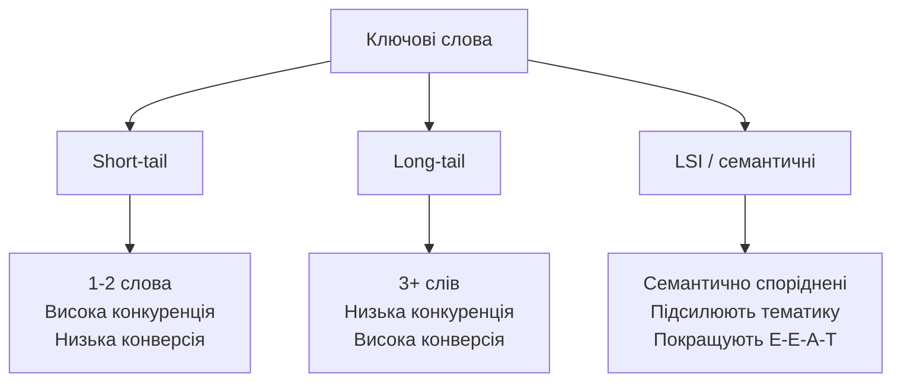
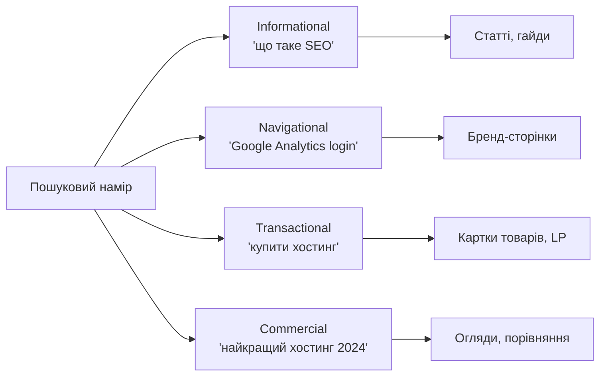
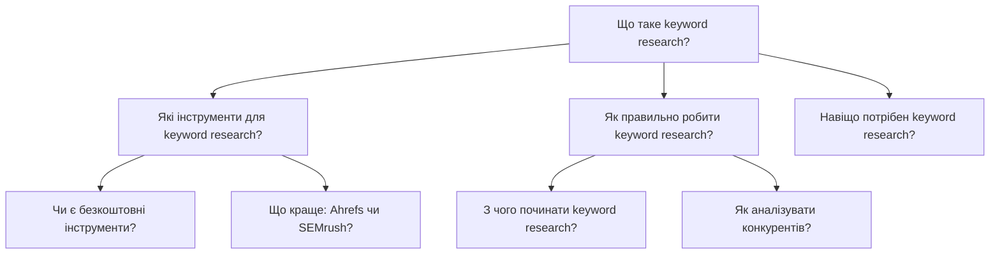
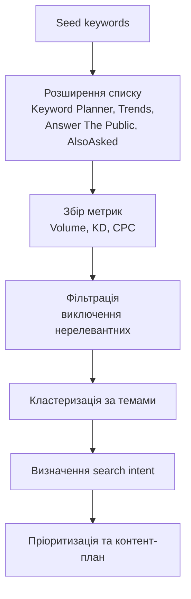

# Лекція 15 Keyword research — інструменти та методи

## 1. Типи ключових слів

Ключові слова (keywords) — це слова та словосполучення, які користувачі вводять у пошуковий рядок для знаходження потрібної інформації. Розуміння різних типів ключових слів є фундаментом для побудови ефективної SEO-стратегії.

### Short-tail keywords

Short-tail (або head keywords) — це короткі запити, що складаються з одного або двох слів. Вони характеризуються надзвичайно високим обсягом пошуку і водночас надзвичайно високою конкуренцією. Прикладами таких запитів є "ноутбук", "купити телефон", "SEO".

З короткими запитами пов'язана принципова проблема: вони занадто широкі. Коли користувач вводить слово "ноутбук", незрозуміло, що саме він шукає — огляд, порівняння, де купити, чи ціни на конкретну модель. Через це конверсія трафіку з таких запитів, як правило, низька. Просуватися за short-tail запитами реально лише для великих авторитетних ресурсів із тисячами посилань.

### Long-tail keywords

Long-tail keywords — це запити, що складаються з трьох і більше слів. Вони мають нижчий обсяг пошуку, але значно вищу специфічність і, відповідно, вищу конверсію. Приклади: "купити ноутбук для навчання до 20000 гривень", "як налаштувати GA4 для інтернет-магазину".

Концепція long-tail була популяризована Крісом Андерсоном у книзі "The Long Tail" (2006). Ключова ідея полягає в тому, що сукупний обсяг трафіку з тисяч специфічних запитів перевищує трафік від кількох популярних слів. Для більшості вебсайтів саме довгохвостові запити формують основу органічного трафіку — вони менш конкурентні, легше ранжуються і залучають аудиторію з чіткими намірами.

### LSI keywords

LSI (Latent Semantic Indexing) keywords — це семантично пов'язані слова та фрази, які допомагають пошуковим системам краще зрозуміти тематику сторінки. Термін LSI технічно застарів (Google вже не використовує класичний LSI-алгоритм), проте концепція семантичної спорідненості залишається актуальною.

Якщо основне ключове слово — "кава", то семантично пов'язаними будуть: еспресо, американо, капучино, кавоварка, кофеїн, обсмажування. Використання таких слів природньо у тексті сигналізує пошуковику, що сторінка є вичерпним джерелом з даної теми, а не штучно напханою одним ключовим словом.



## 2. Search intent — пошуковий намір

Search intent (пошуковий намір) — це мета, з якою користувач вводить запит у пошукову систему. Google систематично аналізує поведінку мільярдів користувачів і навчився визначати, що саме стоїть за кожним запитом. Якщо контент сторінки не відповідає наміру запиту, вона не ранжуватиметься, навіть якщо ідеально оптимізована за всіма іншими параметрами.

### Інформаційний намір (Informational)

Користувач шукає відповідь на питання або хоче дізнатися більше про певну тему. Характерні маркери: "що таке", "як", "чому", "пояснення", "визначення". Приклади: "що таке PageRank", "як зробити сайт", "чому падає трафік". Для таких запитів оптимальний формат — статті, гайди, відповіді на питання.

### Навігаційний намір (Navigational)

Користувач хоче потрапити на конкретний вебсайт або сторінку. Приклади: "Google Analytics вхід", "Facebook особистий кабінет", "Rozetka". У таких випадках намагатися перехопити трафік безглуздо — користувач знає, куди йде. Виняток — бренди можуть оптимізувати сторінки під навігаційні запити, пов'язані зі своїм іменем.

### Транзакційний намір (Transactional)

Користувач готовий вчинити дію: купити, завантажити, підписатися, замовити. Маркери: "купити", "замовити", "завантажити", "ціна", "знижка". Приклади: "купити iPhone 15 Pro", "замовити піцу онлайн". Для таких запитів оптимальні сторінки товарів, категорій та landing pages з чіткими CTA.

### Комерційне дослідження (Commercial Investigation)

Користувач перебуває на етапі порівняння та вибору перед покупкою. Маркери: "найкращий", "порівняння", "огляд", "рейтинг", "vs". Приклади: "найкращий ноутбук 2024", "Matomo vs Google Analytics", "огляд Samsung Galaxy S24". Для таких запитів ефективні порівняльні статті, огляди та рейтинги.



Визначення наміру — це перший крок перед написанням будь-якого контенту. Якщо ви плануєте сторінку під запит "keyword research", відкрийте SERP і проаналізуйте топ-10 результатів: яке це переважно — статті, інструменти, відеоогляди? Ця відповідь і є правильним форматом для вашої сторінки.

## 3. Метрики keyword research

При аналізі ключових слів використовується кілька ключових метрик, кожна з яких несе окрему інформацію для прийняття рішень.

### Search Volume (обсяг пошуку)

Середньомісячна кількість пошукових запитів за даним словом у конкретному регіоні. Важливо розуміти, що ця цифра є усередненою за 12 місяців і може суттєво відрізнятися в різні сезони. Запит "купити ялинку" матиме однаковий середньомісячний обсяг у всіх місяцях, хоча реальний трафік різко зростає у грудні.

Орієнтири для українського ринку (умовні): запити з обсягом понад 10 000 на місяць вважаються дуже популярними, 1 000–10 000 — середньою популярністю, до 1 000 — нішевими або довгохвостовими. Не варто ігнорувати низькочастотні запити: навіть 50–100 відвідувачів на місяць з чіткими намірами можуть бути ціннішими за тисячі нецільових.

### Keyword Difficulty (складність ключового слова)

KD — це числовий показник (зазвичай від 0 до 100), що відображає відносну складність потрапляння в топ-10 пошукової видачі за даним запитом. Чим вищий показник, тим більше авторитетних ресурсів вже конкурують за це місце.

KD розраховується по-різному в різних інструментах (Ahrefs, SEMrush, Ubersuggest), тому порівнювати цифри між платформами некоректно. Принципово важливо розуміти відносну складність у межах одного інструменту. Молодому сайту рекомендується орієнтуватися на запити з KD до 20–30 і поступово підвищувати планку в міру зростання авторитету домену.

### CPC (Cost Per Click)

Середня вартість одного кліку в Google Ads для даного ключового слова. Ця метрика важлива не лише для платної реклами, але й для оцінки комерційної цінності запиту в органічному пошуку. Якщо рекламодавці готові платити 5–10 доларів за клік — це сигнал, що запит приносить реальну комерційну вигоду.

### Competition (конкуренція в рекламі)

Показник, що відображає насиченість рекламного аукціону Google Ads (від 0 до 1 або Low/Medium/High). Висока конкуренція в рекламі, як правило, кореляціює з комерційно цінними запитами, але не обов'язково означає складність в органічному ранжуванні — це різні речі.

| Метрика | Що вимірює | Де застосовується |
|---|---|---|
| Search Volume | Популярність запиту | Оцінка потенційного трафіку |
| Keyword Difficulty | Складність ранжування | Пріоритизація запитів |
| CPC | Комерційна цінність | Оцінка ROI від SEO |
| Competition | Насиченість реклами | Сигнал комерційного потенціалу |

## 4. Google Keyword Planner без рекламного бюджету

Google Keyword Planner — офіційний безкоштовний інструмент Google для дослідження ключових слів. Технічно він створений для рекламодавців, але залишається корисним і для SEO, якщо знати його обмеження.

### Доступ і налаштування

Для роботи з Keyword Planner необхідний обліковий запис Google Ads. Важливо: без активних рекламних кампаній інструмент показує лише діапазони обсягу пошуку (наприклад, "1K–10K"), а не точні цифри. Точні дані стають доступними лише після запуску хоч якоїсь кампанії, навіть мінімальної.

Щоб потрапити в інструмент: Google Ads → меню зверху → "Інструменти" → "Планувальник ключових слів".

### Discover New Keywords

Перша функція — "Відкрити нові ключові слова" — дозволяє вводити до 10 початкових слів або URL сторінки конкурента і отримувати пов'язані варіанти. Алгоритм Google пропонує слова, які він вважає тематично пов'язаними, з приблизними обсягами, конкуренцією та CPC.

Практичний прийом: введіть URL сторінки конкурента, що добре ранжується, — Keyword Planner покаже ключові слова, релевантні для цієї сторінки. Це ефективний метод швидкого аналізу конкурентів без платних інструментів.

### Get Search Volume and Forecasts

Друга функція — "Отримати статистику та прогнози" — дозволяє завантажити список готових ключових слів і перевірити їхні показники. Це зручно, якщо ви вже маєте початковий список і хочете пріоритизувати його за обсягом.

### Практичні обмеження

Основна проблема Keyword Planner — агрегація даних. Інструмент часто об'єднує схожі запити в групи і показує однакові обсяги для слів з різною реальною популярністю. Крім того, він зосереджений переважно на рекламних запитах з комерційним наміром і може недооцінювати інформаційні запити. Для більш точного аналізу рекомендується комбінувати Keyword Planner з Google Search Console та Google Trends.

## 5. Google Trends: сезонність, rising queries, географія

Google Trends — безкоштовний інструмент, що показує відносну популярність пошукових запитів у часі. На відміну від Keyword Planner, він не надає абсолютних обсягів, але незамінний для розуміння трендів, сезонності та географічного розподілу інтересу.

### Розуміння індексу популярності

Усі дані в Trends виражаються у відносних одиницях від 0 до 100, де 100 — пік популярності запиту за обраний період. Це важливо розуміти: порівнювати абсолютні значення двох різних запитів між собою некоректно, проте порівнювати динаміку зміни популярності — цілком можливо.

### Аналіз сезонності

Для контент-стратегії сезонний аналіз є надзвичайно цінним. Введіть запит і перегляньте графік за останні 5 років — це дозволяє передбачити пікові місяці і запланувати публікацію відповідного контенту заздалегідь. Наприклад, статтю про підготовку до ЗНО (НМТ) варто публікувати не в травні, а в лютому–березні, коли інтерес починає зростати.

```mermaid
xychart-beta
    title "Умовна сезонність запиту _купити ялинку_"
    x-axis [Січ, Лют, Бер, Кві, Тра, Чер, Лип, Сер, Вер, Жов, Лис, Гру]
    y-axis "Відносна популярність" 0 --> 100
    bar [5, 2, 2, 1, 1, 1, 1, 1, 3, 10, 45, 100]
```

### Rising Queries та Breakout

У розділі "Пов'язані запити" особливу увагу привертають запити зі статусом "Breakout" — їхня популярність зросла більш ніж на 5000% за короткий час. Це можуть бути нові технології, продукти або події, під які є можливість оперативно створити контент і зайняти топ до приходу конкурентів.

### Порівняння запитів та географія

Google Trends дозволяє порівнювати до 5 запитів одночасно на одному графіку — це ефективний спосіб визначити, який з кількох можливих варіантів ключового слова є більш популярним у вашому регіоні. Географічна карта показує, з яких регіонів надходить найбільше запитів, що корисно для локального SEO або таргетингу контенту.

Практичний прийом: перед вибором між синонімами (наприклад, "вебдизайн" vs "веброзробка") перевірте обидва в Trends — це дасть розуміння, яке слово реально використовує ваша аудиторія.

## 6. Answer The Public та AlsoAsked: пошук питальних запитів

Питальні запити (запити у формі питань) є особливо цінною категорією ключових слів з кількох причин. По-перше, вони чітко відображають інформаційний намір. По-друге, добре оптимізовані відповіді на питання можуть потрапити у Featured Snippets ("нульова позиція"). По-третє, вони ідеально підходять для розділів FAQ та структури People Also Ask.

### Answer The Public

Answer The Public (answerthepublic.com) — інструмент, що візуалізує питання, прийменникові фрази та порівняння, пов'язані з будь-яким ключовим словом. Безкоштовна версія дозволяє виконувати обмежену кількість пошуків на день.

Принцип роботи: введіть базове ключове слово (наприклад, "SEO") і виберіть мову та регіон. Інструмент генерує колесо або список питань, згрупованих за питальними словами: що (what), як (how), чому (why), коли (when), де (where), хто (who), яке (which).

Для кожного ключового слова Answer The Public надає:
- питання (questions) — прямі запити у формі питання;
- прийменники (prepositions) — фрази типу "SEO для малого бізнесу", "SEO без посилань";
- порівняння (comparisons) — "SEO vs PPC", "SEO проти реклами";
- алфавітний список (alphabeticals) — варіації запиту від А до Я.

Експортуйте результати у CSV і використовуйте як основу для FAQ-секцій, структури статей або контент-плану.

### AlsoAsked

AlsoAsked (alsoasked.com) — інструмент, що збирає реальні питання з блоку "People Also Ask" у видачі Google і відображає їх у вигляді дерева вкладених питань. Безкоштовна версія обмежена кількістю запитів.

Ключова перевага AlsoAsked — він показує не просто список питань, а ієрархічні зв'язки між ними. Це дозволяє зрозуміти, як Google бачить структуру теми і якою має бути глибина розкриття матеріалу.



### Практичне застосування питальних запитів

Питальні запити є ідеальною сировиною для:

- FAQ-секцій на сторінках товарів і послуг (зі Schema.org FAQPage розміткою);
- підзаголовків H2–H3 в інформаційних статтях;
- самостійних статей у форматі "Що таке X" або "Як зробити X";
- відеоскриптів та подкастів, де питальний формат природній.

## 7. Побудова робочого процесу keyword research

Окремі інструменти ефективні лише тоді, коли вони є частиною системного підходу. Типовий процес дослідження ключових слів складається з кількох послідовних етапів.

На першому етапі формується первинний список seed keywords — базових слів, що описують тематику сайту або конкретної сторінки. Seed keywords — це відправна точка, з якої починається розширення семантичного ядра.

На другому етапі відбувається розширення списку. Keyword Planner показує пов'язані варіанти, Answer The Public додає питальні форми, Google Trends допомагає перевірити реальну популярність та сезонність, а AlsoAsked розкриває підтеми.

На третьому етапі список фільтрується за метриками. Кожне слово оцінюється за обсягом пошуку, складністю та відповідністю пошуковому наміру. Запити, що не відповідають цілям сайту або надто конкурентні для поточного рівня авторитету домену, виключаються.

На четвертому етапі ключові слова кластеризуються — об'єднуються у тематичні групи, кожна з яких відповідатиме окремій сторінці або статті. Кластеризація запобігає канібалізації ключових слів (ситуації, коли кілька сторінок конкурують між собою за одне слово).

На п'ятому етапі формується контент-план із пріоритетами: які сторінки створювати в першу чергу виходячи зі співвідношення потенційного трафіку, складності конкуренції та комерційної цінності.



## Висновки

Keyword research — це не одноразова задача, а безперервний процес, що супроводжує всю SEO-роботу. Розуміння типів ключових слів (short-tail, long-tail, LSI) дозволяє будувати збалансовану стратегію, орієнтовану і на широку аудиторію, і на цільових користувачів. Аналіз search intent є обов'язковою умовою: навіть ідеально технічно оптимізована сторінка не ранжуватиметься, якщо її формат не відповідає очікуванням пошукової системи.

Безкоштовні інструменти — Google Keyword Planner, Google Trends, Answer The Public та AlsoAsked — у сукупності дають достатньо даних для якісного дослідження, особливо на початкових етапах роботи з сайтом. Метрики search volume, keyword difficulty та CPC допомагають пріоритизувати зусилля і зосереджуватись на запитах, де є реальний шанс отримати результат.
