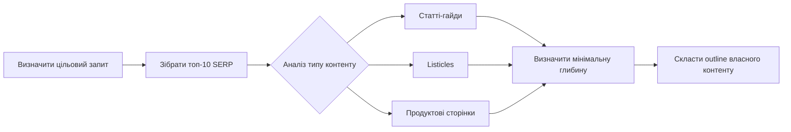
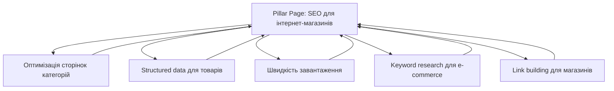
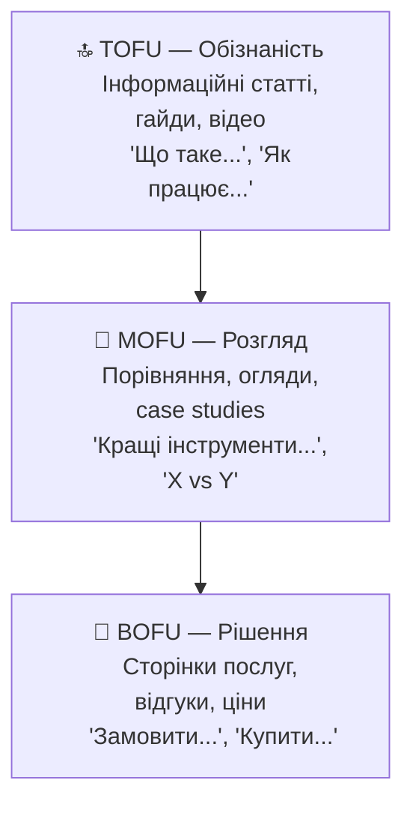

# Лекція 16 Конкурентний аналіз та content gap

## Вступ

Одним із ключових принципів сучасного SEO є розуміння конкурентного середовища. Недостатньо лише оптимізувати власний сайт — необхідно знати, що роблять конкуренти, які теми вони охоплюють, які ключові слова залучають їхній трафік і де є прогалини, якими можна скористатися. Конкурентний аналіз дозволяє ухвалювати обґрунтовані рішення щодо контент-стратегії, а не діяти навмання.

У цій лекції розглянемо методологію аналізу конкурентів у контексті SEO: від виявлення їхніх ключових слів до побудови власного контент-плану на основі знайдених прогалин.

## 1. Competitor keyword analysis: як знайти ключові слова конкурентів

### Хто є вашим SEO-конкурентом?

Важливо розрізняти бізнес-конкурентів і SEO-конкурентів. Бізнес-конкурент — це компанія, яка пропонує аналогічний продукт або послугу. SEO-конкурент — це будь-який сайт, що займає позиції у пошуковій видачі за запитами, важливими для вашого бізнесу. Нерідко це можуть бути інформаційні портали, блоги або агрегатори, а не прямі конкуренти у традиційному розумінні.

Щоб визначити своїх SEO-конкурентів, введіть у Google кілька цільових запитів і подивіться, хто стабільно з'являється у топ-10. Повторювані домени й є вашими реальними конкурентами у видачі.

### Методи збору ключових слів конкурентів

Існує кілька підходів до виявлення ключових слів, за якими конкурент отримує органічний трафік.

Перший підхід — використання спеціалізованих SEO-інструментів. Платформи на кшталт Ahrefs, Semrush або Ubersuggest дозволяють ввести домен конкурента і побачити повний список ключових слів, за якими він ранжується, разом із позиціями, обсягами пошуку та динамікою трафіку. Це найефективніший метод, але більшість розширених функцій є платними.

Другий підхід — Google Search Console у зворотному напрямку. Якщо у вас є доступ до власного GSC, можна побачити, за якими запитами ваш сайт вже отримує покази, і порівняти їх із тим, що показують інструменти для конкурентів.

Третій підхід — ручний аналіз через Google. Введіть запит, який вас цікавить, і вивчіть сторінки конкурентів, що займають топ-позиції. Перегляньте їхні title tags, H1, підзаголовки та загальну тематику. Це дає уявлення про те, під які кластери запитів оптимізований конкретний матеріал.

Четвертий підхід — аналіз meta tags через браузерні розширення. Інструменти на кшталт META SEO Inspector або MozBar дозволяють побачити title, meta description, заголовки та ключові слова на сторінці конкурента безпосередньо у браузері.

### Що шукати при аналізі ключових слів конкурентів

При вивченні ключових слів конкурентів зверніть увагу на такі аспекти:

Ключові слова з позиціями 2–10 особливо цікаві — конкурент вже довів релевантність теми, але ще не зайняв неприступну першу позицію. Це означає, що якісніший контент може перемогти.

Ключові слова, за якими конкурент займає позиції 11–20 (друга сторінка), вказують на теми, де він намагався, але не досяг успіху. Ці теми можуть бути вигідними для вас, якщо ви підготуєте глибший матеріал.

Сезонні запити з різкими піками трафіку варто виявити заздалегідь і підготувати контент до початку сезону.

## 2. SERP analysis: аналіз топ-10 результатів

### Чому важливо аналізувати SERP

Google відбирає у топ-10 ті сторінки, які найкраще відповідають пошуковому наміру. Вивчення цих сторінок є фактично відповіддю на питання: "Що саме хоче бачити Google за цим запитом?" Якщо ви не відповідаєте на той самий намір, навіть технічно ідеальна сторінка не займе високу позицію.

### Методологія SERP analysis

Перший крок — визначення типу контенту, що домінує у видачі. Це можуть бути статті-переліки (listicles), детальні гайди, сторінки продуктів, відео або локальні результати. Тип переважаючого контенту підказує формат, у якому слід готувати матеріал.

Другий крок — аналіз довжини та структури сторінок, що ранжуються. Якщо всі топ-10 результатів — це розгорнуті статті на 2 000–3 000 слів із детальними розділами, написати коротку заміткy в 500 слів не матиме сенсу. Водночас якщо у видачі домінують короткі відповіді, надмірно довгий матеріал може виявитися зайвим.

Третій крок — вивчення структури контенту лідерів. Які підзаголовки вони використовують? Які підпитання розглядають? Яку додаткову цінність надають (таблиці, порівняння, калькулятори, відео)?

Четвертий крок — аналіз SERP features. Чи є featured snippet за цим запитом? Якщо так, то в якому форматі — абзац, список чи таблиця? Це дає підказку, як структурувати відповідний розділ власного матеріалу.

### Кількісний аналіз конкурентів

Для кожної сторінки з топ-10 корисно зафіксувати такі параметри: кількість слів, кількість заголовків H2 і H3, наявність зображень та відео, кількість backlinks, швидкість завантаження сторінки. Ці дані допоможуть визначити мінімальний "поріг входу" для конкурентного контенту за конкретним запитом.

## 3. Content gap analysis: що є у конкурентів, чого немає у вас

### Концепція content gap

Content gap — це теми, ключові слова або питання, за якими конкуренти отримують трафік, а ваш сайт не представлений. Виявлення цих прогалин є одним із найефективніших способів збільшити органічний трафік без боротьби за вже охоплені теми.

### Типи прогалин у контенті

Перший тип — ключові слова, за якими конкурент ранжується, а ваш сайт — ні. Це найочевидніший варіант: теми, які ви взагалі не охопили.

Другий тип — теми, де ваш контент існує, але значно поступається за глибиною. Наприклад, у конкурента є вичерпний гайд на 3 000 слів, а у вас — коротка стаття на 600 слів за тією самою темою.

Третій тип — формати, яких бракує. Можливо, конкурент представлений у відеоформаті або має інфографіки, тоді як ваш сайт обмежений лише текстом.

Четвертий тип — підзапити та супутні теми. Ваш матеріал може відповідати на основне запитання, але оминати логічні підпитання, які шукають користувачі.

### Інструменти для виявлення content gap

У Ahrefs функція Content Gap дозволяє ввести кілька конкурентних доменів і автоматично виявити ключові слова, за якими вони всі ранжуються, але вашого сайту немає. Це особливо потужний метод для виявлення системних прогалин.

У Semrush є аналогічний функціонал у розділі Keyword Gap. Навіть у безкоштовних версіях цих інструментів можна отримати обмежену, але корисну вибірку даних.

Ручний метод полягає у порівнянні структур сайтів конкурентів: переглянути їхні sitemap, розділи блогу, теги та категорії. Це допомагає виявити цілі тематичні кластери, які конкурент охоплює, а ваш сайт — ні.

## 4. Reverse engineering контенту: чому цей контент ранжується

### Принцип зворотного інжинірингу

Reverse engineering — це процес аналізу успішного контенту конкурента з метою зрозуміти, чому саме він займає топ-позиції. Мета не в копіюванні, а в розумінні логіки алгоритму.

### Що аналізувати

On-page фактори є першим рівнем аналізу. Необхідно вивчити title tag і його відповідність запиту, структуру заголовків, щільність і розміщення ключових слів, наявність structured data. Також важливо звернути увагу на те, наскільки природно інтегровані ключові слова — сучасні алгоритми добре розпізнають forced keyword stuffing.

Off-page фактори є другим рівнем. Необхідно перевірити кількість і якість backlinks, що вказують на сторінку. Якщо сторінка конкурента набрала 200 якісних посилань за три роки, це суттєвий фактор, який важко перевершити за кілька місяців. Натомість якщо вона тримається за рахунок авторитету домену без сильного посилального профілю конкретної сторінки — це більш реалістичний конкурент.

Поведінкові сигнали є третім рівнем. Хоча ці дані недоступні безпосередньо, можна оцінити, наскільки контент дійсно корисний: чи відповідає він на всі можливі підпитання, чи легко читається, чи містить оригінальні дані або дослідження, чи є авторитетним у своїй ніші.

### Шаблон аналізу конкурентної сторінки

Для систематизації аналізу зручно використовувати стандартний шаблон:

- URL та title tag сторінки-конкурента.
- Позиція та ключові слова, за якими ранжується.
- Кількість слів та загальна структура (кількість H2, H3).
- Формат та спеціальні елементи (таблиці, відео, інфографіки).
- Backlinks на сторінку (кількість та DR/DA донорів).
- Наявність featured snippet або інших SERP features.
- Що можна зробити краще або інакше.

## 5. Від keywords до topic clusters

### Обмеження підходу "одна сторінка — одне ключове слово"

Традиційний підхід, при якому під кожне ключове слово створювалася окрема сторінка, значно застарів. Сучасні алгоритми Google, зокрема BERT і MUM, добре розуміють семантику та контекст. Тому сторінка, оптимізована під основний запит, одночасно може ранжуватися за десятками семантично пов'язаних варіантів.

Більш ефективний підхід — побудова topic clusters, або тематичних кластерів.

### Архітектура topic clusters

Topic cluster складається з двох елементів: pillar page та cluster content.

Pillar page — це широка, вичерпна сторінка, яка охоплює тему загалом. Вона є центральним вузлом кластера і оптимізована під головний, більш широкий запит. Наприклад, pillar page може мати тему "SEO для інтернет-магазинів".

Cluster content — це набір глибших, вузькоспеціалізованих статей, кожна з яких охоплює конкретний підрозділ теми. Вони оптимізовані під довші, більш специфічні запити і мають внутрішні посилання на pillar page. Наприклад: "Як оптимізувати сторінки категорій в інтернет-магазині", "Structured data для продуктових сторінок", "Швидкість завантаження сторінок товарів" тощо.

### Переваги topic clusters

Архітектура topic clusters надає пошуковим системам чіткий сигнал про тематичний авторитет сайту. Коли є десятки взаємопов'язаних матеріалів на одну тему з продуманою системою внутрішніх посилань, Google розуміє, що цей ресурс є серйозним джерелом інформації у своїй ніші.

Крім того, ця структура природно розподіляє link equity між сторінками кластера: посилання, що надходять на pillar page, через внутрішні посилання передають авторитет усім пов'язаним матеріалам.

## 6. Content marketing funnel: TOFU, MOFU, BOFU контент

### Концепція воронки

Не всі відвідувачі сайту однаково готові до здійснення цільової дії — купівлі, реєстрації або звернення. Вони перебувають на різних етапах прийняття рішення, і відповідно потребують різного типу контенту. Модель TOFU–MOFU–BOFU (Top of Funnel – Middle of Funnel – Bottom of Funnel) допомагає структурувати контент-стратегію відповідно до цих етапів.

### TOFU — верхня частина воронки

На цьому етапі людина ще не знає про продукт або послугу, але має загальну проблему чи питання. Вона шукає інформацію, навчається, досліджує.

Типові запити TOFU мають інформаційний характер: "що таке SEO", "як працює пошукова система", "чому мій сайт не знаходять у Google". Контент для TOFU — це освітні статті, огляди, пояснення концепцій, інфографіки та відео для початківців. Мета не продати, а привернути аудиторію та побудувати довіру.

### MOFU — середня частина воронки

Людина вже розуміє проблему та активно шукає рішення. Вона порівнює варіанти, вивчає різні підходи, оцінює альтернативи.

Типові запити: "найкращі SEO-інструменти 2024", "Ahrefs vs Semrush порівняння", "як вибрати SEO-агенцію". Контент для MOFU — це порівняльні огляди, case studies, детальні гайди з вибору, вебінари, шаблони та чек-листи. Мета — допомогти у прийнятті рішення та позиціонувати себе як найкращий варіант.

### BOFU — нижня частина воронки

Людина готова до дії. Вона шукає конкретний продукт або послугу і хоче підтвердити правильність вибору.

Типові запити: "замовити SEO-аудит сайту", "ціна SEO-просування Харків", "Ahrefs знижка промокод". Контент для BOFU — це сторінки послуг із конкретними пропозиціями, відгуки клієнтів, детальне порівняння тарифів, сторінки з акціями, landing pages. Мета — конвертувати відвідувача у клієнта.

### Збалансована контент-стратегія

Поширена помилка — зосередитися лише на BOFU-контенті (комерційних запитах) і ігнорувати інформаційний. BOFU-запити мають вищу конкуренцію та нижчий обсяг пошуку. TOFU та MOFU матеріали привертають значно більший трафік, будують авторитет сайту і через ланцюжок взаємодій зрештою конвертуються. Крім того, посилальна маса, як правило, природніше накопичується на корисних інформаційних матеріалах, а не на комерційних сторінках.

## 7. Типи контенту: blog posts, ultimate guides, videos, infographics, tools

### Різноманіття форматів

Контент — це не лише текст. Сучасна SEO-стратегія передбачає використання різних форматів залежно від теми, аудиторії та пошукового наміру.

### Blog posts та статті

Стаття — найпоширеніший формат. Вона добре підходить для інформаційних запитів, коли потрібно пояснити концепцію, розповісти про подію або дати практичну пораду. Оптимальна довжина залежить від конкуренції: для деяких тем достатньо 800 слів, для інших потрібно 3 000+. Ключовий критерій — повнота відповіді на запит, а не кількість слів заради кількості.

### Ultimate guides

Вичерпний гайд — це довгий структурований матеріал, що охоплює тему з усіх боків. Такий формат ефективний для широких тем ("Повний гайд з SEO для початківців") і добре накопичує backlinks, оскільки інші сайти охоче посилаються на вичерпні ресурси. Суттєвий недолік — значні витрати часу на підготовку та необхідність регулярного оновлення, щоб контент залишався актуальним.

### Відео

Відеоконтент займає особливе місце в сучасній пошуковій видачі. Google нерідко показує відео у featured snippets та відеокаруселях. Крім того, YouTube є другою за розміром пошуковою системою у світі. Для тем, де процеси легше показати, ніж описати (налаштування інструментів, покрокові процедури, огляди), відео може значно перевершувати текст за ефективністю.

### Інфографіки

Інфографіки ефективні для візуалізації складних даних, процесів або порівнянь. Вони добре поширюються у соціальних мережах і природно залучають посилання — інші автори вставляють інфографіку у свої матеріали з посиланням на джерело. Проте для пошукової видачі інфографіка самостійно має обмежену цінність: вона потребує текстового контексту, оскільки пошукові системи не "читають" зображення.

### Інтерактивні інструменти та калькулятори

Онлайн-інструменти — один із найефективніших способів залучення посилань і трафіку. Калькулятор, генератор, checker або інтерактивний тест вирішують конкретну задачу користувача й мають значно вищий потенціал для отримання природних backlinks порівняно зі звичайною статтею. Наприклад, безкоштовний SEO-аудит або калькулятор читабельності тексту можуть приносити стабільний трафік роками.

## Висновки

Конкурентний аналіз є системним процесом, що складається з кількох взаємопов'язаних етапів. Виявлення ключових слів конкурентів, глибокий аналіз SERP, пошук контентних прогалин і розуміння того, чому конкретний матеріал ранжується — все це дає основу для побудови ефективної контент-стратегії. Архітектура topic clusters забезпечує тематичний авторитет сайту, а модель TOFU–MOFU–BOFU допомагає охопити аудиторію на всіх етапах прийняття рішень. Різноманіття форматів контенту розширює можливості для отримання трафіку та backlinks.
