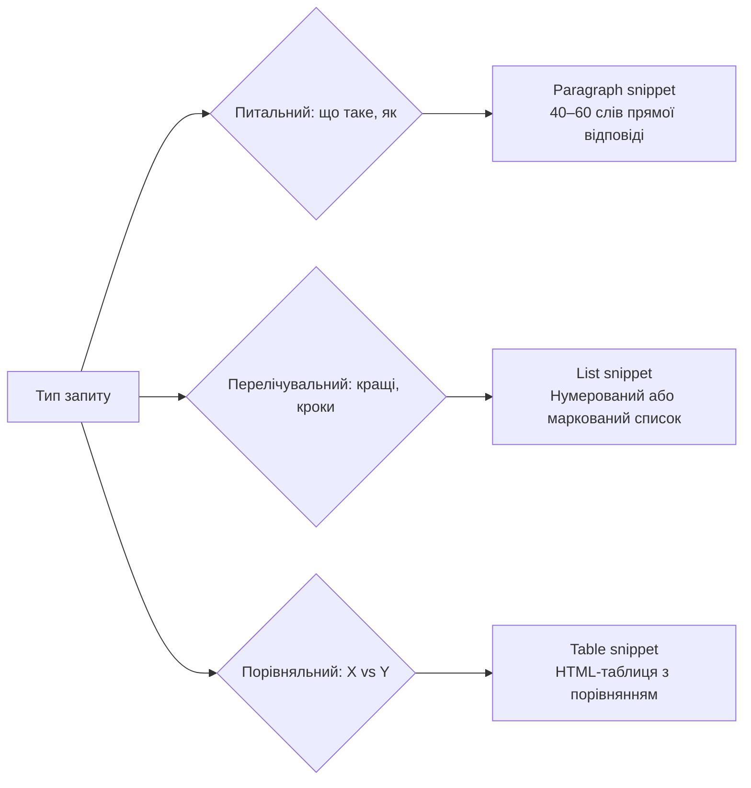
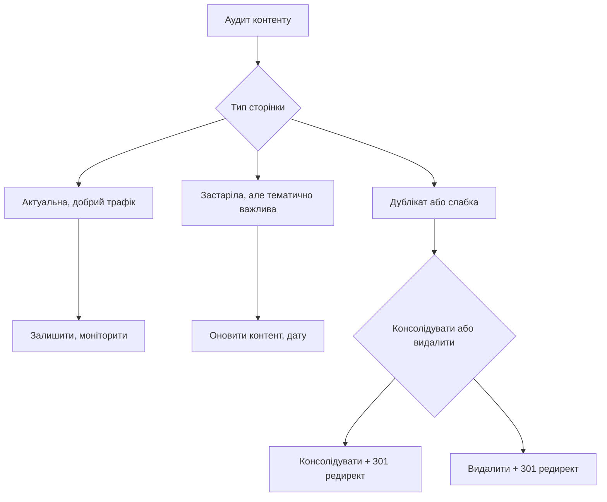

# Лекція 17 SEO-копірайтинг та оптимізація контенту

## Вступ

Сучасний SEO-копірайтинг виходить далеко за межі простого розміщення ключових слів у тексті. Google навчився розпізнавати якісний контент — такий, що справді корисний, авторитетний, написаний знаючою людиною для реальної аудиторії. Водночас чудово написаний матеріал без технічної оптимізації може так і не потрапити до цільового читача.

У цій лекції розглянемо принципи та методи, що дозволяють поєднати якісне письмо з ефективною SEO-оптимізацією.

## 1. E-E-A-T принцип: Experience, Expertise, Authoritativeness, Trust

### Еволюція концепції

Google уперше описав критерії E-A-T (Expertise, Authoritativeness, Trustworthiness) у своїх Search Quality Evaluator Guidelines — внутрішньому документі, за яким тисячі оцінювачів перевіряють якість результатів пошуку. У 2022 році до абревіатури додали четверту складову — Experience, що перетворило концепцію на E-E-A-T.

Хоча E-E-A-T не є прямим алгоритмічним сигналом ранжування у буквальному сенсі, він відображає те, що Google намагається оцінити: чи заслуговує цей ресурс на довіру? Чи є автор справжнім фахівцем? Чи підтверджений авторитет сайту зовнішніми джерелами?

### Розшифровка E-E-A-T

Experience (Досвід) — наявність практичного, особистого досвіду в темі. Огляд продукту від людини, яка його купила та використовувала, цінніший, ніж узагальнений текст, складений без безпосереднього контакту з предметом. Google вміє розпізнавати ознаки реального досвіду: конкретні деталі, особисті спостереження, нестандартні факти.

Expertise (Експертність) — глибокі знання у відповідній галузі. Для медичних, юридичних та фінансових тем (які Google позначає як YMYL — Your Money Your Life) це особливо критично. Стаття про симптоми захворювання, написана лікарем, оцінюється значно вище, ніж та сама тема, викладена без фахової підготовки.

Authoritativeness (Авторитетність) — визнання ресурсу авторитетним джерелом у своїй ніші. Вимірюється зокрема через backlinks від авторитетних ресурсів, цитування в ЗМІ, згадки без посилань. Авторитетність будується роками і є одним із найважчих для підробки сигналів.

Trustworthiness (Достовірність) — загальна надійність ресурсу. Сюди відносяться: наявність чіткої інформації про автора та компанію, коректні джерела для фактів, прозора рекламна політика, захищене з'єднання HTTPS, актуальність дат публікацій.

### Як покращити E-E-A-T на практиці

Для підвищення E-E-A-T рекомендуються такі практичні кроки. Необхідно вказувати авторів матеріалів і додавати їхні біографії з релевантним досвідом. Варто посилатися на авторитетні джерела — наукові статті, офіційні ресурси, звіти індустрії. Корисно отримувати й публікувати відгуки від реальних клієнтів або користувачів. Слід чітко вказувати дати публікацій і останнього оновлення, а також забезпечити сторінки "Про нас" і контактну інформацію.

## 2. Латентно-семантичне індексування (LSI): природність keywords

### Що таке LSI і чому важливо

Латентно-семантичне індексування (Latent Semantic Indexing, LSI) — це метод, при якому пошукова система аналізує смислові зв'язки між словами у тексті, а не лише точні збіги запиту. Він дозволяє Google розуміти контекст і тематичну глибину матеріалу.

Якщо стаття присвячена вирощуванню помідорів, система очікує побачити пов'язані слова: ґрунт, полив, добрива, теплиця, хвороби рослин, урожай. Відсутність таких термінів може сигналізувати про поверхневий контент, а їхня присутність — про глибоке розкриття теми.

### LSI-ключові слова на практиці

LSI-ключові слова — це не синоніми основного запиту, а семантично пов'язані терміни, що природно зустрічаються в контексті теми. Їх можна знайти кількома способами:

У Google можна скористатися розділом "Пов'язані запити" внизу сторінки результатів, а також функцією автозаповнення. Введіть основний запит і подивіться, які варіанти пропонує Google — це і є семантично пов'язані терміни.

Інструменти на кшталт Answer The Public або AlsoAsked генерують питальні запити, пов'язані з темою. Ці питання часто відповідають LSI-тематиці і водночас є основою для розгляду в підрозділах статті.

Аналіз top-10 конкурентів дозволяє виявити спільні терміни, що регулярно з'являються у матеріалах лідерів видачі за даним запитом.

### Природна інтеграція ключових слів

Головний принцип SEO-копірайтингу сьогодні — писати для людей, а не для алгоритмів. Текст, де ключові слова вставлені штучно, читається незграбно і відштовхує аудиторію. Це також негативний сигнал для алгоритму.

Рекомендується вживати основне ключове слово у заголовку H1, в першому або другому абзаці, в одному-двох підзаголовках та рівномірно протягом тексту. Щільність ключових слів не є самостійною метрикою, що треба відстежувати — важлива лише природність.

## 3. Читабельність: Flesch Reading Ease та grade level

### Чому читабельність важлива для SEO

Читабельність тексту безпосередньо впливає на поведінкові метрики: якщо матеріал важко сприймати, відвідувачі швидко покидають сторінку. Висока bounce rate і низький час перебування на сторінці — негативні сигнали для алгоритму. Крім того, доступний і зрозумілий текст має більший шанс отримати featured snippet.

### Індекс Flesch Reading Ease

Формула Flesch Reading Ease оцінює текст за двома параметрами: середньою довжиною речень і середньою кількістю складів у слові.

```
Flesch Reading Ease = 206.835 – (1.015 × ASL) – (84.6 × ASW)
```

де ASL (Average Sentence Length) — середня довжина речення у словах, ASW (Average Syllables per Word) — середня кількість складів у слові.

Результат розміщується у діапазоні від 0 до 100. Значення 60–70 відповідає комфортному читанню для широкої аудиторії, 70–80 — легкому, 30–50 — академічному тексту. Для вебконтенту загального призначення оптимальний діапазон — 60–70.

Слід зауважити, що формула розроблена для англійської мови. Для української вона не є стандартизованою в повній мірі, проте загальні принципи — коротші речення і менш складна лексика — залишаються актуальними.

### Grade level (рівень грамотності)

Formула Flesch-Kincaid Grade Level переводить показник читабельності у шкільний клас, необхідний для розуміння тексту. Значення 8–10 є оптимальним для масового вебконтенту. Академічний або фаховий контент може мати вищий рівень — це нормально, якщо аудиторія відповідна.

Практичні рекомендації для покращення читабельності:

- Уникати речень довше 20–25 слів.
- Розбивати довгі абзаци на менші (3–4 речення максимум).
- Використовувати активний стан замість пасивного.
- Замінювати складну термінологію простішими аналогами, де це можливо.
- Використовувати перехідні слова та словосполучення для логічного зв'язку.

Hemingway Editor (hemingwayapp.com) — безкоштовний онлайн-інструмент для перевірки читабельності, що підсвічує складні речення, пасивний стан і зайві прислівники.

## 4. Структурування тексту: списки, таблиці, цитати, підзаголовки

### Роль структури у SEO та UX

Добре структурований текст легше сканується очима — а користувачі в інтернеті переважно саме сканують, а не читають лінійно. Крім того, чітка ієрархія заголовків дає алгоритмам зрозуміти структуру документа й виявити ключові теми.

### Заголовки H1–H6

H1 — єдиний заголовок першого рівня на сторінці, що відповідає основній темі і містить основне ключове слово. Він повинен чітко відповідати на питання: "Про що ця сторінка?"

H2 — заголовки основних розділів. Вони структурують зміст і часто відповідають підзапитам або підтемам основного запиту.

H3 і нижче — підрозділи всередині розділів H2. Корисні для деталізації без надмірного ускладнення структури.

Поширена помилка — використовувати теги H не для ієрархії, а лише для стилізації. Це руйнує семантичну структуру документа і ускладнює роботу алгоритмів.

### Списки та таблиці

Маркований список ефективний, коли перелічуються рівнозначні елементи без чіткої послідовності. Нумерований список доречний для покрокових інструкцій або рейтингових переліків. Таблиці ідеальні для порівняння кількох об'єктів за кількома критеріями.

Всі ці елементи позитивно впливають на читабельність і підвищують шанси потрапити у featured snippet.

### Цитати та виносні блоки

Важливі тези, статистику або висновки можна виокремити як цитати або виносні блоки. Це привертає увагу читача до ключових моментів і підвищує "сканованість" сторінки. Крім того, добре сформульовані цитати охоче поширюються у соціальних мережах.

## 5. Featured snippets optimization

### Що таке featured snippet

Featured snippet (також "нульова позиція") — це виокремлений блок у верхній частині SERP, що відображає пряму відповідь на запит. Google витягує цей блок з однієї з сторінок у видачі, що може значно збільшити клікабельність навіть порівняно з першою органічною позицією.

Featured snippets існують у трьох основних форматах, кожен з яких потребує відповідної оптимізації.

### Paragraph snippet

Відображається у вигляді короткого абзацу відповіді. Зазвичай виникає у відповідь на питальні запити типу "що таке", "як пояснити", "чому відбувається".

Для оптимізації рекомендується чітко поставити питання у тексті (або заголовку підрозділу) і відразу дати коротку, вичерпну відповідь у наступному абзаці. Оптимальна довжина — 40–60 слів. Відповідь повинна бути самодостатньою і зрозумілою без широкого контексту.

### List snippet

Відображається як нумерований або маркований список. Виникає у відповідь на запити типу "кращі способи", "кроки для", "список".

Для оптимізації потрібно структурувати відповідний розділ у вигляді чіткого нумерованого або маркованого списку з лаконічними, зрозумілими пунктами. Кожен пункт повинен бути інформативним навіть поза контекстом.

### Table snippet

Відображається у вигляді таблиці з порівнянням. Виникає у відповідь на порівняльні запити або запити зі структурованими даними.

Для оптимізації необхідно представити порівняння у вигляді правильно розміченої HTML-таблиці з чіткими заголовками рядків і стовпців.



### Загальна стратегія

Важливо розуміти, що featured snippet не гарантований — Google сам вирішує, чи виводити його і звідки брати. Проте правильна структура тексту суттєво підвищує шанси. Корисно орієнтуватися на запити, за якими featured snippet вже існує: якщо ваш конкурент займає цю позицію, оптимізованіша структура може перетягнути блок на вашу сторінку.

## 6. Writing для voice search: conversational queries

### Зростання голосового пошуку

З поширенням голосових асистентів (Google Assistant, Siri, Alexa) голосовий пошук стає все значущішим каналом. Голосові запити мають характерні особливості, що відрізняють їх від текстових.

### Особливості голосових запитів

Голосові запити, як правило, довші й більш розмовні. Людина не вводить "погода Київ", а питає "Яка погода зараз у Києві?" Вони часто починаються з питальних слів: "де", "як", "коли", "чому", "що".

Голосовий пошук більш контекстуальний і локальний: люди питають про найближчі ресторани, графіки роботи магазинів, маршрути. Крім того, відповідь у голосовому режимі зачитується як речення, тому виграють матеріали з чіткими, природними формулюваннями.

### Як оптимізувати контент для голосового пошуку

Перший підхід — відповідати на питальні запити. Структура FAQ (питання-відповідь) природно відповідає форматові голосового пошуку. Включення типових питань аудиторії у підзаголовки тексту підвищує шанс потрапити у голосовий результат.

Другий підхід — використовувати розмовний стиль. Текст, написаний природною мовою без надмірного канцеляризму, краще читається вголос і більш відповідає голосовим запитам.

Третій підхід — оптимізація для featured snippets. Google зазвичай зачитує саме paragraph snippet як відповідь у голосовому пошуку. Тому оптимізація під цей формат одночасно охоплює й голосовий пошук.

## 7. Content freshness signals: коли і як оновлювати контент

### Чому свіжість контенту важлива

Google надає перевагу актуальному контенту у запитах, де свіжість є критичною: новини, поточні події, регулярно змінювані дані. Для вічнозелених тем ("evergreen content") дата менш критична, але Google все одно аналізує сигнали свіжості при оцінці актуальності матеріалу.

### Типи сигналів свіжості

Зовнішні сигнали — поява нових backlinks на сторінку, нові згадки у соціальних мережах. Це свідчить про зростаючу популярність матеріалу.

Внутрішні сигнали — дата публікації і дата останнього оновлення, частота змін контенту, додавання нових матеріалів (нові коментарі, нові розділи).

Google Freshness Algorithm особливо активний для запитів із явною потребою в актуальних даних: "останні новини", "поточна ціна", "рейтинг 2024".

### Стратегія оновлення контенту

Не весь контент однаково потребує оновлення. Важливо розрізняти кілька категорій.

Контент, що втрачає актуальність, потребує регулярного оновлення: статистика, рейтинги, огляди інструментів, нормативні вимоги. Для таких матеріалів варто встановити регулярний цикл перегляду — щорічно або частіше.

Evergreen-контент — визначення, методики, принципи — оновлюється рідше, але слід перевіряти наявність застарілих прикладів, посилань на відсутні ресурси або концепцій, що вже змінилися.

Content pruning — видалення або консолідація застарілого або низькоякісного контенту — також є позитивним сигналом. Google оцінює загальну якість ресурсу, і кілька слабких сторінок можуть тягнути вниз рейтинг всього сайту.

### Як правильно оновлювати контент

При оновленні варто дотримуватися кількох правил. Необхідно зберігати URL незмінним, якщо сторінка вже має трафік та backlinks. Слід оновлювати дату публікації лише тоді, коли зміни суттєві, а не при косметичних правках. Корисно додавати розділ із приміткою "Оновлено [дата]" з коротким описом змін — це підвищує довіру читачів. При консолідації кількох слабких сторінок в одну необхідно налаштовувати 301-редирект з об'єднаних URL.



## Висновки

SEO-копірайтинг є синтезом кількох дисциплін: розуміння алгоритмів, знання психології читача, технічної компетентності та майстерності письма. Принцип E-E-A-T ставить у центр реальну цінність для читача — практичний досвід, фахові знання та достовірність. LSI-підхід та природна інтеграція ключових слів замінили застарілий keyword stuffing. Структурування тексту через заголовки, списки та таблиці одночасно підвищує читабельність і збільшує шанси на featured snippet. Регулярне оновлення контенту утримує позиції для тем, де актуальність є критичним фактором.
