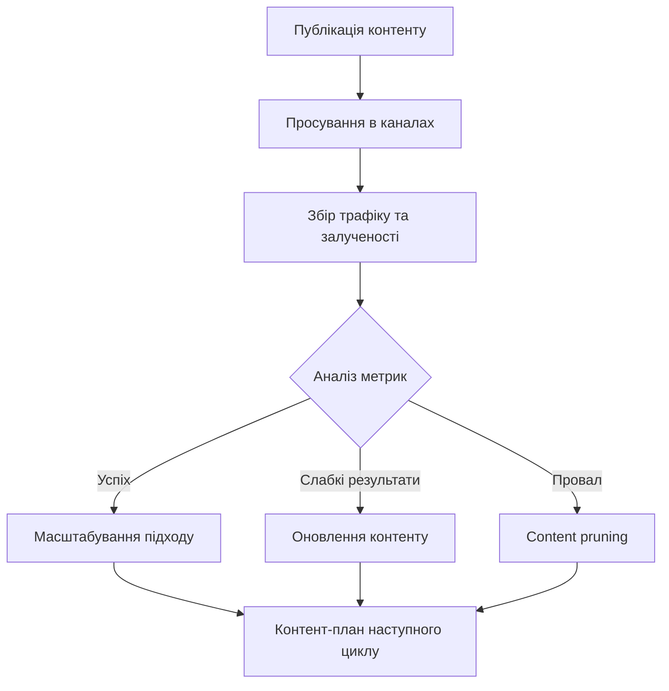
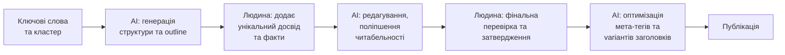

# Лекція 18 Контент-стратегія та просування контенту

## Вступ

Контент-маркетинг давно перестав бути просто модним терміном — сьогодні це системна дисципліна зі своїми методологіями, інструментами вимірювання та чіткими бізнес-цілями. Найпоширеніша помилка початківців полягає в тому, що вони зосереджуються виключно на створенні нового контенту, ігноруючи стратегічне планування, аудит існуючих матеріалів та системне просування. Ця лекція охоплює повний цикл роботи з контентом: від формування плану публікацій до вимірювання результатів та використання штучного інтелекту в сучасному контент-маркетингу.

## 1. Створення контент-плану: від запитів до календаря публікацій

Контент-план — це стратегічний документ, який визначає, який контент буде створено, для кого, з якою метою та в який час. Без чіткого плану контент-маркетинг перетворюється на хаотичне виробництво матеріалів, що не досягають своїх цілей.

### Від семантичного ядра до тем публікацій

Відправною точкою для будь-якого контент-плану є семантичне ядро — структурований набір пошукових запитів, які описують потреби цільової аудиторії. На попередніх заняттях ми досліджували методи збору та кластеризації запитів; тепер розглянемо, як перетворити ці кластери на конкретні теми публікацій.

Кожен кластер запитів відповідає певній інформаційній потребі користувача. Наприклад, кластер «як вибрати ноутбук для роботи» охоплює запити типу «кращий ноутбук для роботи», «характеристики ноутбука для офісу», «порівняння ноутбуків» — усі вони відповідають одному пошуковому наміру і можуть бути об'єднані в одну статтю-гід.

При трансформації кластерів у теми необхідно враховувати:

- пошуковий намір (informational, transactional, navigational);
- конкурентоспроможність — чи реально увійти до топ-10 за цими запитами;
- відповідність наявним ресурсам — чи є у команди експертиза для якісного розкриття теми;
- позицію у воронці продажів — TOFU, MOFU або BOFU.

### Пріоритизація тем

Не всі теми однаково цінні. Для пріоритизації використовують матрицю, що враховує кілька вимірів одночасно.

```
Пріоритет = (Потенційний трафік × Відповідність намірам) / Складність ранжування
```

На практиці зручно використовувати просту систему балів: кожну тему оцінюють за трьома критеріями від 1 до 5 — обсяг пошукового трафіку, складність ранжування (інверсна оцінка — чим складніше, тим менший бал) та відповідність бізнес-цілям. Теми з найвищою сумарною оцінкою потрапляють у план першими.

### Структура контент-календаря

Контент-календар — це операційний інструмент, який конкретизує план у часі. Добре структурований календар містить такі поля:

- дата публікації;
- тема та цільові ключові слова;
- тип контенту (стаття, відео, інфографіка);
- відповідальний автор або виконавець;
- статус (ідея, в роботі, на перевірці, опубліковано);
- канали просування;
- метрики успіху (цільовий трафік, конверсія).

Для невеликих команд Google Sheets залишається одним із найзручніших інструментів для ведення календаря. Більші організації використовують спеціалізовані платформи: Notion, Airtable, CoSchedule або Trello.

Оптимальна частота публікацій залежить від ресурсів команди та типу вебсайту. Практика показує, що краще публікувати одну якісну статтю на тиждень, ніж п'ять поверхневих матеріалів. Алгоритми Google давно навчилися оцінювати глибину та корисність контенту, а не лише його кількість.

## 2. Content audit: оцінка існуючого контенту

Перш ніж створювати новий контент, варто зрозуміти, що вже є на сайті та наскільки це ефективно. Content audit — систематичний аналіз усіх наявних матеріалів — дає відповідь на питання, що працює, що потребує покращення, а що варто видалити.

### Методологія проведення аудиту

Аудит контенту складається з кількох послідовних етапів.

Перший етап — інвентаризація. Необхідно зібрати повний список URL-адрес вебсайту. Для цього використовують такі інструменти, як Screaming Frog, Sitebulb або безкоштовний Seobility. Результатом є таблиця з усіма URL, мета-заголовками, описами та базовою SEO-інформацією.

Другий етап — збір даних про ефективність. Для кожної сторінки збирають дані з Google Analytics 4 та Google Search Console: кількість сеансів, показник відмов, середній час перебування, кількість конверсій, органічні покази та кліки, середня позиція у пошуку.

Третій етап — якісна оцінка. Кожен матеріал оцінюють за такими критеріями: актуальність інформації (чи не застаріла?), відповідність пошуковому наміру, унікальність та глибина, технічний стан (broken links, помилки форматування), наявність E-E-A-T сигналів.

### Класифікація контенту за результатами аудиту

За підсумками аналізу кожна сторінка потрапляє в одну з категорій.

Категорія «залишити без змін» — контент, який стабільно генерує трафік і конверсії, актуальний та технічно коректний. Такі матеріали лише монітизуються і підтримуються.

Категорія «оновити» — контент, який мав хороші показники, але частково застарів або може бути покращений. Це найцінніший актив — сторінки вже мають певний авторитет у пошукових системах.

Категорія «об'єднати» — схожі або дублікативні матеріали, які конкурують один з одним за однакові ключові слова. Їх консолідують в одну вичерпну сторінку.

Категорія «видалити» — сторінки без трафіку, без зворотних посилань, з низькоякісним контентом, які «розбавляють» загальну якість сайту в очах пошукових систем.

## 3. Content pruning: видалення та консолідація слабкого контенту

Content pruning («обрізання контенту») — практика свідомого видалення або консолідації матеріалів, що знижують загальну якість сайту. Попри інтуїтивне відчуття, що більше контенту — краще, насправді слабкий контент може активно шкодити SEO.

### Чому слабкий контент шкодить сайту

Концепція «crawl budget» означає, що пошукові боти витрачають обмежений ресурс на обхід кожного домену. Якщо значна частина сторінок є низькоякісними, бот витрачає бюджет на їх індексацію замість важливих сторінок.

Крім того, Google оцінює якість домену комплексно. Великий відсоток сторінок з низьким часом перебування, високим показником відмов або тонким контентом (thin content) може знижувати загальний авторитет домену і впливати на ранжування навіть якісних сторінок.

### Що саме підлягає pruning

До сторінок-кандидатів на видалення або консолідацію відносять:

- сторінки з менше ніж 300 словами корисного контенту без явної причини;
- дублікати та майже-дублікати (near-duplicates);
- застарілі новини або події, що вже минули;
- тегові та категорійні сторінки з мінімальним унікальним контентом;
- сторінки, що не отримували органічного трафіку понад 12 місяців і не мають зворотних посилань.

### Технічне виконання pruning

При видаленні сторінки важливо правильно налаштувати 301-редирект на найближчу за тематикою існуючу сторінку або на головну. Просто повернути 404 — погана практика, особливо якщо на сторінку ведуть зовнішні посилання.

При консолідації декількох сторінок в одну необхідно: зібрати весь цінний контент з усіх джерел, опублікувати консолідовану версію, налаштувати редиректи з усіх старих URL на новий, оновити внутрішні посилання на сайті.

## 4. Оновлення vs створення нового: коли що вибирати

Одне з ключових стратегічних рішень у контент-маркетингу — куди спрямовувати ресурси: на оновлення існуючих матеріалів чи на створення нового контенту. Немає єдиної відповіді, але є чіткі критерії для прийняття рішення.

### Коли варто оновлювати існуючий контент

Оновлення є пріоритетним у таких випадках.

Сторінка раніше займала позиції 5–20 у пошуку, але поступово опустилася нижче. Це сигнал, що Google вважав матеріал релевантним, але конкуренти підготували кращі версії. Оновлення з метою перевершити конкурентів часто ефективніше, ніж створення нової сторінки.

Тематика стабільна і зберігає попит (evergreen content), але деталі застаріли: змінилися статистичні дані, з'явилися нові інструменти, оновилися найкращі практики.

Сторінка має якісні зворотні посилання. Оновлення такої сторінки дозволяє зберегти накопичений link equity та підсилити вже авторитетний матеріал.

### Коли варто створювати новий контент

Нова сторінка доцільна в таких ситуаціях:

- пошуковий запит або тема відсутні на сайті повністю;
- існуюча сторінка оптимізована під інший пошуковий намір і не може бути адаптована без кардинальної переробки;
- тема є настільки новою, що потребує окремого матеріалу (новий продукт, нова технологія, нова послуга).

### Практичне правило

Досвідчені SEO-спеціалісти керуються таким підходом: якщо сторінка вже існує і може бути покращена до рівня, що задовольняє пошуковий намір, оновлення завжди ефективніше за створення нової сторінки. Нова сторінка починає «з нуля», без авторитету і зворотних посилань.

## 5. Content promotion стратегії: social media, email, outreach

Навіть найякісніший контент не генеруватиме трафік без активного просування. Органічне SEO вимагає часу, тому паралельно використовують кілька каналів дистрибуції.

### Соціальні мережі

Соціальні мережі виконують подвійну функцію: безпосередньо приводять трафік і сприяють природньому поширенню контенту, що потенційно генерує зворотні посилання.

Ефективна стратегія в соціальних мережах передбачає не просто публікацію посилання на статтю. Для кожного матеріалу варто готувати кілька варіантів публікацій: цитата або ключовий інсайт у вигляді картки, питання для обговорення, коротке відео або анімація на основі даних зі статті, інфографіка з ключовими тезами.

Важливо адаптувати формат під специфіку кожної платформи. Те, що добре працює в LinkedIn (детальний аналіз, professional insights), не обов'язково буде ефективним у Instagram або TikTok.

### Email-маркетинг як канал просування контенту

Email-розсилка залишається одним із найефективніших каналів дистрибуції контенту з точки зору ROI. Підписники — це вже зацікавлена аудиторія, яка надала явний дозвіл на комунікацію.

Базові практики content-focused email:

- сегментація бази — різні сегменти отримують різний контент залежно від інтересів;
- лаконічний preview — email не переказує статтю, а дає достатньо контексту, щоб зацікавити і спонукати перейти на сайт;
- персоналізація рядка теми підвищує показник відкривань;
- оптимальна частота — зазвичай 1–2 листи на тиждень, якщо немає специфічних домовленостей з аудиторією.

### Outreach: персоналізоване просування

Outreach — цілеспрямоване звернення до журналістів, блогерів, інфлюенсерів або вебсайтів з пропозицією ознайомитися з матеріалом. Мета — отримати зворотне посилання, соціальне поширення або згадку.

Ефективний outreach базується на кількох принципах.

Персоналізація — жодних масових шаблонних розсилок. Кожен лист має демонструвати, що відправник знайомий з роботою адресата і розуміє, чому саме цей матеріал буде корисним для його аудиторії.

Релевантність — контент має бути дійсно цікавим для аудиторії людини, якій пишуть. Пропонувати статтю про JavaScript розробникам Python-блогу — марна трата часу для обох сторін.

Цінність для адресата — замість «будь ласка, розмістіть посилання на мою статтю» ефективніше запропонувати щось цінне: унікальні дані, цитату експерта, ексклюзивний коментар.

Системність — outreach-кампанія передбачає роботу з базою контактів, відстеження відповідей та follow-up через 5–7 днів, якщо відповіді не надійшло.

## 6. Link earning через якісний контент

Якщо link building — активне набуття посилань, то link earning — створення контенту, який природньо привертає посилання без активного аутрічу. Це вищий рівень контент-маркетингу, що вимагає інвестицій у справді видатні матеріали.

### Типи контенту з високим link earning потенціалом

Дослідження та оригінальні дані. Будь-яке оригінальне дослідження — опитування, аналіз даних, галузевий звіт — автоматично стає джерелом, на яке посилаються інші публікації. Якщо дані унікальні, їх будуть цитувати знову і знову.

Ultimate guides та вичерпні ресурси. Найповніший гід з певної теми притягує посилання, оскільки інші автори вважають за краще посилатися на один авторитетний ресурс, ніж на кілька часткових.

Безкоштовні інструменти та калькулятори. Практичні інструменти, що вирішують конкретну задачу, отримують посилання через сарафанне радіо та рекомендації.

Інфографіки та візуалізації даних. Якісна візуалізація складних даних активно поширюється і зазвичай публікується з посиланням на першоджерело.

Контроверсійні або несподівані висновки. Матеріали, що руйнують стереотипи або пропонують нестандартний погляд, природньо генерують дискусії та посилання.

### Зв'язок між якістю контенту та авторитетністю домену

Кожне якісне зворотне посилання передає «link equity» — частину авторитету донора — на ваш сайт. Накопичений авторитет домену впливає на ранжування всіх сторінок сайту, не лише тих, що безпосередньо отримали посилання. Це довгострокова інвестиція: контент, створений сьогодні, може генерувати посилання протягом років.

## 7. Вимірювання успіху: метрики контент-маркетингу

Без вимірювання неможливо управляти. Контент-маркетинг має чіткі метрики ефективності, які поділяються на кілька рівнів: охоплення, залученість, конверсія та дохід.

### Метрики охоплення та трафіку

Органічний трафік — ключова метрика для SEO-орієнтованого контенту. Вимірюють абсолютні значення та динаміку у порівнянні з попереднім аналогічним періодом.

Покази у пошуку (Impressions) та CTR (Click-Through Rate) з Google Search Console показують, наскільки ефективно заголовки та мета-описи приваблюють кліки.

Охоплення у соціальних мережах — кількість унікальних користувачів, що побачили публікацію.

### Метрики залученості

Середній час перебування на сторінці. Для довгих статей нормальний показник — 3–5 хвилин. Якщо середній час перебування значно нижчий, варто переглянути якість або читабельність матеріалу.

Глибина прогортання (scroll depth) показує, яку частину сторінки читачі переглядають. Якщо більшість залишають сторінку після першого екрану, проблема або у контенті, або в структурі подачі.

Показник відмов (bounce rate) у GA4. Важливо розрізняти: не кожна «відмова» є поганим знаком. Якщо користувач прийшов на статтю, провів 5 хвилин і пішов — він отримав відповідь на своє питання, що є успіхом.

### Метрики конверсії

Мікро-конверсії — дії, що демонструють залученість: підписка на розсилку, завантаження матеріалу, заповнення форми.

Макро-конверсії — безпосередні бізнес-результати: заявка, покупка, реєстрація.

Assisted conversions — випадки, коли контент не став фінальним дотиком до конверсії, але брав участь у шляху до неї. GA4 дозволяє аналізувати attribution, щоб зрозуміти повну цінність контенту.

### Метрики SEO-авторитетності

Кількість та якість зворотних посилань — відстежують через Google Search Console або Ahrefs Webmaster Tools.

Динаміка позицій для цільових ключових слів — зростання середньої позиції свідчить про підвищення авторитетності сторінки.

### Звітування та ітерації

Оцінку ефективності контент-маркетингу проводять регулярно: щотижневий моніторинг основних метрик, щомісячний аналіз ефективності кожного матеріалу та щоквартальний стратегічний огляд із коригуванням контент-плану.



## 8. AI в контент-маркетингу: можливості та обмеження

Штучний інтелект трансформує контент-маркетинг швидше, ніж будь-яка попередня технологія. Розуміння реальних можливостей і обмежень AI є критично важливим для сучасного фахівця.

### Де AI дійсно допомагає

Ідеація та брейнштормінг. AI-інструменти (ChatGPT, Claude, Gemini) ефективні для генерації ідей, варіантів заголовків, структури статей, питань, які може задавати цільова аудиторія. Це прискорює одну з найбільш «дорогих» у часі частин роботи.

Оптимізація та редагування. AI аналізує текст на читабельність, пропонує синоніми, виявляє повторення, допомагає адаптувати тон під цільову аудиторію.

SEO-аналіз конкурентів. Інструменти на базі AI здатні за лічені хвилини проаналізувати структуру топ-10 сторінок, виявити теми, що не охоплені у вашому матеріалі (content gaps), запропонувати LSI-ключові слова.

Масштабування типових форматів. Написання метаописів для сотень сторінок, генерація варіантів subject lines для email-кампаній, адаптація одного матеріалу для різних каналів — все це AI виконує значно швидше за людину.

Персоналізація контенту. AI-алгоритми рекомендаційних систем дозволяють показувати різний контент різним сегментам аудиторії залежно від поведінки та інтересів.

### Де AI має суттєві обмеження

Оригінальна думка та унікальний досвід. AI генерує контент на основі існуючих даних і не може запропонувати справді нову ідею, унікальний кейс або особистий інсайт. E-E-A-T (Experience, Expertise, Authoritativeness, Trustworthiness) вимагає реального досвіду — того, чого у AI немає.

Актуальні дані та новини. Більшість AI-моделей мають певну дату зрізу знань (knowledge cutoff) і не можуть надавати актуальну інформацію без інструментів пошуку.

Глибока технічна експертиза у вузьких галузях. Для медичного, юридичного, фінансового контенту або матеріалів у вузьких технічних нішах AI генерує правдоподібно звучачі, але потенційно хибні твердження (т.зв. «галюцинації»). Такий контент обов'язково потребує перевірки експертом.

Творчий голос та стиль бренду. AI може імітувати стиль, але не може органічно його розвивати. Контент, написаний виключно AI без людської редактури, часто має однотипну структуру і бракує «живого» авторського голосу.

### Google і AI-згенерований контент

Google офіційно зазначив, що не забороняє AI-генерований контент як такий, але оцінює якість, оригінальність та корисність для користувача незалежно від способу створення. Контент, що масово генерується лише з метою маніпуляції пошуковими результатами без реальної цінності для читача, порушує Google Search Essentials.

Практичний підхід полягає в тому, щоб використовувати AI як інструмент, що прискорює та покращує роботу людини, а не замінює її. Модель «HAHAHI» (Human-Assisted, Human-Authored, Human-Improved) — коли AI допомагає на окремих етапах, але людина зберігає контроль над якістю, точністю та унікальністю — є найбільш стійкою стратегією.

### Практичний робочий процес з AI

Ефективний сучасний підхід до створення контенту з AI-підтримкою виглядає наступним чином.



## Підсумок

Контент-стратегія — це не набір розрізнених тактик, а цілісна система, що охоплює планування, виробництво, дистрибуцію та вимірювання результатів. Розуміння повного циклу дозволяє ефективніше розподіляти ресурси: замість того, щоб постійно нарощувати кількість нового контенту, часто вигідніше вкласти зусилля в оновлення існуючого або видалення матеріалів, що знижують загальну якість сайту.

Використання AI як допоміжного інструменту дозволяє значно масштабувати виробництво контенту, але не скасовує потребу в людській експертизі, оригінальних ідеях та ретельній перевірці якості. Фахівець, який поєднує стратегічне мислення з умінням ефективно використовувати AI-інструменти, матиме суттєву конкурентну перевагу на сучасному ринку праці.
