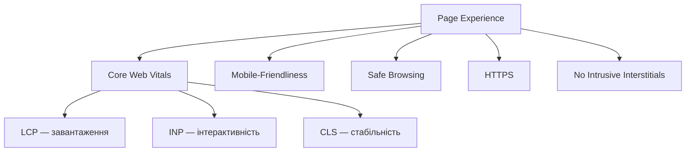
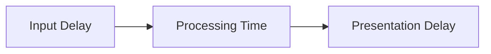
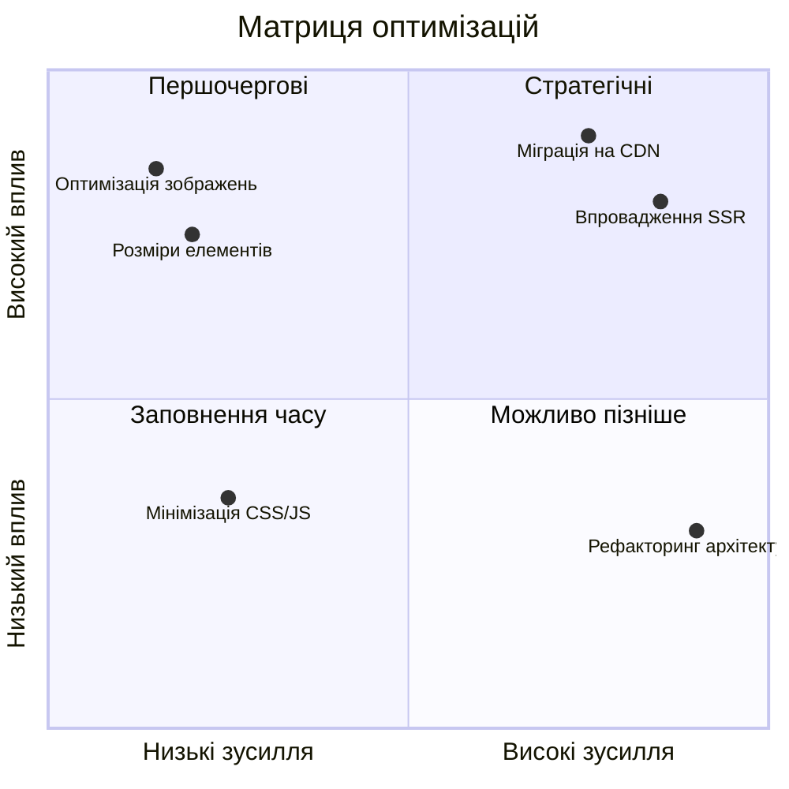

# Core Web Vitals та продуктивність

---

## 📌 Про що сьогодні

- Чому продуктивність = SEO
- Три метрики Core Web Vitals
- Інструменти вимірювання
- Оптимізація: від теорії до коду
- Mobile-first indexing
- Практичний чек-лист

---

## 🚀 Продуктивність та SEO: зв'язок

**Page Experience Update (травень 2020)** — Google офіційно включив UX до алгоритму ранжування.

- +32% відмов при завантаженні 1→3 секунди
- +90% відмов при завантаженні понад 5 секунд
- Amazon: 100 мс затримки = -1% продажів
- Walmart: +1 секунда швидкості = +2% конверсій

> Продуктивність — не технічна деталь, а бізнес-метрика.

---

## 🏗️ Структура Page Experience



---

## ⚡ LCP — Largest Contentful Paint

**Що вимірює:** час до появи найбільшого видимого елемента.

**Які елементи враховуються:**
- ``, `<video poster>`, CSS background-image
- Великі текстові блоки

| Оцінка | Значення |
|--------|----------|
| 🟢 Добре | ≤ 2.5 с |
| 🟡 Потребує покращення | 2.5–4 с |
| 🔴 Погано | > 4 с |

> Оцінка за **75-м перцентилем** усіх завантажень.

---

## 🔧 Як покращити LCP

**4 напрямки оптимізації:**

1. **Сервер** — CDN, edge caching, зниження TTFB < 600 мс
2. **Рендеринг** — прибрати render-blocking CSS/JS (`defer`, `async`)
3. **Зображення** — WebP/AVIF, `srcset`, `<link rel="preload">`
4. **Доставка** — SSR/SSG, HTTP/2, Brotli compression

```html
<!-- Пріоритизація LCP-зображення -->
<link rel="preload" as="image" href="hero.webp"
      imagesrcset="hero-320.webp 320w, hero-640.webp 640w"
      imagesizes="100vw">
```

---

## 🖱️ INP — Interaction to Next Paint

**Замінив FID** у березні 2024 року.

**Що вимірює:** повний цикл від дії користувача до візуального оновлення.



| Оцінка | Значення |
|--------|----------|
| 🟢 Добре | ≤ 200 мс |
| 🟡 Потребує покращення | 200–500 мс |
| 🔴 Погано | > 500 мс |

---

## 🔧 Як покращити INP

**Основна проблема:** JavaScript блокує головний потік.

- Розбивати завдання > 50 мс на менші (`setTimeout`, `scheduler.yield`)
- Мінімізувати роботу в event handlers (`requestIdleCallback`)
- Debouncing / throttling для scroll, resize
- **Web Workers** для важких обчислень

```javascript
// Передача управління браузеру під час масивних операцій
if (i % 50 === 0) {
  await new Promise(resolve => setTimeout(resolve, 0));
}
```

---

## 📐 CLS — Cumulative Layout Shift

**Що вимірює:** сумарне зміщення елементів під час завантаження.

**Формула оцінки:**
```
Layout Shift Score = Impact Fraction × Distance Fraction
```

| Оцінка | Значення |
|--------|----------|
| 🟢 Добре | ≤ 0.1 |
| 🟡 Потребує покращення | 0.1–0.25 |
| 🔴 Погано | > 0.25 |

> CLS > 0 = користувач натискає не туди і втрачає місце читання.

---

## 🔧 Як покращити CLS

**Найчастіші причини:**

- Зображення без зазначених розмірів → **завжди вказуйте `width` і `height`**
- Реклама та динамічний контент → **резервуйте простір через `min-height`**
- Веб-шрифти → **використовуйте `font-display: swap` або `optional`**
- Анімації → **тільки `transform` та `opacity`**, без layout-властивостей

```html
<!-- Правильно — браузер знає розміри заздалегідь -->

```

---

## 🛠️ Інструменти вимірювання

| Інструмент | Тип | Що дає |
|-----------|-----|--------|
| **PageSpeed Insights** | Lab + Field | Оцінка + рекомендації |
| **Google Search Console** | Field (CrUX) | Масштаб проблем по сайту |
| **Lighthouse** | Lab | Детальний аудит |
| **WebPageTest** | Lab | Реальні пристрої, географія |
| **Chrome DevTools** | Lab | Performance profiling |

**Lab data** — контрольоване середовище.
**Field data (CrUX)** — реальні користувачі, реальні умови.

---

## 📱 Mobile-First Indexing

Google **в першу чергу** аналізує мобільну версію сайту.

**Вимоги:**
- Весь ключовий контент — на мобільній версії
- Однакові `title`, `description`, structured data
- Viewport meta tag обов'язковий

```html
<meta name="viewport" content="width=device-width, initial-scale=1">
```

**Touch targets:** мінімум **48×48 px** з відстанню ≥ 8 px між ними.

---

## ✅ Чек-лист оптимізації

**LCP:**
- [ ] Формат WebP/AVIF для головного зображення
- [ ] `<link rel="preload">` для критичних ресурсів
- [ ] TTFB < 600 мс, CDN підключено

**INP:**
- [ ] Немає JS-завдань > 50 мс
- [ ] Web Workers для важких обчислень

**CLS:**
- [ ] Всі зображення мають `width` та `height`
- [ ] `font-display: swap` або `optional`

**Mobile:**
- [ ] Viewport налаштовано, touch targets ≥ 48 px

---

## 📊 Пріоритизація: вплив vs зусилля



---

## 🔄 Моніторинг та бюджети

**Не разова оптимізація — постійний процес.**

- **Lighthouse CI** — перевірка при кожному деплої
- **Search Console** — масштаб проблем по всьому сайту
- **RUM** (Real User Monitoring) — реальний досвід користувачів

```json
{
  "timings": [
    { "metric": "interactive", "budget": 3000 },
    { "metric": "first-contentful-paint", "budget": 1500 }
  ]
}
```

---

## 🎯 Висновки

1. **Core Web Vitals** — офіційний фактор ранжування Google з 2020 р.
2. **LCP, INP, CLS** — вимірюють завантаження, інтерактивність, стабільність.
3. Оцінка за **75-м перцентилем** реальних відвідувань.
4. **Mobile-first** — мобільна версія є пріоритетом для індексації.
5. Продуктивність впливає не лише на SEO, а й на **конверсії та дохід**.
