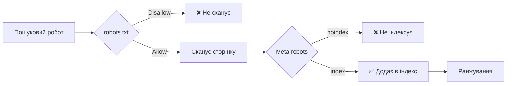
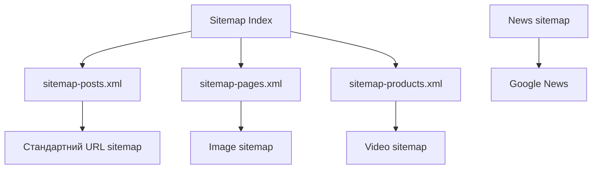
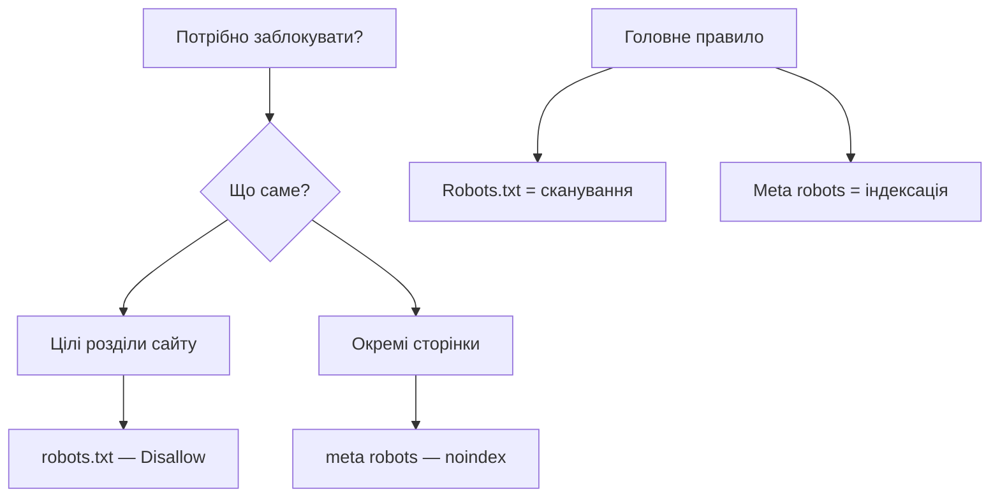
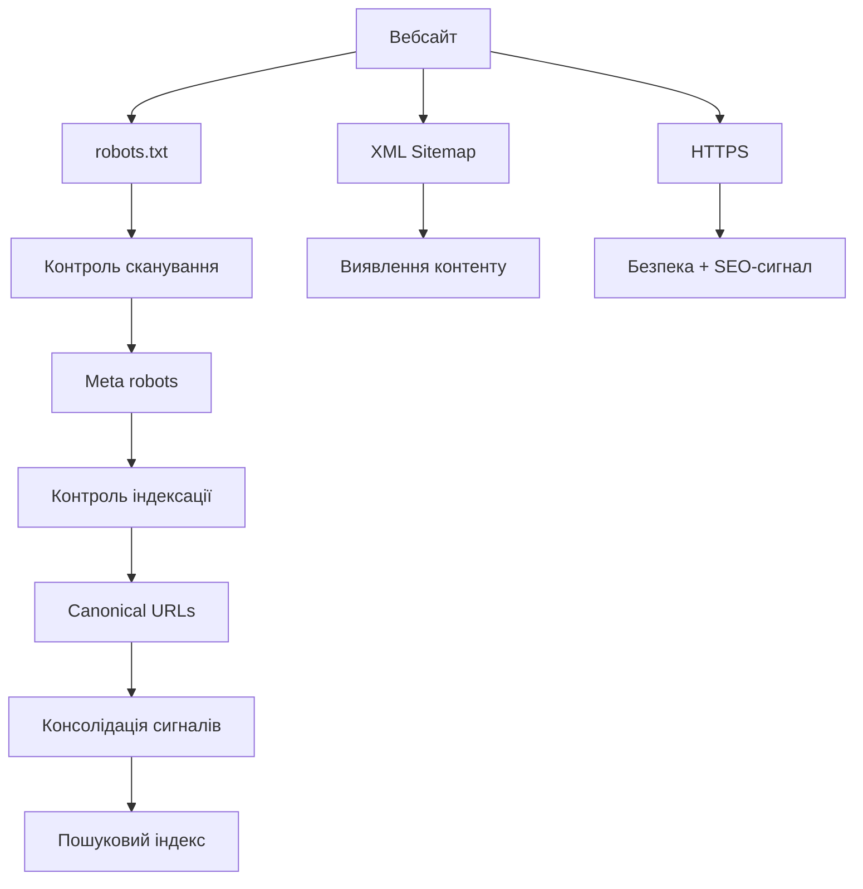

# Технічне SEO — crawling та indexing

---

## 📌 Про що сьогодні

- Robots.txt — макрорівень контролю
- XML Sitemap — карта для роботів
- Meta robots tags — мікрорівень контролю
- HTTPS та безпека
- Canonical URLs — боротьба з дублікатами
- Пагінація та сучасні підходи

---

## 🔍 Загальна схема: crawling → indexing



> Контент може бути **недоступним для сканування** або **відхиленим від індексації** — це різні рівні контролю.

---

## 🤖 Robots.txt — що це

**Robots Exclusion Protocol (1994)** — текстовий файл у корені сайту.

- Розташування: `https://example.com/robots.txt`
- Надає **рекомендації** роботам, не є механізмом безпеки
- Добросовісні роботи поважають директиви, зловмисники — ні

```
User-agent: *
Disallow: /admin/
Allow: /admin/admin-ajax.php
Crawl-delay: 10

Sitemap: https://example.com/sitemap.xml
```

---

## 📋 Директиви robots.txt

| Директива | Призначення |
|-----------|-------------|
| `User-agent` | До якого робота застосовується блок |
| `Disallow` | Шляхи, заборонені для сканування |
| `Allow` | Виняток всередині заблокованої директорії |
| `Crawl-delay` | Затримка між запитами (не підтримується Google) |
| `Sitemap` | Вказівка на XML sitemap |

**Wildcards:** `*` — будь-яка послідовність, `$` — кінець URL.

---

## ⚠️ Типові помилки robots.txt

**Заблокований весь сайт (тестові налаштування на продакшні):**
```
User-agent: *
Disallow: /   ← НЕБЕЗПЕЧНО!
```

**Заблоковані CSS та JS:**
```
Disallow: /css/   ← Google не зможе рендерити сторінки
Disallow: /js/
```

**Robots.txt ≠ захист контенту.** Якщо на сторінку посилаються інші сайти — вона може з'явитись в індексі навіть без сканування. Для заборони індексації — використовуйте `noindex`.

---

## 🗺️ XML Sitemap — навіщо потрібен

**Sitemap** допомагає роботам ефективно знаходити контент, особливо для:

- великих сайтів (тисячі сторінок)
- сайтів зі слабкою внутрішньою перелінковкою
- нового контенту, який ще не пов'язаний посиланнями

**Обмеження:**
- максимум **50 000 URL** на файл
- максимум **50 MB** (без компресії)
- для більших сайтів — **Sitemap Index**

---

## 📄 Структура XML Sitemap

```xml
<?xml version="1.0" encoding="UTF-8"?>
<urlset xmlns="http://www.sitemaps.org/schemas/sitemap/0.9">
  <url>
    <loc>https://example.com/</loc>
    <lastmod>2025-02-07</lastmod>
    <changefreq>daily</changefreq>
    <priority>1.0</priority>
  </url>
</urlset>
```

> ⚠️ Google ігнорує `changefreq` та `priority`. Вказуйте для документації, але не розраховуйте на вплив.

---

## 🗂️ Типи Sitemap



**Для кожного типу контенту — своє розширення XML.**

---

## 🏷️ Meta Robots Tags — мікрорівень

Розміщуються в `<head>` кожної сторінки окремо.

```html
<head>
  <meta name="robots" content="noindex, nofollow">
</head>
```

| Директива | Значення |
|-----------|----------|
| `index` / `noindex` | Дозволити / заборонити індексацію |
| `follow` / `nofollow` | Передавати / не передавати PageRank |
| `noarchive` | Не показувати кешовану копію |
| `nosnippet` | Не показувати опис у видачі |
| `max-snippet:N` | Обмежити довжину snippet |

---

## ⚖️ Robots.txt vs Meta Robots



---

## 🔒 HTTPS — базова вимога

**HTTPS є офіційним фактором ранжування** з 2014 року.

- Підтверджує автентичність сервера
- Шифрує дані в передачі
- Захищає від атак типу MITM
- Для SEO достатньо **DV-сертифіката** (безкоштовно через Let's Encrypt)

**Mixed content** — HTTPS-сторінка завантажує HTTP-ресурси:

```html
<!-- Автоматичне виправлення через CSP -->
<meta http-equiv="Content-Security-Policy"
      content="upgrade-insecure-requests">
```

---

## 🔐 HSTS — примусовий HTTPS

**HTTP Strict Transport Security** — браузер завжди використовує HTTPS.

```
Strict-Transport-Security: max-age=31536000; includeSubDomains; preload
```

- `max-age` — термін дії (1 рік = 31 536 000 с)
- `includeSubDomains` — поширюється на піддомени
- `preload` — вбудовується безпосередньо в браузери

**Кроки міграції HTTP → HTTPS:** отримати сертифікат → встановити → налаштувати 301 → оновити canonical → переподати sitemap.

---

## 🔗 Canonical URLs — проблема дублікатів

**Один контент — кілька URL:**

```
https://example.com/product
https://www.example.com/product
https://example.com/product?ref=twitter
https://example.com/product/
```

→ Пошуковик розділяє link equity між ними.

**Рішення — canonical tag:**

```html
<link rel="canonical" href="https://example.com/product">
```

---

## 📍 Canonical: коли і як

**Self-referencing canonical** — навіть на унікальних сторінках захищає від параметрів.

**Cross-domain canonical** — для синдикованого контенту.

| Ситуація | Інструмент |
|----------|-----------|
| Доступ до URL потрібен (параметри сортування) | `rel="canonical"` |
| Постійна зміна структури URL | 301 redirect |
| Міграція домену | 301 redirect |
| Синдикація контенту | Cross-domain canonical |

> Ніколи не використовуйте canonical для принципово різного контенту — це призведе до деіндексації.

---

## 📄 Пагінація — сучасні підходи

**Ситуація:** `rel="next"` / `rel="prev"` Google офіційно не використовує з 2019 р.

**Варіанти для SEO:**

1. **View All page** — одна сторінка з повним контентом + canonical із пагінованих сторінок.
2. **Self-referencing canonical** — кожна сторінка індексується окремо.
3. **noindex для глибоких сторінок** — `page=10+` отримують `noindex, follow`.
4. **Infinite scroll + SEO fallback** — JS для користувачів, пагінація для роботів.

---

## 🔄 Зведена схема технічного SEO



---

## ✅ Практичний чек-лист

**Robots.txt:**
- [ ] Файл доступний за `https://example.com/robots.txt`
- [ ] CSS та JS НЕ заблоковані
- [ ] Вказано `Sitemap:` директиву

**Sitemap:**
- [ ] Подано в Google Search Console
- [ ] Містить лише канонічні URL без noindex
- [ ] `lastmod` відповідає реальним датам

**Індексація:**
- [ ] Важливі сторінки доступні для сканування
- [ ] Сторінки з noindex не мають посилань у sitemap
- [ ] Canonical коректно вказує на пріоритетні URL

---

## 🎯 Висновки

1. **Robots.txt** — макрорівень, контролює сканування (не захист!).
2. **XML Sitemap** — прискорює виявлення та індексацію контенту.
3. **Meta robots** — мікрорівень, контролює індексацію окремих сторінок.
4. **HTTPS** — базова вимога, не опція.
5. **Canonical** — усуває дублікати, консолідує PageRank.
6. Технічне SEO вимагає **регулярного моніторингу**, а не разового налаштування.
