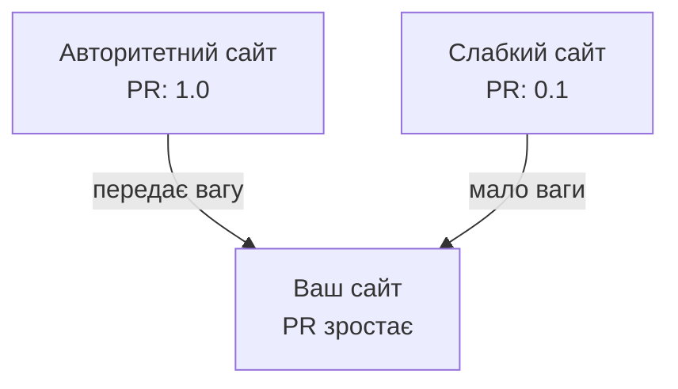
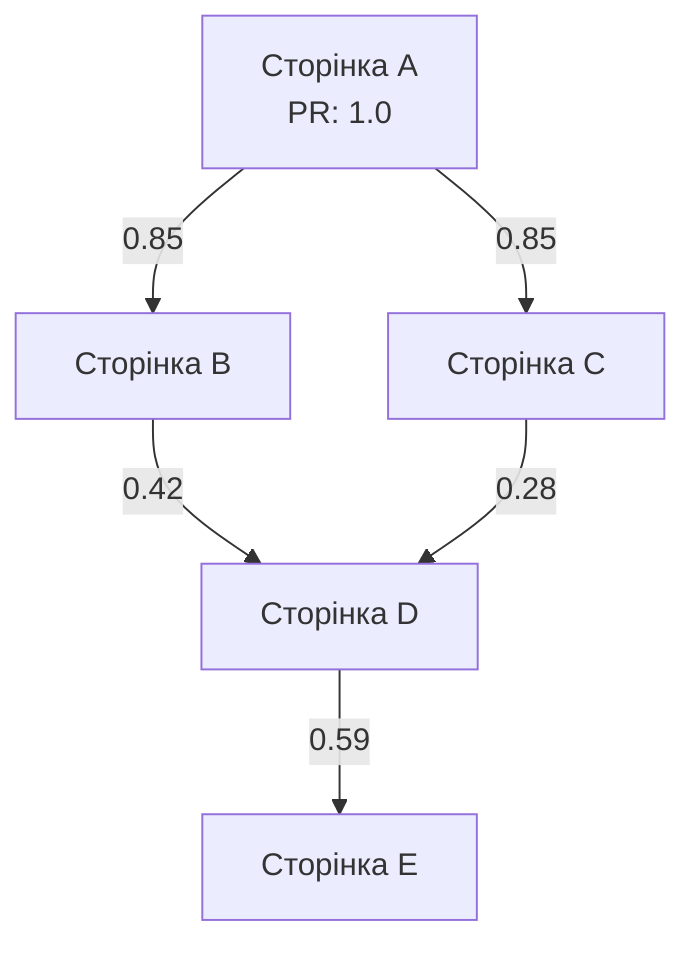
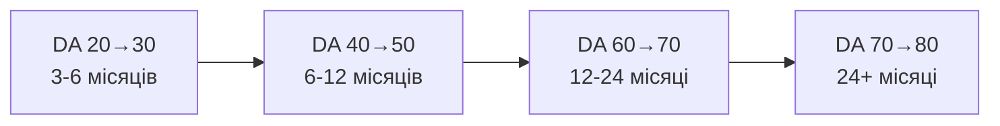
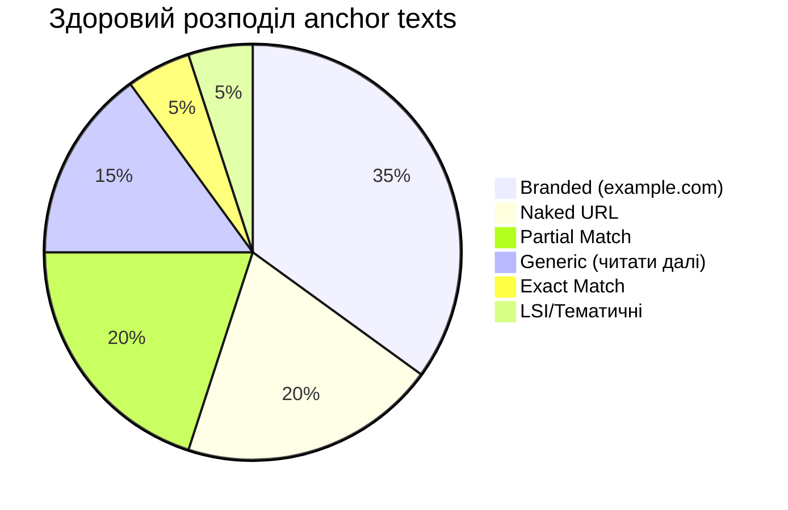

# Лекція 07: Link Building та Off-page SEO

---

## 🌐 Off-page SEO: що це і чому це важливо?

**On-page SEO** — що *ви* говорите про себе.

**Off-page SEO** — що *інші* говорять про вас.

> Зовнішні посилання = голоси довіри в очах пошукових систем.

Чим авторитетніше джерело посилання → тим ціннішим є голос.

---

## 📜 Народження PageRank

**1996 рік, Стенфордський університет** — Ларрі Пейдж та Сергій Брін.

Революційна ідея: важливість сторінки визначається не лише кількістю посилань, а **авторитетністю тих, хто посилається**.

Аналогія: академічні цитування в наукових статтях.



---

## 🧮 Математика PageRank (спрощено)

```
PR(A) = (1-d) + d × (PR(T1)/C(T1) + ... + PR(Tn)/C(Tn))
```

Ключові принципи:

- **d = 0.85** — damping factor (користувач продовжує клікати)
- Вага ділиться між **усіма вихідними посиланнями** сторінки
- Посилання з авторитетного сайту з малою кількістю посилань — найцінніше

> Краще одне посилання з Forbes, ніж 100 посилань зі сміттєвих каталогів.

---

## 💧 Link Equity: як тече авторитетність



**Link juice** — авторитетність, що передається через посилання.

⚠️ Чим більше вихідних посилань — тим менше кожне з них передає.

---

## 📊 Domain Authority: метрика, яка не від Google

**DA (Moz), DR (Ahrefs), AS (Semrush)** — не офіційні метрики Google!

Але корисні для:

- Порівняння з конкурентами
- Відбору партнерів для розміщення
- Моніторингу прогресу



⚠️ Шкала **логарифмічна** — чим вище, тим важче.

---

## 🔗 Dofollow vs Nofollow

**Dofollow** — стандартне посилання, передає PageRank:
```html
<a href="https://example.com">Текст посилання</a>
```

**Nofollow** — раніше блокував передачу ваги:
```html
<a href="https://example.com" rel="nofollow">Текст</a>
```

**З 2019 року** Google сприймає nofollow як *підказку*, а не директиву.

Також є: `rel="sponsored"` та `rel="ugc"` (форуми, коментарі).

---

## ⚓ Anchor Text: різноманітність = безпека



⚠️ **Забагато exact match** ("купити взуття") → сигнал маніпуляції → штраф.

---

## 🌿 Природний профіль посилань

Ознаки **здорового** профілю:

- Різноманітні джерела: блоги, медіа, форуми, директорії
- Поступове органічне зростання
- Деякі посилання природно *втрачаються* — це нормально
- Є посилання з .edu, .gov, галузевих видань

Ознаки **підозрілого** профілю:

- Різкий стрибок кількості посилань
- Всі посилання однотипні
- Однакові anchor texts (exact match)

---

## 🛠 Стратегії White-hat Link Building

| Стратегія | Складність | Якість посилань |
|-----------|-----------|-----------------|
| 📝 Guest posting | Середня | Висока |
| 📰 Digital PR | Висока | Дуже висока |
| 🔗 Broken link building | Середня | Висока |
| 🎤 HARO | Низька | Дуже висока |

---

## ✍️ Guest Posting

Пишемо якісну статтю для авторитетного сайту у своїй ніші → отримуємо посилання.

**Пошук можливостей:**
```
"ваша ніша" + "написати для нас"
"ваша ніша" + "гостьовий пост"
```

**Правила успіху:**
- Стаття має бути *кращою* за стандартний контент сайту
- 1-2 контекстні посилання в тексті > 10 у авторській біографії
- Оригінальні дані та інсайти підвищують шанси прийняття

---

## 📣 Digital PR: заробляй посилання, а не купуй

**Newsjacking** — швидко реагуємо на актуальні новини індустрії → журналісти цитують.

**Оригінальні дослідження** — опитування, звіти → десятки посилань на джерело.

**Інфографіки** — легко поширюються → посилання на оригінал.

> 💡 Одне посилання з Forbes = сотні посилань із сірих каталогів.

---

## 🔍 Broken Link Building

**Ідея:** знаходимо "мертві" посилання на авторитетних сайтах → пропонуємо свій контент як заміну.

**Алгоритм:**
1. Знаходимо релевантні сайти в ніші
2. Шукаємо 404-посилання (Ahrefs, розширення Check My Links)
3. Створюємо контент, що відповідає темі
4. Пишемо ввічливого листа вебмайстру

**Тон листа:** "Я знайшов у вас зламане посилання — ось мій матеріал на цю тему, можливо буде корисно для читачів."

---

## 🎤 HARO: стаєш медіаекспертом

**Help A Reporter Out** — платформа для зв'язку журналістів з експертами.

**Процес:**
1. Реєстрація на haro.com як джерело
2. Щоденні email-дайджести із запитами
3. Відповідаємо на релевантні → публікуємо з посиланням

**Секрет успіху:**
- Відповідай лише на теми де є реальна експертиза
- Конкретні дані + унікальна перспектива
- Швидкість — у журналістів дедлайни!
