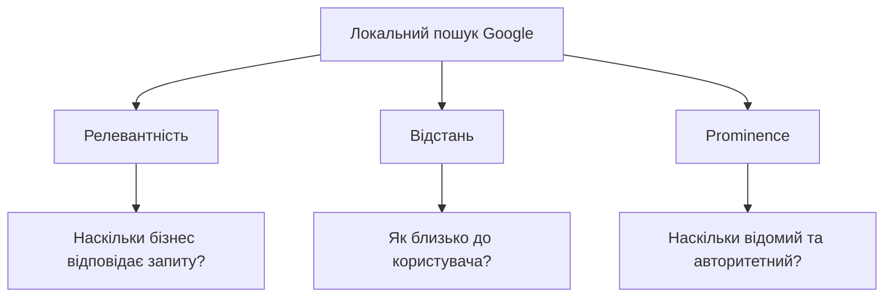
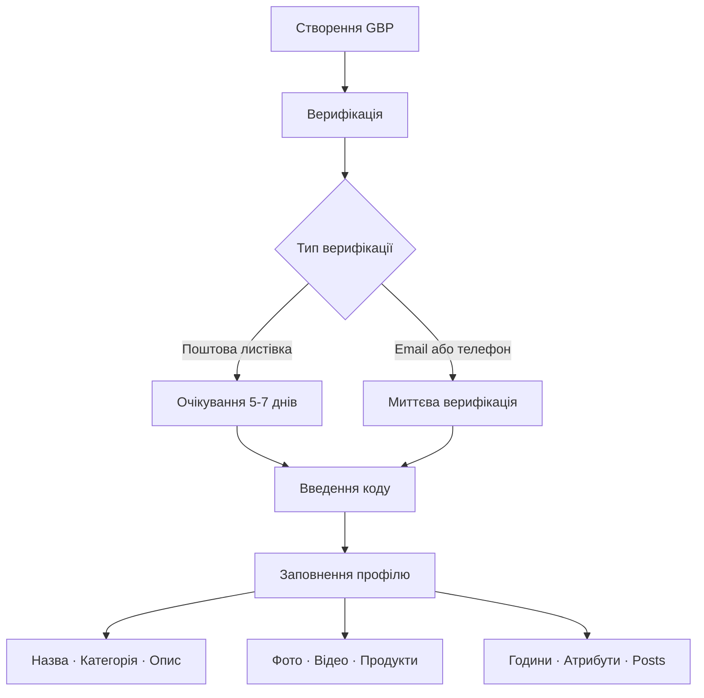
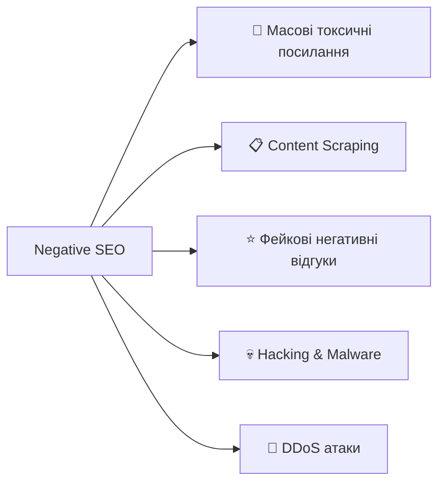

# Лекція 08: Локальне SEO та токсичні посилання

---

## 📍 Локальне SEO: чому це важливо?

**Факт:** більшість пошуків "поруч зі мною" відбувається зі смартфона.

> "Кафе поблизу", "ремонт телефонів Луцьк", "стоматолог відкритий зараз" — це локальний пошук.

**Хто потребує локального SEO:**
- Магазини, ресторани, кафе
- Медичні, юридичні, освітні заклади
- Будь-який бізнес з фізичною адресою

**Без локального SEO** — тебе немає на карті в буквальному сенсі.

---

## 🗺 Три фактори локального ранжування Google



**Prominence** — відгуки, посилання, згадки в мережі, репутація.

---

## 🏢 Google Business Profile: з чого починати



---

## ⚠️ Типові помилки в GBP

**Назва бізнесу** — тільки офіційна назва!

❌ `Пекарня Київ найкращі торти центр міста` → штраф
✅ `Пекарня Смачний Хліб`

**Категорія** — найвідповідальніший вибір.
Основна категорія = головний сигнал релевантності.

**Опис** (до 750 символів) — пишемо для людей, не для роботів.

**Фото:** логотип 720×720 px, обкладинка 1024×576 px (16:9).

---

## 📋 NAP Consistency: фундамент локального SEO

**NAP = Name + Address + Phone**

Google перевіряє однаковість цих даних по всьому вебу.

| ✅ Правильно | ❌ Неправильно |
|-------------|---------------|
| ТОВ "Технологічні Рішення" | Технологічні Рішення |
| вул. Хрещатик, 22, офіс 5 | Хрещатик 22, оф. 5 |
| +380 44 123 4567 | (044) 123-45-67 |

> Розбіжності = плутанина для Google = нижчі позиції.

---

## 🗂 Citations: де відзначитись?

**Structured citations** — бізнес-директорії (Google, Yelp, Facebook).
**Unstructured citations** — згадки у статтях, блогах, пресі.

| Рівень | Приклади |
|--------|---------|
| **Tier 1** 🏆 | Google GBP, Facebook, Apple Maps, Bing Places |
| **Tier 2** ⭐ | Yelp, Foursquare, YellowPages, галузеві каталоги |
| **Tier 3** 📌 | Регіональні директорії, нішеві каталоги |

**Стратегія:** спочатку Tier 1, потім розширення.

---

## ⭐ Reviews: не просто репутація, а ранжування

**Google підтверджує:** кількість, якість і свіжість відгуків впливають на позиції.

**Ідеальна стратегія:**

- Просити відгуки після позитивного досвіду
- Email-follow-up через 2-3 дні
- QR-коди в точках продажу
- Ніколи не купувати фейкові відгуки ← штраф + видалення профілю

**Орієнтир:** рейтинг 4.5+ → значно вищий CTR та конверсія.

---

## 💬 Відповіді на відгуки: шаблони

**На негативний:**
> "Дякуємо, що звернули увагу. Нам шкода чути про такий досвід — це не відповідає нашим стандартам. Зв'яжіться з нами за [контакт], і ми вирішимо ситуацію."

**На позитивний:**
> "Дякуємо за теплі слова! Раді, що [конкретна деталь із відгуку] вам сподобалась. Чекаємо на вас знову!"

⏱ Відповідь на негативний відгук — **протягом 24 годин**.

---

## ☠️ Токсичні посилання: що це?

Backlinks, що **шкодять** SEO-профілю через порушення Google Guidelines.

**Типові джерела:**
- 🕸 PBN (Private Blog Networks) — штучні мережі сайтів
- 💬 Spam-коментарі з комерційними anchor texts
- 📄 Дорвеї та сміттєві каталоги
- 🔗 Footer-посилання на сотнях чужих сайтів
- 🔞 Нерелевантні сайти (adult, gambling) без логіки зв'язку

---

## 🔬 Як виявити токсичні посилання?

| Інструмент | Що показує |
|-----------|-----------|
| **Google Search Console** | Базовий список backlinks |
| **Semrush Backlink Audit** | Автоматична токсичність 0-100 |
| **Ahrefs Site Explorer** | Spam Score, Domain Rating |
| **Moz Link Explorer** | Spam Score на рівні домену |

**Мануальні червоні прапорці:**
- Нерелевантна тематика (кулінарія → фінанси)
- Автоматичний або тонкий контент
- 80%+ однакових exact match anchor texts

---

## 🚫 Disavow: коли і як?

**Disavow — останній засіб**, не рутинна практика!

**Коли використовувати:**
- Manual action від Google за неприродні посилання
- Масована Negative SEO атака
- Спадок минулих маніпулятивних практик

**Формат файлу .txt:**
```
# Spam коментарі виявлені 15.01.2025
domain:spammy-blog.com

# PBN мережа
domain:pbn-network1.com
```

Завантаження → Google Search Console → Security & Manual Actions → Disavow Links.

---

## 🎯 Negative SEO: форми атак



**Реальність:** Google здебільшого ігнорує такі атаки, але моніторинг необхідний.

---

## 🛡 Захист від Negative SEO

**Проактивно:**
- Налаштувати alerts у Ahrefs / Semrush на нові посилання
- Google Alerts на згадки бренду
- Security плагіни (Wordfence, Sucuri) для WordPress
- Регулярні перевірки Google Search Console

**Якщо атака відбулась:**
1. Документувати (скріншоти, дати)
2. Outreach до вебмайстрів спам-сайтів
3. Disavow токсичних посилань
4. DMCA для scraped контенту
5. Нарощувати якісний профіль посилань

---

## 🎯 Ключові висновки

- **Локальне SEO** — обов'язкове для бізнесів з фізичною адресою
- **GBP + NAP + Citations + Reviews** = чотири стовпи локального ранжування
- **Токсичні посилання** можуть нашкодити — потрібен регулярний аудит
- **Disavow** — інструмент крайнього засобу, не рутина
- **Negative SEO** реальне, але Google дедалі краще його ігнорує

> 🔑 Локальне SEO = бути знайденим там, де тебе шукають.
