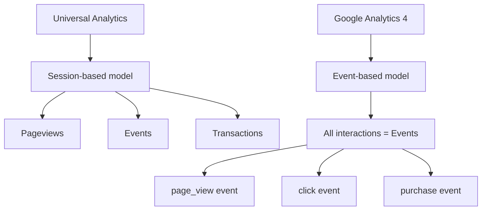
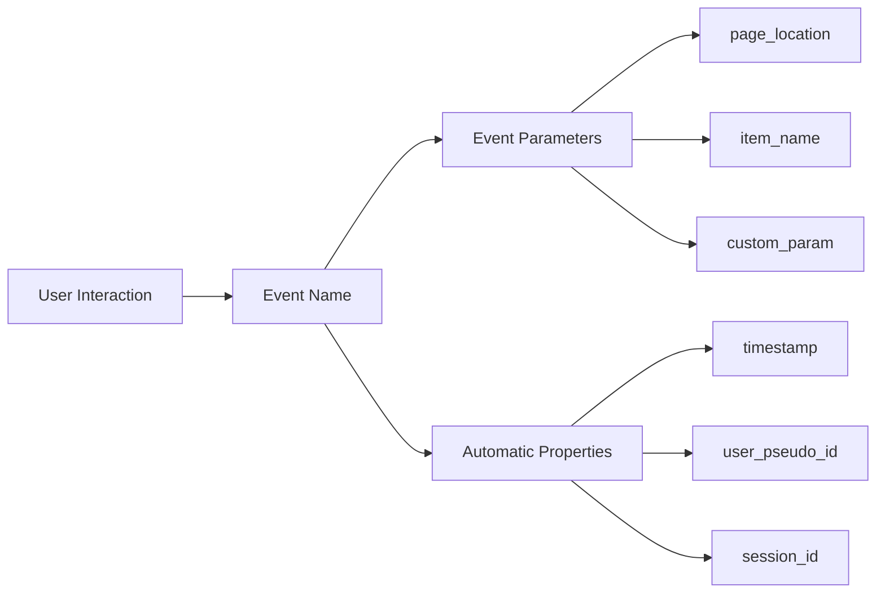
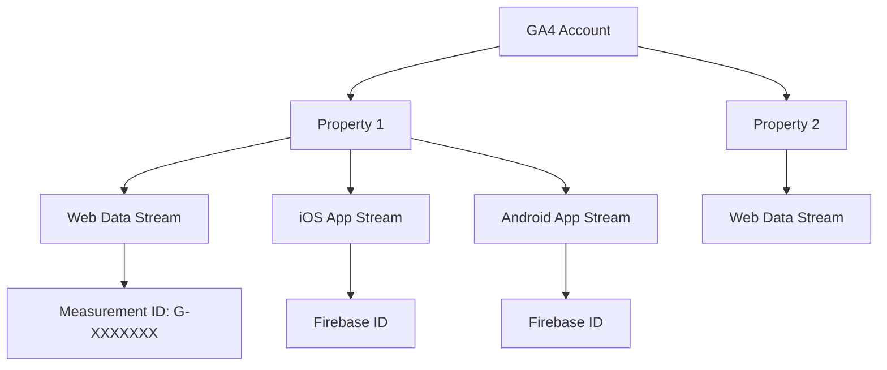
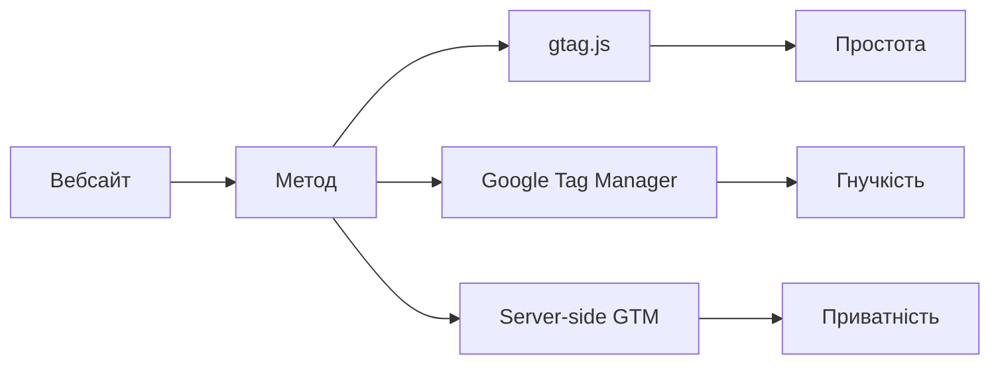
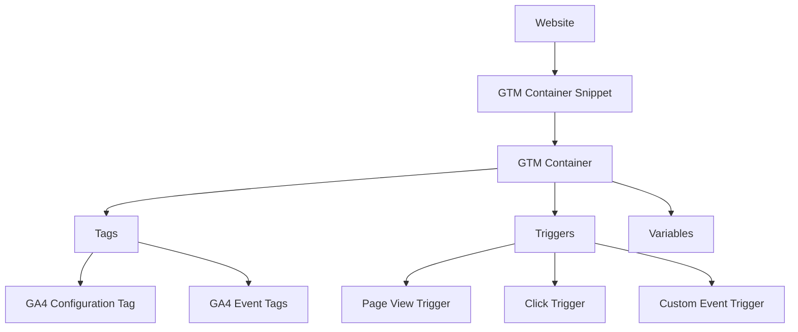
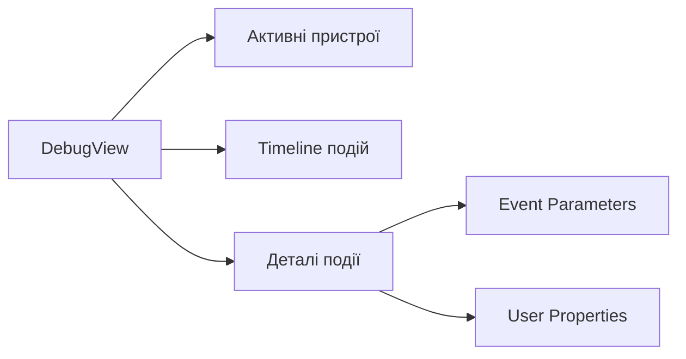

# Google Analytics 4 — основи 📊

---

## UA vs GA4: зміна парадигми

**Universal Analytics** (2012–2023) — орієнтований на сесії

**Google Analytics 4** (з 2020) — орієнтований на події

> 1 липня 2023 — офіційне вимкнення Universal Analytics

Це не просто оновлення інтерфейсу — це **зміна парадигми**

---

## Чому GA4, а не UA?

- 📱 Зростання мобільного трафіку
- 🔗 Мультиканальна поведінка користувачів
- 🍪 Посилення вимог до приватності даних (GDPR)
- 🤖 Інтеграція машинного навчання
- 📲 Єдина платформа для вебу та мобільних застосунків

---

## Порівняння архітектур



---

## Ключові відмінності UA vs GA4

| Аспект | Universal Analytics | Google Analytics 4 |
|---|---|---|
| Модель даних | Сесії | Події |
| Ідентифікація | Cookie / Client ID | User ID spaces + signals |
| Звіти | Преконфігуровані | Explorations (ad-hoc) |
| Кросплатформенність | Обмежена | Вбудована |
| ML-функції | Базові | Глибока інтеграція |
| Приватність | IP anonymization | Consent Mode v2 |

---

## Event-based модель: що це означає?

**Кожна взаємодія = подія з параметрами**

- Перегляд сторінки → `page_view`
- Клік на кнопку → кастомна подія
- Покупка → `purchase`

Немає ієрархії "сесія → pageview → event"

Все рівноцінно та гнучко 🎯

---

## Структура події в GA4



До кожної події можна додати **до 25 кастомних параметрів**

---

## Переваги event-based підходу

- **Гнучкість** — власні події з будь-якими параметрами
- **Уніфікація** — немає різних "типів hit", все є подіями
- **Кросплатформенність** — однакова структура для вебу та застосунків
- **ML-готовність** — структуровані дані для предиктивних моделей

---

## Сесії в GA4: як вони рахуються?

Нова сесія починається при:

- 🆕 Першому відвідуванні сайту
- ⏰ 30 хвилинах неактивності
- 🔗 Зміні UTM-параметрів кампанії

**Engaged session** — сесія тривалістю >10 сек або з конверсією або з 2+ переглядами

На відміну від UA: сесія **не скидається** о півночі

---

## Ієрархія GA4: Account → Property → Stream



---

## Property та Data Streams

**Account** — організаційна одиниця (компанія / проєкт)

**Property** — конкретний вебсайт або застосунок

**Data Stream** — джерело даних:

- 🌐 Web Stream → `G-XXXXXXXXXX`
- 🍎 iOS App Stream → Firebase ID
- 🤖 Android App Stream → Firebase ID

Одна property може мати кілька streams одночасно

---

## Measurement ID

Формат: `G-XXXXXXXXXX`

- Прив'язаний до конкретного **Data Stream**, а не до property
- Відрізняється від UA Tracking ID (`UA-XXXXXXXX-Y`)
- Різні субдомени можуть мати різні Measurement ID

---

## Методи встановлення tracking



Для більшості проєктів рекомендується **Google Tag Manager** 🏆

---

## gtag.js: встановлення

Два блоки коду в `<head>`:

```javascript
// 1. Завантаження бібліотеки
<script async src="https://www.googletagmanager.com/gtag/js?id=G-XXXXXX"></script>

// 2. Ініціалізація
<script>
  window.dataLayer = window.dataLayer || [];
  function gtag(){dataLayer.push(arguments);}
  gtag('js', new Date());
  gtag('config', 'G-XXXXXX');
</script>
```

---

## Google Tag Manager: архітектура



---

## GTM: три складові

**Tags** — фрагменти коду, що виконують дії
(надсилають дані до GA4, завантажують пікселі)

**Triggers** — визначають, КОЛИ тег спрацьовує
(завантаження сторінки, клік, кастомна подія)

**Variables** — зберігають значення для тегів
(Measurement ID, дані з dataLayer, URL)

---

## Enhanced Measurement ⚡

Автоматичні події без написання коду:

| Подія | Що відстежує |
|---|---|
| `scroll` | Прокрутка до 90% сторінки |
| `click` | Кліки на зовнішні посилання |
| `file_download` | Завантаження файлів (pdf, xlsx, zip...) |
| `video_start/complete` | YouTube-відео |
| `form_start/submit` | HTML-форми |
| `view_search_results` | Внутрішній пошук |

---

## Обмеження Enhanced Measurement

- ⚠️ Недостатня деталізація параметрів
- ⚠️ Складно фільтрувати технічні кліки
- ⚠️ Неможливо додати кастомні параметри
- ⚠️ Проблеми з SPA (React, Vue)

Розглядати як **стартову точку**, а не повноцінне рішення

---

## DebugView 🔍

Перегляд подій **у реальному часі** під час тестування

На відміну від стандартних звітів — **без затримки 24-48 годин**



---

## Як увімкнути DebugView

**Спосіб 1:** gtag.js — додати параметр:
```javascript
gtag('config', 'G-XXXXXX', { 'debug_mode': true });
```

**Спосіб 2:** GTM — використати **Preview mode** (рекомендовано)

**Спосіб 3:** Chrome extension **Google Analytics Debugger**

⚠️ Не залишайте debug mode в production!

---

## Типові помилки, які виявляє DebugView

- 🔁 **Дубльовані події** — тригер спрацьовує кілька разів
- ❌ **Відсутні параметри** — dataLayer variable не заповнена
- 🔢 **Неправильний тип даних** — число надходить як рядок
- 📄 **Подія на неправильній сторінці** — некоректний тригер

---

## Висновки

GA4 — це **фундаментальна зміна парадигми**, а не оновлення

**Event-based модель** → гнучкість і кросплатформенність

**Ієрархія Account → Property → Stream** → зрозуміла організація

**GTM + Enhanced Measurement** → швидкий старт без коду

**DebugView** → валідація перед production

Правильне налаштування з початку = якісні дані назавжди 🎯
