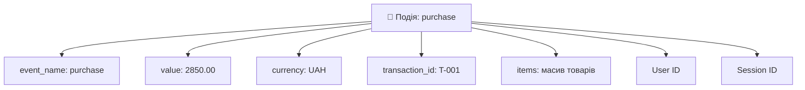
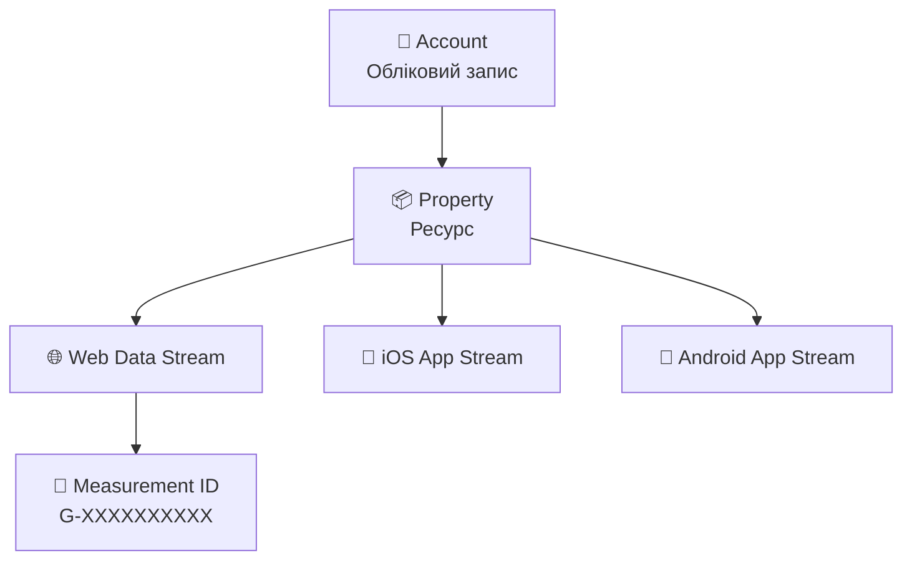
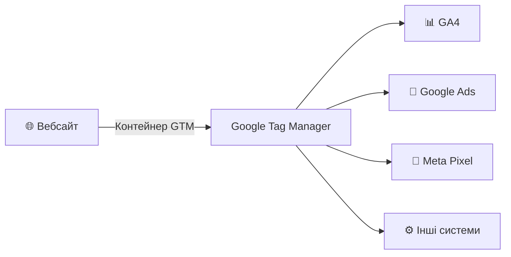
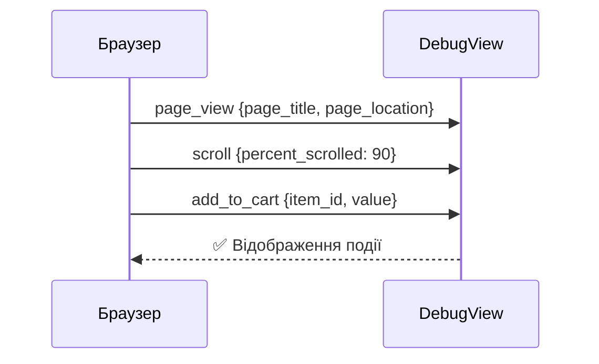
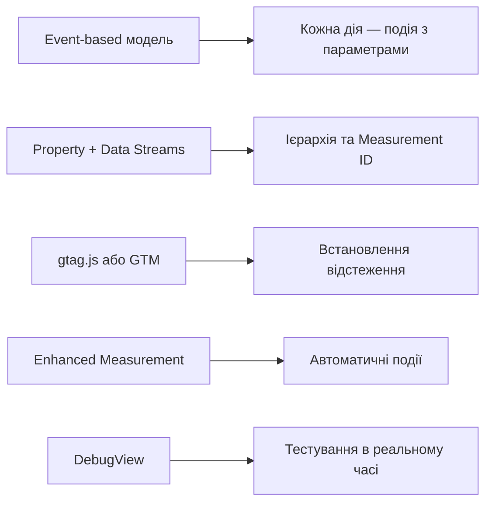

# Google Analytics 4 — основи


---

## Чому GA4 — це не просто «новий дизайн»

### Universal Analytics → Google Analytics 4

| | Universal Analytics | Google Analytics 4 |
|---|---|---|
| Модель даних | Сесійна | Event-based |
| Основна одиниця | Сесія | Подія |
| Платформи | Тільки веб | Веб + iOS + Android |
| BigQuery | Платно | Безкоштовно |
| Cookies | Залежить | Мінімальна залежність |

> У липні 2023 Google повністю припинив обробку даних у Universal Analytics.

---

## Дві моделі — два способи мислення

```mermaid
graph LR
    subgraph UA — Сесійна модель
        S1[Сесія відкрилась] --> H1[Хіт: pageview]
        H1 --> H2[Хіт: event]
        H2 --> H3[Хіт: transaction]
        H3 --> S2[Сесія закрилась]
    end
    subgraph GA4 — Event-based модель
        E1[page_view] --> E2[scroll]
        E2 --> E3[add_to_cart]
        E3 --> E4[purchase]
    end
```

**UA питає:** скільки сесій і скільки сторінок за сесію?

**GA4 питає:** що робили користувачі і в якій послідовності?

---

## Ключові зміни в метриках

### Що зникло і що прийшло

❌ **Показник відмов** (Bounce Rate) у класичному вигляді

✅ **Рівень залученості** (Engagement Rate)

✅ **Залучена сесія** = тривала > 10 сек **або** мала конверсію **або** ≥ 2 перегляди

---

🔄 Показник відмов = 100% − Engagement Rate

---

## Анатомія події в GA4



**Кожен рядок у базі GA4 — це подія.**
Сесії, користувачі, конверсії — похідні агрегати.

---

## Ієрархія акаунту GA4



**Property** — основний контейнер даних.
**Data Stream** — джерело: сайт або застосунок.
**Measurement ID** — ідентифікатор для коду відстеження.

---

## Два способи встановлення

### Варіант A: gtag.js (пряме встановлення)

```html
<script async src="https://www.googletagmanager.com/gtag/js?id=G-XXXXXXX"></script>
<script>
  window.dataLayer = window.dataLayer || [];
  function gtag(){dataLayer.push(arguments);}
  gtag('js', new Date());
  gtag('config', 'G-XXXXXXX');
</script>
```

✅ Просто · ❌ Кожна зміна вимагає розробника

---

### Варіант B: Google Tag Manager

Один контейнер на сайті → всі теги через вебінтерфейс GTM.

✅ Гнучко · ✅ Без розробника · ✅ Всі теги в одному місці

---

## GTM — центр управління тегами



**Ключова перевага:** маркетологи вносять зміни самостійно, не чекаючи розробника.

---

## Enhanced Measurement — автоматичні події

### Що відстежується без додаткового коду:

| Подія | Коли спрацьовує |
|---|---|
| `page_view` | Завантаження сторінки |
| `scroll` | Прокрутка до 90% сторінки |
| `click` | Клік на зовнішнє посилання |
| `file_download` | Завантаження PDF, ZIP, DOCX |
| `video_start/complete` | Взаємодія з YouTube-відео |
| `view_search_results` | Внутрішній пошук по сайту |

⚙️ Налаштування: Admin → Data Streams → Enhanced Measurement

---

## DebugView — тестування в реальному часі

### Як увімкнути:

- 🔌 Розширення браузера **Google Analytics Debugger** (Chrome)
- 🔍 **GTM Preview Mode** — автоматично
- 💻 У коді: `gtag('config', 'G-XXX', {'debug_mode': true})`

---



**Затримка ~1–2 сек.** Незамінний при впровадженні та тестуванні.

---

## Що важливо налаштувати одразу

### ☑️ Чеклист після створення ресурсу

- [ ] Змінити **Data Retention** з 2 місяців на **14 місяців**
- [ ] Перевірити **часовий пояс та валюту** у налаштуваннях property
- [ ] Увімкнути / перевірити **Enhanced Measurement**
- [ ] Встановити код відстеження та перевірити через **DebugView**
- [ ] Зв'язати з **Google Search Console** та **Google Ads**

---

## Підсумок лекції


