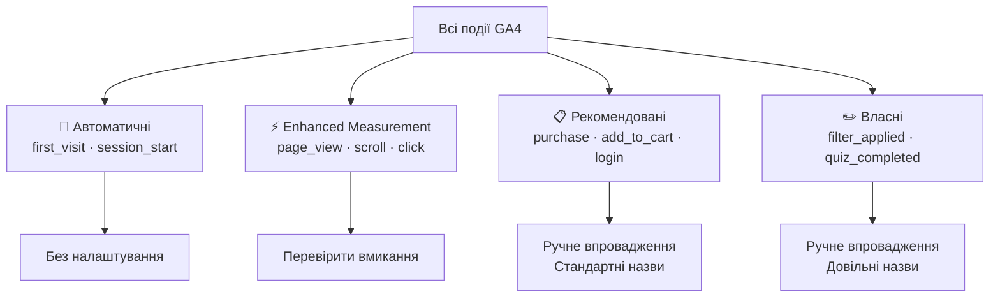
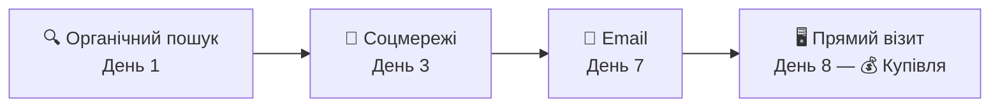
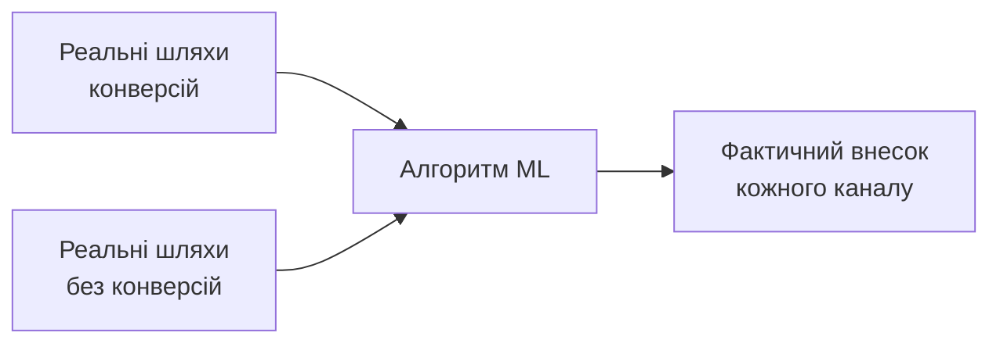
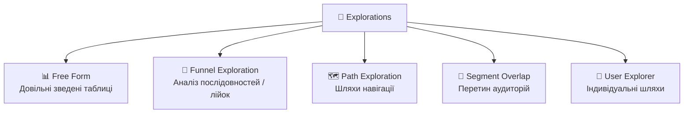
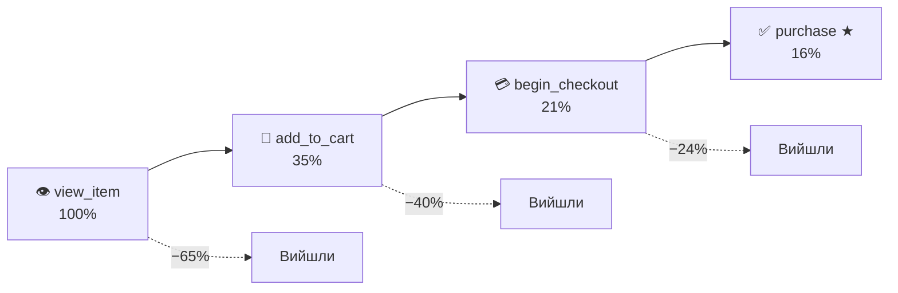
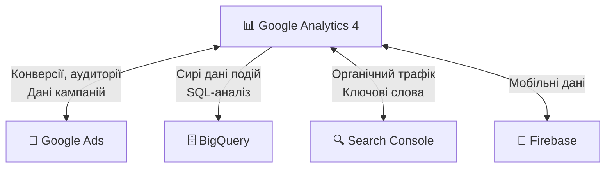
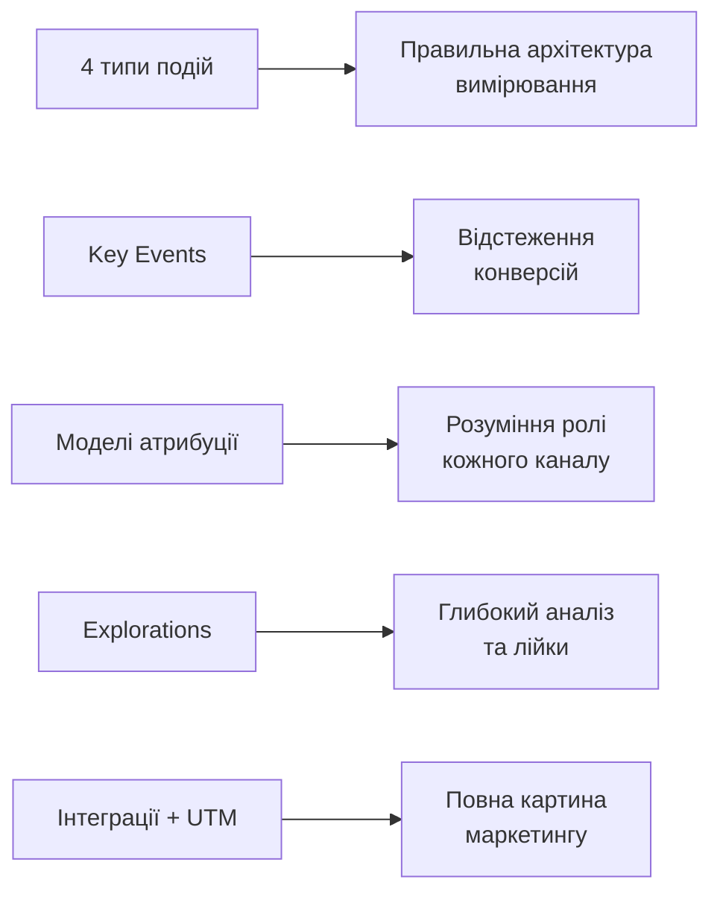

# GA4 — події, конверсії та атрибуція

---

## Чотири типи подій у GA4



---

## Рекомендовані події — чому назва важлива

### eCommerce-послідовність (стандарт Google):

| Назва події | Де спрацьовує |
|---|---|
| `view_item` | Картка товару |
| `add_to_cart` | Кнопка «Додати до кошика» |
| `begin_checkout` | Початок оформлення |
| `purchase` | Підтвердження замовлення |

⚠️ Якщо назвати `order_complete` замість `purchase` — подія **не потрапить** до стандартних звітів монетизації.

---

## Власні події — правила іменування

### ✅ Як правильно:

```
filter_applied
quiz_completed
chat_opened
promo_banner_clicked
```

### ❌ Як не можна:

```
filter applied    ← пробіли заборонені
filter-applied    ← дефіс заборонений
1filter           ← не починається з літери
```

📌 Конвенція: **snake_case**, лише латиниця, описує **дію**, а не результат.

---

## Параметри події — контекст взаємодії

```javascript
gtag('event', 'purchase', {
  transaction_id: 'T-2024-001',
  value: 2850.00,
  currency: 'UAH',
  coupon: 'SUMMER10',
  items: [{
    item_id: 'SKU_001',
    item_name: 'Смартфон Samsung Galaxy A55',
    item_category: 'Смартфони',
    quantity: 1,
    price: 2850.00
  }]
});
```

**Без параметрів** — знаємо лише факт покупки.
**З параметрами** — знаємо що, скільки, за яку суму, з яким купоном.

---

## Custom Definitions — реєстрація параметрів

### Чому це потрібно?

GA4 **не відображає** кастомні параметри у звітах автоматично.

### Як зареєструвати:

Admin → **Custom Definitions** → Create Custom Dimension

| Поле | Значення |
|---|---|
| Dimension name | Категорія товару |
| Scope | Event |
| Event parameter | `item_category` |

⏳ Дані з'являться у звітах лише для **нових** подій після реєстрації.

---

## Конверсії: Key Events

### Від «цілей» UA до «ключових подій» GA4

**Universal Analytics:** Goals — окремі налаштування (destination, duration, event).

**GA4:** будь-яка подія → ключова одним кліком.

---

### Як позначити:

Admin → **Events** → знайти подію → 🔘 Mark as key event

або

Admin → **Conversions** → New conversion event → ввести назву

---

⚠️ GA4 рахує **кожне спрацювання**, не унікальних користувачів.
Для унікальних — використовуй метрику **Converted users**.

---

## Моделі атрибуції — хто отримує «кредит»?

### Шлях до конверсії:



| Модель | Розподіл кредиту |
|---|---|
| Last Click | 0% / 0% / 0% / **100%** |
| First Click | **100%** / 0% / 0% / 0% |
| Linear | 25% / 25% / 25% / 25% |
| Time Decay | 5% / 10% / 30% / **55%** |
| **Data-Driven** ✅ | Залежить від реальних даних |

---

## Data-Driven атрибуція — чому вона краща

### Як працює:



✅ Враховує **всі точки контакту**
✅ Адаптується до **конкретного бізнесу**
⚠️ Потребує мінімум **400 конверсій/місяць**

**Порівняти моделі:** Advertising → Attribution → Model Comparison

---

## Аудиторії — сегменти для аналізу і реклами

### Приклади аудиторій:

- 🛒 «Кинутий кошик» — `add_to_cart` без `purchase` за 7 днів
- 👁️ «Зацікавлені в ноутбуках» — переглянули товар з категорії Laptops 3+ рази
- 🔄 «Активні клієнти» — покупка протягом останніх 30 днів
- 🤖 «Ймовірні покупці» — predictive audience від ML

---

### Де використовується:

📊 В аналізі (Explorations) → 🎯 В Google Ads (ремаркетинг)

Admin → **Audiences** → New Audience

---

## Explorations — інструменти вільного аналізу



**Стандартні звіти** показують що відбулось.
**Explorations** пояснюють чому.

---

## Funnel Exploration — аналіз лійки



**Open funnel** — користувач може пропустити кроки.
**Closed funnel** — лише ті, хто пройшов усі кроки по порядку.

---

## Три типи сегментів в Explorations

| Тип | Включає | Коли використовувати |
|---|---|---|
| **User segment** | Всі події користувача | Аналіз поведінки аудиторії |
| **Session segment** | Лише ті сесії, де виконалась умова | Аналіз лійок та шляхів |
| **Event segment** | Лише конкретні події | Аналіз окремих взаємодій |

⚠️ Неправильний тип сегменту → хибні висновки.

---

## Інтеграції GA4



**GA4 → Google Ads:** аудиторії для ремаркетингу + конверсії для оптимізації.
**GA4 → BigQuery:** сирі дані для SQL-аналізу на рівні кожної події.

---

## UTM-розмітка — основа атрибуції

### Структура UTM-посилання:

```
https://example.com/promo
  ?utm_source=google
  &utm_medium=cpc
  &utm_campaign=spring_sale_2024
  &utm_content=banner_v2
  &utm_term=купити+смартфон
```

| Параметр | Що описує | Приклад |
|---|---|---|
| `utm_source` | Джерело | `google`, `facebook` |
| `utm_medium` | Канал | `cpc`, `email`, `social` |
| `utm_campaign` | Кампанія | `spring_sale_2024` |
| `utm_content` | Варіант оголошення | `banner_v2` |
| `utm_term` | Ключове слово | `купити смартфон` |

---

## Підсумок лекції


