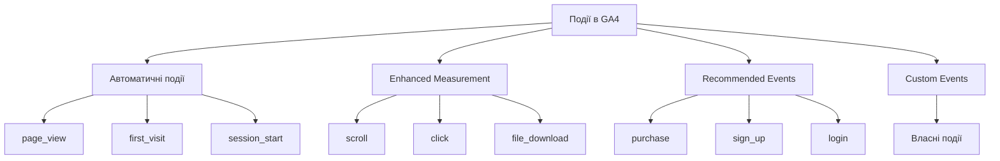
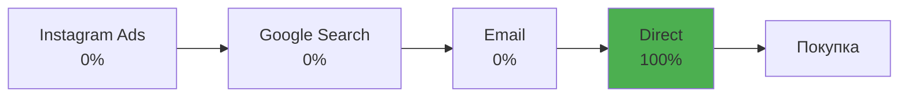
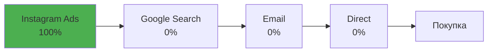
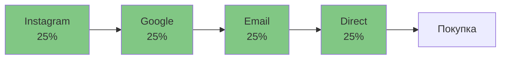
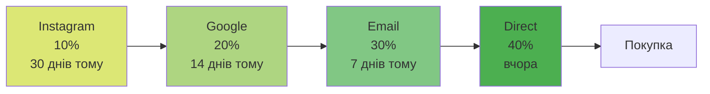
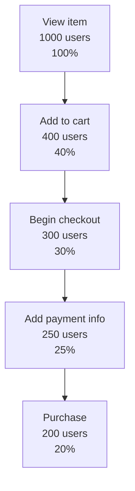

# GA4 — події, конверсії та атрибуція 🎯


---

## Все є подією в GA4

У GA4 будь-яка взаємодія — це **подія**

Перегляд сторінки — подія.
Клік — подія.
Покупка — подія.
Навіть початок сесії — подія.

Розуміння системи подій = розуміння GA4 🧠

---

## Ієрархія типів подій



---

## Автоматичні події 🤖

Збираються **без будь-яких налаштувань**:

- `page_view` — кожен перегляд сторінки
- `session_start` — початок нової сесії
- `first_visit` — перше відвідування (спрацьовує один раз!)
- `user_engagement` — активна взаємодія з сайтом

⚠️ Для SPA (React, Vue) потрібне додаткове налаштування `page_view`

---

## Recommended Events 📋

Стандартизовані назви від Google — **реалізуються вручну**

- `login` / `sign_up` — вхід та реєстрація
- `search` — пошук на сайті
- `share` — поширення контенту
- `select_content` — кліки по елементах контенту

**Переваги:**
- Автоматично з'являються у стандартних звітах
- Інтеграція з Google Ads без налаштувань
- Сумісність з майбутніми функціями GA4

---

## E-commerce: воронка рекомендованих подій

`view_item` → `add_to_cart` → `begin_checkout`
→ `add_payment_info` → `add_shipping_info` → `purchase`

Кожен крок покупки відстежується як окрема подія

---

## Custom Events ✏️

```javascript
gtag('event', 'calculator_used', {
  calculation_type: 'mortgage',
  result_value: 250000,
  currency: 'UAH'
});
```

**Правила іменування:**
- Починається з літери
- Тільки літери, цифри, підкреслення
- Не довше 40 символів
- snake_case (`my_event`, не `MyEvent`)
- GA4 чутливий до регістру!

---

## Параметри подій

До кожної події — **до 25 кастомних параметрів**

```javascript
gtag('event', 'product_view', {
  item_id: 'SKU_12345',
  item_name: 'Ноутбук ASUS',
  item_category: 'Електроніка',
  price: 25000,
  currency: 'UAH',
  user_type: 'registered',
  in_stock: true
});
```

---

## Dimensions vs Metrics

**Виміри (Dimensions)** — якісні характеристики:
*"що?", "який?"* → назва події, категорія, тип пристрою

**Метрики (Metrics)** — кількісні показники:
*"скільки?"* → кількість подій, сума покупки, час на сторінці

---

## Конверсії в GA4 🏆

**Конверсія** — будь-яка подія, яку ви позначили як важливу

В GA4: проста перемикач у налаштуваннях → `Mark as key event`

- До **30 конверсій** на property
- Рахуються як **загальна кількість подій** (не унікально на сесію!)
- З лютого 2024 нова назва: **Key Events**

---

## Macro vs Micro конверсії

**Macro-conversions** — головні бізнес-цілі:
- 🛒 Інтернет-магазин → `purchase`
- 📧 Медіасайт → `subscribe_newsletter`
- 💼 SaaS → `sign_up` / `subscribe`

**Micro-conversions** — проміжні дії:
- `add_to_cart`
- `video_complete`
- `file_download`
- `click_contact`

---

## Conversion Rate у GA4

```
Conversion Rate = (Сесії з конверсією / Загальна кількість сесій) × 100%
```

**Приклад:**
1000 сесій за день → 50 з покупкою, 150 із завантаженням файлу

- Purchase conversion rate = **5%**
- File download conversion rate = **15%**
- Overall conversion rate = **15%** (150 унікальних сесій з будь-якою конверсією)

---

## Що таке атрибуція? 🗺️

Користувач рідко купує після першого відвідування.

**Типовий шлях:**
Instagram Ads → Google Search → Email → Пряме посилання → **Покупка**

Атрибуція відповідає на питання:
**Якому каналу "зарахувати" цю конверсію?**

---

## Last Click — останній клік



✅ Простота, легко відстежити тригер конверсії
❌ Ігнорує попередні точки контакту, недооцінює awareness-канали

**Підходить для:** імпульсивних покупок, коротких циклів

---

## First Click — перший клік



✅ Показує ефективність каналів залучення
❌ Ігнорує канали, що "дожимають" до покупки

**Підходить для:** аналізу B2B, планування awareness-бюджету

---

## Linear — лінійна модель



✅ Враховує всі точки контакту
❌ Не розрізняє важливість взаємодій

**Підходить для:** luxury-брендів, складних B2B-продуктів

---

## Time Decay — затухання в часі



✅ Логічна для довгих циклів покупки
**Підходить для:** нерухомість, автомобілі, B2B-продажі

---

## Data-Driven Attribution 🤖

Машинне навчання аналізує ваші дані та визначає **реальний вплив кожного каналу**

- Порівнює шляхи тих, хто конвертувався, з тими, хто ні
- Динамічно адаптується до змін поведінки

**Вимоги:** мінімум 400 конверсій за 30 днів + зв'язок з Google Ads

🏆 **Золотий стандарт** для великих вебсайтів з достатньою кількістю даних

---

## Яку модель обрати?

| Ситуація | Модель |
|---|---|
| Короткий цикл покупки | Last Click |
| Аналіз залучення | First Click |
| Всі канали рівноцінні | Linear |
| Довгий цикл рішення | Time Decay |
| Достатньо даних (400+ конв/міс) | Data-Driven |

Жодна модель не є "правильною" — краще використовувати кілька для різних цілей

---

## Аудиторії в GA4 👥

**Аудиторія** — сегмент користувачів за визначеними критеріями

До **100 аудиторій** на property

Використання:
- Ремаркетинг у Google Ads
- Аналіз у звітах
- Персоналізація контенту

⚠️ Аудиторії працюють **prospectively** — тільки з моменту створення!

---

## Типи аудиторій

**Predefined** — готові шаблони: Purchasers, All Users, Recently Active

**Custom** — власні критерії:
- Комбінація подій та параметрів
- Послідовності дій
- Властивості користувача

**Predictive** (ML) — прогнозні:
- Likely to purchase (in next 7 days)
- Likely to churn

---

## Приклад кастомної аудиторії

**"Переглянули товар, але не купили"**

✅ Умова включення: `view_item` — мінімум 1 раз за 30 днів

❌ Умова виключення: `purchase` — НЕ відбулася за 30 днів

⏱️ Membership duration: 30 днів

→ Ідеальна аудиторія для **ремаркетингу** 🎯

---

## Сегментація: Explorations 🔭

Потужний інструмент для ad-hoc аналізу



Найбільший відвал — на етапі додавання в кошик (**60%**)

---

## Типи Explorations

- **Free Form** — таблиці та графіки з будь-якими вимірами
- **Funnel Exploration** — воронка конверсії з відвалом
- **Path Exploration** — шляхи навігації по сайту
- **Segment Overlap** — перетин сегментів аудиторії
- **Cohort Exploration** — аналіз когорт у часі
- **User Lifetime** — поведінка за весь lifecycle

---

## Три типи сегментів в Explorations

**User segments** — фільтр за lifetime поведінкою:
*Користувачі, які колись купили*

**Session segments** — фільтр за конкретною сесією:
*Сесії, де переглянули 5+ сторінок*

**Event segments** — фільтр за конкретними подіями:
*Покупки на суму >100 USD*

⚠️ Різниця критично важлива для правильної інтерпретації!

---

## Інтеграції GA4 🔌

**Google Ads** — імпорт конверсій, експорт аудиторій, smart bidding

**BigQuery** — безкоштовний raw data export (раніше тільки для GA360!)
→ SQL-запити, кастомні дашборди, ML-моделі, необмежений storage

**Measurement Protocol** — відправка подій з серверів, IoT, офлайн (POS)

**Server-Side GTM** — обхід ad blockers, краща швидкість, контроль над даними

---

## Висновки

Event-based архітектура → **безпрецедентна гнучкість** вимірювання

Правильні конверсії → **розуміння воронки** від залучення до покупки

Моделі атрибуції → **різні погляди** на один customer journey

Аудиторії → **замкнений цикл**: аналіз → ремаркетинг → оптимізація

BigQuery → **enterprise-аналітика** доступна всім 🚀
