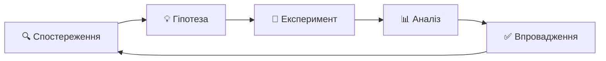
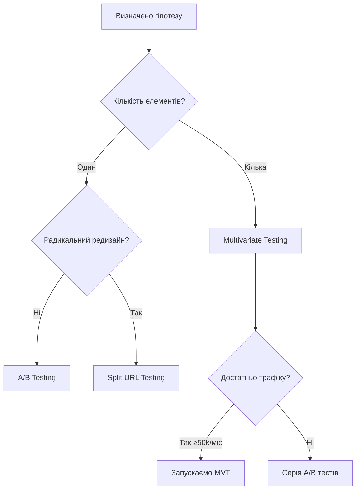

# Лекція 12. A/B тестування — теорія 🧪

---

## Що таке CRO і навіщо він потрібен?

**Conversion Rate Optimization** — підвищення частки відвідувачів, які виконують цільову дію

$$CR = \frac{\text{Конверсії}}{\text{Відвідувачі}} \times 100\%$$

> 5 000 відвідувачів, 150 покупок → **CR = 3%**
> Піднімаємо до 3,5% → **+25% доходу** без збільшення бюджету

🎯 SEO приводить трафік. CRO змушує цей трафік конвертуватись.

---

## Методологія CRO

Науковий цикл:

---

## Як сформулювати гіпотезу 💡

**Шаблон:**

> «Якщо ми **[змінимо X на Y]**, то **[метрика Z]** зросте на **[N%]**, тому що **[дані підтверджують]**»

❌ **Слабка гіпотеза:** «Змінимо колір кнопки»

✅ **Сильна гіпотеза:** «Якщо ми змінимо колір CTA з сірого (#9E9E9E) на помаранчевий (#FF6B35), CTR зросте на 15%, тому що heat map показує: 60% користувачів не помічають кнопку через низький контраст»

---

## Ключові елементи сильної гіпотези

- Конкретний елемент, що змінюється
- Конкретна вимірювана метрика
- Кількісна ціль
- Обґрунтування на реальних даних

---

## Які типи тестів існують?

---

## A/B vs Multivariate vs Split URL

| Тип | Коли | Обмеження |
|-----|------|-----------|
| **A/B** | Один елемент | Не тестує взаємодію |
| **MVT** | Кілька елементів + великий трафік | Потрібно в N разів більше трафіку |
| **Split URL** | Радикальний редизайн | Вплив на SEO |

---

## Статистична значущість 📊

**P-value** — ймовірність отримати такий результат випадково

- p = 0,03 → лише 3% шанс, що різниця випадкова
- Поріг: **p < 0,05**

⚠️ P-value ≠ розмір ефекту!
Конверсія 3,00% → 3,01% — статистично значуща, але практично марна.

**Confidence interval:** «CR зріс на 12% ± 4%» → реальний ефект між 8% і 16%.

---

## Розмір вибірки: скільки потрібно трафіку?

Чотири параметри:

- **Baseline CR** — поточна конверсія (нижча → більше трафіку)
- **MDE** — мінімальний ефект, який важливий для бізнесу
- **Statistical power** — зазвичай 80%
- **Significance level** — зазвичай 5%

**Приклад:** CR = 3%, очікуване покращення +15% → потрібно **≈ 30 000 відвідувачів**

---

## Типові помилки ❌

**Peeking** — зупинка тесту, коли «виглядає добре». Реальний рівень помилки зростає до 20–30%.

**Multiple testing** — 20 тестів одночасно → 1 хибнопозитивний гарантований.

**Seasonality bias** — тест лише в понеділок-середу не репрезентативний. Мінімум — **2 повних тижні**.

**Sample Ratio Mismatch** — план 50/50, а вийшло 53/47 → результати ненадійні.

**Novelty effect** — B виграє тільки тому, що він новий.

---

## Підсумок

> A/B тестування — це **наукова методологія**, а не просто технічний інструмент.

✅ Чітка гіпотеза на основі даних
✅ Розрахунок вибірки до запуску
✅ Не зупиняти тест достроково
✅ Коректна інтерпретація результатів

**CRO — це марафон:** 100 малих тестів за рік > 3 великих редизайни без аналітики.
