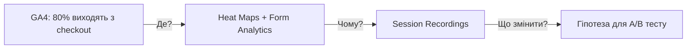
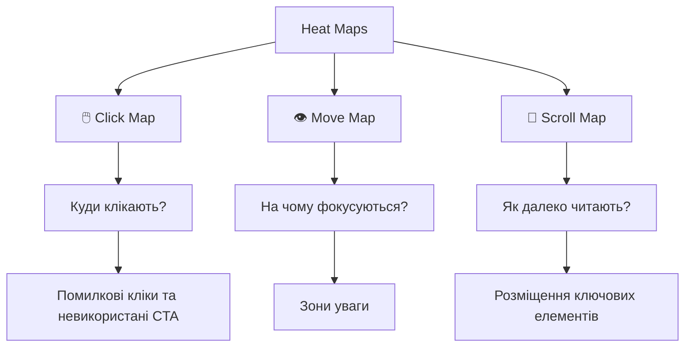
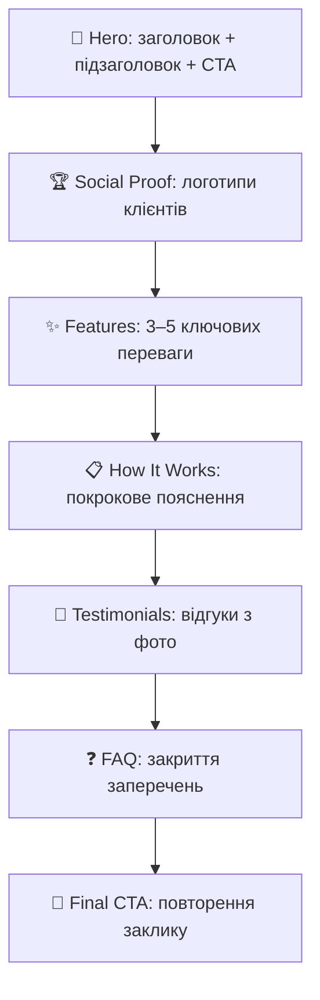

# Лекція 13. CRO інструменти та UX аналіз 🔥

---

## Як дізнатись, що не так на сайті?

Кількісні дані (GA4) говорять **де** проблема.
Якісні інструменти пояснюють **чому**.

---

## Heat Maps: три типи 🗺️

---

## Scroll Map: критичне правило

> Якщо 70% користувачів іде зі сторінки, **не доскролюючи до форми** — форму треба підняти вище.

- **50% відвідувачів** — все важливе має бути вище цього рівня
- **80% відвідувачів** — другорядний контент
- **Нижче 20%** — фактично не існує для аудиторії

---

## Session Recordings: червоні прапорці 🚩

**Rage clicks** — повторні швидкі кліки на один елемент → кнопка не реагує, форма зависла.

**U-turn behavior** — відкрив → почав взаємодіяти → одразу пішов → невідповідність між рекламою і контентом.

**Form abandonment** — залишив форму на полі «Телефон» або «Адреса» → зайвий запит даних.

**Dead clicks** — клікає туди, де нічого не відбувається → порушена навігація або UX.

🛠️ **Microsoft Clarity** і **Hotjar** автоматично виявляють rage clicks.

---

## Form Analytics: де і чому кидають форми

| Метрика | Що показує |
|---------|-----------|
| **Completion rate** | Частка тих, хто завершив форму |
| **Field drop-off** | На якому полі йдуть |
| **Time on field** | Де довго думають (незрозумілий лейбл?) |
| **Return rate** | Куди повертаються (помилка валідації?) |

> ⚠️ Кожне додаткове поле знижує conversion rate приблизно на **11%**

---

## Евристики Нільсена та friction points

**Видимість статусу:** кнопка без індикатора завантаження → клікнуть 5 разів.

**Відповідність реальному світу:** «Валідувати кошик» ❌ vs «Перевірити замовлення» ✅

**Контроль і свобода:** відсутність кнопки «Назад» у checkout → класична friction point.

**Запобігання помилкам:** inline validation > валідація після сабміту.

**34%** покупців залишають кошик через обов'язкову реєстрацію.
**49%** відмовляються, якщо вартість доставки з'являється лише на фінальному кроці.

---

## CTA Optimization 🎯

### Розташування
- **Above the fold** — видимий без прокрутки
- Поруч з ціною, відгуками, гарантією
- **Sticky CTA** для довгих сторінок

### Колір
Не «кращий» колір — а той, що **виділяється контрастом**.
Мінімум WCAG: **4,5:1** → перевірити через WebAIM Contrast Checker.

---

## Текст CTA: мікрокопія має значення

| Погано | Добре |
|--------|-------|
| «Відправити» | «Отримати безкоштовну консультацію» |
| «Завантажити» | «Завантажити PDF (3,2 МБ)» |
| «Отримати гайд» | «Хочу отримати гайд» |

Персоналізація від першої особи показує статистично кращі результати, особливо в SaaS.

Мінімальний розмір кнопки на мобільному: **44×44 px**.

---

## Landing Page: структура, що конвертує

---

## Landing Page: ключові принципи

**Message match** — реклама обіцяє «Безкоштовний SEO-аудит за 24 год», а заголовок «Послуги SEO для бізнесу» → користувач іде.

**Single objective** — один CTA. Два конкуруючих CTA знижують ефективність обох.

**Видалення навігації** — на рекламних landing pages прибирання хедер-меню **підвищує CR**: навігація дає «вихід» до конверсії.

---

## Підсумок

> CRO — це синтез **кількісних даних** і **якісних спостережень**.

Жоден інструмент окремо не дає повної картини:

- Теплові карти → **де** клікають, але не чому.
- Записи сесій → **чому** конкретний користувач, але без статистики.
- A/B тест → **статистичне підтвердження** гіпотези.

Тільки разом — систематична практика з вимірюваним результатом. 🚀
