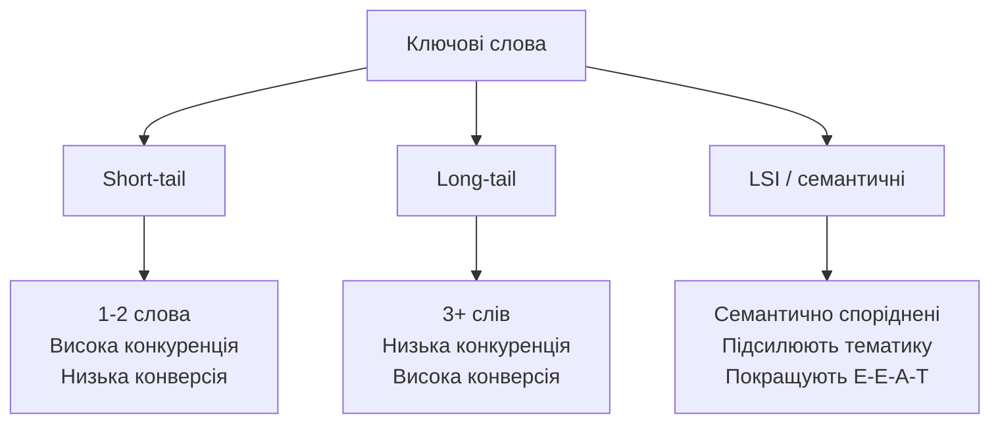
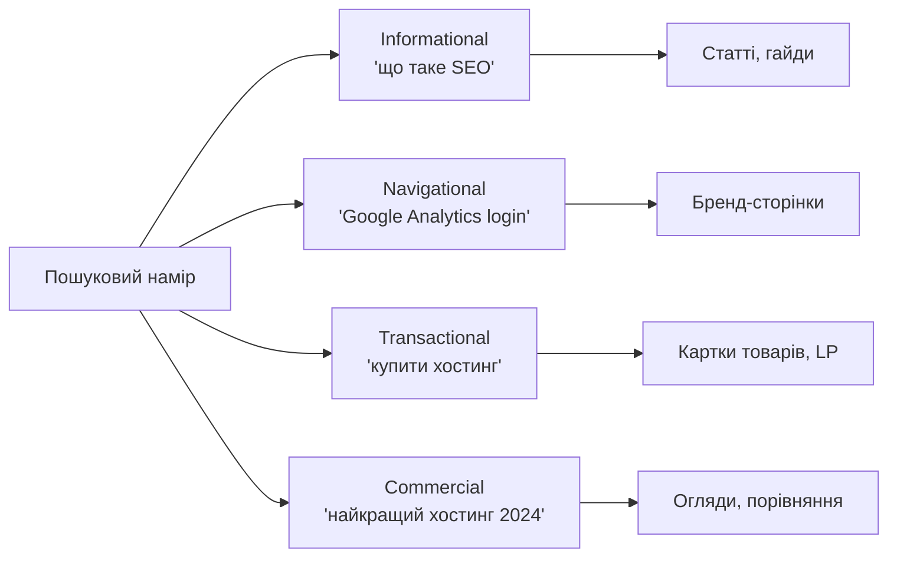
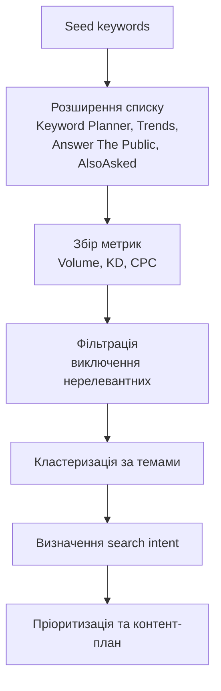

# Лекція 15. Keyword research 🔍

---

## Що таке ключові слова? 🔑

Ключові слова (keywords) — це слова та словосполучення, які користувачі вводять у пошуковий рядок для знаходження потрібної інформації.

Розуміння різних типів ключових слів є фундаментом для побудови ефективної SEO-стратегії.

---

## Типи ключових слів



---

## Short-tail keywords 📏

Короткі запити з одного-двох слів: «ноутбук», «купити телефон», «SEO».

Характеристики:

- надзвичайно високий обсяг пошуку;
- надзвичайно висока конкуренція;
- низька конверсія через широкий зміст запиту.

Просуватися за short-tail реально лише для великих авторитетних ресурсів із тисячами посилань.

---

## Long-tail keywords 🎯

Запити з трьох і більше слів: «купити ноутбук для навчання до 20 000 гривень», «як налаштувати GA4 для інтернет-магазину».

Концепція популяризована Крісом Андерсоном у книзі «The Long Tail» (2006).

Переваги:

- нижча конкуренція та легше ранжування;
- вища специфічність і конверсія;
- сукупний трафік із тисяч таких запитів перевищує short-tail.

Для більшості сайтів саме long-tail формують основу органічного трафіку.

---

## LSI keywords 🧩

LSI (Latent Semantic Indexing) — семантично пов'язані слова та фрази, що допомагають пошуковим системам краще зрозуміти тематику сторінки.

Термін технічно застарів, але концепція семантичної спорідненості залишається актуальною.

Приклад для слова «кава»: еспресо, американо, капучино, кавоварка, кофеїн, обсмажування.

Використання LSI природньо сигналізує, що сторінка є вичерпним джерелом теми.

---

## Search intent — пошуковий намір 🎯

Мета, з якою користувач вводить запит у пошукову систему.

Google аналізує поведінку мільярдів користувачів і навчився визначати, що саме стоїть за кожним запитом.

Якщо контент сторінки не відповідає наміру запиту, вона не ранжуватиметься, навіть якщо ідеально оптимізована за всіма іншими параметрами.

---

## Чотири типи пошукового наміру



---

## Informational намір ℹ️

Користувач шукає відповідь або хоче дізнатися більше про тему.

Маркери: «що таке», «як», «чому», «пояснення», «визначення».

Приклади: «що таке PageRank», «як зробити сайт», «чому падає трафік».

Оптимальний формат — статті, гайди, розгорнуті відповіді на питання.

---

## Navigational намір 🧭

Користувач хоче потрапити на конкретний вебсайт або сторінку.

Приклади: «Google Analytics вхід», «Facebook особистий кабінет», «Rozetka».

Перехоплювати такий трафік безглуздо — користувач знає, куди йде.

Виняток: бренди можуть оптимізувати власні сторінки під навігаційні запити зі своїм іменем.

---

## Transactional намір 💳

Користувач готовий вчинити дію: купити, завантажити, підписатися, замовити.

Маркери: «купити», «замовити», «завантажити», «ціна», «знижка».

Приклади: «купити iPhone 15 Pro», «замовити піцу онлайн».

Оптимальний формат — сторінки товарів, категорій та landing pages з чіткими CTA.

---

## Commercial Investigation 🔎

Користувач перебуває на етапі порівняння та вибору перед покупкою.

Маркери: «найкращий», «порівняння», «огляд», «рейтинг», «vs».

Приклади: «найкращий ноутбук 2024», «Matomo vs Google Analytics».

Оптимальний формат — порівняльні статті, огляди, рейтинги.

---

## Практичний прийом визначення наміру 💡

Перш ніж писати сторінку під запит, відкрийте SERP і проаналізуйте топ-10 результатів.

Поставте запитання:

- що переважає у видачі: статті, інструменти, відеоогляди?
- яка середня довжина контенту?
- чи є Featured Snippet, карусель, локальна видача?

Відповідь і буде правильним форматом для вашої сторінки.

---

## Метрики keyword research 📊

При аналізі ключових слів використовується чотири основні метрики.

| Метрика | Що вимірює | Де застосовується |
|---|---|---|
| Search Volume | Популярність запиту | Оцінка потенційного трафіку |
| Keyword Difficulty | Складність ранжування | Пріоритизація запитів |
| CPC | Комерційна цінність | Оцінка ROI від SEO |
| Competition | Насиченість реклами | Сигнал комерційного потенціалу |

---

## Search Volume 📈

Середньомісячна кількість пошукових запитів за словом у конкретному регіоні.

Цифра усереднена за 12 місяців — сезонні запити можуть мати різкі пікі.

Орієнтири для українського ринку:

- понад 10 000/міс — дуже популярні запити;
- 1 000 – 10 000/міс — середньочастотні;
- до 1 000/міс — нішеві, довгохвостові.

Не варто ігнорувати низькочастотні запити — вони часто приносять цільовий трафік.

---

## Keyword Difficulty ⚔️

Числовий показник (0–100), що відображає складність потрапляння у топ-10.

Чим вищий KD, тим більше авторитетних ресурсів уже конкурують за це місце.

Важливо:

- розраховується по-різному в Ahrefs, SEMrush, Ubersuggest;
- порівнювати цифри між платформами некоректно;
- молодому сайту орієнтуватися на KD до 20–30.

---

## Google Trends 📉

Безкоштовний інструмент, що показує відносну популярність запитів у часі.

На відміну від Keyword Planner, не надає абсолютних обсягів.

Незамінний для розуміння:

- трендів і сезонності;
- географічного розподілу інтересу;
- порівняння популярності синонімів.

Усі дані — у відносних одиницях від 0 до 100, де 100 — пік популярності за обраний період.

---

## Аналіз сезонності в Trends 📅

```mermaid
xychart-beta
    title "Умовна сезонність запиту 'купити ялинку'"
    x-axis [Січ, Лют, Бер, Кві, Тра, Чер, Лип, Сер, Вер, Жов, Лис, Гру]
    y-axis "Відносна популярність" 0 --> 100
    bar [5, 2, 2, 1, 1, 1, 1, 1, 3, 10, 45, 100]
```

Контент про підготовку до НМТ варто публікувати не в травні, а в лютому–березні — коли інтерес тільки починає зростати.

---

## Rising Queries та Breakout 🚀

У розділі «Пов'язані запити» особливу увагу привертають запити зі статусом **Breakout**.

Їхня популярність зросла більш ніж на 5000% за короткий час.

Можливості:

- нові технології та продукти;
- актуальні події та новини;
- оперативне створення контенту до приходу конкурентів.

Також корисні порівняння до 5 запитів одночасно та географічна карта інтересу.

---

## Answer The Public ❓

Інструмент, що візуалізує питання, прийменникові фрази та порівняння, пов'язані з ключовим словом.

Сайт: answerthepublic.com. Безкоштовна версія — обмежена кількість пошуків на день.

Групи результатів:

- **questions** — прямі запити у формі питання (what, how, why, when, where, who, which);
- **prepositions** — «SEO для малого бізнесу», «SEO без посилань»;
- **comparisons** — «SEO vs PPC», «SEO проти реклами»;
- **alphabeticals** — варіації запиту від А до Я.

Експорт у CSV — основа для FAQ, структури статей, контент-плану.

---

## AlsoAsked 🌳

Сайт alsoasked.com збирає реальні питання з блоку «People Also Ask» у видачі Google.

Відображає їх як дерево вкладених питань.

Перевага — ієрархічні зв'язки між питаннями, що показує, як Google бачить структуру теми і якою має бути глибина розкриття матеріалу.

---

## Де застосовувати питальні запити 🗂️

Питальні запити — ідеальна сировина для:

- FAQ-секцій на сторінках товарів і послуг (зі Schema.org FAQPage розміткою);
- підзаголовків H2–H3 в інформаційних статтях;
- самостійних статей «Що таке X» або «Як зробити X»;
- відеоскриптів та подкастів, де питальний формат природній.

Додатковий бонус — можливість потрапити у Featured Snippets («нульова позиція»).

---

## Робочий процес keyword research ⚙️



---

## Етапи процесу: деталізація

1. **Seed keywords** — базові слова, що описують тематику сайту або сторінки.
2. **Розширення** — Keyword Planner, Answer The Public, Trends, AlsoAsked.
3. **Фільтрація за метриками** — volume, KD, відповідність наміру.
4. **Кластеризація** — об'єднання у тематичні групи для запобігання канібалізації.
5. **Контент-план** — пріоритизація за трафіком, складністю та комерційною цінністю.
